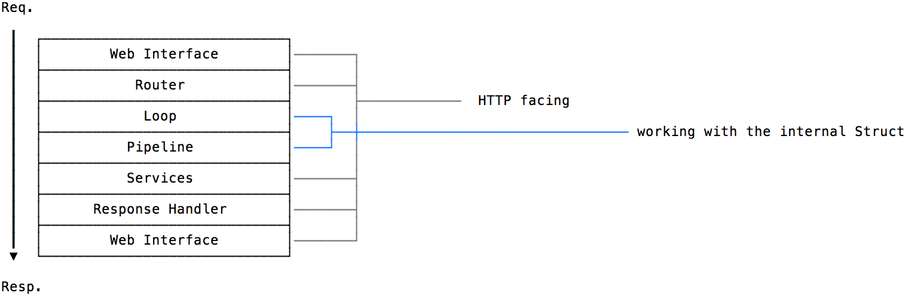
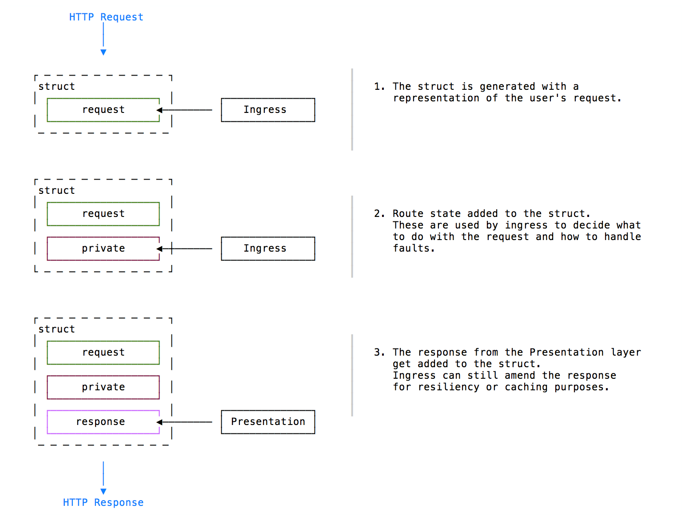

# Belfrage

## What is Belfrage

__Belfrage__ is part of the WebCore stack, it takes care of transforming and validating HTTP requests to and from a rendering service like the WebCore presentation layer. Belfrage is generic enough to be used as an entry point for any BBC service with minimal effort.

Belfrage looks after the resiliency of the page, it monitors in real-time the status of the responses and can take actions in case of errors.

Belfrage is simple and fast, with a number of ancillary apps outside of the traffic flow to add additional features and functionality.

## Key features of Belfrage

### Layers

We use a simple architecture with clear separation of responsibilities for any layer.
Every layer knows how to communicate with the adjacent ones, but communication with further layers is discouraged. Only a subset of these layers will handle HTTP tasks, the rest of the layers will do business logic against the struct, an internal data structure representing the request/response cycle.



[More details on the different layers are in the Layers document](./docs/layers.md)

### Struct

The struct is a data structure which will represent the state of the request at any moment. Internally it will be a hash map whose key will be progressively filled with data along the request path.

    struct = { request: {}, private: {}, response: {} }

At any time the system can log the struct giving the precise state of the current request (some values are removed for privacy).

It's the responsibility of the web interface to transform the struct into the final HTTP response.



[Struct examples are in the Struct document](./docs/struct.md)

### Caching
Belfrage currently uses the "Erlang Term Storage" or ETS for in-memory cache. We have a small layer around the cache interface to only store successful responses for `GET` requests and non-personalised responses.

### Resiliency

#### Fallback
Fallback is the first resiliency feature to be added to Belfrage. It currently utilises the in-memory caching mechanism to serve stale, cached responses from origins if an origin returns an unsuccessful response. Currently, fallback responses do have an expiry and will not be stored indefinitely.

This feature is only available for non-personalised responses.

## Properties of Belfrage

* resilient
* performant
* handle failures
* more to come...

## Getting it running

### Install Elixir

Get Elixir 1.8 on your Mac.

```
brew install elixir
```

### Install Hex

Hex is a package manager for Elixir. You'll need it to install dependencies.

```
mix local.hex
```

### Install dependencies

```
mix deps.get
```

### Set your credentials

Running locally, Belfrage will connect to the Test Lambda in the webcore-sre-dev account. Unlike Prod and Test where Belfrage will assume a role to refresh the credentials, local dev will simply use your local credentials for the account. You can set these however you wish - if in doubt you can use [cli-wormhole](https://github.com/bbc/cli-wormhole) and export them for mozart_dev account number `134209033928`.

### Run the app

```
mix run --no-halt
```

The app runs on port 7080.

### Testing

To run unit tests use the standard `mix` command:
```
mix test
```

To run the end to end integration suite run:
```
mix test_e2e
```

To run the automatically generated route matcher tests use: 
```
mix routes_test
```

### Run benchmark performance tests
```
mix benchmark
```

## Code style

We use the `mix format` to apply code style and formatting rules automatically. Our CI will fail if you do not run `mix format`

Want `mix format` to run automatically? Consider getting your IDE to do this on file changes, or alternatively run `git config core.hooksPath .githooks` from this directory to add a pre-commit hook that will run `mix format` for you before allowing you to commit.

Got an opinion on how `mix format` could do a better job? Edit `.formatter.exs`

## Deployment pipeline

Belfrage is deployed using Jenkins and Cosmos. The [Belfrage job](https://ci.news.tools.bbc.co.uk/job/bbc/job/belfrage/) on Jenkins runs the tests for all branches that are pushed up to Github.

If the tests all pass then the [Multi Stack job](https://ci.news.tools.bbc.co.uk/job/belfrage-multi-stack/) is run in order to build the RPMs for `belfrage` and `belfrage-preview`. If the job is run for the master branch then a release is also created for both stacks.
