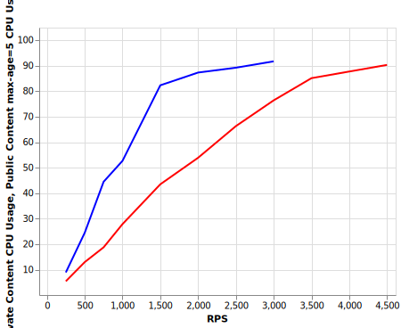

# How Many Instances do we Need on Sydney?

The purposes of these loadtests are twofold:
- to determine the base instances on sydney
- to see how our performance has changed since introducing [Finch](https://jira.dev.bbc.co.uk/browse/RESFRAME-4765), [OPT 24](https://jira.dev.bbc.co.uk/browse/RESFRAME-4503) and  [increasing the somaxconn value](https://jira.dev.bbc.co.uk/browse/RESFRAME-4791)

Sydney will serve apps traffic. The average load of this stack will be upwards of 5000rps. We need to be sure we can handle it. This apps traffic will not have GTM in front of us, so we may experience more traffic spikes as we don't have a caching layer in-front of us.

In order to know how many instances we should have by default on Sydney, we need to evaluate the max load a single instance of belfrage can comfortably handle.

The definition of 'comfortable' in this situation is when belfrage has ~= 90% CPU usage with and origin serving private content with 100ms latency.

With the new http client we also need to evaluate the worker configuration for this stack and the others. So we will also need to run load tests evaluating how the latency effects what rps we can achieve and the amount of pool workers we use.

## RPS vs CPU Usage
belfrage commit hash `4f3a4bb2e5cc21b2ec1b8132fac6292e39ecbbdc`

origin simulator configuration:
```
{
  "origin": "https://www.bbc.co.uk/sport",
  "stages": [
    {
      "at": 0,
      "status": 200,
      "latency": "100ms"
    }
  ],
  "headers": {
    "content-encoding": "gzip",
    "content-type": "text/html; charset=utf-8",
    "cache-control": "private"
  }
}
```

vegeta command format
```
$ date && echo "GET https://sydney.belfrage.test.api.bbc.co.uk/origin-simulator" | vegeta attack -duration=<<duration>> -rate=<<rate>> -max-body=0 -header "replayed-traffic:true" -header "accept-encoding:gzip" -http2=false | tee results.bin | vegeta report
```

300 seconds, 1500 rps, 100ms latency
```
$ date && echo "GET https://sydney.belfrage.test.api.bbc.co.uk/origin-simulator" | vegeta attack -duration=300s -rate=1500 -max-body=0 -header "replayed-traffic:true" -header "accept-encoding:gzip" -http2=false | tee sydney_300s_1500_rps_100msl_results.bin | vegeta report
Thu 28 Jul 16:07:50 UTC 2022
Requests      [total, rate, throughput]  450001, 1500.00, 1499.47
Duration      [total, attack, wait]      5m0.104819269s, 4m59.999690395s, 105.128874ms
Latencies     [mean, 50, 95, 99, max]    106.089981ms, 105.661407ms, 106.891272ms, 109.048237ms, 30.000144025s
Bytes In      [total, mean]              0, 0.00
Bytes Out     [total, mean]              0, 0.00
Success       [ratio]                    100.00%
Status Codes  [code:count]               0:3  200:449998
Error Set:
Get https://sydney.belfrage.test.api.bbc.co.uk/origin-simulator: net/http: request canceled (Client.Timeout exceeded while awaiting headers)
```

300 seconds, 2000 rps, 100ms latency
```
$ date && echo "GET https://sydney.belfrage.test.api.bbc.co.uk/origin-simulator" | vegeta attack -duration=300s -rate=2000 -max-body=0 -header "replayed-traffic:true" -header "accept-encoding:gzip" -http2=false | tee sydney_300s_2000_rps_100msl_results.bin | vegeta report
Thu 28 Jul 16:16:56 UTC 2022
Requests      [total, rate, throughput]  600000, 2000.00, 1999.30
Duration      [total, attack, wait]      5m0.105071147s, 4m59.999493543s, 105.577604ms
Latencies     [mean, 50, 95, 99, max]    106.078112ms, 105.830372ms, 107.263318ms, 110.084572ms, 1.162465248s
Bytes In      [total, mean]              0, 0.00
Bytes Out     [total, mean]              0, 0.00
Success       [ratio]                    100.00%
Status Codes  [code:count]               200:600000
Error Set:
```

300 seconds 2500 rps 100ms latency
```
$ date && echo "GET https://sydney.belfrage.test.api.bbc.co.uk/origin-simulator" | vegeta attack -duration=300s -rate=2500 -max-body=0 -header "replayed-traffic:true" -header "accept-encoding:gzip" -http2=false | tee sydney_300s_2500_rps__100msl_results.bin | vegeta report
Thu 28 Jul 12:23:27 UTC 2022
Requests      [total, rate, throughput]  750000, 2500.00, 2499.11
Duration      [total, attack, wait]      5m0.105832507s, 4m59.99961052s, 106.221987ms
Latencies     [mean, 50, 95, 99, max]    106.539603ms, 106.060456ms, 107.887261ms, 113.254912ms, 30.000134942s
Bytes In      [total, mean]              0, 0.00
Bytes Out     [total, mean]              0, 0.00
Success       [ratio]                    100.00%
Status Codes  [code:count]               0:2  200:749998
Error Set:
Get https://sydney.belfrage.test.api.bbc.co.uk/origin-simulator: net/http: request canceled (Client.Timeout exceeded while awaiting headers)
```

300 seconds 3000rps 100ms latency
```
$ date && echo "GET https://sydney.belfrage.test.api.bbc.co.uk/origin-simulator" | vegeta attack -duration=300s -rate=3000 -max-body=0 -header "replayed-traffic:true" -header "accept-encoding:gzip" -http2=false | tee sydney_300s_3000_rps_100msl_results.bin | vegeta report
Thu 28 Jul 17:36:55 UTC 2022
Requests      [total, rate, throughput]  900001, 3000.01, 2935.61
Duration      [total, attack, wait]      5m6.578849709s, 4m59.999764004s, 6.579085705s
Latencies     [mean, 50, 95, 99, max]    108.29322ms, 106.962418ms, 112.23323ms, 131.506289ms, 30.000597926s
Bytes In      [total, mean]              0, 0.00
Bytes Out     [total, mean]              0, 0.00
Success       [ratio]                    100.00%
Status Codes  [code:count]               0:5  200:899996
Error Set:
Get https://sydney.belfrage.test.api.bbc.co.uk/origin-simulator: net/http: request canceled (Client.Timeout exceeded while awaiting headers)
```

600 seconds 3000rps 100ms latency
```
$ date && echo "GET https://sydney.belfrage.test.api.bbc.co.uk/origin-simulator" | vegeta attack -duration=600s -rate=3000 -max-body=0 -header "replayed-traffic:true" -header "accept-encoding:gzip" -http2=false | tee sydney_600s_3000_rps_100msl_results.bin | vegeta report
Thu 28 Jul 17:53:23 UTC 2022
Requests      [total, rate, throughput]  1800002, 3000.00, 2999.43
Duration      [total, attack, wait]      10m0.11031339s, 9m59.999798751s, 110.514639ms
Latencies     [mean, 50, 95, 99, max]    111.636132ms, 108.844717ms, 121.473796ms, 156.043626ms, 30.000141035s
Bytes In      [total, mean]              0, 0.00
Bytes Out     [total, mean]              0, 0.00
Success       [ratio]                    100.00%
Status Codes  [code:count]               0:16  200:1799986
Error Set:
Get https://sydney.belfrage.test.api.bbc.co.uk/origin-simulator: net/http: request canceled (Client.Timeout exceeded while awaiting headers)
```


## Latency Vs Pool Workers
belfrage commit hash `4f3a4bb2e5cc21b2ec1b8132fac6292e39ecbbdc`

origin simulator configuration:
```
{
  "origin": "https://www.bbc.co.uk/sport",
  "stages": [
    {
      "at": 0,
      "status": 200,
      "latency": "<<latency>>ms"
    }
  ],
  "headers": {
    "content-encoding": "gzip",
    "content-type": "text/html; charset=utf-8",
    "cache-control": "private"
  }
}
```

vegeta command format
```
$ date && echo "GET https://sydney.belfrage.test.api.bbc.co.uk/origin-simulator" | vegeta attack -duration=300 -rate=2500 -max-body=0 -header "replayed-traffic:true" -header "accept-encoding:gzip" -http2=false | tee results.bin | vegeta report
```

600 seconds 2500 rps 100ms latency
```
$ date && echo "GET https://sydney.belfrage.test.api.bbc.co.uk/origin-simulator" | vegeta attack -duration=600s -rate=2500 -max-body=0 -header "replayed-traffic:true" -header "accept-encoding:gzip" -http2=false | tee sydney_600s_2500_rps_results.bin | vegeta report
Thu 28 Jul 12:29:55 UTC 2022
Requests      [total, rate, throughput]  1500000, 2500.00, 2482.39
Duration      [total, attack, wait]      10m4.255277586s, 9m59.999587303s, 4.255690283s
Latencies     [mean, 50, 95, 99, max]    106.455128ms, 106.062289ms, 107.859361ms, 112.213998ms, 30.000126333s
Bytes In      [total, mean]              0, 0.00
Bytes Out     [total, mean]              0, 0.00
Success       [ratio]                    100.00%
Status Codes  [code:count]               0:3  200:1499997
Error Set:
Get https://sydney.belfrage.test.api.bbc.co.uk/origin-simulator: net/http: request canceled (Client.Timeout exceeded while awaiting headers)
```

600 seconds 2500 rps 150ms latency
```
$ date && echo "GET https://sydney.belfrage.test.api.bbc.co.uk/origin-simulator" | vegeta attack -duration=600s -rate=2500 -max-body=0 -header "replayed-traffic:true" -header "accept-encoding:gzip" -http2=false | tee sydney_600s_2500_rps_150msl_results.bin | vegeta report
Thu 28 Jul 14:07:46 UTC 2022
Requests      [total, rate, throughput]  1500000, 2500.00, 2499.34
Duration      [total, attack, wait]      10m0.155244943s, 9m59.99963835s, 155.606593ms
Latencies     [mean, 50, 95, 99, max]    157.390739ms, 156.146246ms, 158.519513ms, 180.272902ms, 30.000122914s
Bytes In      [total, mean]              0, 0.00
Bytes Out     [total, mean]              0, 0.00
Success       [ratio]                    100.00%
Status Codes  [code:count]               0:6  200:1499994
Error Set:
Get https://sydney.belfrage.test.api.bbc.co.uk/origin-simulator: net/http: request canceled (Client.Timeout exceeded while awaiting headers)
```

600 seconds 2500 rps 200ms latency
```
$ date && echo "GET https://sydney.belfrage.test.api.bbc.co.uk/origin-simulator" | vegeta attack -duration=600s -rate=2500 -max-body=0 -header "replayed-traffic:true" -header "accept-encoding:gzip" -http2=false | tee sydney_600s_2500_rps_200msl_results.bin | vegeta report
Thu 28 Jul 14:21:39 UTC 2022
Requests      [total, rate, throughput]  1500000, 2500.00, 2499.03
Duration      [total, attack, wait]      10m0.228909542s, 9m59.999631811s, 229.277731ms
Latencies     [mean, 50, 95, 99, max]    206.783958ms, 206.184248ms, 208.042701ms, 212.895201ms, 30.00014038s
Bytes In      [total, mean]              0, 0.00
Bytes Out     [total, mean]              0, 0.00
Success       [ratio]                    100.00%
Status Codes  [code:count]               0:11  200:1499989
Error Set:
Get https://sydney.belfrage.test.api.bbc.co.uk/origin-simulator: net/http: request canceled (Client.Timeout exceeded while awaiting headers)
```

600 seconds 2500 rps 500ms latency
```
$ date && echo "GET https://sydney.belfrage.test.api.bbc.co.uk/origin-simulator" | vegeta attack -duration=600s -rate=2500 -max-body=0 -header "replayed-traffic:true" -header "accept-encoding:gzip" -http2=false | tee sydney_600s_2500_rps_500msl_results.bin | vegeta report
Thu 28 Jul 15:19:59 UTC 2022
Requests      [total, rate, throughput]  1500000, 2500.00, 2409.18
Duration      [total, attack, wait]      10m22.519319345s, 9m59.999654529s, 22.519664816s
Latencies     [mean, 50, 95, 99, max]    531.028651ms, 507.497482ms, 524.89869ms, 1.066623071s, 30.000784837s
Bytes In      [total, mean]              0, 0.00
Bytes Out     [total, mean]              0, 0.00
Success       [ratio]                    99.98%
Status Codes  [code:count]               0:236  200:1499764
Error Set:
Get https://sydney.belfrage.test.api.bbc.co.uk/origin-simulator: net/http: request canceled (Client.Timeout exceeded while awaiting headers)
```

600 seconds 2500 rps 1000ms latency
```
$ date && echo "GET https://sydney.belfrage.test.api.bbc.co.uk/origin-simulator" | vegeta attack -duration=300s -rate=2500 -max-body=0 -header "replayed-traffic:true" -header "accept-encoding:gzip" -http2=false | tee sydney_300s_2500_rps_1000msl_results.bin | vegeta report
Thu 28 Jul 15:52:50 UTC 2022
Requests      [total, rate, throughput]  750000, 2500.00, 2287.37
Duration      [total, attack, wait]      5m27.54691606s, 4m59.999662402s, 27.547253658s
Latencies     [mean, 50, 95, 99, max]    1.17723455s, 1.008267631s, 1.129914385s, 5.649632415s, 30.006397807s
Bytes In      [total, mean]              0, 0.00
Bytes Out     [total, mean]              0, 0.00
Success       [ratio]                    99.90%
Status Codes  [code:count]               0:778  200:749222
Error Set:
Get https://sydney.belfrage.test.api.bbc.co.uk/origin-simulator: EOF
Get https://sydney.belfrage.test.api.bbc.co.uk/origin-simulator: net/http: request canceled (Client.Timeout exceeded while awaiting headers)
```


## Performance with public content
belfrage commit hash `4f3a4bb2e5cc21b2ec1b8132fac6292e39ecbbdc`

origin simulator configuration:
```
{
  "origin": "https://www.bbc.co.uk/sport",
  "stages": [
    {
      "at": 0,
      "status": 200,
      "latency": "100ms"
    }
  ],
  "headers": {
    "content-encoding": "gzip",
    "content-type": "text/html; charset=utf-8",
    "cache-control": "public, max-age=5"
  }
}
```

vegeta command format
```
$ date && echo "GET https://sydney.belfrage.test.api.bbc.co.uk/origin-simulator" | vegeta attack -duration=300s -rate=<<rate>> -max-body=0 -header "replayed-traffic:true" -header "accept-encoding:gzip" -http2=false | tee results.bin | vegeta report
```

```
[chris_hopkins01@ip-10-114-174-6 ~]$ date && echo "GET https://sydney.belfrage.test.api.bbc.co.uk/origin-simulator" | vegeta attack -duration=600s -rate=1500 -max-body=0 -header "replayed-traffic:true" -header "accept-encoding:gzip" -http2=false | tee sydney_600s_1500_rps_100msl_ttl5_results.bin | vegeta report
Fri 29 Jul 11:10:34 UTC 2022
Requests      [total, rate, throughput]  900001, 1500.00, 1499.99
Duration      [total, attack, wait]      10m0.003282699s, 9m59.999437557s, 3.845142ms
Latencies     [mean, 50, 95, 99, max]    6.010134ms, 3.817463ms, 4.975599ms, 106.506928ms, 312.82823ms
Bytes In      [total, mean]              0, 0.00
Bytes Out     [total, mean]              0, 0.00
Success       [ratio]                    100.00%
Status Codes  [code:count]               200:900001
Error Set:
```
```
[chris_hopkins01@ip-10-114-174-6 ~]$ date && echo "GET https://sydney.belfrage.test.api.bbc.co.uk/origin-simulator" | vegeta attack -duration=600s -rate=2000 -max-body=0 -header "replayed-traffic:true" -header "accept-encoding:gzip" -http2=false | tee sydney_600s_2000_rps_100msl_ttl5_results.bin | vegeta report
Fri 29 Jul 11:35:01 UTC 2022
Requests      [total, rate, throughput]  1200000, 2000.00, 1999.99
Duration      [total, attack, wait]      10m0.003024056s, 9m59.99949827s, 3.525786ms
Latencies     [mean, 50, 95, 99, max]    6.149425ms, 3.950069ms, 5.211724ms, 106.790779ms, 359.430179ms
Bytes In      [total, mean]              0, 0.00
Bytes Out     [total, mean]              0, 0.00
Success       [ratio]                    100.00%
Status Codes  [code:count]               200:1200000
Error Set:
```
```
[chris_hopkins01@ip-10-114-174-6 ~]$ date && echo "GET https://sydney.belfrage.test.api.bbc.co.uk/origin-simulator" | vegeta attack -duration=600s -rate=2500 -max-body=0 -header "replayed-traffic:true" -header "accept-encoding:gzip" -http2=false | tee sydney_600s_2500_rps_100msl_ttl5_results.bin | vegeta report
Fri 29 Jul 12:11:45 UTC 2022
Requests      [total, rate, throughput]  1500000, 2500.00, 2499.98
Duration      [total, attack, wait]      10m0.004057703s, 9m59.999641071s, 4.416632ms
Latencies     [mean, 50, 95, 99, max]    6.349062ms, 4.105123ms, 5.54578ms, 107.306579ms, 30.000142591s
Bytes In      [total, mean]              0, 0.00
Bytes Out     [total, mean]              0, 0.00
Success       [ratio]                    100.00%
Status Codes  [code:count]               0:1  200:1499999
Error Set:
Get https://sydney.belfrage.test.api.bbc.co.uk/origin-simulator: net/http: request canceled (Client.Timeout exceeded while awaiting headers)
```
```
[chris_hopkins01@ip-10-114-174-6 ~]$ date && echo "GET https://sydney.belfrage.test.api.bbc.co.uk/origin-simulator" | vegeta attack -duration=600s -rate=3000 -max-body=0 -header "replayed-traffic:true" -header "accept-encoding:gzip" -http2=false | tee sydney_600s_3000_rps_100msl_ttl5_results.bin | vegeta report
Fri 29 Jul 12:29:59 UTC 2022
Requests      [total, rate, throughput]  1800002, 3000.00, 2999.98
Duration      [total, attack, wait]      10m0.004525255s, 9m59.999782739s, 4.742516ms
Latencies     [mean, 50, 95, 99, max]    6.680528ms, 4.211617ms, 6.253069ms, 109.826973ms, 30.000131632s
Bytes In      [total, mean]              0, 0.00
Bytes Out     [total, mean]              0, 0.00
Success       [ratio]                    100.00%
Status Codes  [code:count]               0:2  200:1800000
Error Set:
Get https://sydney.belfrage.test.api.bbc.co.uk/origin-simulator: net/http: request canceled (Client.Timeout exceeded while awaiting headers)
```
```
[chris_hopkins01@ip-10-114-174-6 ~]$ date && echo "GET https://sydney.belfrage.test.api.bbc.co.uk/origin-simulator" | vegeta attack -duration=600s -rate=3500 -max-body=0 -header "replayed-traffic:true" -header "accept-encoding:gzip" -http2=false | tee sydney_600s_3500_rps_100msl_ttl5_results.bin | vegeta report
Fri 29 Jul 12:45:34 UTC 2022
Requests      [total, rate, throughput]  2100002, 3500.00, 3499.95
Duration      [total, attack, wait]      10m0.006199114s, 9m59.999759523s, 6.439591ms
Latencies     [mean, 50, 95, 99, max]    8.521788ms, 4.393234ms, 16.669126ms, 122.701484ms, 30.000662275s
Bytes In      [total, mean]              0, 0.00
Bytes Out     [total, mean]              0, 0.00
Success       [ratio]                    100.00%
Status Codes  [code:count]               0:9  200:2099993
Error Set:
Get https://sydney.belfrage.test.api.bbc.co.uk/origin-simulator: net/http: request canceled (Client.Timeout exceeded while awaiting headers)
```
```
[chris_hopkins01@ip-10-114-174-6 ~]$ date && echo "GET https://sydney.belfrage.test.api.bbc.co.uk/origin-simulator" | vegeta attack -duration=600s -rate=3500 -max-body=0 -header "replayed-traffic:true" -header "accept-encoding:gzip" -http2=false | tee sydney_600s_3500_rps_100msl_ttl5_results2.bin | vegeta report
Fri 29 Jul 13:22:48 UTC 2022
Requests      [total, rate, throughput]  2100002, 3500.00, 3499.97
Duration      [total, attack, wait]      10m0.00385826s, 9m59.999754033s, 4.104227ms
Latencies     [mean, 50, 95, 99, max]    7.517117ms, 4.228181ms, 9.216739ms, 117.700166ms, 30.000142253s
Bytes In      [total, mean]              0, 0.00
Bytes Out     [total, mean]              0, 0.00
Success       [ratio]                    100.00%
Status Codes  [code:count]               0:6  200:2099996
Error Set:
Get https://sydney.belfrage.test.api.bbc.co.uk/origin-simulator: net/http: request canceled (Client.Timeout exceeded while awaiting headers)
```
```
[chris_hopkins01@ip-10-114-174-6 ~]$ date && echo "GET https://sydney.belfrage.test.api.bbc.co.uk/origin-simulator" | vegeta attack -duration=600s -rate=4000 -max-body=0 -header "replayed-traffic:true" -header "accept-encoding:gzip" -http2=false | tee sydney_600s_4000_rps_100msl_ttl5_results.bin | vegeta report
Fri 29 Jul 13:47:01 UTC 2022
^CRequests      [total, rate, throughput]  359176, 4000.01, 3999.78
Duration      [total, attack, wait]      1m29.797837386s, 1m29.79373387s, 4.103516ms
Latencies     [mean, 50, 95, 99, max]    10.374359ms, 4.8441ms, 29.563503ms, 133.171137ms, 30.000143709s
Bytes In      [total, mean]              0, 0.00
Bytes Out     [total, mean]              0, 0.00
Success       [ratio]                    100.00%
Status Codes  [code:count]               0:4  200:359172
Error Set:
Get https://sydney.belfrage.test.api.bbc.co.uk/origin-simulator: net/http: request canceled (Client.Timeout exceeded while awaiting headers)
```
```
[chris_hopkins01@ip-10-114-174-6 ~]$ date && echo "GET https://sydney.belfrage.test.api.bbc.co.uk/origin-simulator" | vegeta attack -duration=600s -rate=4000 -max-body=0 -header "replayed-traffic:true" -header "accept-encoding:gzip" -http2=false | tee sydney_600s_4000_rps_100msl_ttl5_results.bin | vegeta report
Fri 29 Jul 14:31:41 UTC 2022
Requests      [total, rate, throughput]  2400000, 4000.00, 3999.95
Duration      [total, attack, wait]      10m0.006045559s, 9m59.999818992s, 6.226567ms
Latencies     [mean, 50, 95, 99, max]    8.746838ms, 4.434084ms, 21.581788ms, 129.494672ms, 30.000146345s
Bytes In      [total, mean]              0, 0.00
Bytes Out     [total, mean]              0, 0.00
Success       [ratio]                    100.00%
Status Codes  [code:count]               0:8  200:2399992
Error Set:
Get https://sydney.belfrage.test.api.bbc.co.uk/origin-simulator: net/http: request canceled (Client.Timeout exceeded while awaiting headers)
```
```
[chris_hopkins01@ip-10-114-174-6 ~]$ date && echo "GET https://sydney.belfrage.test.api.bbc.co.uk/origin-simulator" | vegeta attack -duration=600s -rate=4500 -max-body=0 -header "replayed-traffic:true" -header "accept-encoding:gzip" -http2=false | tee sydney_600s_4500_rps_100msl_ttl5_results.bin | vegeta report
Fri 29 Jul 15:00:58 UTC 2022
Requests      [total, rate, throughput]  2690440, 4487.35, 4092.73
Duration      [total, attack, wait]      10m29.533454944s, 9m59.560696894s, 29.97275805s
Latencies     [mean, 50, 95, 99, max]    776.679523ms, 6.811276ms, 3.146221826s, 21.66610463s, 36.398112624s
Bytes In      [total, mean]              0, 0.00
Bytes Out     [total, mean]              0, 0.00
Success       [ratio]                    95.77%
Status Codes  [code:count]               0:31412  200:2576509  500:82519
Error Set:
Get https://sydney.belfrage.test.api.bbc.co.uk/origin-simulator: net/http: request canceled (Client.Timeout exceeded while awaiting headers)
Get https://sydney.belfrage.test.api.bbc.co.uk/origin-simulator: EOF
500 Internal Server Error
Get https://sydney.belfrage.test.api.bbc.co.uk/origin-simulator: dial tcp 0.0.0.0:0->34.245.251.89:443: bind: address already in use
read tcp 10.114.174.6:58402->52.212.83.170:443: read: connection reset by peer
read tcp 10.114.174.6:46407->52.212.83.170:443: read: connection reset by peer
Get https://sydney.belfrage.test.api.bbc.co.uk/origin-simulator: dial tcp 0.0.0.0:0->54.220.222.39:443: bind: address already in use
Get https://sydney.belfrage.test.api.bbc.co.uk/origin-simulator: net/http: request canceled while waiting for connection (Client.Timeout exceeded while awaiting headers)
read tcp 10.114.174.6:25242->52.212.83.170:443: read: connection reset by peer
Get https://sydney.belfrage.test.api.bbc.co.uk/origin-simulator: dial tcp 0.0.0.0:0->52.212.83.170:443: bind: address already in use
Get https://sydney.belfrage.test.api.bbc.co.uk/origin-simulator: http: server closed idle connection
Get https://sydney.belfrage.test.api.bbc.co.uk/origin-simulator: EOF (Client.Timeout exceeded while awaiting headers)
net/http: request canceled (Client.Timeout exceeded while reading body)
```


The dip in workers her is due to a deployment of another branch in-between load tests which had 512 workers.


## Results
### Performance with Private Content

RPS vs CPU Usage
| RPS  | CPU USAGE |         |
|------|-----------|---------|
|      | Trial 1   | Trial 2 |
| 250  | 8.95%     |         |
| 500  | 24.5%     |         |
| 750  | 44.5%     |         |
| 1000 | 52.7%     |         |
| 1500 | 82.2%     | 82.3%   |
| 2000 | 87.3%     | 87.2%   |
| 2500 | 89.2%     | 91.3%   |
| 3000 | 91.2%*    | 91.7%*  |


Latency vs Workers
| Latency (ms) | Min Workers Per Pool | Total Workers (*8) |
|--------------|----------------------|--------------------|
| 100          | 28                   | 224                |
| 150          | 42                   | 336                |
| 200          | 57                   | 456                |
| 500*         | 149                  | 1,192              |
| 1000*        | 304                  | 2,432              |
The rps was a constant 2500rps for at least 5 mins each time.


#### Performance with Public Content
Public content loadtest results hitting one page with 100ms latency and a `max-age` of 5 seconds.
| RPS  | RPS TO ORIGIN | CPU USAGE (%) | REQUEST SUCCESS (%) | Latency Monitor Mailbox Message (millions) |
|------|---------------|---------------|---------------------|--------------------------------------------|
| 250  | -             | 5.49          | 100                 | 0                                          |
| 500  | -             | 13.0          | 100                 | 0                                          |
| 750  | -             | 18.8          | 100                 | 0                                          |
| 1000 | -             | 27.9          | 100                 | 0                                                                                  |
| 1500 | 30            | 43.5          | 100                 | 0                                          |
| 2000 | 38            | 53.9          | 100                 | 0                                          |
| 2500 | 48            | 66.3          | 100                 | 0                                          |
| 3000 | 53            | 76.4          | 100                 | 0                                          |
| 3500 | 57            | 85.1          | 100                 | 1.60 *                                      |
| 3500 | 58            | 83.1          | 100                 | 0                                          |
| 4000 | 68            | 87.7          | 100                 | 0                                          |
| 4500 | 82            | 90.3          | 95.77               | 7.88 *                                      |

\* At these points the latency monitor develops a message queue million of messages long. This means the CPU returns to 10%-20% after the load test, rather than near 0%.  The only ways to get rid of this is to redeploy or restart the `LatencyMonitor` process.


#### Comparing Public and Private Performance

- blue line: private content, 0% cache hit
- red line: public max-age=5, 98% cache hit
[see interactively here](./load-test-results/data/2022-07-28-sydney-instance/priv-vs-pub-interactive.html)

This graph shows us the bounds of Belfrage's performance w.r.t caching. We know that all typical Belfrage performance should lie between these two lines. The steeper the line the lower the cache hit ratio. 

Here you can also see the bi-modal nature of our application. It seems that there is a linear trend until we reach 80%-85% after which another trend starts. From the data we have its not clear if this second trend is linear or not. So Belfrage behaves differently when CPU usage is high. The source of this is mysterious, but this is probably due to some optimisation occurring within the BEAM VM. As [this](https://stressgrid.com/blog/beam_cpu_usage/) article suggests. It may be from waiting processes using less cpu cycles when under high load.

### How many instances should we have on Sydney?
We can calculate the upper and lower bound of instances in order to satisfy the load of 5000rps.

We can do this using this formula, where:
rps_typical = the typical rps for a given cpu utilisation X
rps_lower = the rps with private content (cache_ratio = 0) at given cpu utilisation X
rps_upper = the rps with public content (cache_ratio ~= 1) at given cpi utilisation X
cache_ratio = cache ratio we expect from the instance. 0 being no cache 1 being 100% cache hit.


Assuming we want belfrage to typically have 20% CPU usage then we can see from our results that each instance can handle about 430rps when the requests are private. `5000 / 430 ~= 12` **That's 12 instances when all the content is private**. This is the upper bound of instances. We also know each belfrage instance can handle 2500rps of private content comfortably. So **we can expect these instances to handle up to 30,000 rps spikes of private content.**

If we assume the content is very cacheable (near 100% cache hit) then belfrage can handle 780rps at 20% CPU. `5000 / 780 ~= 7` (rounding up) **That's 7 instances when the content is highly cacheable**. This is the lower bound of instances. Belfrage can handle 3000rps of highly cacheable request. So **we would expect these instance to handle up to 21,000 rps spikes of highly cacheable content.**

**Seeing as we are not looking to cache this content initially we would expect to see around 12 instances on the Live Sydney stack.**

### How has our performance improved?
Before introducing Finch, changing the somaxconn and upgrading to OTP 24 (with the jit compiler) we could reliably get 1500rps per instance. Our goal for some time has been to get a single instance of belfrage able to handle 2000rps. We have surpassed this target. **We can now handle 2500rps of purely private content and 3000rps of highly cacheable content.** If we can fix the `LatencyMonitor` this will then become 3000rps of private content and 4000rps of highly cacheable content.


