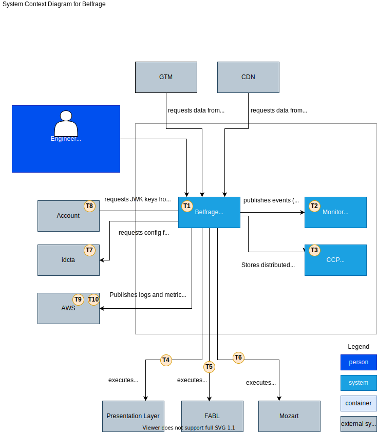

# Architecture

## C4 Architecture Diagrams.

### Level 1: System context diagram

[Diagram source](source/architecture/c4-level-1.drawio)

### Level 2: Container diagrams

[Diagram source](source/architecture/c4-level-2.drawio)

[Diagram source](source/architecture/c4-level-2-monitor.drawio)

[Diagram source](source/architecture/c4-level-2-ccp.drawio)
