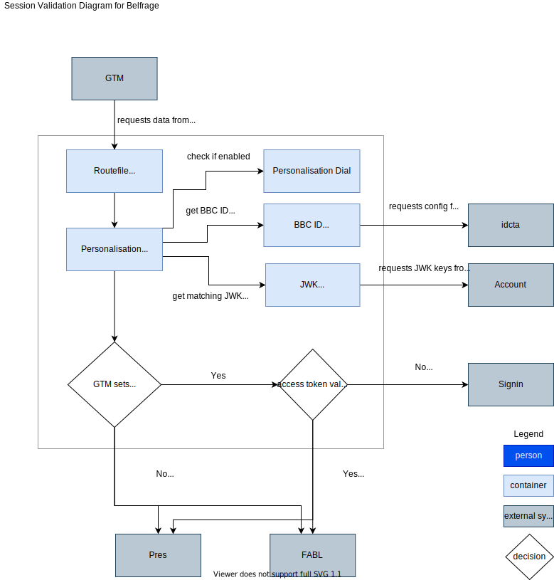

# Personalisation

Personalisation means user-tailored content, i.e. displaying different content
for different users be it authenticated vs non-authenticated or different
content for authenticated users depending on their profile.

## Role of Belfrage in personalisation

The role of Belfrage when it comes to personalisation is the same as in other
areas: to enable efficiency and resilience for upstream layers.

Personalisation in general means more traffic for the upstream layers because
they need to generate user-tailored content instead of the same content for
everyone that can be cached downstream. This increases the risk and Belfrage
aims to mitigate that.

Personalisation mechanism is the same regardless of the origin that generates
the content, so Belfrage aims to take on some processing that would otherwise
need to happen in each origin.

In particular, Belfrage implements:

* A way to turn personalisation off globally via a dial (e.g. in case of an
  incident).
* A way for teams to indicate that a route supports personalisation.
* Validation of the current user's session (and prompts re-authentication if
  it's invalid).
* Indication that a request is personalised to upstream layers and current
  user's profile details.
* Non-personalised fallbacks when the origin responds with an error.

Here's a diagram illustrating what Belfrage does when it comes to
personalisation:



[Diagram source](../source/belfrage-personalisation.drawio)

## Personalisation dial

Personalisation can be turned off per stack using the 'Personalisation' dial.
When it's off Belfrage will treat all incoming requests as non-personalised and
won't provide user profile details to origins. It will serve non-personalised
early responses and fallbacks to users.

## Personalised routes

Please see this [wiki
page](https://github.com/bbc/belfrage/wiki/Routing-in-Belfrage#personalising-a-route)
for info on how teams can enable personalisation for a route.

Note that only requests to `*.bbc.co.uk` can be personalised currently.

## User session validation

In Belfrage a user is considered authenticated if:

* The value of the request header `x-id-oidc-signedin` (set by GTM) is '1' or
* Identity token (`ckns_id` cookie) is present in the request

User's session is considered valid if a valid user access token (`ckns_atkn`
cookie) is present in the request.

If an authenticated user accesses a personalised route and their user access
token is not valid, they are redirected to the BBC Account URL
https://session.bbc.co.uk/session. Belfrage adds a `ptrt` query parameter to
the URL (the page to return to) which lets the Account signing page know where
to redirect the users after authentication.

### Validation process

You may be aware of the [BBC API
Management](https://github.com/bbc/api-management/wiki) tools that already
exist and wonder what we may be doing differently. Our solution is based
closely on a subset of that package and we work with the team there to enable
the required features in Belfrage.

Belfrage validates that the user's access token has the correct issuer and
audience values. It also verifies the name of the token, because only one token
type is currently supported.

The following claims are validated:

* iss = https://access.api.bbc.com/bbcidv5/oauth2
* aud = Account
* tokenName = access_token
* exp is later than current time + configured expiry threshold (currently 70
  minutes), i.e. that the token hasn't expired and won't expire within the
  configured window.

The token is also verified as well as validated. To verify a token Belfrage
uses the BBC Account key to ensure that the token was signed by the BBC. For
performance reasons Belfrage keeps the available account keys in memory with a
GenServer process periodically running in the background to refresh the list.

Each user's token is signed using a specific key. The header of the users
access token specifies which key was used to sign it:

* kid
* alg

Belfrage uses both these values to ensure a unique key is returned from the list
(there may be multiple keys with the same `kid`).

### BBC Account Keys

The Account keys are provided by the BBC Account team (see
[C4](docs/architecture.md#level-2-container-diagrams)). Upon deployment of
Belfrage the keys are fetched and stored in memory. They are then periodically
fetched to ensure they remain up to date.

Should there be an issue fetching the keys, the existing set in memory will be
used until the next refresh period. Should there be an issue on deployment a
fallback set will be used. The fallback set is the list of keys fetched and
then hard baked during the creation of the release archive.

The keys returned are of the [JWK format](https://tools.ietf.org/html/rfc7517).

The endpoint to fetch the keys is
https://access.api.bbc.com/v1/oauth/connect/jwk_uri and this is currently
fetched every hour (check the GenServer module in case this changes).

The `JWK_URI` requires the relevant BBC Authentication so Belfrage makes the
request using the Client certificates provided by Cosmos.

### Handling key revocation

If the Account JWK keys are revoked there will be a period of time, until the
next fetch is performed, where Belfrage is unable to successfully verify newly
signed in users. A manual process exists where the keys can be updated manually
on each instance should this be required.

### IDCTA flagpole

A periodic request is made to the IDCTA config which contains the BBC ID
flagpole status. Belfrage looks for the `id-availability` key for the values
`GREEN` or `RED` applying the fallback of `GREEN` should there be an issue
retrieving the config. If the flagpole is red, personalisation is disabled.

The config is retrieved from the API at
https://idcta.api.bbc.co.uk/idcta/config every 10 seconds currently and stored
in-memory. The config flagpole state is available for continuous polling by
other personalisation components, e.g. `Belfrage.Personalisation`.

## Personalised requests to upstream services

Belfrage considers a request personalised if:

* Personalisation is enabled (dial is on, IDCTA flagpole is green).
* Requested route is personalised in the current environment.
* User is authenticated.
* User's session is valid.

For personalised requests, Belfrage sets the following headers when making a
request to an origin:

```
authorization: Bearer [ckns_atkn]
x-authentication-provider: idv5
pers-env: [live or test]
ctx-pii-age-bracket: [user's age bracket]
ctx-pii-allow-personalisation: [has the user allowed personalisation]
```

Belfrage only supports v5 of the BBC Account.

## Caching and fallbacks

Belfrage doesn't serve cached early responses to personalised requests: it
always makes a request to the origin.

Belfrage doesn't store personalised responses in the cache. It also verifies
the `cache-contol` header that origins return in response to personalised
requests. If an origin responds with `cache-control: public`, Belfrage updates
that to `private`.

If Belfrage receives an error from an origin in response to a personalised
request, it will attempt to serve a non-personalised fallback. It will mark
such fallback as private (as well as the error response if there's no
fallback).

Responses from Belfrage contain `Vary` header, the value of which includes
`x-id-oidc-signedin` for requests to personalised routes. I.e. GTM is expected
to vary the response on the authenticated status of the user: non-authenticated
users can only be served a non-personalised cached response. Authenticated
users are not served a cached response at all because all personalised
responses are private.

GTM marks the responses that it varies on `x-id-oidc-signedin` as private: i.e.
downstream layers won't cache it. To avoid this when personalisation is turned
off (e.g. in case of an incident, when we want to reduce the load on GTM and
upstream), Belfrage doesn't include `x-id-oidc-signedin` in the `Vary` header.
When personalisation is off all users (both authenticated and not) get the same
responses, so they are always public and can be cached downstream.
