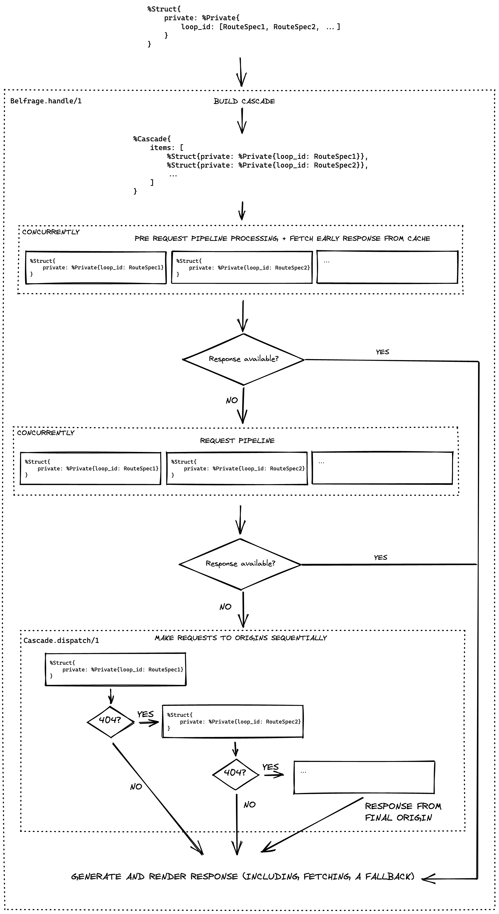

# Cascade

## What is the cascade

The cascade is a feature that allows a single URL that Belfrage receives to be
passed through to multiple origins sequentially until one of them returns a
non-404 response.

It's necessary because for some URLs that Belfrage needs to be able to handle
it's not possible to tell which origin they should be passed to. E.g. a URL
like `/news/business-51706219` could be a CPS Story or a Picture Gallery or
something else and so it's not possible to map such URL to a single origin.

To address the issue the cascade functionality allows us to specify multiple
route specs for a route. Belfrage will then try the first origin in the list,
if it gets a 404 response back it will try the next origin, etc. Anything apart
from a 404 (even errors like 500) is considered the response that should be
sent back to the user.

## Enabling the cascade for a route

To enable the cascade functionality for a route, specify multiple route specs
via the `:using` option, e.g.:

```
handle "/path/that/requires/cascade", using: ["RouteSpec1", "RouteSpec2"], examples:
[...]
```

Requests to the route above will first be passed to `RouteSpec1`, and if that
results in a 404, will then be passed to `RouteSpec2`.

## Risks and limitations of the cascade

The cascade functionality is essentially a way to pass a request to multiple
origins sequentially, which has the following (fairly obvious, but just listing
them for clarity) consequences:

* The cascade increases latency and load on origins as Belfrage might need to
  try requesting multiple origins before serving a response to the user.
* Poor performance of an origin early in the cascade affects the latency even if
  the origin is not supposed to serve a response (i.e. returns a 404).
* An error or timeout from an origin halts the cascade, which means that
  unavailability of an origin will prevent requests from reaching other origins
  that follow it in the cascade, even if the faulty origin isn't supposed to
  serve a response (i.e. would normally return a 404).
* If a circuit breaker is applied to a route spec in the cascade, it will halt
  the cascade and a 500 (or a fallback) will be returned to the user even if
  the request would otherwise be handled by a different origin later in the
  cascade.
* In case of a genuine 404 it's the last origin in the cascade that will render
  a response, so the origins in front of it won't be able to have customised
  error pages.
* The cascade may make debugging issues with requests or responding to
  incidents more difficult because of the additional logic involved.

For all of these reasons it's recommended to limit the amount of traffic that
goes through the cascade by mapping as many URLs as possible to specific
origins before defining a route that uses the cascade.

## Implementation detail

Processing a request that must be handled by the cascade works like this:



* `Belfrage.handle/1` receives a `Struct` with `private.loop_id` containing
  list of route specs that should be used by the cascade.
* The cascade is built by duplicating the received `Struct` for each route spec
  that should be used (this happens in `Belfrage.Cascade.build/1`). The result
  is a `Belfrage.Cascade` struct with a list of items which are `Struct`s each
  containing a single route spec in `private.loop_id`. The entire list of route
  specs is stored in `Struct.private.candidate_loop_ids` for each of the
  `Struct`s.
* Each `Struct` in the cascade is concurrently "pre-processed" (all necessary
  data is populated) and we attempt to fetch an early response from cache. If
  there is a cached response for any of the `Struct`s in the list of items,
  then that response is returned back to the user.
* The request pipeline is then executed for each `Struct` in the list of items
  concurrently. If any of the transformers produce a response (e.g. a redirect
  or a 500 from the circuit breaker), that response is sent back to the user.
* The origins in the cascade are requested one by one (this happens in
  `Belfrage.Cascade.dispatch/1`). If the first origin returns a 404, the
  request is passed to the following origin, etc, until a non-404 response is
  received (including other errors or timeouts) or the end of the cascade is
  reached, in which case the last response is served to the user.
* If the last requested origin returns a 404, Belfrage sends a 404 back to the
  user, but doesn't use the response body from the origin: it generates a
  generic 404 response instead.
* Processing and rendering the response happens as usual, including fetching
  fallbacks for errors.
