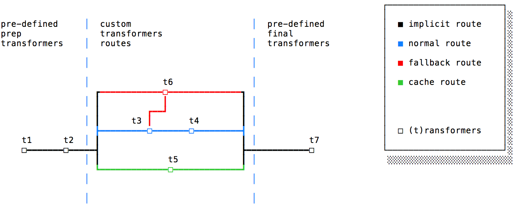

# Layers

Ingress processes a request in different layers.

## Web Interface
> input: HTTP request, output: sanitised HTTP request

This thin layer is only responsible for transforming the inbound HTTP request and the outbound response in the final HTTP object. It will also take care of extracting and validating/sanitizing headers.

## Router
> input: sanitised HTTP request, output: struct

This layer will match and validate the request against a number of configured paths. 

There will be two kinds of route matches, pure webcore matches and legacy matches, which have different behaviour.

A webcore match is controlled by three simple rules:

```
/:service/:page_type/:id
/:service/:page_type
/:service
```

Fragments match a whitelist of services (news, sport, etc), page types (stories, feeds, etc.) and ids (valid format and valid checksum of the id). 
Once matched and validated we can dynamically define which loop to call by building the loop name dynamically, eg: `/sport/story/abc123` points to the `sport_story` loop.

A legacy match is more complex as routes are not very uniform. This will require a list of custom route matchers and an explicit pointer to the corresponding Loop.

```
/mundo                       => :ws_mundo_frontpage
/mundo/:id                   => :ws_mundo_story
/sport/a/legacy/page?abc=123 => :sport_project_foo_story
```

## Loop
> input: loop id, output: struct “private” key

A route matcher points to a loop. A loop keeps a real-time state of a page like, the news frontpage, or the sport stories. Please note that it represent the whole sport stories and not a single story.

A loop keeps the state of the page. A loop listens to messages which will update its state with information on errors or response times. 

Internally a loop will return a data structure with an initial set of information regarding the state of the route, like if the page is okay or experiencing problems and which pipeline to call.

## Pipeline
> input: struct, output: struct

A pipeline is a predefined list of transformers.
A pipeline gets a struct and applies a number of transformations to it. At the end of the pipeline the struct will be sent to the indicated service which will generate and perform the HTTP call.

A pipeline can mutate, one of its transformers can amend the list of remaining calls in the pipeline. So a transformer can change the direction of the pipeline.

Some transformers, at the beginning and end of the pipeline are implicit, while the rest need to be explicitly required.

Internally the list of transformers will be represented by a list of symbols:
 `pipeline = [:t1, :t2, :t3]`.




## Services
> input: struct, output: HTTP request

Services are responsible for performing calls to the outside. 
A number of specialised services will invoke Lambdas, perform HTTP calls or fetch data from cache/S3.

## Response Handler
> input: HTTP request, output: struct

The response handler will get the HTTP response from the services and add it back to the `response` field of the Struct.

If required the struct will be passed again to the pipeline for further transformation.

We are at the end of the journey, our response is ready for the web interface and finally our user.
