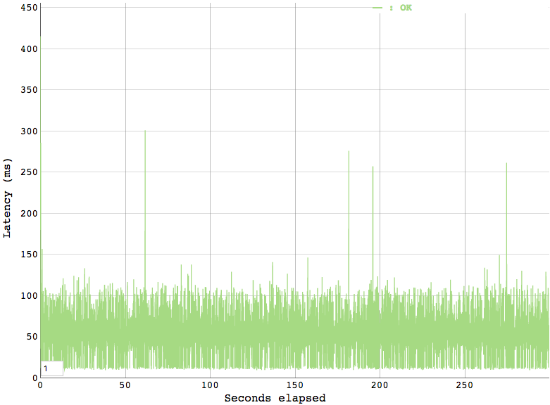

# Load tests empty response Lambda

- 31st October 2019
- Belfrage Test using Playground empty-response lambda 
- No caching
- Vegeta Runner

### Instance

- Type: 1 x c5.2xlarge
- CPUs: 8 vCPUs (4 core, 2 threads per core)

## Load test setup

* Default 10 initial workers.
* Max-workers default is 18446744073709551615.
* RPS of 0 = infinity (must be used with a reasonable max-workers value)

| Duration | RPS | Max Workers | Time run |
| -------- | --- | ----------- | -------- |
| 300 secs | 20  | default     | 9:56     |
| 300 secs | 50  | default     | 10:28    |
| 300 secs | 100 | default     | 10:40    |
| 300 secs | 200 | default     | 10:53    |
| 300 secs | 500 | default     | 11:04    |
| 300 secs | 1000| default     | 11:15    |
| 300 secs | 0   | 20          | 11:38    |
| 300 secs | 0   | 50          | 11:51    |
| 300 secs | 0   | 100         | 13:58    |

### Commands 

Attack! and create a histogram
```
> echo "GET https://empty-response.belfrage.test.api.bbc.co.uk/sport/videos/48521428" | vegeta attack -duration 300s -rate 0 -max-workers 100 -header "Playground:true" -insecure | tee ./report.bin | vegeta report -type=hist[0,20ms,40ms,60ms,80ms,100ms,200ms,300ms,400ms,500ms] --output ./histograms/report-300-0-10-100.txt
```

Plot
```
> vegeta plot report.bin > report.html
```

HDR Plot
```
> vegeta report -type=hdrplot --output reportHdrplot.txt report.bin
```

## Tests

All tests run for 300 secs

### 20rps

```
Bucket           #     %       Histogram
[0s,     20ms]   1176  19.60%  ##############
[20ms,   40ms]   2540  42.33%  ###############################
[40ms,   60ms]   2175  36.25%  ###########################
[60ms,   80ms]   91    1.52%   #
[80ms,   100ms]  13    0.22%   
[100ms,  200ms]  5     0.08%   
[200ms,  300ms]  0     0.00%   
[300ms,  400ms]  0     0.00%   
[400ms,  500ms]  0     0.00%   
[500ms,  +Inf]   0     0.00%  
```

### 50rps

```
Bucket           #     %       Histogram
[0s,     20ms]   4464  29.76%  ######################
[20ms,   40ms]   3963  26.42%  ###################
[40ms,   60ms]   6334  42.23%  ###############################
[60ms,   80ms]   193   1.29%   
[80ms,   100ms]  35    0.23%   
[100ms,  200ms]  11    0.07%   
[200ms,  300ms]  0     0.00%   
[300ms,  400ms]  0     0.00%   
[400ms,  500ms]  0     0.00%   
[500ms,  +Inf]   0     0.00%   
```

### 100 rps

```
Bucket           #      %       Histogram
[0s,     20ms]   7058   23.53%  #################
[20ms,   40ms]   6254   20.85%  ###############
[40ms,   60ms]   16057  53.52%  ########################################
[60ms,   80ms]   520    1.73%   #
[80ms,   100ms]  61     0.20%   
[100ms,  200ms]  30     0.10%   
[200ms,  300ms]  10     0.03%   
[300ms,  400ms]  9      0.03%   
[400ms,  500ms]  1      0.00%   
[500ms,  +Inf]   0      0.00%   
```

### 200 rps

```
Bucket           #      %       Histogram
[0s,     20ms]   10591  17.65%  #############
[20ms,   40ms]   9744   16.24%  ############
[40ms,   60ms]   38341  63.90%  ###############################################
[60ms,   80ms]   1101   1.84%   #
[80ms,   100ms]  120    0.20%   
[100ms,  200ms]  68     0.11%   
[200ms,  300ms]  19     0.03%   
[300ms,  400ms]  14     0.02%   
[400ms,  500ms]  1      0.00%   
[500ms,  +Inf]   1      0.00%   
```

### 500 rps

```
Bucket           #       %       Histogram
[0s,     20ms]   18043   12.03%  #########
[20ms,   40ms]   16473   10.98%  ########
[40ms,   60ms]   110339  73.56%  #######################################################
[60ms,   80ms]   4381    2.92%   ##
[80ms,   100ms]  378     0.25%   
[100ms,  200ms]  255     0.17%   
[200ms,  300ms]  95      0.06%   
[300ms,  400ms]  32      0.02%   
[400ms,  500ms]  4       0.00%   
[500ms,  +Inf]   0       0.00%   
```

### 1000 rps

```
Bucket           #       %       Histogram
[0s,     20ms]   27792   9.26%   ######
[20ms,   40ms]   26920   8.97%   ######
[40ms,   60ms]   234885  78.30%  ##########################################################
[60ms,   80ms]   8737    2.91%   ##
[80ms,   100ms]  843     0.28%   
[100ms,  200ms]  598     0.20%   
[200ms,  300ms]  86      0.03%   
[300ms,  400ms]  73      0.02%   
[400ms,  500ms]  47      0.02%   
[500ms,  +Inf]   19      0.01%   
```

### Concurrency 20

```
Bucket           #       %       Histogram
[0s,     20ms]   487     0.43%   
[20ms,   40ms]   69      0.06%   
[40ms,   60ms]   107568  95.83%  #######################################################################
[60ms,   80ms]   3537    3.15%   ##
[80ms,   100ms]  324     0.29%   
[100ms,  200ms]  266     0.24%   
[200ms,  300ms]  2       0.00%   
[300ms,  400ms]  0       0.00%   
[400ms,  500ms]  0       0.00%   
[500ms,  +Inf]   1       0.00%   
```

### Concurrency 50

```
Bucket           #       %       Histogram
[0s,     20ms]   1046    0.37%   
[20ms,   40ms]   1757    0.62%   
[40ms,   60ms]   270408  95.86%  #######################################################################
[60ms,   80ms]   7530    2.67%   ##
[80ms,   100ms]  839     0.30%   
[100ms,  200ms]  455     0.16%   
[200ms,  300ms]  7       0.00%   
[300ms,  400ms]  1       0.00%   
[400ms,  500ms]  36      0.01%   
[500ms,  +Inf]   0       0.00%   
```

### Concurrency 100

```
Bucket           #       %       Histogram
[0s,     20ms]   6549    1.16%   
[20ms,   40ms]   13357   2.38%   #
[40ms,   60ms]   514164  91.44%  ####################################################################
[60ms,   80ms]   24472   4.35%   ###
[80ms,   100ms]  2184    0.39%   
[100ms,  200ms]  1481    0.26%   
[200ms,  300ms]  52      0.01%   
[300ms,  400ms]  7       0.00%   
[400ms,  500ms]  0       0.00%   
[500ms,  +Inf]   4       0.00%   
```

## Lambda metrics

All response times in ms.

### 20 rps

Lambda duration
```
avg(@duration): 1.4957
max(@duration): 39.78
min(@duration): 0.99
```

Lambda Invocations
```
bin(1m),count()
2019-10-31 10:02:00.000,20
2019-10-31 10:01:00.000,397
2019-10-31 10:00:00.000,1200
2019-10-31 09:59:00.000,1220
2019-10-31 09:58:00.000,1220
2019-10-31 09:57:00.000,1200
2019-10-31 09:56:00.000,803
2019-10-31 09:55:00.000,20
```

Duration stats over 1min intervals
```
bin(1m),avg(@duration),max(@duration),min(@duration)
2019-10-31 10:02:00.000,5.9635,38.2,1.1
2019-10-31 10:01:00.000,1.3299,16.87,1.03
2019-10-31 10:00:00.000,1.3915,19.33,1
2019-10-31 09:59:00.000,1.4963,39.78,0.99
2019-10-31 09:58:00.000,1.5075,21.81,1.04
2019-10-31 09:57:00.000,1.3963,19.47,1.03
2019-10-31 09:56:00.000,1.6318,20,1.06
2019-10-31 09:55:00.000,6.3185,20.62,1.51
```

Comparison in Cloudwatch of the Lambda duration over various tests


## Latency by Percentile Distribution

### 20rps

### 50rps

### 100rps

### 200rps

### 500rps

### 1000rps

### Concurrency of 20

### Concurrency of 100


## Vegeta Plot

### 20rps

### 50rps

### 200rps

### 500rps

### 1000rps

### Concurrency of 20

### Concurrency of 100


## Belfrage metrics

### CPU Utilization (percent)


