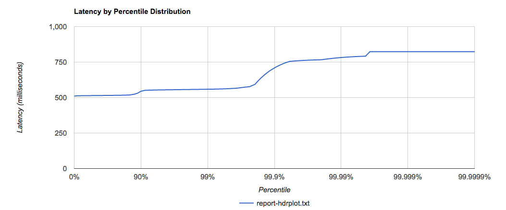

# Load tests Lambda with a 500ms delay

- 8th November 2019
- Belfrage Test using Playground empty-with-timeout lambda 
- No caching
- Vegeta Runner

### Instance

- Type: 1 x c5.2xlarge
- CPUs: 8 vCPUs (4 core, 2 threads per core)

## Tests

Run the 3 Vegeta recipes (5 min tests).

* Upto 200rps
* 500rps and 1000rps
* Upto 100 concurrency

## Lambda Cold starts

| Test | No. cold starts |
| - | - |
| 20rps | 34 |
| 50rps | 0 |
| 100rps | 36 |
| 200rps | 75 |
| 500rps | 425 |
| 1000rps | 178 |
| 20c | 11 |
| 50c | 0 |
| 100c | 0 |

Cold start durations are around 160ms - 190ms.

```
@message
"REPORT RequestId: 9282a75c-62d9-4f00-bda8-8c69fbf0368b	Duration: 505.39 ms	Billed Duration: 600 ms	Memory Size: 512 MB	Max Memory Used: 77 MB	Init Duration: 171.79 ms	
"
"REPORT RequestId: 44406845-83a6-47aa-9ccd-ef1a9cc6ac2f	Duration: 505.53 ms	Billed Duration: 600 ms	Memory Size: 512 MB	Max Memory Used: 77 MB	Init Duration: 166.15 ms	
"
"REPORT RequestId: 724466a9-b2d2-4188-888e-6333f252c966	Duration: 505.63 ms	Billed Duration: 600 ms	Memory Size: 512 MB	Max Memory Used: 77 MB	Init Duration: 182.04 ms	
"
```

## Throughput achieved on Concurrency tests

| Test | Throughput |
| -| - |
| 20c | 38 |
| 50c | 96 |
| 100c | 192 |

## Latency by Percentile Distribution

### 50rps

### 100rps

### 200rps

### 500rps

### 1000rps

### Concurrency of 20

### Concurrency of 50

### Concurrency of 100


## Vegeta Plot

### 50rps


### 100rps


### 200rps


### 500rps


### 1000rps

### Concurrency of 20


### Concurrency of 50


### Concurrency of 100


## Belfrage metrics

### CPU Utilization (percent)


