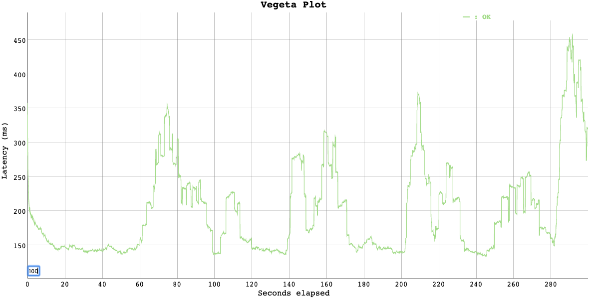
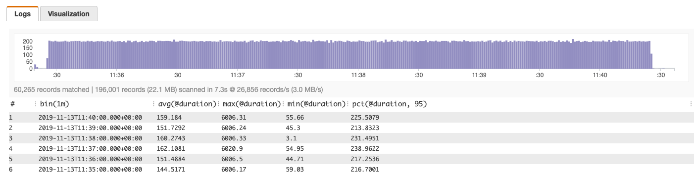

# Load tests SFV mock Fabl response Lambda

- 13th November 2019
- Belfrage Test using Playground sfv-mock-fabl-pwa lambda 
- No caching
- Vegeta Runner
- Tests run using http1

### Instance

- Type: 1 x c5.2xlarge
- CPUs: 8 vCPUs (4 core, 2 threads per core)

### Lambda

- Memory: 512mb

## Tests

Run the `vegeta-300s-200rps` recipe (5 min tests):
[vegeta-300s-200rps](https://github.com/bbc/belfrage-wrk2-loadtest/blob/master/trigger/recipes/vegeta-300s-200rps.json)

## Latency by Percentile Distribution

### 20rps

### 50rps

### 100rps

### 200rps

## Vegeta Plot

### 20rps

### 50rps

### 100rps

### 200rps

## 200rps for 5 minute period - 11:35:22 - 11:40:27
The table below shows an overview of the test results:

| Service         | Total Requests | Average Duration | Max        | Min     | 95%   | Failures |
|-----------------|----------------|------------------|------------| --------|-------|----------|
| Lambda Function | 60,210         | 156ms            | 6.02s      | 3.1ms   | 225ms | 184      |
| Belfrage        | 60,000         | 205ms            | 8.91s      | ------  | 266ms |  4       |

*note: Belfrage response time is made up of function execution time + lambda spinup + belfrage api time.*

### Lambda Execution Duration

Average Latency = 156ms

### Belfrage Responses

Average Latency = 204.66ms

### Lambda Timeout Errors

184 timeouts

### Total Lambda Invocations

60,210 invocations

### Total Belfrage Invocations

60,000 invocations

## Summary
The results above show that the lambda was invoked (60,210 - 60,000) that's 210 times more than Belfrage.
This can be put down to the built in Belfrage retry functionality on a timeout response.
This figure closesly matches the 184 timeouts experienced by the Lambda.

Another interesting observations is that the 187 timeouts all seem to happen in unique streams (instances) and only once for each. There also seems to be a pattern where every lambda invocation increases the max memory used by 1 or 2mb. This figure creeps up until the full memory (512mb) is being consumed.
A number of invocations continue to happen (around 35) with full memory being used before the timeout is reported. The Lambda then seems to restart and the memory usage goes to around 100mb and then the pattern starts and the memory usage starts going up again.

Also the timeout seems to be on a steady ratio of around 1 timeout every 326 lambda invocations.

### Lambda

- Memory: 1024mb

The above test was re-run after increasing the memory to `1024mb`. This resulted in a `70%` reduction in timeouts.

Also noticed a `62%` reduction in belfrage retries `210 -> 79`.
