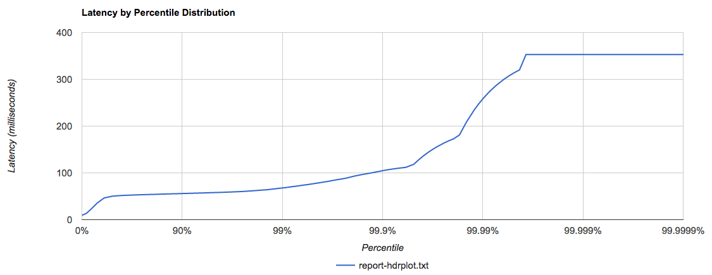
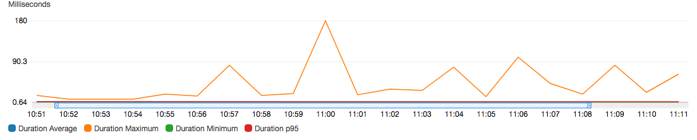
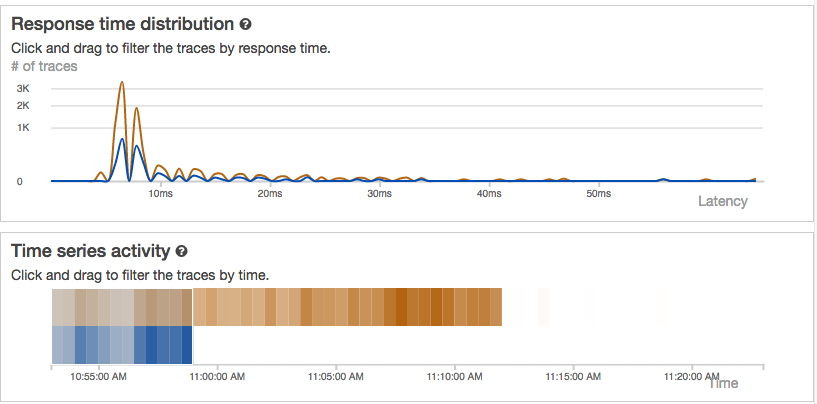

# Load tests empty response Lambda with XRAY

- 25th November 2019
- Belfrage Test using Playground empty-response lambda
- No caching
- Vegeta Runner
- Tests run using http1
- XRAY enabled

### Instance

- Type: 1 x c5.2xlarge
- CPUs: 8 vCPUs (4 core, 2 threads per core)

### Lambda

- Memory: 512mb

## Tests

Run the `vegeta-300s-200rps` recipe (5 min tests):
[vegeta-300s-200rps](https://github.com/bbc/belfrage-wrk2-loadtest/blob/master/trigger/recipes/vegeta-300s-200rps.json)

## Results in S3

[vegeta-300s-200rps-1574680312049](https://s3.console.aws.amazon.com/s3/buckets/belfrage-loadtest-results/vegeta-300s-200rps-1574680312049/?region=eu-west-1&tab=overview)

## Lambda response times

| Rate         | Approx Time run     | λ avg | λ fn min | λ fn avg | λ fn max  |
|--------------|---------------------|-------|----------|----------|-----------|
| 20rps        | 10:51:50 - 10:56:50 | 7.5   | 0.79     | 1.1314   | 18.25     |
| 50rps        | 10:57:08 - 11:01:32 | 7.5   | 0.74     | 1.1767   | 179.86    |
| 100rps       | 11:02:04 - 11:06:28 | 7.5   | 0.71     | 1.1198   | 77.17     |
| 200rps       | 11:06:58 - 11:11:51 | 7.5   | 0.64     | 1.0806   | 82.1      |

### 200 rps historgram

```
Bucket           #      %       Histogram
[0s,     20ms]   10282  17.14%  ############
[20ms,   40ms]   9507   15.85%  ###########
[40ms,   60ms]   38706  64.51%  ################################################
[60ms,   80ms]   1233   2.05%   #
[80ms,   100ms]  134    0.22%
[100ms,  200ms]  58     0.10%
[200ms,  300ms]  50     0.08%
[300ms,  400ms]  24     0.04%
[400ms,  500ms]  6      0.01%
[500ms,  +Inf]   0      0.00%
```

### 200 rps HDR Plot



### Metrics for full recipe



### XRAY Distribution

* Blue curve = 20rps run
* Orange curve = full run


