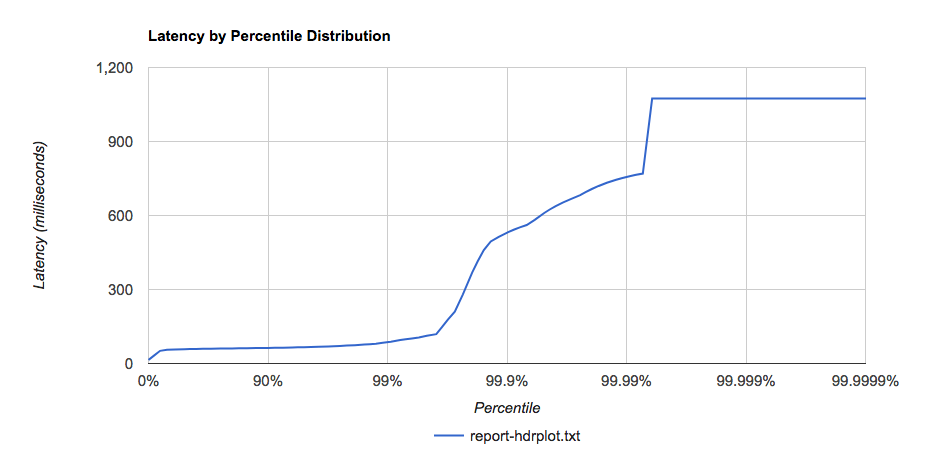

# Load tests SFV full mock response Lambda

- 26th November 2019
- Belfrage Test using Playground sfv-mock-response-pwa lambda
- No caching
- Vegeta Runner
- Tests run using http1

We ran into a Vegeta issue with the larger response from this Lambda. The responses are saved to a report.bin file which cause disk space usage issues. This meant we were unable to get the 1000rps test results.

### Instance

- Type: 1 x c5.2xlarge
- CPUs: 8 vCPUs (4 core, 2 threads per core)

### Lambda

- Memory: 512mb

## Tests

Run the `vegeta-300s-200rps` recipe (5 min tests):
https://github.com/bbc/belfrage-wrk2-loadtest/blob/master/trigger/recipes/vegeta-300s-200rps.json

Run the `vegeta-300s-1000rps` recipe (5 min tests):
https://github.com/bbc/belfrage-wrk2-loadtest/blob/master/trigger/recipes/vegeta-300s-1000rps.json

## Results in S3

[vegeta-300s-200rps-1574768542649](https://s3.console.aws.amazon.com/s3/buckets/belfrage-loadtest-results/vegeta-300s-200rps-15747685426499/?region=eu-west-1&tab=overview)

[vegeta-300s-1000rps-1574783937664](https://s3.console.aws.amazon.com/s3/buckets/belfrage-loadtest-results/vegeta-300s-1000rps-1574783937664/?region=eu-west-1&tab=overview)

## Latency by Percentile Distribution

### 200rps


### 500rps


## Vegeta Plot

### 200rps


### 500rps


## Historgrams

### 200rps

```
Bucket           #      %       Histogram
[0s,     100ms]  59836  99.73%  ##########################################################################
[100ms,  200ms]  134    0.22%
[200ms,  300ms]  3      0.01%
[300ms,  +Inf]   27     0.04%
```

### 500rps

```
Bucket           #      %       Histogram
[0s,     20ms]   6966   4.64%   ###
[20ms,   40ms]   12764  8.51%   ######
[40ms,   60ms]   87005  58.00%  ###########################################
[60ms,   80ms]   41378  27.59%  ####################
[80ms,   100ms]  894    0.60%
[100ms,  200ms]  584    0.39%
[200ms,  300ms]  90     0.06%
[300ms,  400ms]  0      0.00%
[400ms,  500ms]  151    0.10%
[500ms,  +Inf]   168    0.11%
```

### Lambda Execution Duration

#### 200rps

| bin(1m) | avg(@duration) | min(@duration) | max(@duration) |
|---------|----------------|----------------|----------------|
| 2019-11-26 15:54:00.000 | 2.1848 | 1.41 | 79.76 |
| 2019-11-26 15:53:00.000 | 2.2024 | 1.42 | 77.73 |
| 2019-11-26 15:52:00.000 | 2.2499 | 1.4 | 145.2 |
| 2019-11-26 15:51:00.000 | 2.2333 | 1.44 | 56.39 |
| 2019-11-26 15:50:00.000 | 2.1883 | 1.43 | 75.45 |
| 2019-11-26 15:49:00.000 | 4.2647 | 1.64 | 30.62 |

#### 500rps

| bin(1m) | avg(@duration) | min(@duration) | max(@duration) |
|---------|----------------|----------------|----------------|
| 2019-11-26 16:00:00.000 | 2.293 | 1.37 | 124.63 |
| 2019-11-26 15:59:00.000 | 2.0951 | 1.36 | 88.27 |
| 2019-11-26 15:58:00.000 | 2.1053 | 1.34 | 55.93 |
| 2019-11-26 15:57:00.000 | 2.1453 | 1.37 | 133.93 |
| 2019-11-26 15:56:00.000 | 2.1889 | 1.36 | 98.57 |
| 2019-11-26 15:55:00.000 | 2.268 | 1.46 | 190.11 |

### Lambda memory use

| provisonedMemoryMB | smallestMemoryRequestMB | avgMemoryUsedMB | maxMemoryUsedMB | overProvisionedMB |
|--|--|--|--|--|
| 488.2812 | 93.4601 | 115.9623 | 138.2828 | 349.9985 |


### Belfrage CPU


## Summary

The memory use for the Lambda function with the full mocked response is much lower than when only the FABL response was mocked out. Function timings are also very low so it does not appear to be the case that the response body of around 96KB or the bundle size of around 1MB has any contributing factors to the memory issues experienced in the [11th Nov run](2019-11-11.md).

It should be noted that the latency reports (as in the previous test runs) are affected by Lambda cold starts. This means that there are quite a few slower responses which skew the distributions. This can be observed on the Vegeta plot where the large spikes are at the start of each test.

It may be prudent therefore if we could apply some sort of ramping to the tests so that Lambdas are warm prior to running the tests. This would give us a better understanding of Belfrage. On the flip side, it does allow us to see how variations in traffic might affect responses.
