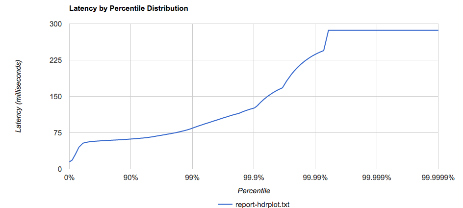
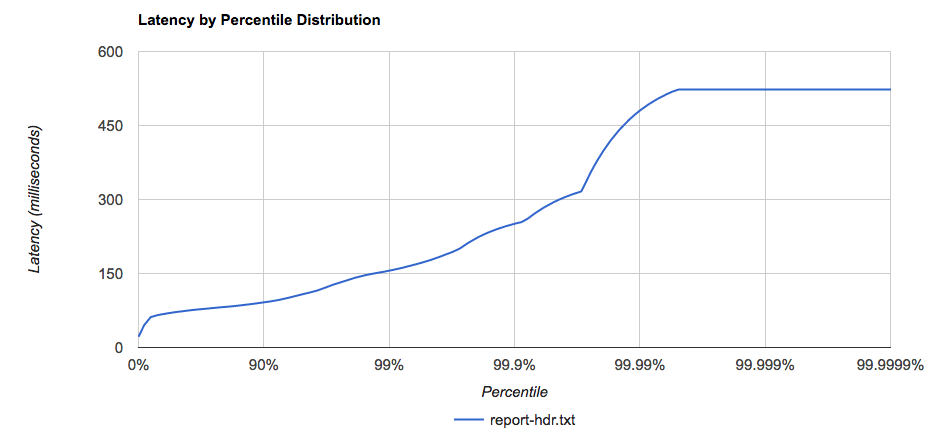
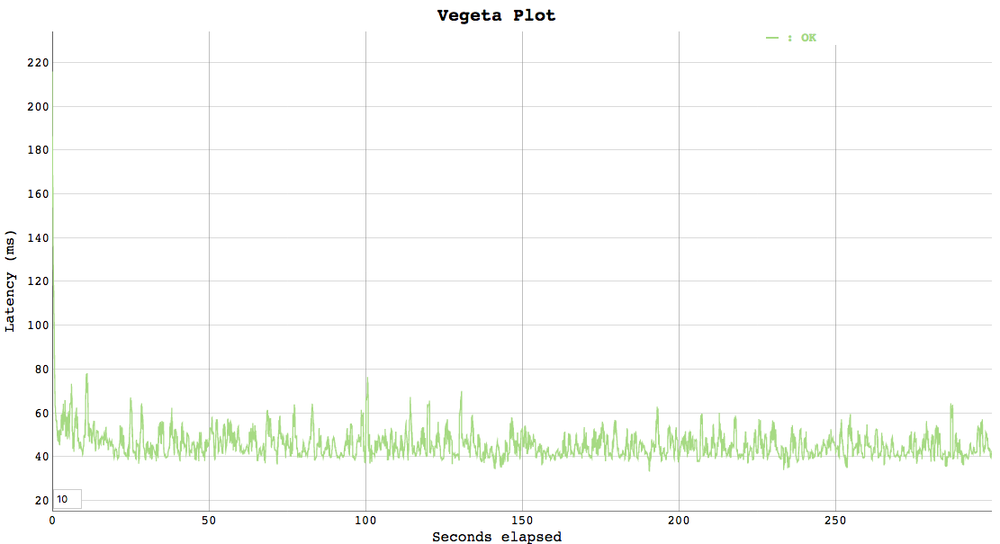
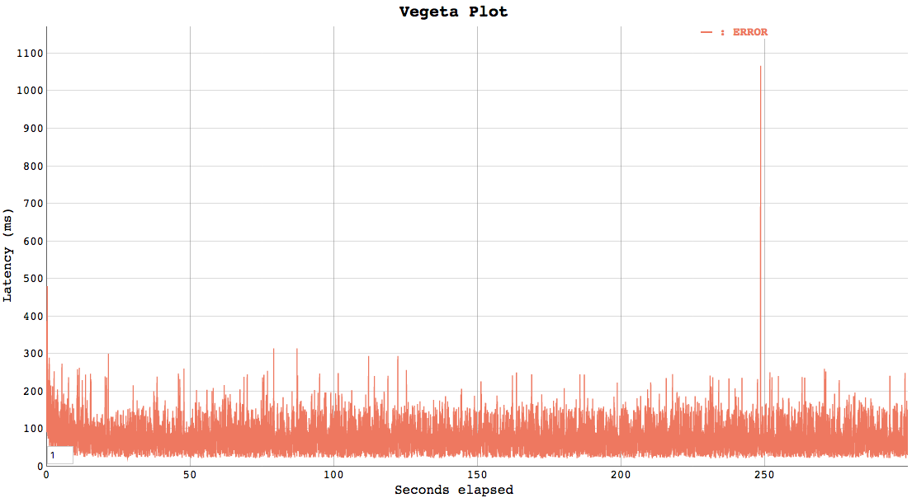

# Load tests no cache and no fabl Lambdas

- 27th November 2019
- Belfrage Test using Playground pres-no-cache-no-fabl lambda
- Belfrage Test using Playground pres-no-cache-pwa lambda
- No caching
- Vegeta Runner
- Tests run using http1

### Instance

- Type: 1 x c5.2xlarge
- CPUs: 8 vCPUs (4 core, 2 threads per core)

### Lambda

- Memory: 512mb

## Tests

Manual run of 200rps for 300 secs.

* https://pres-no-cache-pwa.belfrage.test.api.bbc.co.uk/pres-test/greet/no-cache
* https://pres-no-cache-no-fabl-pwa.belfrage.test.api.bbc.co.uk/sport/videos/48521428

## Results in S3

[vegeta-300s-200rps-no-cache-greet-endpoint](https://s3.console.aws.amazon.com/s3/buckets/belfrage-loadtest-results/vegeta-300s-200rps-no-cache-greet-endpoint/?region=eu-west-1&tab=overview)

[vegeta-300s-200rps-no-fabl](https://s3.console.aws.amazon.com/s3/buckets/belfrage-loadtest-results/vegeta-300s-200rps-no-fabl/?region=eu-west-1&tab=overview)

## Latency by Percentile Distribution

### No cache Greet endpoint

### No cache no FABL

## Vegeta Plot

### No cache Greet endpoint

### No cache no FABL

## Lambda stats

No cache Greet endpoint

## Lambda Duration stats

### No cache Greet endpoint
----------------------------------------------------
| avg(@duration) | min(@duration) | max(@duration) |
|----------------|----------------|----------------|
| 4.1072         | 2.31           | 173.94         |
----------------------------------------------------

### No cache no FABL
----------------------------------------------------
| avg(@duration) | min(@duration) | max(@duration) |
|----------------|----------------|----------------|
| 21.4815        | 7.31           | 421.7          |
----------------------------------------------------

## Lambda Memory use

### No cache Greet endpoint
| provisonedMemoryMB | smallestMemoryRequestMB | avgMemoryUsedMB | maxMemoryUsedMB | overProvisionedMB |
|--------------------|-------------------------|-----------------|-----------------|-------------------|
| 488.2812           | 111.5799                | 178.066         | 191.6885        | 296.5927          |

### No cache no FABL
| provisonedMemoryMB | smallestMemoryRequestMB | avgMemoryUsedMB | maxMemoryUsedMB | overProvisionedMB |
|--------------------|-------------------------|-----------------|-----------------|-------------------|
| 488.2812           | 116.3483                | 194.4569        | 202.179         | 286.1023          |
--------------------------------------------------------------------------------------------------------

## Lambda most expensive duration

### No cache Greet endpoint
----------------------------------------------------
|              @requestId              | @duration |
|--------------------------------------|-----------|
| 3b3a293c-62d4-43e2-be7b-afd2c49bdef9 | 173.94    |
| 76a3a0b8-35f2-4207-ad58-086bea14cdf3 | 172.03    |
| 5e51f81c-7abd-42a7-b948-1b1038fb8239 | 150.08    |
| d1b2fda6-a2c8-4cd9-9f72-e229154c1dfe | 127.68    |
| bbd2f56e-c2e2-446f-ba12-86a45ccfc43f | 119.15    |
----------------------------------------------------

### No cache no FABL
|              @requestId              | @duration |
|--------------------------------------|-----------|
| 8a48b61d-a848-4b74-a551-180d6ec6796f | 421.7     |
| d6d98c12-6821-4487-87be-cb7a2f1cfd07 | 420.59    |
| be5aefbb-17e3-4ac9-8f2e-a239ecbd0d60 | 310.81    |
| 36e1041e-160b-4824-b6ed-37b024701ab5 | 298.3     |
| dbe293b0-d08a-4e03-96a4-41348a8353ab | 293.4     |
| 61db641a-fbd6-4cbc-912c-0b24cf1ceaa4 | 291.88    |
| 6a820dac-8c40-4267-8ea4-dcf54fa90078 | 281.31    |
| 7d320ef5-f728-41c4-9c6d-65d28008821a | 281.07    |
| 469e3ae1-ca0b-48ed-a40c-3a5459336c14 | 280.05    |
| 8f5d0f33-4c2d-4bcb-bead-162356c6ac7e | 279.67    |
----------------------------------------------------
