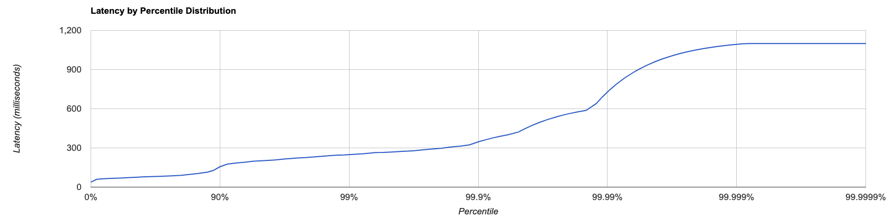

# Load tests empty response Lambda with XRAY

- 4th December 2019
- Belfrage Test using Playground fabl-response lambda
- No caching
- Vegeta Runner
- Tests run using http1
- XRAY enabled

### Instance

- Type: 1 x c5.2xlarge
- CPUs: 8 vCPUs (4 core, 2 threads per core)

### Lambda

- Memory: 512mb

## Tests

Run the `vegeta-300s-200rps` recipe (5 min tests):
[vegeta-300s-200rps](https://github.com/bbc/belfrage-wrk2-loadtest/blob/master/trigger/recipes/vegeta-300s-200rps.json)

## Results in S3

[vegeta-300s-200rps-1575453983179](https://s3.console.aws.amazon.com/s3/buckets/belfrage-loadtest-results/vegeta-300s-200rps-1575453983179/?region=eu-west-1&tab=overview)

## Latency by Percentile Distribution

### 20rps

### 50rps

### 100rps

### 200rps

## Vegeta Plot

### 20rps

### 50rps

### 100rps

### 200rps

## 20rps for 5 minute period - 09:46:22 - 09:51:23
The table below shows an overview of the test results:

| Service         | Total Requests | Average Duration | Max        | Min     | 95%   | Failures |
|-----------------|----------------|------------------|------------| --------|-------|----------|
| Lambda Function | 6,000          | 74.22ms          | 313ms      | 24.4ms  | 193ms |  0       |
| Belfrage        | 6,000          | 87.78ms          | 518ms      | ------  | 201ms |  0       |

## 50 for 5 minute period - 09:51:23 - 09:56:24
The table below shows an overview of the test results:

| Service         | Total Requests | Average Duration | Max        | Min     | 95%   | Failures |
|-----------------|----------------|------------------|------------| --------|-------|----------|
| Lambda Function | 15,000         | 75ms             | 330ms      | 17ms    | 187ms |  0       |
| Belfrage        | 15,000         | 88ms             | 1.25s      | ------  | 199ms |  0       |

## 100 for 5 minute period - 09:56:23 - 10:01:23
The table below shows an overview of the test results:

| Service         | Total Requests | Average Duration | Max        | Min     | 95%   | Failures |
|-----------------|----------------|------------------|------------| --------|-------|----------|
| Lambda Function | 30,000         | 77ms            | 332ms       | 24.77ms | 194ms |   0      |
| Belfrage        | 30,000         | 88ms            | 1.13s       | ------  | 202ms |   0      |

## 200rps for 5 minute period - 10:01:24 - 10:06:25
The table below shows an overview of the test results:

| Service         | Total Requests | Average Duration | Max        | Min     | 95%   | Failures |
|-----------------|----------------|------------------|------------| --------|-------|----------|
| Lambda Function | 60,000         | 77ms             | 1.08s      | 21.9ms  | 195ms |  0       |
| Belfrage        | 60,000         | 87ms             | 1.09s      | ------  | 200ms |  0       |

*note: Belfrage response time is made up of function execution time + lambda spinup + belfrage api time.*

### Lambda Execution Duration

Average Latency = 77ms

### Belfrage Responses

### Lambda Timeout Errors
0 Lambda timeouts across all the runs

## Summary
The results above show that the lambda was invoked the same number of times as belfrage requested. This means that no lambda requests errored so no belfrage retries were made.

We also see that the maximum memory used throughout the full run was never more than 208mb.
