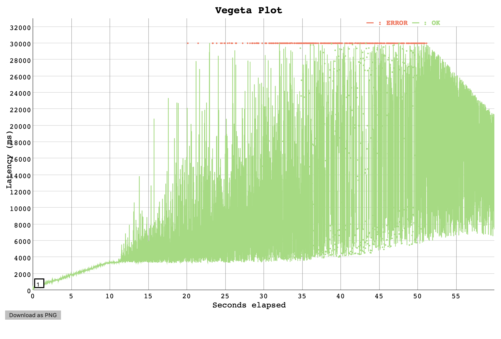
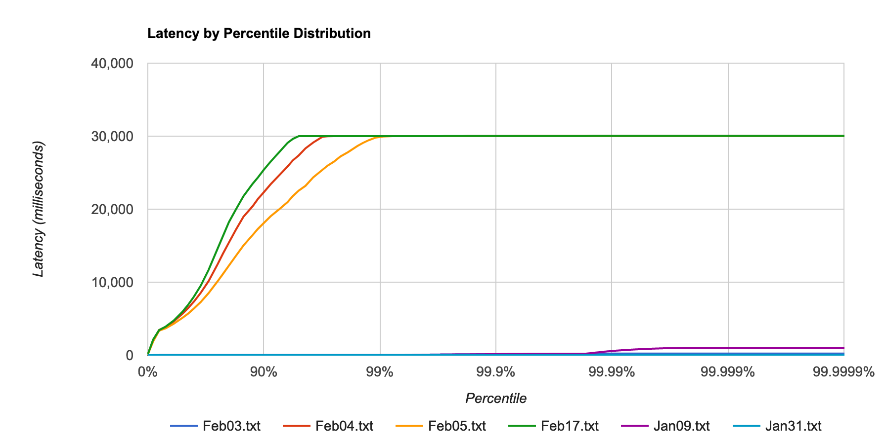

# Load Test Results -  Belfrage performance investigation

## Context

During the first spike for Belfrage 2nd tier cache, load tests were conducted with Belfrage cache-busting feature, to gauge the performance implication of payload messaging between Elixir nodes. Further tests are impeded by the [performance of Belfrage at higher rate](https://broxy.tools.bbc.co.uk/belfrage-loadtest-results/vegeta-60s-350rps-1581958285990).

#### 350rps performance,  17 Feb



## Hypothesis

- The performance degradation has been introduced by a recent merge.

## Setup
- Vegeta Runner on EC2
- Requests to Belfrage playground: cache busting on or cache-control ("private, max-age=0, no-cache")
- OriginSimulator on EC2: Type: 1 x c5.2xlarge instance, CPUs: 8 vCPUs (4 core, 2 threads per core)
- OriginSimulator simulate 300kb payload (random_content recipe)

## Tests
Run `60s, 350rps, 0ms latency` test on the following selected Belfrage builts (date):

1. [09 Jan 2020](https://github.com/bbc/belfrage/commit/2b38759c8544fbb2b1cdbde3de158b8919254e86)
2. [30 Jan 2020](https://github.com/bbc/belfrage/commit/fe6205e7db8fe558e8d9cd70a496c3d0aedcde55)
3. [03 Feb 2020](https://github.com/bbc/belfrage/commit/2da4b32f05bf8a062c588f69eb264120d57197ed)
4. [04 Feb 2020](https://github.com/bbc/belfrage/commit/a819725c2c8d7e5d565541bfbca4065402486ca3)
5. [05 Feb 2020](https://github.com/bbc/belfrage/commit/5bfb08f5384c2035cebf527a560b222b30066fad)
6. [17 Feb 2020](https://github.com/bbc/belfrage/commit/c346afa0b335fa6baf510055ada2a20d32e96bb9)

## Results

Positive: the performance degradation has been introduced by a recent [merge on 4 Feb 2020](https://github.com/bbc/belfrage/commit/a819725c2c8d7e5d565541bfbca4065402486ca3).

#### [09 Jan 2020](https://github.com/bbc/belfrage/commit/2b38759c8544fbb2b1cdbde3de158b8919254e86)

```
ID: 1581975083829
Requests      [total, rate, throughput]  21000, 350.02, 349.64
Duration      [total, attack, wait]      1m0.005s, 59.997s, 8.253ms
Latencies     [mean, 50, 95, 99, max]    9.643ms, 8.962ms, 10.942ms, 15.310ms, 1.010s
Bytes In      [total, mean]              6445056000, 306907.43
Bytes Out     [total, mean]              0, 0.00
Success       [ratio]                    99.90%
Status Codes  [code:count]               200:20980  500:20  
Error Set:
500 Internal Server Error
```

[Results](https://broxy.tools.bbc.co.uk/belfrage-loadtest-results/vegeta-60s-350rps-1581975083829)

#### [30 Jan 2020](https://github.com/bbc/belfrage/commit/fe6205e7db8fe558e8d9cd70a496c3d0aedcde55)
```
ID: 1581974405295
Requests      [total, rate, throughput]  21000, 350.02, 350.00
Duration      [total, attack, wait]      59.999s, 59.997s, 2.248ms
Latencies     [mean, 50, 95, 99, max]    2.247ms, 2.198ms, 2.611ms, 2.969ms, 23.510ms
Bytes In      [total, mean]              6451200000, 307200.00
Bytes Out     [total, mean]              0, 0.00
Success       [ratio]                    100.00%
Status Codes  [code:count]               200:21000  
Error Set:
```

[Results](https://broxy.tools.bbc.co.uk/belfrage-loadtest-results/vegeta-60s-350rps-1581974405295)

#### [03 Feb 2020](https://github.com/bbc/belfrage/commit/2da4b32f05bf8a062c588f69eb264120d57197ed)

```
ID: 1581976700701
Requests      [total, rate, throughput]  21000, 350.02, 349.52
Duration      [total, attack, wait]      1m0.008s, 59.997s, 10.296ms
Latencies     [mean, 50, 95, 99, max]    9.871ms, 9.159ms, 10.992ms, 15.193ms, 221.723ms
Bytes In      [total, mean]              6443212800, 306819.66
Bytes Out     [total, mean]              0, 0.00
Success       [ratio]                    99.88%
Status Codes  [code:count]               200:20974  500:26  
Error Set:
500 Internal Server Error
```

[Results](https://broxy.tools.bbc.co.uk/belfrage-loadtest-results/vegeta-60s-350rps-1581976700701)

#### [04 Feb 2020](https://github.com/bbc/belfrage/commit/a819725c2c8d7e5d565541bfbca4065402486ca3)

```
ID: 1581977452236
Requests      [total, rate, throughput]  21000, 350.02, 255.14
Duration      [total, attack, wait]      1m19.522s, 59.997s, 19.525s
Latencies     [mean, 50, 95, 99, max]    9.051s, 5.713s, 27.367s, 30.003s, 30.024s
Bytes In      [total, mean]              6232780800, 296799.09
Bytes Out     [total, mean]              0, 0.00
Success       [ratio]                    96.61%
Status Codes  [code:count]               0:708  200:20289  500:3  
Error Set:
500 Internal Server Error
```

[Results](https://broxy.tools.bbc.co.uk/belfrage-loadtest-results/vegeta-60s-350rps-1581977452236)

#### [05 Feb 2020](https://github.com/bbc/belfrage/commit/5bfb08f5384c2035cebf527a560b222b30066fad)


```
ID: 1581975871385
Requests      [total, rate, throughput]  21000, 350.01, 269.93
Duration      [total, attack, wait]      1m16.898s, 59.998s, 16.899s
Latencies     [mean, 50, 95, 99, max]    7.748s, 5.1434s, 22.544s, 29.883s, 30.0150s
Bytes In      [total, mean]              6376550400, 303645.26
Bytes Out     [total, mean]              0, 0.00
Success       [ratio]                    98.84%
Status Codes  [code:count]               0:243  200:20757  
Error Set:
```

[Results](https://broxy.tools.bbc.co.uk/belfrage-loadtest-results/vegeta-60s-350rps-1581975871385)

#### [17 Feb 2020](https://github.com/bbc/belfrage/commit/c346afa0b335fa6baf510055ada2a20d32e96bb9)

```
ID: 1581973607395
Requests      [total, rate, throughput]  21000, 350.02, 244.03
Duration      [total, attack, wait]      1m21.339s, 59.997s, 21.342s
Latencies     [mean, 50, 95, 99, max]    9.925s, 5.992s, 29.9980s, 30.005s, 30.037s
Bytes In      [total, mean]              6097612800, 290362.51
Bytes Out     [total, mean]              0, 0.00
Success       [ratio]                    94.52%
Status Codes  [code:count]               0:1150  200:19849  500:1  
Error Set:
500 Internal Server Error
```

[Results](https://broxy.tools.bbc.co.uk/belfrage-loadtest-results/vegeta-60s-350rps-1581973607395)

## Comparison



## Note

- 500 Errors at 350rps occur in most of the load tests
