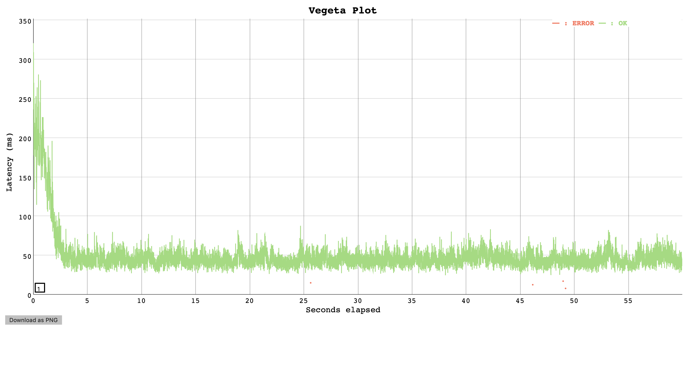

# Load Test Results:  :zlib performance (4 Feb merge)

## Context

A significant performance cost was incurred by the [merge on 4th Feb](https://github.com/bbc/belfrage/commit/a819725c2c8d7e5d565541bfbca4065402486ca3) - see [RESFRAME-3282](https://jira.dev.bbc.co.uk/browse/RESFRAME-3282) investigation.

## Hypothesis

- The performance cost is incurred by [:zlib](https://github.com/bbc/belfrage/blob/985f2048299e0e576067a56b967db4d436400e76/lib/belfrage/response_transformers/pre_cache_compression.ex#L31) in `Belfrage.ResponseTransformers.PreCacheCompression`

## Setup
- Vegeta Runner on EC2
- Requests to Belfrage playground with cache busting
- OriginSimulator on EC2: Type: 1 x c5.2xlarge instance, CPUs: 8 vCPUs (4 core, 2 threads per core)
- OriginSimulator simulates 300kb raw and gzipped payload (random_content recipe)

## Tests
Run `60s, 350rps, 0ms latency` test

1. 250kb payload
2. 300kb payload
3. gzipped 300kb payload: `content-encoding: gzip` header
4. gzipped 350kb payload: `content-encoding: gzip` header

By sending gzipped payload with `content-encoding: gzip` header, the use of `:zlib` in PreCacheCompression transformer is bypassed. A quick hack on [OriginSimulator to generate and store gzipped random content in ETS](https://github.com/bbc/origin_simulator/blob/ee00e1995f9948227de712a9d3381a3495aecc3a/lib/origin_simulator/body.ex#L16).


## Results

[:zlib](https://github.com/bbc/belfrage/blob/985f2048299e0e576067a56b967db4d436400e76/lib/belfrage/response_transformers/pre_cache_compression.ex#L31) is the main cause of the performance degradation (Belfrage starts to fail at higher payload and rate e.g. 300kb, 350rps). Smaller payload tests suggest `:zlib` incurred 40ms latency at minimum.

#### 250kb payload

```
ID: 1582104905315
Requests      [total, rate, throughput]  21000, 350.02, 349.73
Duration      [total, attack, wait]      1m0.0341s, 59.997s, 36.968ms
Latencies     [mean, 50, 95, 99, max]    49.633ms, 44.814ms, 66.617ms, 192.614ms, 323.938ms
Bytes In      [total, mean]              5374976000, 255951.24
Bytes Out     [total, mean]              0, 0.00
Success       [ratio]                    99.98%
Status Codes  [code:count]               200:20996  500:4  
Error Set:
500 Internal Server Error
```

[Results](https://broxy.tools.bbc.co.uk/belfrage-loadtest-results/vegeta-60s-350rps-1582104905315)



#### 300kb payload
```
ID: 1582105264903
Requests      [total, rate, throughput]  21000, 350.02, 199.90
Duration      [total, attack, wait]      1m29.997s, 59.997s, 30.000s
Latencies     [mean, 50, 95, 99, max]    8.715s, 4.661s, 30.001s, 30.001s, 30.011s
Bytes In      [total, mean]              5526528000, 263168.00
Bytes Out     [total, mean]              0, 0.00
Success       [ratio]                    85.67%
Status Codes  [code:count]               0:3009  200:17990  500:1  
Error Set:
500 Internal Server Error
```

[Results](https://broxy.tools.bbc.co.uk/belfrage-loadtest-results/vegeta-60s-350rps-1582105264903)


#### gzipped 300kb payload - :zlib bypassed

```
ID: 1582104155116
Requests      [total, rate, throughput]  21000, 350.02, 349.69
Duration      [total, attack, wait]      1m0.007s, 59.997s, 9.674ms
Latencies     [mean, 50, 95, 99, max]    10.974ms, 10.174ms, 12.860ms, 17.664ms, 228.039ms
Bytes In      [total, mean]              6446284800, 306965.94
Bytes Out     [total, mean]              0, 0.00
Success       [ratio]                    99.92%
Status Codes  [code:count]               200:20984  500:16  
Error Set:
500 Internal Server Error
```

[Results](https://broxy.tools.bbc.co.uk/belfrage-loadtest-results/vegeta-60s-350rps-1582104155116)


#### gzipped 350kb payload - :zlib bypassed

```
ID: 1582109729703
Requests      [total, rate, throughput]  21000, 350.02, 349.73
Duration      [total, attack, wait]      1m0.009s, 59.997s, 11.796ms
Latencies     [mean, 50, 95, 99, max]    13.131ms, 12.140ms, 15.678ms, 22.218ms, 233.510ms
Bytes In      [total, mean]              7521740800, 358178.13
Bytes Out     [total, mean]              0, 0.00
Success       [ratio]                    99.94%
Status Codes  [code:count]               200:20987  500:13  
Error Set:
500 Internal Server Error
```

[Results](https://broxy.tools.bbc.co.uk/belfrage-loadtest-results/vegeta-60s-350rps-1582109729703)


## Comparison


## Note
