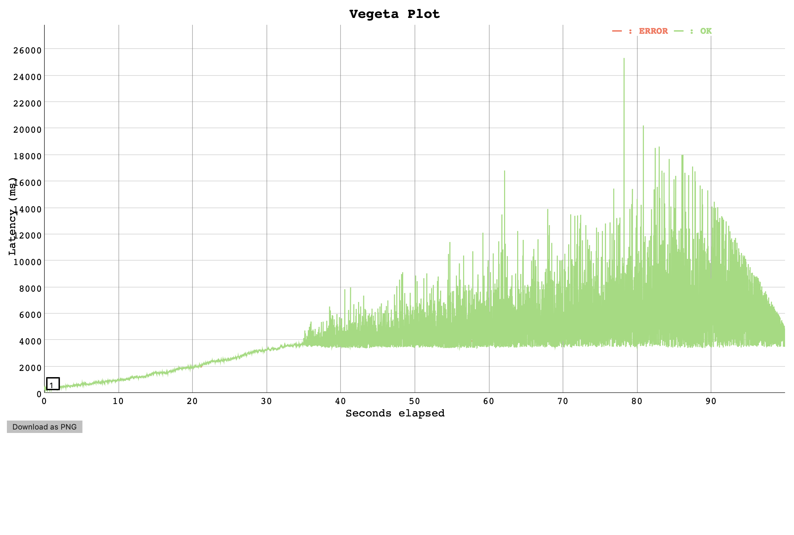
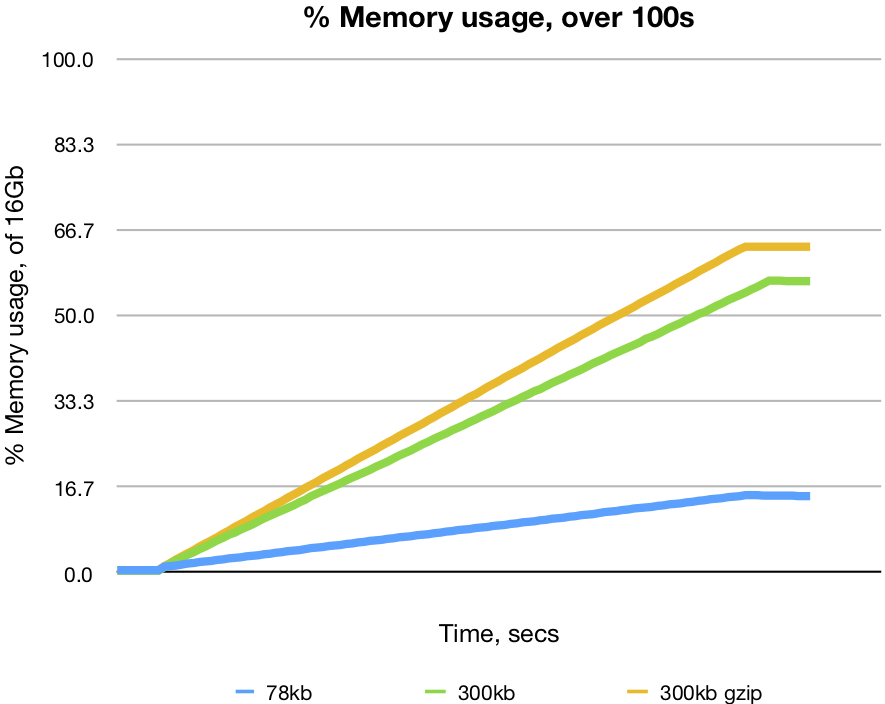

# Load Tests: cache performance

## Context

Caching in Belfrage appears to cause BEAM VM crashes during the [T2-cache spike load testing](https://jira.dev.bbc.co.uk/browse/RESFRAME-3281) (RESFRAME-3281). The tests described in this report provide further insights into the issue.

## Hypothesis

- Belfrage cache is performant at higher request rates

## Setup
- Vegeta Runner on EC2
- Belfrage (playground) on EC2: Type: 1 x c5.2xlarge instance, CPUs: 8 vCPUs (4 core, 2 threads per core)
- Requests to Belfrage playground with **cache busting to simulate multiple "new" requests**
- OriginSimulator on EC2: Type: 1 x c5.2xlarge instance, CPUs: 8 vCPUs (4 core, 2 threads per core)
- OriginSimulator simulates HTTP text, gzipped content payloads (`random_content`, `origin` recipes)

## Tests
Run `100s, 300rps, 0ms latency` tests with: 

1. 78kb payload from a BBC origin: BBC Sounds 
2. 300kb payload: OriginSimulator random content (302kb)
3. 300kb gzip payload: OriginSimulator gzipped 400kb random content (310kb)

Belfrage was restarted prior to each test. In addition to load tests results, CPU and memory usage of the Belfrage instance was measured and captured with `top`.

## Results

In terms of latency and successful responses, Belfrage cache is **only performant for a short duration** at higher request rates, during which it is performant for:

- gzip payload
- small non-gzip payload
- larger non-gzip payload: performance degraded due to another [known issue](https://confluence.dev.bbc.co.uk/display/BELFRAGE/Known+Issues) - see "Implication of non-gzip content from origins"

The performance appears to incur significant CPU usage at least 50% (gzip payload) and close to 100% for non-gzip content when Belfrage performs internal compression prior to caching.

During the tests, Belfrage consumed memory continuously. The test results suggest memory usage increases all the time, in different rates (payloads of different sizes). The memory consumption eventually causes BEAM VM to crash in further tests that involved longer duration and higher rates, e.g. 100s, 400rps gzip payload test (below) when Belfrage completely consumed all available memory.


#### 78kb payload

```
ID: 1583083546053
Requests      [total, rate, throughput]  30000, 300.01, 299.92
Duration      [total, attack, wait]      1m40.021s, 1m39.997s, 24.318ms
Latencies     [mean, 50, 95, 99, max]    24.321ms, 22.840ms, 30.090ms, 36.176ms, 345.843ms
Bytes In      [total, mean]              11907106140, 396903.54
Bytes Out     [total, mean]              0, 0.00
Success       [ratio]                    99.99%
Status Codes  [code:count]               200:29998  500:2  
Error Set:
500 Internal Server Error
```

[Results](https://broxy.tools.bbc.co.uk/belfrage-loadtest-results/vegeta-100s-300rps-1583083546053)


#### 300kb payload

```
ID: 1583084457133
Requests      [total, rate, throughput]  30000, 300.01, 285.47
Duration      [total, attack, wait]      1m45.071s, 1m39.997s, 5.074s
Latencies     [mean, 50, 95, 99, max]    3.763s, 3.724s, 7.217s, 10.101s, 25.332s
Bytes In      [total, mean]              9214464000, 307148.80
Bytes Out     [total, mean]              0, 0.00
Success       [ratio]                    99.98%
Status Codes  [code:count]               200:29995  500:5  
Error Set:
500 Internal Server Error
```

[Results](https://broxy.tools.bbc.co.uk/belfrage-loadtest-results/vegeta-100s-300rps-1583084457133)



#### 300kb gzip payload
```
ID: 1583085421617
Requests      [total, rate, throughput]  30000, 300.01, 299.89
Duration      [total, attack, wait]      1m40.010s, 1m39.997s, 13.798ms
Latencies     [mean, 50, 95, 99, max]    14.512ms, 13.643ms, 17.570ms, 23.414ms, 263.002ms
Bytes In      [total, mean]              12284723200, 409490.77
Bytes Out     [total, mean]              0, 0.00
Success       [ratio]                    99.97%
Status Codes  [code:count]               200:29992  500:8  
Error Set:
500 Internal Server Error
```

[Results](https://broxy.tools.bbc.co.uk/belfrage-loadtest-results/vegeta-100s-300rps-1583085421617)


#### CPU and memory usage

1. 78kb: [data](data/2020-03-02/78kb.csv) 
2. 300kb: [data](data/2020-03-02/300kb.csv)
3. 300kb gzip: [data](data/2020-03-02/300kb_gzip.csv)

## Comparison

#### HDR plots


#### CPU Usage


#### MemoryUsage

