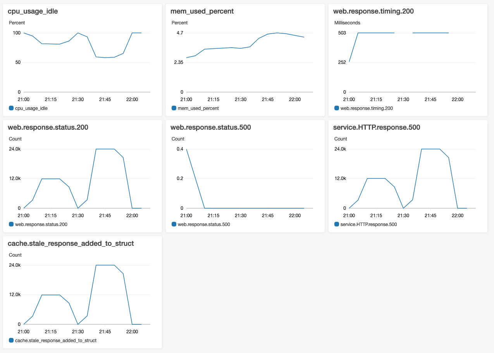
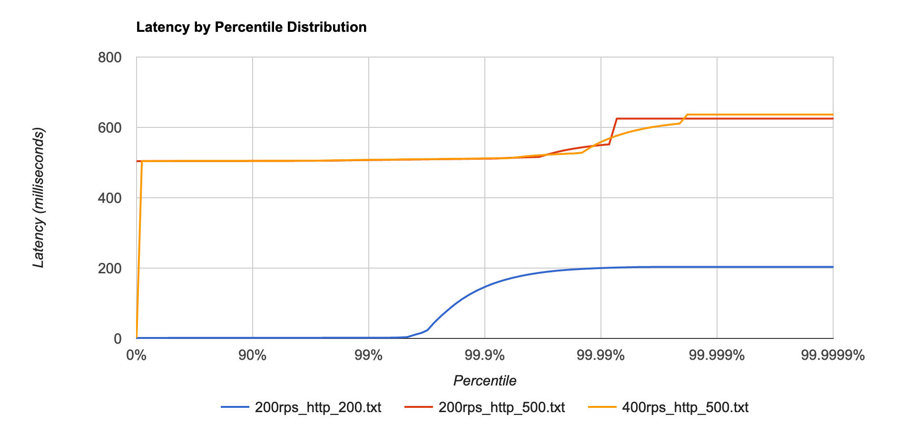

# Load Tests: Tier-1 cache fallback performance

## Context

We want to verify the performance and the resiliency of the in-memory fallback mechanism from Tier-1 cache - [RESFRAME-3069](https://jira.dev.bbc.co.uk/browse/RESFRAME-3069).

## Hypothesis

- Belfrage T1 cache provides fallback mechanism and 100% performant when HTTP origin is down

## Setup
- Vegeta Runner on EC2
- Belfrage (playground) on EC2: Type: 1 x c5.2xlarge instance, CPUs: 8 vCPUs (4 core, 2 threads per core)
  - master branch: 10 March, commit: 388cf32da572fd356dfad8c25938dc58b08d678f
- Requests to Belfrage playground, to an OriginSimulator route.
- OriginSimulator on EC2: Type: 1 x c5.2xlarge instance, CPUs: 8 vCPUs (4 core, 2 threads per core)
- OriginSimulator simulates HTTP 20kb gzipped content payload (`random_content` recipe)

## Tests
Run the following tests on https://www.belfrage-playground.test.api.bbc.co.uk/sounds with a simulated origin containing 20kb gzip random content

1. `60s, 200rps` test, origin with HTTP status 200, 0ms latency
2. `1200s, 200rps` test, origin (down) with HTTP status 500, 500ms latency
3. `1200s, 400rps` test, origin (down) with HTTP status 500, 500ms latency

## Results

Belfrage T1 cache provides fallback mechanism and 100% performant when HTTP origin is down.

The results suggests T1 cache working as expected and provides the fallback with minimal added latency (4-5ms). The server performance was CPU-bound: towards **45% max usage** at 400rps. Memory usage was within the range of 2-5% of 15Gb, max usage 4.7%, 0.7Gb.

#### `60s, 200rps`, HTTP 200

```
ID: 1583960214593
Requests      [total, rate, throughput]  12000, 200.02, 200.01
Duration      [total, attack, wait]      59.996s, 59.995s, 1.498ms
Latencies     [mean, 50, 95, 99, max]    1.907ms, 1.525ms, 1.759ms, 2.051ms, 203.216ms
Bytes In      [total, mean]              245760000, 20480.00
Bytes Out     [total, mean]              0, 0.00
Success       [ratio]                    100.00%
Status Codes  [code:count]               200:12000  
Error Set:
```

[Results](https://broxy.tools.bbc.co.uk/belfrage-loadtest-results/vegeta-60s-200rps-1583960214593)

#### `1200s, 200rps`, HTTP 500, 500ms latency

```
ID: 1583962080164
Requests      [total, rate, throughput]  240000, 200.00, 199.92
Duration      [total, attack, wait]      20m0.499s, 19m59.995s, 504.417ms
Latencies     [mean, 50, 95, 99, max]    504.472ms, 504.374ms, 504.812ms, 507.280ms, 625.007ms
Bytes In      [total, mean]              4915200000, 20480.00
Bytes Out     [total, mean]              0, 0.00
Success       [ratio]                    100.00%
Status Codes  [code:count]               200:240000  
Error Set:
```

[Results](https://broxy.tools.bbc.co.uk/belfrage-loadtest-results/vegeta-1200s-200rps-1583962080164)

#### `1200s, 400rps`, HTTP 500, 500ms latency

```
ID: 1583963930044
Requests      [total, rate, throughput]  480000, 400.00, 399.83
Duration      [total, attack, wait]      20m0.502s, 19m59.997s, 504.549ms
Latencies     [mean, 50, 95, 99, max]    504.445ms, 504.418ms, 505.102ms, 507.753ms, 636.418ms
Bytes In      [total, mean]              9830400000, 20480.00
Bytes Out     [total, mean]              0, 0.00
Success       [ratio]                    100.00%
Status Codes  [code:count]               200:480000  
Error Set:
```

[Results](https://broxy.tools.bbc.co.uk/belfrage-loadtest-results/vegeta-1200s-400rps-1583963930044)

#### Server performance: CloudWatch

Note: the initial counts of `web.response.status.500` were the results of manual checking that origin is down (via `cache bust`)



## Comparison

#### HDR plots


