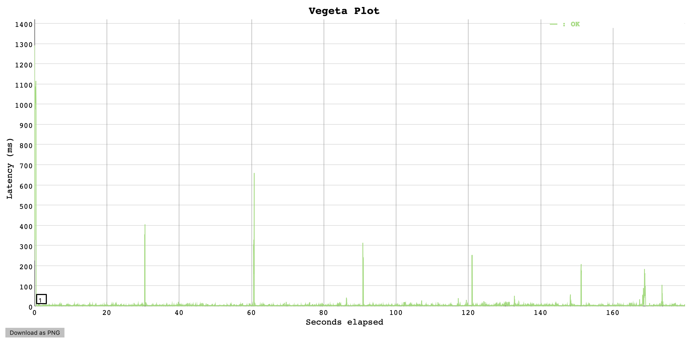

# Test Results: WebCore page caching

## Context

WebCore Pres Layer returns a public cache-control header. This enables pages to be cached in Belfrage. The tests described in this report verify the caching performance for WebCore pages.

## Hypotheses

- WebCore returns public cache-control header
- WebCore pages are cached in Belfrage local and distributed (fallback) caches
- Belfrage serving mostly cached content from the local cache and is performant

## Setup
- Vegeta Runner on EC2
- Requests to Belfrage test

## Tests

Request a Topics sport page: https://www.belfrage.test.api.bbc.co.uk/sport/curling, verify `cache-control` header is present and the page is cached by checking Belfrage local (ETS) and distributed (S3) cache storage.

Run `180s 200rps` test on the same page, verify Belfrage mostly serves cached content with CloudWatch `cache.local.fresh.hit` and `cache.local.miss` metrics.

## Results

The Topics sport page (curling) returns the following public cache-control response header:

```json
{
  "name": "cache-control",
  "value": "public, stale-while-revalidate=0, max-age=30"
}
```

The page was found in Belfrage in-memory cache via Elixir remote console, by looking up the cache with the page hash key:

```
iex(belfrage@10.114.165.38)> [{_, _, _, _, {%{body: gzip}, _}}] = :ets.lookup :cache, "c690a8d2f08b1d7832f168f79218165b"
[
  {:entry, "c690a8d2f08b1d7832f168f79218165b", 1587133101502, 21600000,
   {%Belfrage.Struct.Response{
      body: <<31, 139, 8, 0, 0, 0, 0, 0, 0, 3, ...>>,
      cache_directive: %{
        cacheability: "public",
        max_age: 30,
        stale_if_error: 0,
        stale_while_revalidate: 0
      },
      fallback: false,
      headers: %{
        "content-encoding" => "gzip",
        ..
      },
      http_status: 200
    }, 1587133101502}}
]
```
```
iex(belfrage@10.114.165.38)36> gzip |> :zlib.gunzip |> String.slice(0..239)
"<!DOCTYPE html><html lang=\"en\" class=\"no-js\"><head><meta charSet=\"utf-8\" /><meta name=\"viewport\" content=\"width=device-width, initial-scale=1\" /><title>Curling | BBC Sport</title><meta name=\"description\" content=\"The home of Curling on BBC " <> ...
```

The page was also cached in Belfrage distributed cache as verified through the CCP (Central Cache Processor) table and storage (S3) lookup:

```
iex(belfrage_ccp@10.114.163.5)8> BelfrageCcp.cache_info "c690a8d2f08b1d7832f168f79218165b"
{1587139990215, 3835}
```

```
iex(belfrage_ccp@10.114.163.5)9> BelfrageCcp.get "c690a8d2f08b1d7832f168f79218165b"
{:ok,
 %{
   __struct__: Belfrage.Struct.Response,
   ...
}}
```

The load test result suggests Belfrage served mostly cached content (99% of requests) during the test duration and is performant. Most of the requests (~0.8% of total requests) sent to WebCore Lambda origin happened in spikes at max age/TTL (set at 30s) intervals when cache content was being refreshed.

#### 180s, 200rps

```
ID: 1587379863686
Requests      [total, rate, throughput]  36000, 200.01, 199.99
Duration      [total, attack, wait]      3m0.006614564s, 2m59.995393424s, 11.22114ms
Latencies     [mean, 50, 95, 99, max]    7.628985ms, 3.028422ms, 7.188532ms, 67.484411ms, 1.292131659s
Bytes In      [total, mean]              4504320000, 125120.00
Bytes Out     [total, mean]              0, 0.00
Success       [ratio]                    100.00%
Status Codes  [code:count]               200:36000
Error Set:
```

[Results](https://broxy.tools.bbc.co.uk/belfrage-loadtest-results/vegeta-180s-200rps-1587379863686)



| elapsed time (minute)| cache.local.fresh.hit (~= web.response.status.200) |  cache.local.miss (= service.lambda.response.200)  |
|----------|--------------|--------------------------|
| 1st  |  519  |  97  |
| 2nd  |  11.9k  |  81  |
| 3rd  |  11.9k  |  75 |
| 4th  |  11.4k |  42  |
| 5th  |  7  |  4  |

Total hits: 35,726, total miss: 299

