# Test Results: cache limit and reclaim

## Context

To prevent local (tier-1) cache from consuming all available VM memory and causing crashes at higher request rates, a cache limit and reclaim mechanism is configured. The mechanism is based on [Cachex size limit](https://hexdocs.pm/cachex/cache-limits.html) and its default least-recently-written (LRW) reclaim policy.

## Hypotheses

- cache limit and reclaim mechanism stabilises memory usage at higher request rates (425rps)
- cache limit and reclaim mechanism is performant at higher request rates (425rps)

## Setup
- Vegeta Runner on EC2, Repeater
- Requests to Belfrage playground: c5.2xlarge, 8-core CPU, 16GB memory
- Cache: 36k max size, LRW reclaim policy, reclaim ratio: 0.3 (30%)

## Tests

Run the following tests (0ms simulated latency) on Belfrage playground with OriginSimulator returning gzip payload (e.g. [single-route recipe](data/2020-05-05/recipe.json)):

#### Vegeta

- 1200s/20min 425rps 1kb payload: on a single-route with `cache-bust`, so that all requests are cached
- 240s 425rps 100kb payload: on a single-route with `cache-bust`, so that all requests are cached
- 130s 425rps 300kb payload: on a single-route with `cache-bust`, so that all requests are cached

#### Repeater

- 30-minute 50% Repeater traffics (~500rps), OriginSimulator returning 100kb gzip payload

During all the tests, the following BEAM VM stats was sampled at 1s frequency or every 30s (for the Repeater test) by running [this script](https://gist.github.com/boonious/d1b7a8c03dfb255c879a2ee9215d0ad5) in IEx remote console:

- memory usage
- %CPU util
- cache table (ETS) size
- cache table memory usage

For the Repeater test, a one-minute [microstate accounting](https://erlang.org/doc/man/msacc.html) was also run to measure the time spent on various system tasks. To enable reporting with additional states accounting (e.g. `busy wait`, `NIF` states), Erlang run-time was compiled with `--with-microstate-accounting=extra` configuration. On the Playground EC2 instance where `asdf` was installed, the configuration was enabled with the `KERL_CONFIGURE_OPTIONS` environment variable prior to installation: 

```
$ export KERL_CONFIGURE_OPTIONS="--with-microstate-accounting=extra"
$ asdf install erlang  22.3.3
```

A one-minute microstate accounting statistic sample was generated through the following steps in remote console:

```
iex(belfrage@10.114.166.240)1> :msacc.start 60000
iex(belfrage@10.114.166.240)2> :msacc.print
```

## Results

The cache limit and reclaim mechanism stabilises memory usage at higher request rates. In all the tests, memory usage plateaued at levels corresponding to max cache size when the local cache was filled up. Memory usage was up to ~5GB (30%) on average and ~8GB (50%) max for larger payload (300kb) responses. The reclaim or cache eviction mechanism is evident from the sawtooth memory usage and cache size plots. In the longer-duration Repeater test (~500rps, 100kb payload), memory usage was stable at 2-3GB. This provides ample spare memory for other Belfrage processes and perhaps a larger-size cache if this improves cache hit ratio (34% gauged from the Repeater test).

With memory usage stabilising, Belfrage traffic throughput is now CPU-bound as indicated by the result from the Repeater test: 68.78% (average) and 87.6% (maximum) %CPU utilisation.

Cache limiting is performant according to the latencies results which are in acceptable ranges including 8.9ms - 18.9ms for the Repeater test. All requests were 200-status successful. According the one-minute microstate accounting stats, the VM spent majority of time (65.53%) in processing requests (`emulator`, `NIF`) while the `busy_wait` time was healthy at 5.55%. The work load was spread evenly across all 8 scheduler threads (8-core CPU) suggesting efficient CPU usage.

Suggestion: 

- ~500rps max production traffic load per c5.2xlarge EC instance
- investigate implication of various cache limit settings (size, reclaim ratio) w.r.t. throughput and hit ratio
- VM behaviour when cache limit mechanism fails: reclaim ratio is ineffective (too slow) against higher request rates (spikes)
- use max-age as local cache entries TTL instead of a fix 6-hour value

#### VM average and max stats

| Tests | memory usage MB (avg) | memory usage MB (max) | %CPU util (avg) | %CPU util (max) |
|-------|--------------------|--------------------|-----------------|-----------------|
| 1200s, 1kb | 130.38 | 151.27 | 14.09% | 39.62% |
| 240s, 100kb | 1986.43 | 2914.34 | 23.19% | 39.54% |
| 130s, 300kb | 5135.95 | 8096.94 | 39.56% | 53.84% |
| 30m repeater | 2365.89 | 2905.91 | 68.78% | 87.6% |

#### BEAM VM stats

Memory usage, %CPU, cache table size, cache table memory size:

- [1200s, 425rps, 1kb, cache-bust](data/2020-05-05/1200s_425rps_1kb_stats.csv)
- [240s, 425rps, 100kb, cache-bust](data/2020-05-05/240s_425rps_100kb_stats.csv)
- [130s, 425rps, 300kb, cache-bust](data/2020-05-05/1200s_425rps_1kb_stats.csv)
- [30min, 50% Repeater traffics, 100kb](data/2020-05-05/30min_50percent_repeater_100kb_stats.csv)

Microstate accounting: one-minute sample, Repeater test:

- [Statistic per CPU threads](data/2020-05-05/30min_50percent_repeater_100kb_msacc_threads.csv)
- [Statistic per type](data/2020-05-05/30min_50percent_repeater_100kb_msacc_type.csv)

#### Vegeta

*1200s, 425rps, 1kb, cache-bust*

```
ID: 1588631134357
Requests      [total, rate, throughput]  510000, 425.00, 425.00
Duration      [total, attack, wait]      19m59.999891563s, 19m59.997583735s, 2.307828ms
Latencies     [mean, 50, 95, 99, max]    2.521708ms, 2.33836ms, 3.331595ms, 5.818934ms, 188.062311ms
Bytes In      [total, mean]              522240000, 1024.00
Bytes Out     [total, mean]              0, 0.00
Success       [ratio]                    100.00%
Status Codes  [code:count]               200:510000  
```

[Vegeta results](https://broxy.tools.bbc.co.uk/belfrage-loadtest-results/vegeta-1200s-425rps-1588631134357)

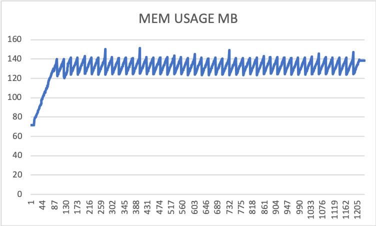

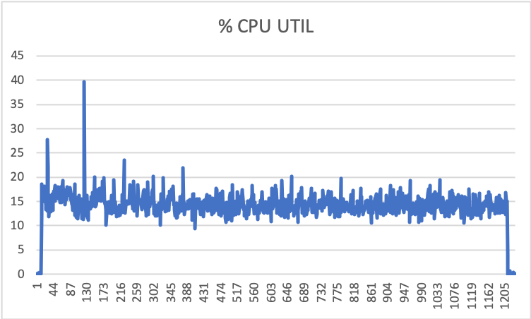

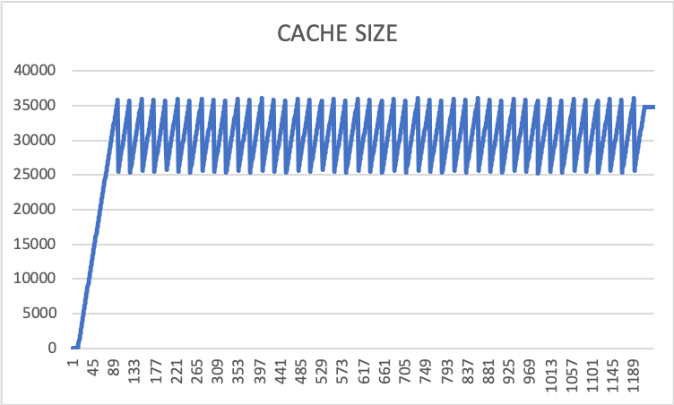

*240s, 425rps, 100kb, cache-bust*

```
ID: 1588684181733
Requests      [total, rate, throughput]  102000, 425.00, 425.00
Duration      [total, attack, wait]      4m0.002820888s, 3m59.99769443s, 5.126458ms
Latencies     [mean, 50, 95, 99, max]    20.034503ms, 5.107651ms, 47.022381ms, 492.909593ms, 1.615765821s
Bytes In      [total, mean]              10444800000, 102400.00
Bytes Out     [total, mean]              0, 0.00
Success       [ratio]                    100.00%
Status Codes  [code:count]               200:102000
```

No further Vegeta results due to incomplete reporting from load test instance (ran out of space when generating report).

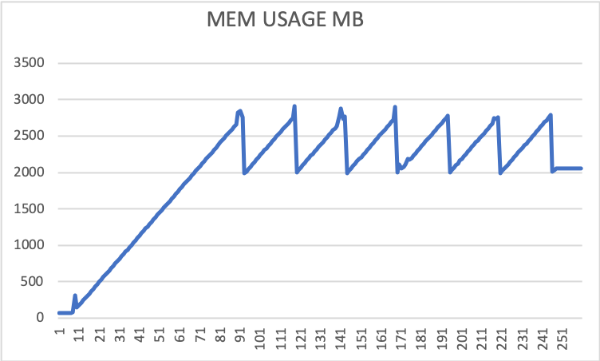

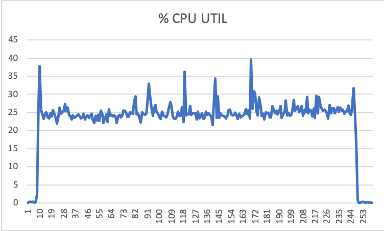

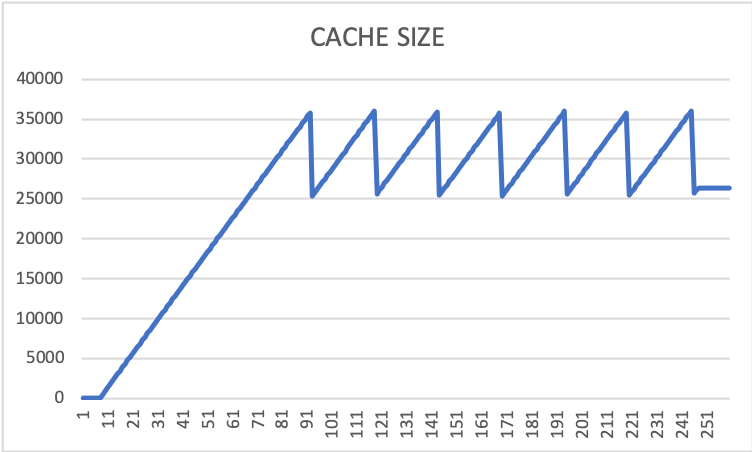

*130s, 425rps, 300kb, cache-bust*

```
Requests      [total, rate, throughput]  55250, 425.00, 424.96
Duration      [total, attack, wait]      2m10.010713183s, 2m9.999099338s, 11.613845ms
Latencies     [mean, 50, 95, 99, max]    15.452684ms, 12.77082ms, 22.946067ms, 80.542584ms, 260.710218ms
Bytes In      [total, mean]              16972800000, 307200.00
Bytes Out     [total, mean]              0, 0.00
Success       [ratio]                    100.00%
Status Codes  [code:count]               200:55250  
```

No further Vegeta results due to incomplete reporting from load test instance (ran out of space when generating report).

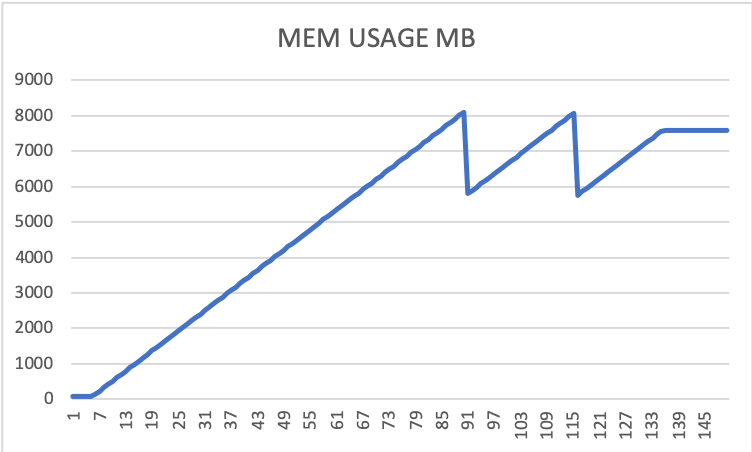

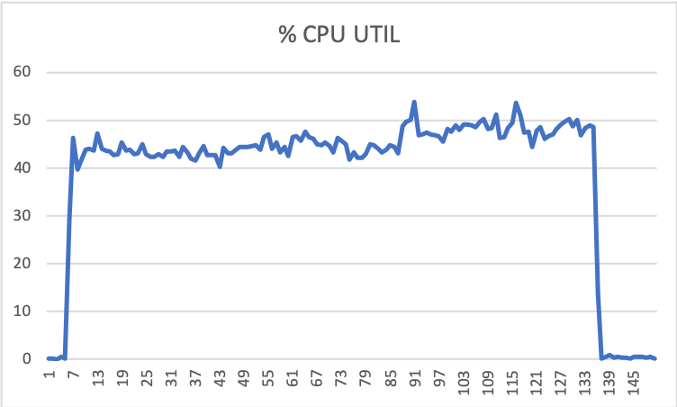

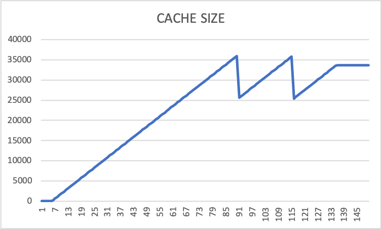

#### Repeater: 30-minutes 50% traffics

*CloudWatch metrics*

- Number of requests: ~900k
- 200 status response time: 8.9ms - 18.9ms
- Cache hit ratio: 34%

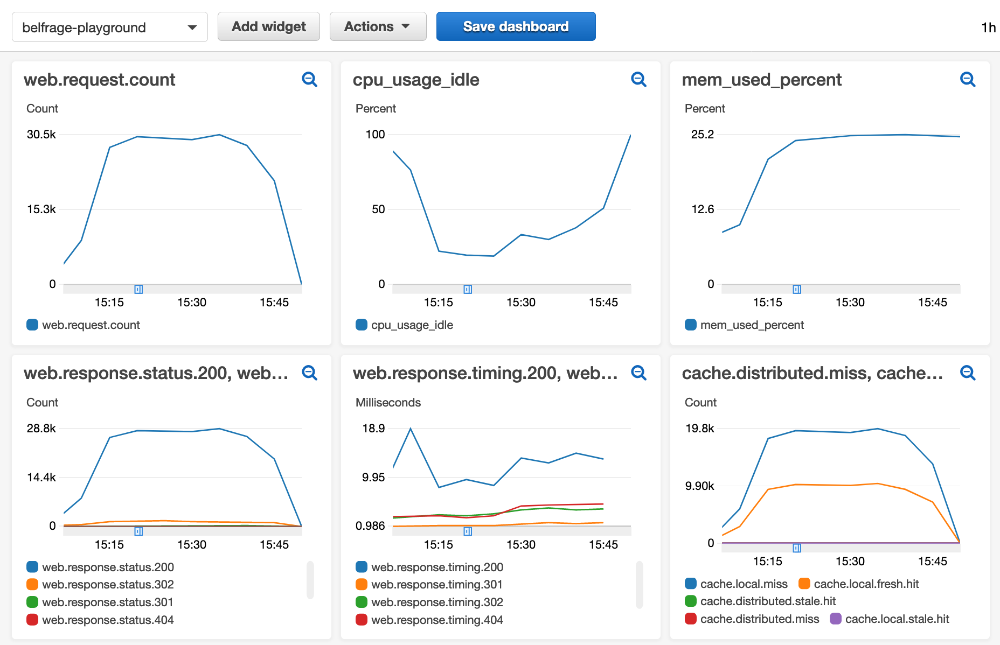

*VM stats*

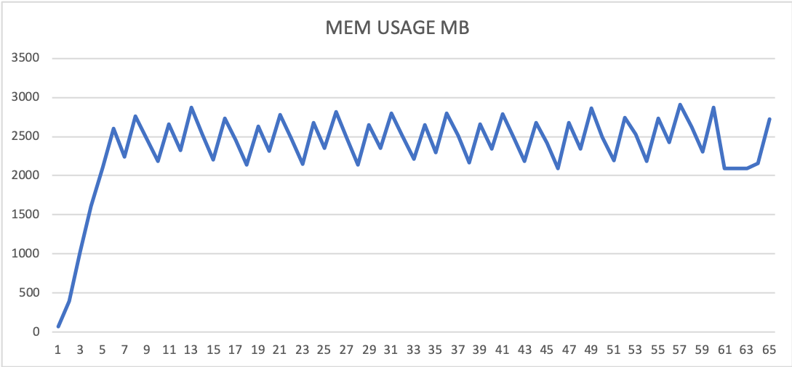

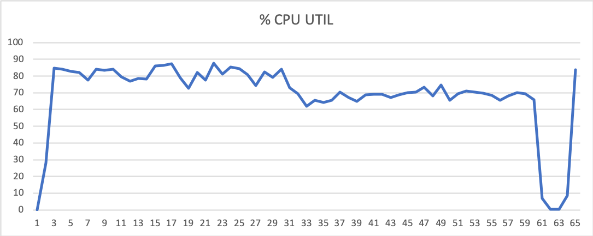

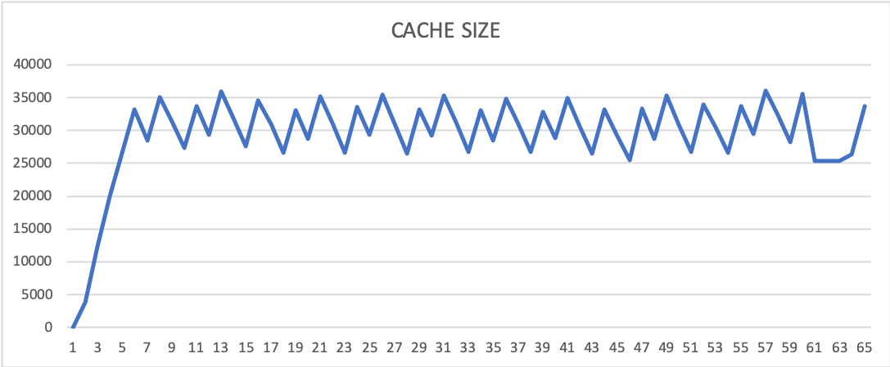

*BEAM microstate accounting stats: 1-minute sample*

|     Thread     | alloc |  aux  |  bif  | busy_wait | check_io | emulator | ets | gc | gc_full | nif | other | port | send | sleep | timers |
|----------------|-------|-------|-------|-----------|----------|----------|-----|----|---------|-----|-------|------|------|-------|--------|
| dirty_cpu_sche | 0.00% | 0.00% | 0.00% | 0.00% | 0.00% | 0.00% | 0.00% | 0.00% | 0.00% | 0.00% | 0.00% | 0.00% | 0.00% | 100.00% | 0.00% |
| dirty_io_sched | 0.00% | 0.00% | 0.00% | 0.07% | 0.00% | 0.00% | 0.00% | 0.00% | 0.00% | 0.00% | 0.00% | 0.00% | 0.00% | 99.92% | 0.00% |
| poll | 0.09% | 0.00% | 0.00% | 0.00% | 1.62% | 0.00% | 0.00% | 0.00% | 0.00% | 0.00% | 0.00% | 0.00% | 0.00% | 98.29% | 0.00% |
| scheduler | 4.83% | 0.46% | 4.32% | 5.55% | 0.96% | 13.79% | 2.53% | 4.24% | 0.61% | 51.74% | 0.87% | 2.18% | 1.04% | 6.83% | 0.03% |