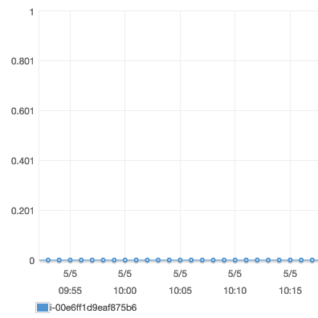
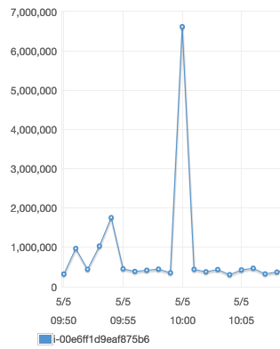
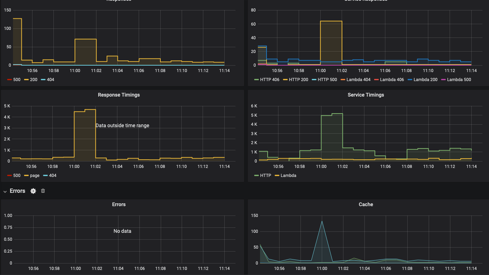

# Load test GTM to Belfrage Test

- 5th May 2020
- GTM Test endpoint to Belfrage Test on Tajik
- Vegeta Runner
- 20 RPS - 200RPS recipe over 300 secs
- 10:54 GMT start

The 200RPS test caused a disk space usage issue however the initial report in the terminal was saved.

The purpose of this test was to verify whether or not the requests through the GTM were being cached.

### Instance

- Type: 1 x c5.2xlarge
- CPUs: 8 vCPUs (4 core, 2 threads per core)

## Tests

Run the `vegeta-300s-200rps` recipe (5 min tests):
https://github.com/bbc/belfrage-wrk2-loadtest/blob/master/trigger/recipes/vegeta-300s-200rps.json

## Resources

### S3 Results
[vegeta-300s-200rps-1588673650028](https://broxy.tools.bbc.co.uk/belfrage-loadtest-results/vegeta-300s-200rps-1588673650028)

### Grafana charts
[Belfrage Test](https://grafana.news.test.tools.bbc.co.uk/dashboard/script/belfrage.js?orgId=1&dashboardId=belfrage&stack=belfrage&region=eu-west-1&env=test&from=1588672451751&to=1588673702234)

## Historgrams

### 20rps

10:54

```
Requests      [total, rate, throughput]  6000, 20.00, 20.00
Duration      [total, attack, wait]      4m59.953415619s, 4m59.949993203s, 3.422416ms
Latencies     [mean, 50, 95, 99, max]    10.206843ms, 3.587028ms, 4.507256ms, 8.423928ms, 1.640138966s
Bytes In      [total, mean]              1060326000, 176721.00
Bytes Out     [total, mean]              0, 0.00
Success       [ratio]                    100.00%
Status Codes  [code:count]               200:6000
```

### 50rps

10:59

Note: the possible correlation of the longer latencies here to the responses, latency, and cache misses on Grafana for this test.

```
Requests      [total, rate, throughput]  15000, 50.00, 50.00
Duration      [total, attack, wait]      4m59.983754644s, 4m59.97998737s, 3.767274ms
Latencies     [mean, 50, 95, 99, max]    59.289158ms, 2.954208ms, 4.70963ms, 2.493016153s, 10.112362334s
Bytes In      [total, mean]              2650815000, 176721.00
Bytes Out     [total, mean]              0, 0.00
Success       [ratio]                    100.00%
Status Codes  [code:count]               200:15000
```

### 100rps

11:04

```
Requests      [total, rate, throughput]  30000, 100.00, 100.00
Duration      [total, attack, wait]      4m59.993612571s, 4m59.989986212s, 3.626359ms
Latencies     [mean, 50, 95, 99, max]    4.52373ms, 3.058593ms, 4.216103ms, 24.753249ms, 1.471442985s
Bytes In      [total, mean]              5301630000, 176721.00
Bytes Out     [total, mean]              0, 0.00
Success       [ratio]                    100.00%
Status Codes  [code:count]               200:30000
```

### 200rps

11:09

The Load test instance ran of out disk space on this run so no reports were generated.

```
Requests      [total, rate, throughput]  60000, 200.00, 200.00
Duration      [total, attack, wait]      4m59.997918474s, 4m59.995037515s, 2.880959ms
Latencies     [mean, 50, 95, 99, max]    7.402676ms, 3.060439ms, 6.833131ms, 151.032542ms, 2.175435523s
Bytes In      [total, mean]              10603083279, 176718.05
Bytes Out     [total, mean]              0, 0.00
Success       [ratio]                    100.00%
Status Codes  [code:count]               0:1  200:59999
Error Set:
http2: server sent GOAWAY and closed the connection; LastStreamID=1999, ErrCode=NO_ERROR, debug=""
```

## Server utilization

### Belfrage CPU Utilization (Percent)



### Belfrage Network Packets Out (Count)



### Grafana Dashboard



## Summary

The observed responses in Grafana show a much lower value than the generated rate of requests. This suggests that the vast majority of requests were cached successfully in GTM with a HIT.

The CPU in Belfrage shows a flat line with no impact on performance. The network graph shows a rough correlation with the tests that were run which indicates that Belfrage did received traffic over this time.

There Vegeta reports, particulary for the 50rps and 100rps test runs show periodic spiking of latency. In addition to that there are some large spikes on the 50rps test run which appears to be correlated to the latency increase in Belfrage and the cache misses.

* [50 rps](https://broxy.tools.bbc.co.uk/belfrage-loadtest-results/vegeta-300s-200rps-1588673650028/300secs_50rps/report-plot.html)
* [100 rps](https://broxy.tools.bbc.co.uk/belfrage-loadtest-results/vegeta-300s-200rps-1588673650028/300secs_100rps/report-plot.html)

A followup from this may be to investigate further the cache misses in the Belfrage layer and also for a comparison of the monitoring in GTM.
