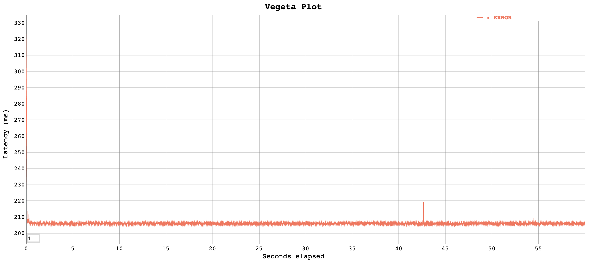

# Test results: Cascade service

## Context
[Belfrage Cascade service](https://paper.dropbox.com/doc/RFC-Fetching-from-multiple-origins-in-Belfrage--A1smYy64nIKHazG~4du2p0RGAg-73EMI4UwT9rMW5hVUpRuc) provides routing for multiple origins that share a route pattern. This report describes the load tests that aim to gauge Belfrage performance when requests are cascaded to multiple downstream origins.

## Hypotheses

- Cascade service is performant at higher request rates: 400rps
- Cascade service introduces latency penalty to downstream origins

## Setup

- Vegeta Runner on EC2: c5.2xlarge instance, 16GB
- Requests to Belfrage on playground: c5.2xlarge, CPUs: 8 vCPUs, 16GB
- OriginSimulator on EC2: c5.2xlarge instance, CPUs: 8 vCPUs
- Build: [Cascade branch](https://github.com/bbc/belfrage/tree/cascade) (e22cb63feeb324d1a0e1d732f0a8d74cbe5dd145) 

## Tests

Run 60s 400rps multiple-latency load tests on the following test route involving two origins backed by OriginSimulator:

```ex
handle "/_private/belfrage-cascade-test", using: ["Origin1", "Origin2"], only_on: "test", examples: ["/_private/belfrage-cascade-test"]
```

Mocking multiple origins with route specs o different platforms:

```ex
defmodule Routes.Specs.Origin1 do
  def specs do
    %{
      platform: Fabl,
      pipeline: ["CircuitBreaker"],
      query_params_allowlist: ["alternativeJsLoading", "batch"]
    }
  end
end
```

```ex
defmodule Routes.Specs.Origin2 do
  def specs do
    %{
      platform: Mozart,
      pipeline: ["CircuitBreaker"],
      query_params_allowlist: ["alternativeJsLoading", "batch"]
    }
  end
end
```

To divert request traffics from the origins to OriginSimulator, set the corresponding endpoint environment variables of the platforms before building Belfrage:

```
$ export FABL_ENDPOINT=http://..origin_simulator_endpoint..
$ export MOZART_ENDPOINT=http://..origin_simulator_endpoint..
```

Set OriginSimulator to return status 404. This triggers successive, i.e. cascading requests to the origins (OriginSimulator). The following origin latencies were set during the load tests:

- 100ms
- 500ms
- 1s

## Results

Cascade service is performant at 400rps but only for origins that are operating at lower latencies (100ms, 500ms) (Plot 1). The performance deteriorates quickly in tests involving slower origins, see 1s latency test where slower requests queued up and became unresponsive - Plot 2. The degradation is a result of saturated access to Belfrage's HTTP connection pool - a system resource that has finite capacity.

In contrast, routing of non-cascade route with origins of the same latencies does not entail the same performance degradation - see Plot 3.

Cascade service also introduces a latency (time) penalty to requests intended for origins in the cascade downstream, i.e. `Origin2` in the load tests. If both origins in the cascade have the same level of latencies, the time required to fulfill a request for `Origin2` is at least 100% longer. On a multi-tenant platform such as Belfrage, the cascade architecture would inevitably give rise to side-effects in which routing may be preferential and biased against some teams whose optimisation work may be undone by others.

Both the performance degradation and latency penalty are also directly proportional to the number of origins in the cascade. More origins means larger time penalty and the degradation (HTTP connection pool saturation) happens at lower origin latency levels.

#### Vegeta - Cascade

*60s, 400rps, 100ms*

```
ID: 1591889903404
Requests      [total, rate, throughput]  24000, 400.02, 0.00
Duration      [total, attack, wait]      1m0.203649476s, 59.997476315s, 206.173161ms
Latencies     [mean, 50, 95, 99, max]    206.215123ms, 206.182156ms, 206.60362ms, 206.900076ms, 323.403286ms
Bytes In      [total, mean]              0, 0.00
Bytes Out     [total, mean]              0, 0.00
Success       [ratio]                    0.00%
Status Codes  [code:count]               404:24000
Error Set:
404 Not Found
```

[Full results](https://broxy.tools.bbc.co.uk/belfrage-loadtest-results/vegeta-60s-400rps-1591889903404)

*Plot 1*


*60s, 400rps, 500ms*

```
ID: 1591890210639
Requests      [total, rate, throughput]  24000, 400.02, 0.00
Duration      [total, attack, wait]      1m1.003697431s, 59.997501176s, 1.006196255s
Latencies     [mean, 50, 95, 99, max]    1.006240256s, 1.006179657s, 1.006667572s, 1.007592314s, 1.141479352s
Bytes In      [total, mean]              0, 0.00
Bytes Out     [total, mean]              0, 0.00
Success       [ratio]                    0.00%
Status Codes  [code:count]               404:24000
Error Set:
404 Not Found
```

[Full results](https://broxy.tools.bbc.co.uk/belfrage-loadtest-results/vegeta-60s-400rps-1591890210639)

*60s, 400rps, 1s*

```
ID: 1591890369984
Requests      [total, rate, throughput]  24000, 400.02, 0.00
Duration      [total, attack, wait]      1m4.442768553s, 59.997479182s, 4.445289371s
Latencies     [mean, 50, 95, 99, max]    3.417081638s, 2.976835472s, 6.022120872s, 8.585601939s, 15.392704991s
Bytes In      [total, mean]              0, 0.00
Bytes Out     [total, mean]              0, 0.00
Success       [ratio]                    0.00%
Status Codes  [code:count]               404:24000
Error Set:
404 Not Found
```

[Full results](https://broxy.tools.bbc.co.uk/belfrage-loadtest-results/vegeta-60s-400rps-1591890369984)

*Plot 2*


#### Vegeta - non cascade

*60s, 400rps, 100ms*
```
ID: 1591952117918
Requests      [total, rate, throughput]  24000, 400.02, 0.00
Duration      [total, attack, wait]      1m0.100696837s, 59.997493065s, 103.203772ms
Latencies     [mean, 50, 95, 99, max]    103.845351ms, 103.694898ms, 104.018507ms, 104.356554ms, 303.913455ms
Bytes In      [total, mean]              216000, 9.00
Bytes Out     [total, mean]              0, 0.00
Success       [ratio]                    0.00%
Status Codes  [code:count]               404:24000
Error Set:
404 Not Found
```

[Full results](https://broxy.tools.bbc.co.uk/belfrage-loadtest-results/vegeta-60s-400rps-1591952117918)

*60s, 400rps, 1s*
```
ID: 1591894716622
Requests      [total, rate, throughput]  24000, 400.02, 0.00
Duration      [total, attack, wait]      1m1.000985077s, 59.997484465s, 1.003500612s
Latencies     [mean, 50, 95, 99, max]    1.004052973s, 1.003964211s, 1.004278418s, 1.005354066s, 1.128618414s
Bytes In      [total, mean]              216000, 9.00
Bytes Out     [total, mean]              0, 0.00
Success       [ratio]                    0.00%
Status Codes  [code:count]               404:24000
Error Set:
404 Not Found
```

[Full results](https://broxy.tools.bbc.co.uk/belfrage-loadtest-results/vegeta-60s-400rps-1591894716622)

*Plot 3*

