# Load Tests: Comparison of logging level changes

- 17th June 2020
- Belfrage returning a 404 and also via Origin Simulator
- Belfrage with the Repeater pointing to the Playground for 30 min runs
- No caching on 404, 30secs cache on Origin Simulator
- Vegeta Runner (http1)

## Context

We want to investigate whether there are any performance implications when enabling the debug logging feature in Belfrage.

### Instance

- Type: 1 x c5.2xlarge
- CPUs: 8 vCPUs (4 core, 2 threads per core)

## Tests

https://www.belfrage-playground.test.api.bbc.co.uk/foo/bar?belfrage-cache-bust

A series of tests against this url
* with debug disabled returning with a 404
* with debug enabled returning with a 404
* with debug disabled returning a 200 from Origin Simulator
* with debug enabled returning a 200 from Origin Simulator
* with debug disabled and the Repeater targeting the Playground
* with debug enabled and the Repeater targeting the Playground

Origin simulator recipe
```
[{"stages":[{"status":200,"latency":"5ms","at":0}],"route":"/*","random_content":"100kb","origin":null,"headers":{"content-encoding":"gzip","cache-control":"public, max-age=30"},"body":null}]
```

## Results

### 60s, 200rps, HTTP 404

```
Latencies     [mean, 50, 95, 99, max]
Disabled      1.80907ms, 1.581766ms, 1.891438ms, 2.726783ms, 148.696467ms
Enabled       1.785399ms, 1.581185ms, 2.285295ms, 4.178109ms, 101.19768ms
```

**CPU utilization comparison**  
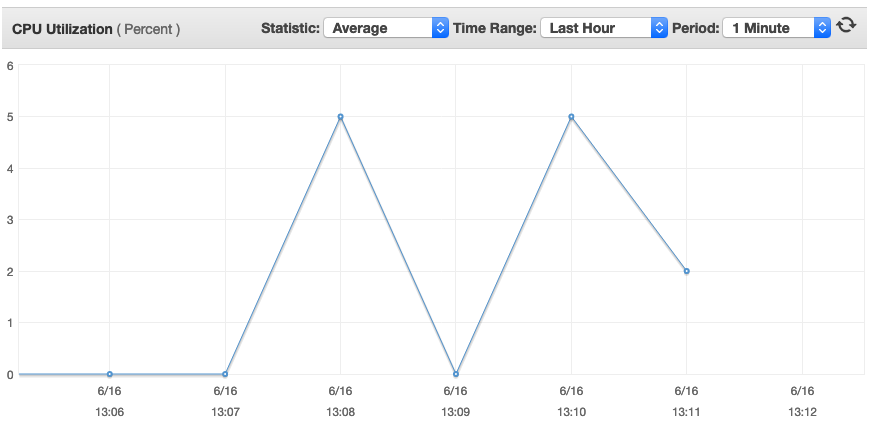

### 300s 500rps, HTTP 404

```
Latencies     [mean, 50, 95, 99, max]
Disabled      1.770131ms, 1.522676ms, 2.758617ms, 5.100605ms, 185.022081ms
Enabled       1.782945ms, 1.502526ms, 2.789291ms, 5.689174ms, 196.292007ms
```

### 300s 1000rps, HTTP 404

```
Latencies     [mean, 50, 95, 99, max]
Disabled      2.067679ms, 1.473702ms, 3.36584ms, 8.00226ms, 431.169062ms
Enabled       1.845596ms, 1.4736ms, 3.075696ms, 7.14886ms, 283.339485ms
```

Diskspace increased from 29% to 32% which is approx 262MB.

**CPU utilization comparison**  
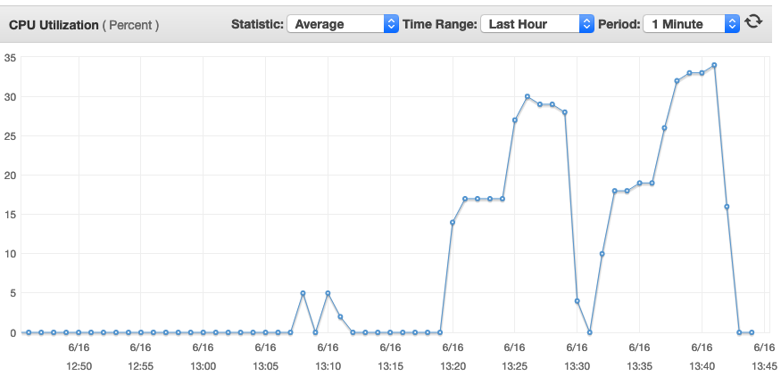

### 60s 200rps, HTTP 200 Origin Simulator 100kb body, 300ms latency

```
Latencies     [mean, 50, 95, 99, max]
Disabled      310.435691ms, 309.852376ms, 311.955568ms, 316.100049ms, 477.233128ms
Enabled       310.770943ms, 310.03872ms, 312.787567ms, 322.993493ms, 499.857424ms
```

**CPU utilization comparison**  
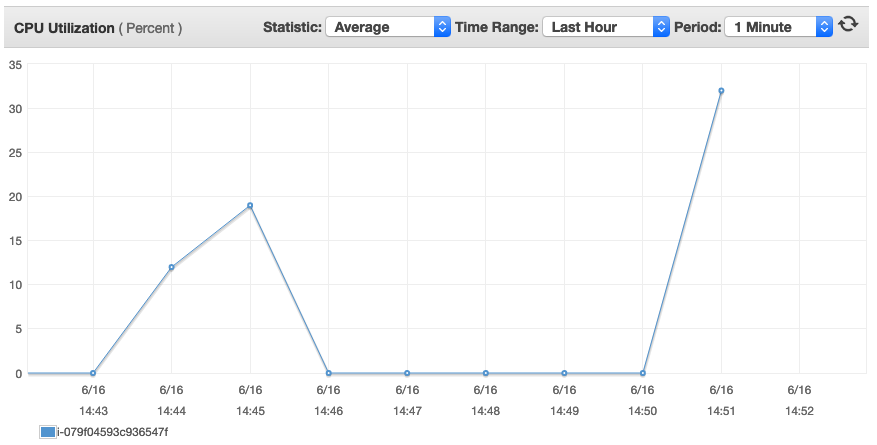

### 60s 300rps, HTTP 200 Origin Simulator 100kb body, 300ms latency

```
Latencies         [mean, 50, 95, 99, max]
Disabled (16:20)  314.756002ms, 310.022938ms, 311.664438ms, 494.128844ms, 1.012510629s
Enabled (16:23)   310.574849ms, 309.935371ms, 311.445896ms, 312.966299ms, 542.166982ms
```

### 300s 300rps, HTTP 200 Origin Simulator 100kb body, 300ms latency

```
Latencies         [mean, 50, 95, 99, max]
Disabled (16:28)  310.216463ms, 310.057928ms, 311.3888ms, 312.241665ms, 503.126237ms
Enabled (16:37)   310.20138ms, 310.007563ms, 311.444624ms, 312.254125ms, 523.441247ms
```

Disk usage after the load test runs
```
[alasdair_stalker@ip-10-114-163-24 ~]$ du -h /var/log/component/app.log
74M	/var/log/component/app.log
```

**CPU utilization comparison**  
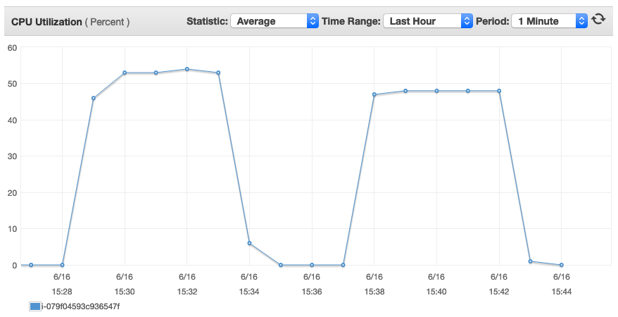

Note: the high cpu utilization here is a result of the Origin Simulator response not including the gzip header. This means that Belfrage then gzip encodes the response causing an increase in work for Belfrage.

### 300s 300rps, HTTP 200 Origin Simulator 200kb body, 300ms latency

```
Latencies        [mean, 50, 95, 99, max]
Disabled 17:03)  319.293701ms, 318.798942ms, 321.740514ms, 324.659237ms, 583.33008ms
Enabled (17:18)  327.882182ms, 319.100477ms, 323.419641ms, 718.948202ms, 1.535362004s
```

**CPU utilization comparison**  
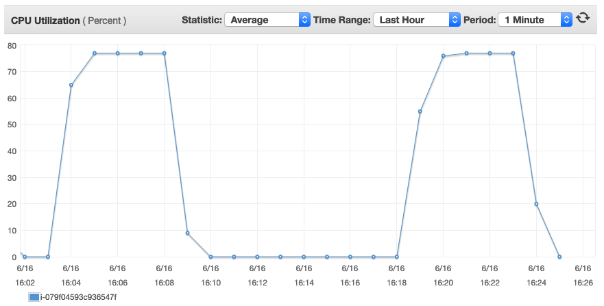

Observe the increase in utilization of an increase of 100kb body (approx 76% versus 53%).

### Repeater - Replay 1x 50% traffic

* 15:48 - 16:19 logs enabled
* 16:30 - 17:00 logs disabled

Disk usage after the load tests:
```
[alasdair_stalker@ip-10-114-163-24 component]$ df -h
Filesystem      Size  Used Avail Use% Mounted on
devtmpfs        7.6G     0  7.6G   0% /dev
tmpfs           7.7G     0  7.7G   0% /dev/shm
tmpfs           7.7G   25M  7.6G   1% /run
tmpfs           7.7G     0  7.7G   0% /sys/fs/cgroup
/dev/nvme0n1p1  8.0G  6.5G  1.6G  81% /
tmpfs           1.6G     0  1.6G   0% /run/user/1000
```

**CPU utilization comparison**  
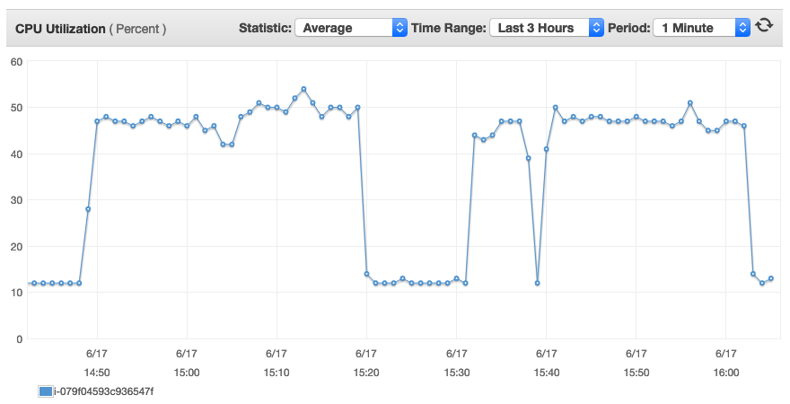

The first run shows the CPU usage when logs are enabled and then approx 10 mins later a subsequent run with the logs disabled. The CPU usage is slightly higher eith debug logs enabled.

**Memory usage chart**  
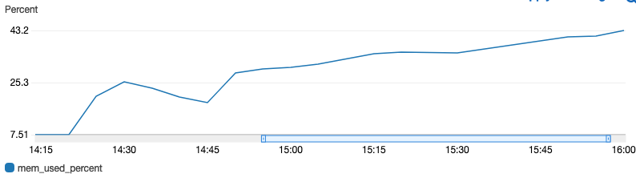

The memory usage over the Repeater test runs shows an increasing memory usage. This may be due to the page variations from the Repeater which would result in the Belfrage in-memory cache increasing in size.

**Disk and memory usage chart**  
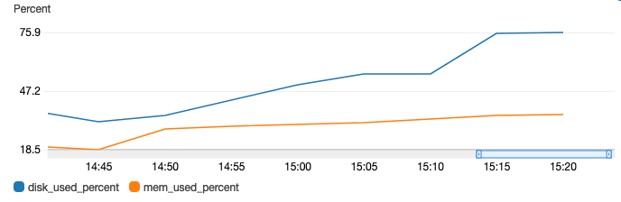

The disk usage presents the greatest factor as the log file size can increase dramatically. On the Playground instance that was used in the tests the disk usage is 29% upon initialisation. This increases to 81% over the 30 min period when the debug logs were enabled and equates to 6.5GB out of 8GB (the instance volume size). The size increase is a result of the logs in the `/home/component/app.log` file.

## Observations

### Memory use

Memory usage during the load test runs suggests a relatively small amount of memory use. It is also quite flat with memory being freed periodically. This is in contrast to when the repeater was enabled (as shown above) which shows a steady increase in use. In conclusion the memory profile does not appear to be affected by enabling the debug logs.


**Memory usage during load tests**  
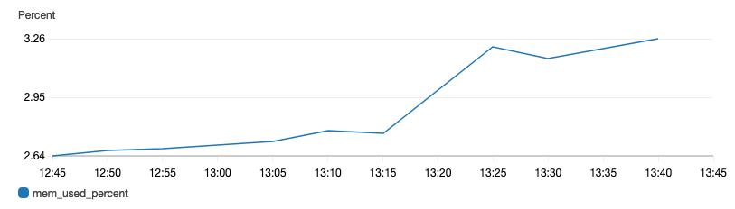

**Memory usage during Repeater tests**  
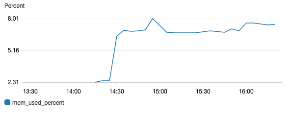

### Disk use

The disk usage during the load test runs shows that the usage can increase quite dramatically. It should be noted that the instance used here had a reasonably small volume size of 8GB and all traffic was being served by this one instance. Log rotate may also play a role however with any spikes in traffic we may not be able to rely on logs being rotated frequently enough to free up space.

When the debug logs were not enabled, very little (if any) logs were created. This raises the question as to where access logs should be stored as they would most certainly "drown out" the existing error logs.

**Disk usage chart**  
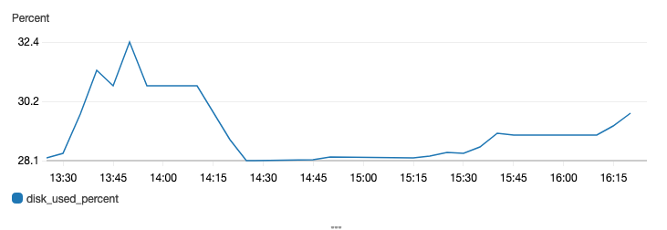

### CPU use

The CPU use during the load tests and repeater runs did not suggest that enabling the debug logs caused any additional load. Even under high CPU load scenarios where Belfrage is required to do the gzipping itself (no gzip header in Origin Simulator) it did not present any noticeable difference between disabled and enabled debug logs.

**CPU utilization comparison**  


### Latency

The latency of the Belfrage responses does not suggest there is any noticable difference when the debug logs are enabled versus them being disabled.
