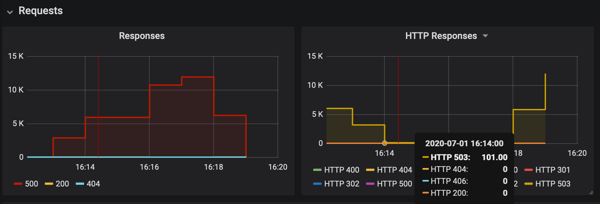
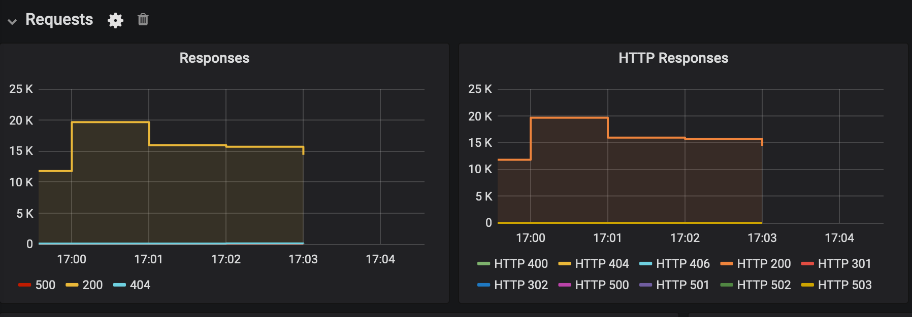
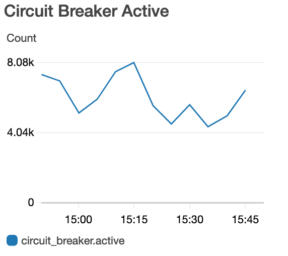

# Test results: dials fault tolerance

## Context
Belfrage relies on 3 [Cosmos Dials](https://confluence.dev.bbc.co.uk/display/platform/Developing+with+Dials) to provide near real-time control of request caching TTL, logging verbosity (log-level) and circuit breaker that throttles requests to malfunctioning origins. The reliability of these dials is crucial to Belfrage. For example, the TTL dial state is called upon in every Belfrage request. Hence, any uncaught exception arising from the TTL dial state call could be detrimental to Belfrage operation.

This report describes a load test that gauged Belfrage fault-tolerance in unexpected scenarios: Cosmos dials data (`dials.json`) is corrupted, i.e. either missing or malformed. It also contains the results of a brief acceptance test on the [circuit breaker dial implementation](https://github.com/bbc/belfrage/pull/463) that is underpinned by a new supervised event-based architecture.

## Hypotheses

- Circuit breaker dial enables and disables request throttling on origins malfunctioning 
- Belfrage is fault-tolerant of Cosmos dials data corruption: `dials.json` on test instance is missing and malformed

## Setup

- Vegeta Runner on a load test instance
- Belfrage Repeater
- Requests to Belfrage test: c5.2xlarge, 8-core CPU, 16GB memory
- OriginSimulator on EC2: c5.2xlarge instance, CPUs: 8 vCPUs

## Tests

#### Circuit breaker dial

Vegeta load test instance sending [20-minute traffic of increasing rate](https://github.com/bbc/belfrage-wrk2-loadtest/blob/master/trigger/recipes/vegeta-300s-200rps.json) (max 200rps) to Belfrage test and OriginSimulator via the ProxyPass route. OriginSimulator was set to return status 503 with 0 latency. The circuit breaker dial was enabled and disabled during the test.

#### Belfrage dials fault-tolerance

Repeater traffic (40%-50% Mozart) was sent to Belfrage test and OriginSimulator via the ProxyPass route. OriginSimulator was set to return the following statuses with 0 latency:

- 200 (100kb random content payload) in TTL dial test
- 503 in circuit breaker, log-level dial tests

To simulate Cosmos dials data corruption scenarios, `/etc/cosmos-dials/dials.json` on Belfrage test instance was either removed (renamed) or modified to contain truncated/malformed JSON (below), before Belfrage was restarted or had its dials state re-initialised. 

```
{"circuit_breaker":"true","logging_level":"erro
```

When the data corruption scenarios occur:

- file read errors were expected in /var/log/component/app.log
- `Belfrage.Dials.state` should return `%{}` on remote console, i.e. the initial (empty) dials state becomes operative on data polling failure

The following fault-tolerant **OK** states were sought:

- TTL: 200 responses, `Belfrage.Dials.TtlMultiplier.value` is a valid integer (not nil) on remote console
- log-level: error logging occurs as usual
- circuit breaker: functions as per `Belfrage.Dials.CircuitBreaker.state` which should be a boolean (not nil) on remote console

## Results

#### Circuit breaker dial

The circuit breaker dial works as expected - see below. When it was enabled, the request rate of malfunctioning origin was limited to 100 per minute, a threshold set for the ProxyPass route. Belfrage was responding at a rate of > 10k (max) per minute with the translated status 500 responses while OriginSimulator was returning 503. When the dial was disabled, thousands of requests were routed to the malfunctioning origin (no throttling).


*Plot 1: Belfrage responses for origin (status 503) when circuit breaker dial enabled between 16:14-16:17*

#### Belfrage dials fault-tolerance

Belfrage is fault-tolerant of Cosmos dials data corruption. The following test results suggests all Belfrage features associated with the dials behaved accordingly when the data corruption scenarios were occurring. 

| scenarios | TTL |  log-level  | circuit breaker |
|-----------|-----|-------------|-----------------|
| `dials.json` removed, dials reset | OK | OK<sup>*</sup> | OK |
| `dials.json` removed, Belfrage restart | OK | OK<sup>*</sup> | OK |
| `dials.json` malformed, Belfrage restart | OK | OK<sup>**</sup> | OK |

<sup>*</sup> error logs:
```
$ !tail
tail -f /var/log/component/app.log 
{"datetime":"2020-07-03T08:54:26.715937Z","level":"error","metadata":{},"msg":"Unable to read dials","reason":"enoent"}
{"datetime":"2020-07-03T08:54:56.716914Z","level":"error","metadata":{},"msg":"Unable to read dials","reason":"enoent"}
...
```

<sup>**</sup> error logs:
```
$ !tail
tail -f /var/log/component/app.log |grep dial
{"datetime":"2020-07-03T16:19:16.565344Z","level":"error","metadata":{},"msg":"Unable to read dials","reason":{"__exception__":true,"original":[48,"invalid_string"]}}
{"datetime":"2020-07-03T16:19:46.566656Z","level":"error","metadata":{},"msg":"Unable to read dials","reason":{"__exception__":true,"original":[48,"invalid_string"]}}
...
```

`Belfrage.Dials.TtlMultiplier.value` was always 1 (internal failsafe default), providing status 200 responses to all requests.


*Plot 2: Belfrage responding with 200 despite malformed dials.json*

Logging also occurred reliably during the test, whereas `Belfrage.Dials.CircuitBreaker.state` was `true` (internal failsafe default) enabling the circuit breaker function as expected.



*Plot 3: Circuit breaker in active state when dials.json is missing or malformed*