# Testing the impact of tooling dependencies

- 24th - 25th Auguest 2020
- [Empty response Lambda](https://empty-response.belfrage-playground.test.api.bbc.co.uk/)
- Load test recipes 200 - 1000rps
- Repeater for 30 min runs
- Baseline tests without Observer CLI installed
- Tests with Observer CLI installed
- Tests with Observer CLI installed and connected (observing the output in the terminal)
- Vegeta

For reference: [Observer CLI dependency change](https://github.com/bbc/belfrage/pull/524/commits/2178e31c5bae25d61c45d7ef83cbae436ffa716f)

### Instance

Playground:
- Type: 1 x c5.2xlarge
- CPUs: 8 vCPUs (4 core, 2 threads per core)

Loadtest:
- Type: 1 x c5.2xlarge

## Tests

### 60s 200rps baseline test

Run started at 15:46, [full results](https://broxy.tools.bbc.co.uk/belfrage-loadtest-results/vegeta-60s-200rps-1598280429971)

```
Requests      [total, rate, throughput]  12000, 200.02, 199.85
Duration      [total, attack, wait]      1m0.043536637s, 59.994951818s, 48.584819ms
Latencies     [mean, 50, 95, 99, max]    44.431828ms, 50.783723ms, 59.100058ms, 107.767342ms, 448.815162ms
Bytes In      [total, mean]              24000, 2.00
Bytes Out     [total, mean]              0, 0.00
Success       [ratio]                    100.00%
Status Codes  [code:count]               200:12000
```

### 60s 500rps baseline test

Run started at 15:54, [full results](https://broxy.tools.bbc.co.uk/belfrage-loadtest-results/vegeta-60s-500rps-1598280857320)

```
Requests      [total, rate, throughput]  30000, 500.02, 499.60
Duration      [total, attack, wait]      1m0.047566095s, 59.997983324s, 49.582771ms
Latencies     [mean, 50, 95, 99, max]    48.477044ms, 53.392798ms, 60.520662ms, 94.085221ms, 420.196834ms
Bytes In      [total, mean]              60000, 2.00
Bytes Out     [total, mean]              0, 0.00
Success       [ratio]                    100.00%
Status Codes  [code:count]               200:30000
```

### 300s 500rps & 1000rps baseline test

Run started at 15:56, [full results](https://broxy.tools.bbc.co.uk/belfrage-loadtest-results/vegeta-300s-1000rps-1598281541448)

```
Requests      [total, rate, throughput]  150000, 500.00, 499.91
Duration      [total, attack, wait]      5m0.055103652s, 4m59.997983033s, 57.120619ms
Latencies     [mean, 50, 95, 99, max]    48.446879ms, 53.34306ms, 60.909055ms, 88.782645ms, 303.62458ms
Bytes In      [total, mean]              300000, 2.00
Bytes Out     [total, mean]              0, 0.00
Success       [ratio]                    100.00%
Status Codes  [code:count]               200:150000
```

```
Requests      [total, rate, throughput]  300000, 1000.00, 999.80
Duration      [total, attack, wait]      5m0.060945156s, 4m59.998989797s, 61.955359ms
Latencies     [mean, 50, 95, 99, max]    51.139589ms, 54.636911ms, 62.072665ms, 97.190578ms, 1.0734406s
Bytes In      [total, mean]              600000, 2.00
Bytes Out     [total, mean]              0, 0.00
Success       [ratio]                    100.00%
Status Codes  [code:count]               200:300000
```

**CPU usage**
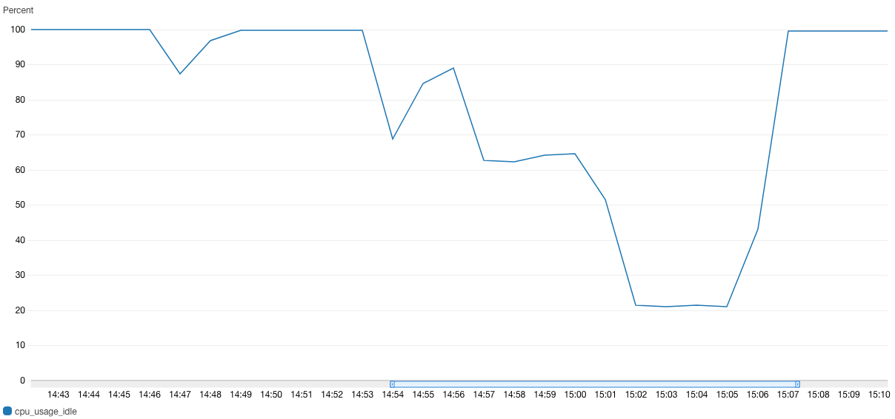

**Memory usage**
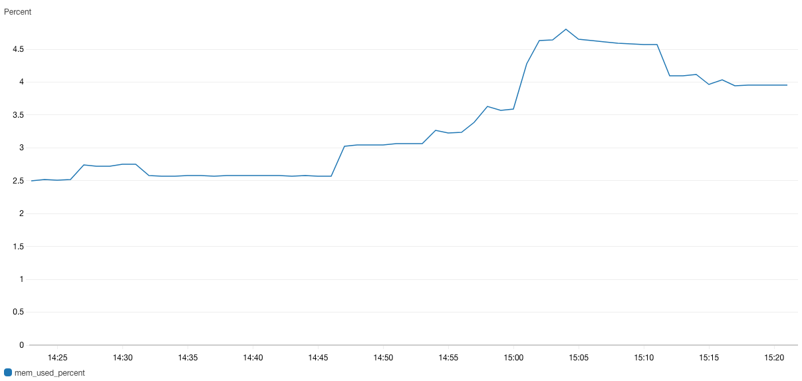

### 60s 200rps with observer_cli enabled

Run started at 09:12, [full results](https://broxy.tools.bbc.co.uk/belfrage-loadtest-results/vegeta-60s-200rps-1598343195490)

```
Requests      [total, rate, throughput]  12000, 200.02, 199.83
Duration      [total, attack, wait]      1m0.050647415s, 59.994994963s, 55.652452ms
Latencies     [mean, 50, 95, 99, max]    44.927718ms, 51.005277ms, 60.183334ms, 119.86288ms, 443.255377ms
Bytes In      [total, mean]              24000, 2.00
Bytes Out     [total, mean]              0, 0.00
Success       [ratio]                    100.00%
Status Codes  [code:count]               200:12000
```

**observer_cli output**
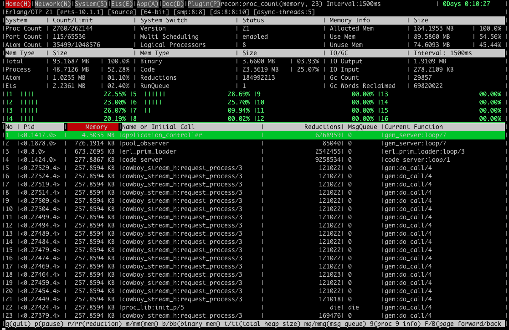

### 60s 500rps with observer_cli enabled

Run started at 09:16, [full results](https://broxy.tools.bbc.co.uk/belfrage-loadtest-results/vegeta-60s-500rps-1598343425799)

```
Requests      [total, rate, throughput]  30000, 500.02, 499.58
Duration      [total, attack, wait]      1m0.050846031s, 59.997992707s, 52.853324ms
Latencies     [mean, 50, 95, 99, max]    48.869058ms, 53.609084ms, 61.692226ms, 99.348698ms, 212.753038ms
Bytes In      [total, mean]              60000, 2.00
Bytes Out     [total, mean]              0, 0.00
Success       [ratio]                    100.00%
Status Codes  [code:count]               200:30000
```

**observer_cli output**
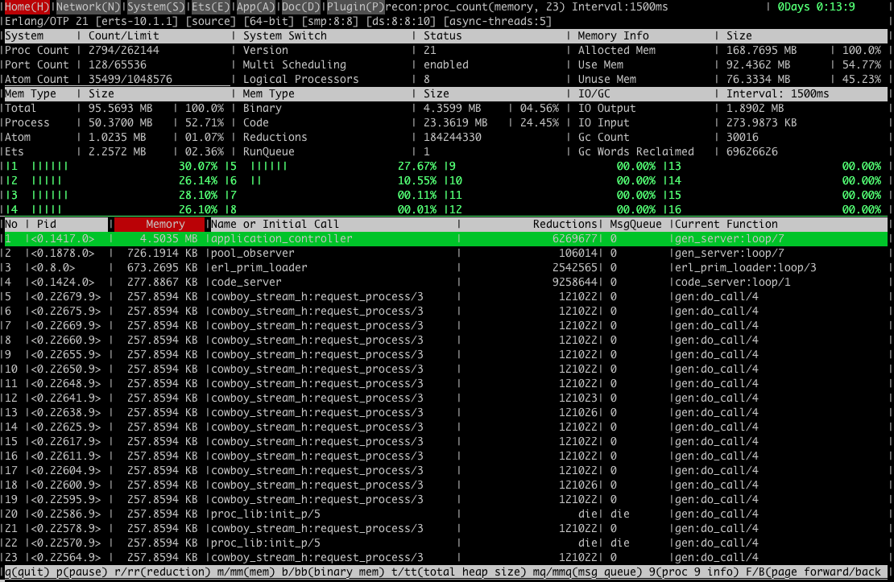

### 300s 500rps & 1000rps with observer_cli enabled

Run started at 09:18, [full results](https://broxy.tools.bbc.co.uk/belfrage-loadtest-results/vegeta-300s-1000rps-1598344127874)

```
Requests      [total, rate, throughput]  150000, 500.00, 499.89
Duration      [total, attack, wait]      5m0.066040368s, 4m59.998021528s, 68.01884ms
Latencies     [mean, 50, 95, 99, max]    48.41104ms, 53.344996ms, 60.904749ms, 94.413004ms, 463.080879ms
Bytes In      [total, mean]              300000, 2.00
Bytes Out     [total, mean]              0, 0.00
Success       [ratio]                    100.00%
Status Codes  [code:count]               200:150000
```

```
Requests      [total, rate, throughput]  300000, 1000.00, 999.83
Duration      [total, attack, wait]      5m0.051351768s, 4m59.998994646s, 52.357122ms
Latencies     [mean, 50, 95, 99, max]    51.366449ms, 54.653824ms, 62.372008ms, 97.524352ms, 422.586967ms
Bytes In      [total, mean]              600000, 2.00
Bytes Out     [total, mean]              0, 0.00
Success       [ratio]                    100.00%
Status Codes  [code:count]               200:300000
```

**observer_cli output**
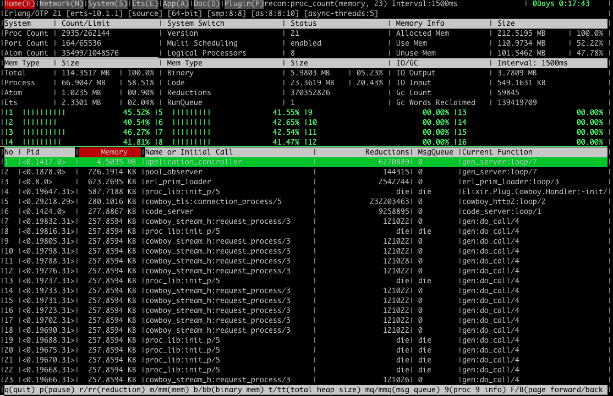

**CPU Usage during the load tests with observer_cli enabled**
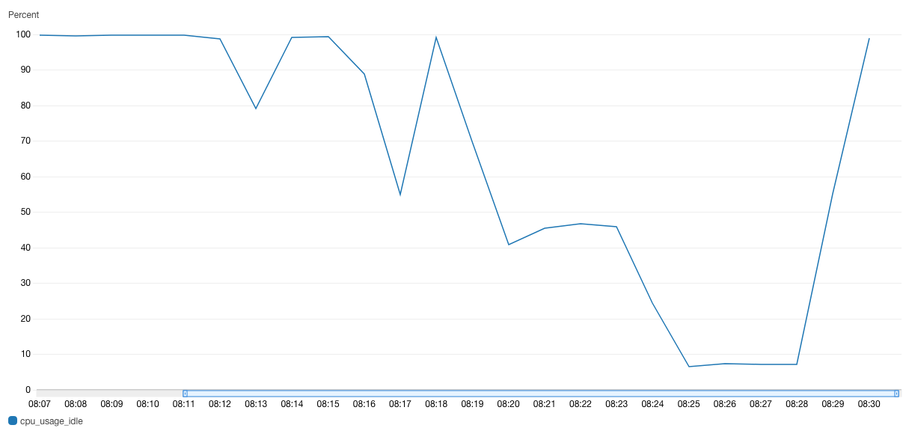

### 60s, 200rps with observer_cli enabled but not started

Run started at 09:18, [full results](https://broxy.tools.bbc.co.uk/belfrage-loadtest-results/vegeta-60s-200rps-1598353587597)

```
Requests      [total, rate, throughput]  12000, 200.02, 199.89
Duration      [total, attack, wait]      1m0.032822481s, 59.995023562s, 37.798919ms
Latencies     [mean, 50, 95, 99, max]    46.766049ms, 51.578714ms, 61.705529ms, 122.587076ms, 511.69145ms
Bytes In      [total, mean]              24000, 2.00
Bytes Out     [total, mean]              0, 0.00
Success       [ratio]                    100.00%
Status Codes  [code:count]               200:12000
```

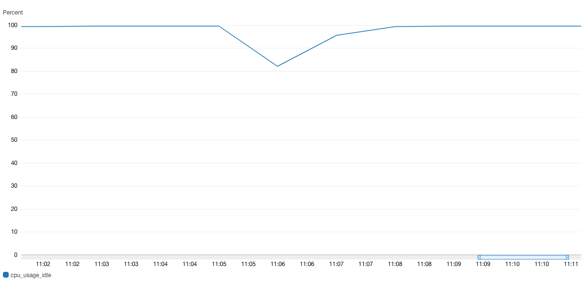

### 60s 200rps Microstate Accounting running

Run started at 09:18, [full results](https://broxy.tools.bbc.co.uk/belfrage-loadtest-results/vegeta-60s-200rps-1598358203821)

```
Requests      [total, rate, throughput]  12000, 200.02, 199.87
Duration      [total, attack, wait]      1m0.038627748s, 59.995010547s, 43.617201ms
Latencies     [mean, 50, 95, 99, max]    46.485357ms, 51.76351ms, 61.263643ms, 112.257641ms, 458.668123ms
Bytes In      [total, mean]              24000, 2.00
Bytes Out     [total, mean]              0, 0.00
Success       [ratio]                    100.00%
Status Codes  [code:count]               200:12000
```

**Display of the Microstate accounting over a 40 second collection period.**
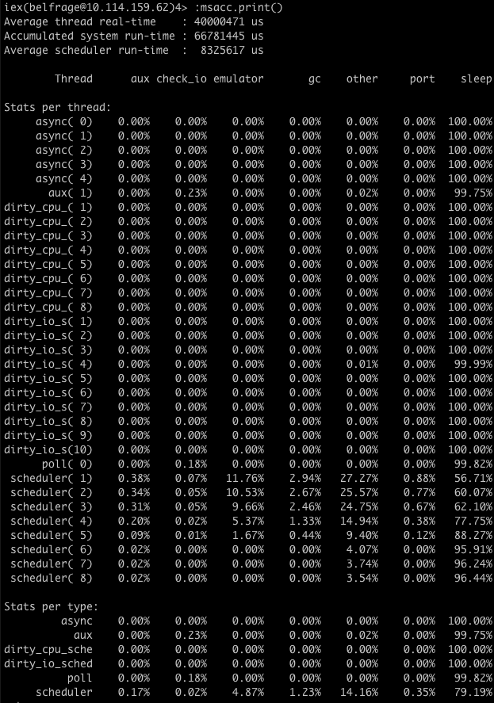

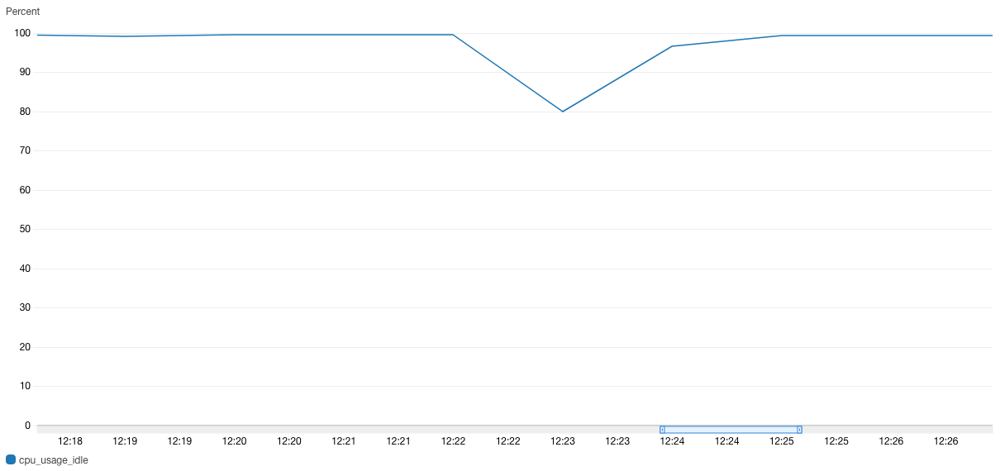

### Repeater 1x 50% traffic for 30 mins

| Timing | Detail |
|--------|--------|
| 14:13  | observer_cli not enabled |
| 14:56  | observer_cli enabled     |
| 15:10  | observer_cli observing   |
| 15:20  | observer_cli stopped     |
| 15:22  | msacc.start(180000)      |
| 15:26  | msacc.print()            |

**CPU usage observer not enabled**
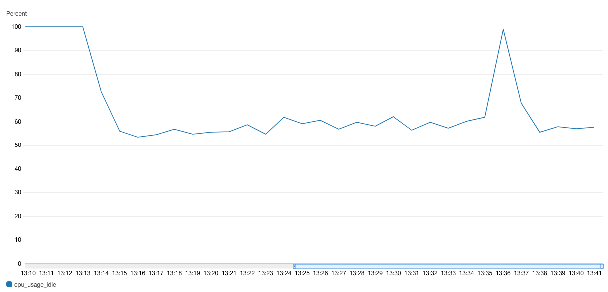

**Starting the observer_cli for 10 mins**
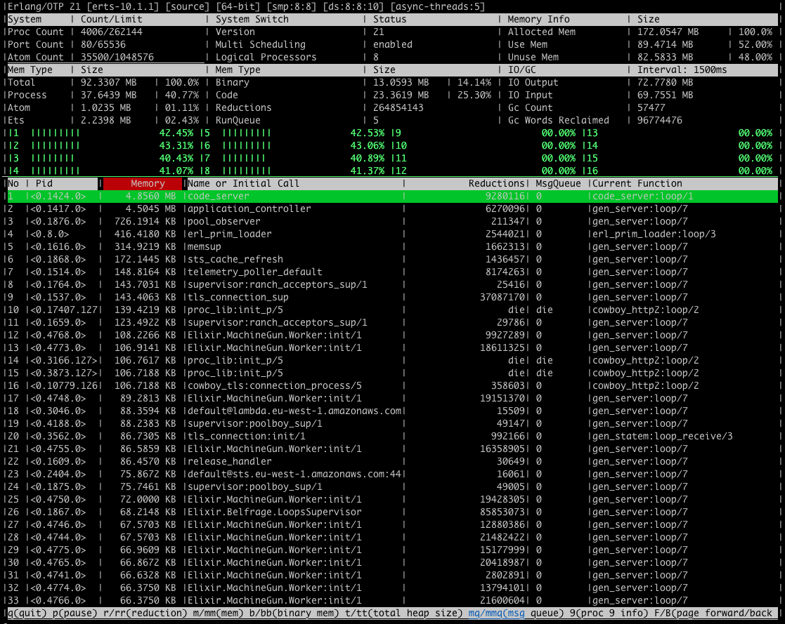

**Collecting data for 3 mins using Microstate Accounting**
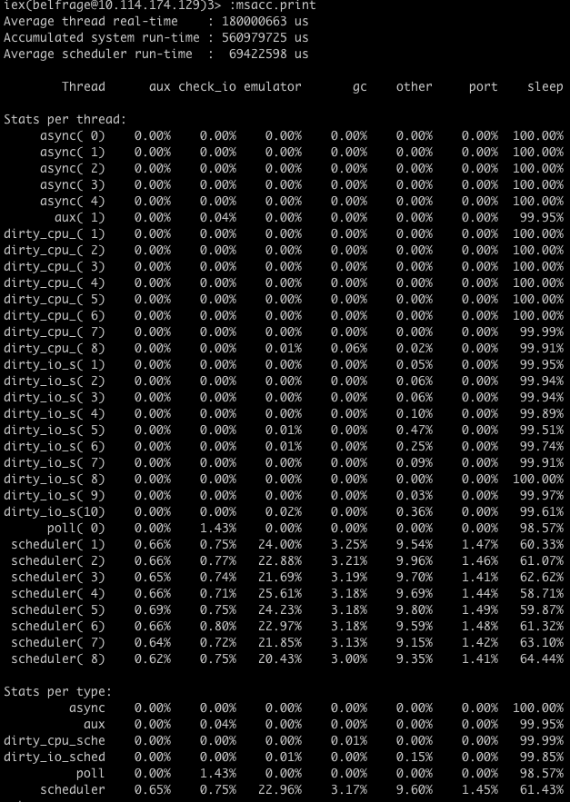

**CPU usage observer_cli enabled**
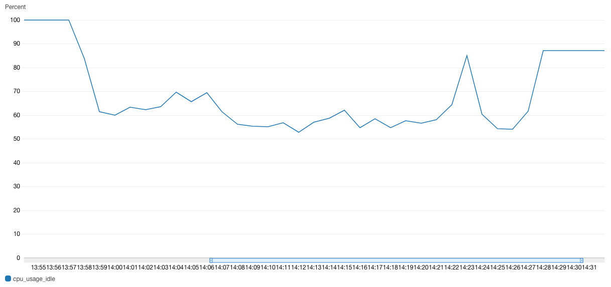

**Comparison of response counts for both Repeater runs**
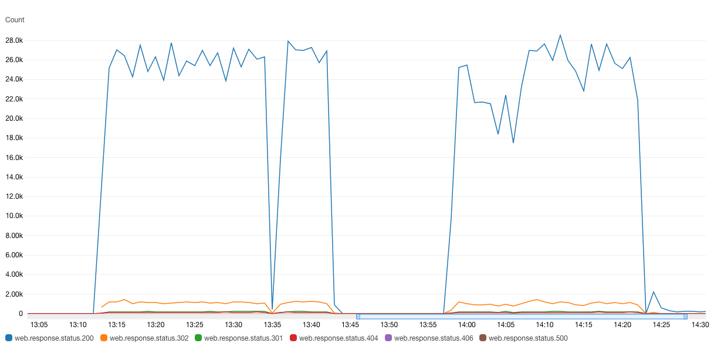

**Comparison of memory usage for both Repeater runs**
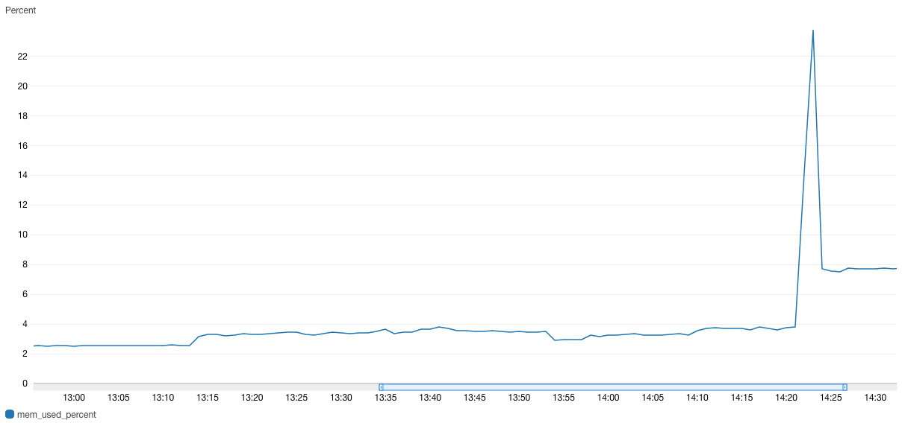

## Summary

The impact on response times when the observer_cli was enabled on the Playground was very slight. The mean latency for the 1000rps test was 51.366449ms versus 51.139589ms and the 99th percentile was 97.524352ms versus 97.190578ms. This looked to be consistenct across all the loadtests that were run.

The memory usage was minimal across all runs.

The CPU usage charts showed that there is a relatively noticeable impact on the instance when the observer_cli was enabled. During the 1000rps test the cpu usage was ~93% versus ~79%. The variance does not appear to be consistent for the different load tests however the CPU usage was always noticeably impacted by the observer_cli.

The additional test run with the observer_cli enabled but not started shows that there was still an impact on performance. This suggests that starting the observer_cli had little impact.

The repeater traffic showed a slightly different story and it is more difficult to see the impact. The traffic patterns for the two runs are not consistent however as the second run has a lower request count for a portion of the test at the start. Comparing the 2nd run from 14:10 UTC versus the 1st run it does show the observer_cli impacted the CPU usage, albeit only slightly.

In conclusion, when enabled, the observer_cli may impact CPU usage to some extent but it is reasonably small and is not impacted adversely when starting it on an instance. Using live traffic showed that it had less of an impact compared to when load test were run.

Microstate Accounting had a slight impact on latency. During the 200rps test the mean was 46.485357ms versus 44.431828ms and the 99th percentile was 112.257641ms versus 107.767342ms. The CPU usage did not appear to be impacted to any noticeable degree (on the repeater test the traffic appears to have dropped significantly during the data collection time unfortunately).
