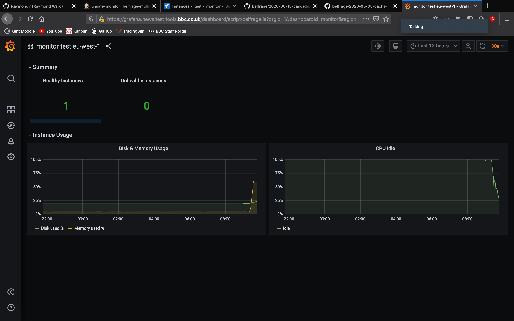

# Test results: Monitor Event Spawns

## Context
Belfrage Monitor now [spawns a process](https://github.com/bbc/belfrage-monitor/blob/master/lib/message_interface/events.ex#L21-L28) when a cast call is received to record an event instead of handling it synchronously. This in turn will increase the levels of concurrency and reduce the bottleneck of storing events recieved from Belfrage. The tests described in this document verify that doing so will not create further bottlenecks or performance issues such as hitting Erlang's process count limit when Belfrage is under heavy load.

## Hypotheses

- Monitor spawning processes to handle event data sent by Belfrage, which was done to reduce the bottleneck of recording events synchronously, does not produce further bottlenecks.

## Setup

- Belfrage-Repeater sending 1.5x traffic to Belfrage-test
- Requests to Belfrage on test: c5.2xlarge, CPUs: 8 vCPUs, 16GB
- Runnning observer_cli on monitor
- Grafana viewing Belfrage and Monitor
- 

## Tests

To test the hypothesis we will begin to run belfrage repeater against test with reduced load and slowly increase the traffic keeping a close eye on valid metrics such as idle CPU, memory usage and Erland process count in observer_cli. 

## Results

Overall the results were as expected. At the repeaters peak we were replaying 150% (3x multiplier, 50% sample rate) of live news eu-west-1 traffic to belfrage-test. 

At this request rate the Erlang process count reached a peak of around 264 averaging around 254, this result makes sense as the processes which are being spawned by monitor are carrying out an ETS insert which is writing these messages to memory, meaning new processes are being created just as fast as old ones are being garbage collected.

When the traffic began to increase we observed that the memory allocated to the ETS table 'event_store_db' was continously increasing until it reached a maximum size at around 2.5 GB before crashing. 

 
This is suspected to be related to an ongoing Belfrage-Monitor issue rather than being related to this test. This value was then reset and again began to increase as traffic continued through Belfrage.

We also observed that on Grafana for both monitor and Belfrage the idle CPU decreased as traffic increased, this is expected and as the load high higher for Belfrage it began to scale up as is expected.

