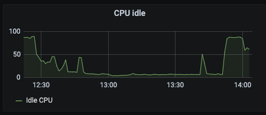
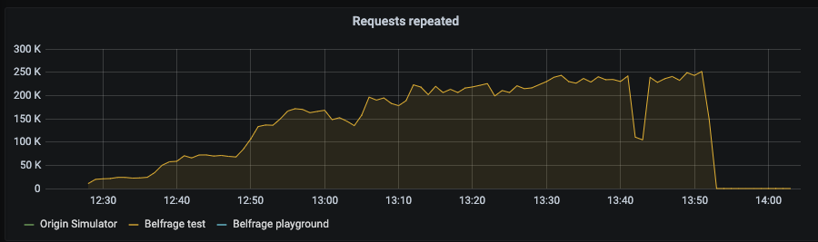
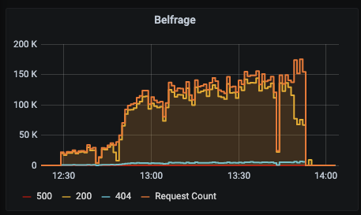
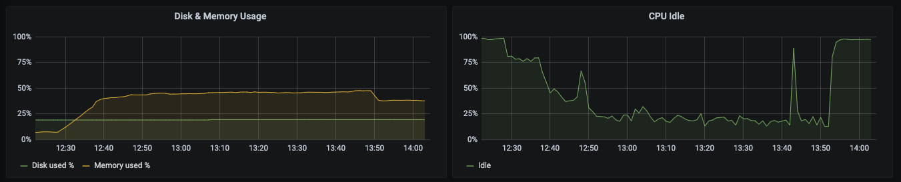
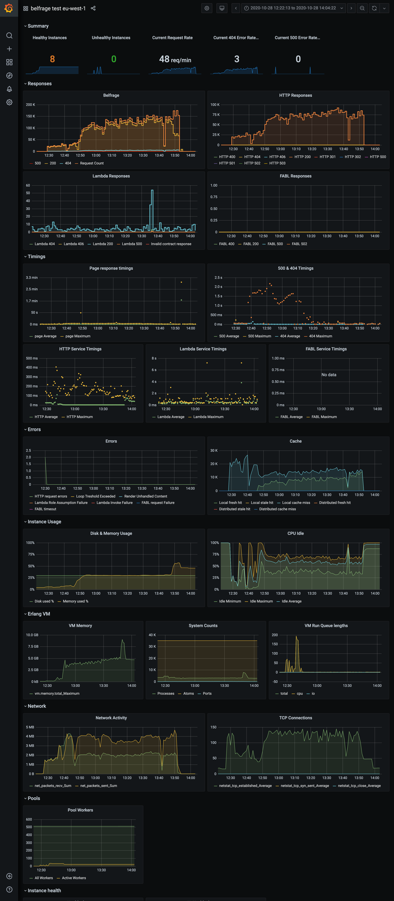

# Test results: Monitor Load Testing

## Context
Monitor receives a lot of messages from Belfrage, roughly 2-4 messages per request.


## Hypotheses

- Monitor is able to cope when Belfrage is under high load.

## Setup

- Belfrage-Repeater attempting to send 5x traffic to Belfrage-test
- Requests to Belfrage on test: c5.2xlarge, CPUs: 8 vCPUs, 16GB
- Grafana viewing Belfrage, Monitor & Repeatex

Origin Simulator recipe:
```json
[{"stages":[{"status":200,"latency":0,"at":0}],"route":"/*","random_content":null,"origin":"https://www.bbc.co.uk/news","headers":{"content-encoding":"gzip","cache-control":"public, max-age=10"},"body":null}]
```

## Tests
The results observed on Grafana between `Wednesday, 28 October 2020 12:22` till `Wednesday, 28 October 2020 14:04`.

NOTE: Changes during the test:
- Belfrage was gzipping content for the first 15 minutes of the load test.
- Belfrage was serving private content from origin simulator for the first 15 minutes. This was then changed to serve `public, max-age=10s`.

## Results

Repeater tried sending 5x news traffic, but it struggled



It reported sending up to 250k rpm.



Belfrage request count shows an average of 145k rpm.



Monitor coping well considering the load



#### Belfrage key performance indicators


## Conclusion
Monitor performed well considering the load.

Monitor dropping to 20% CPU idle is noteworthy, however the load is far higher than what we'd expect for an election.
