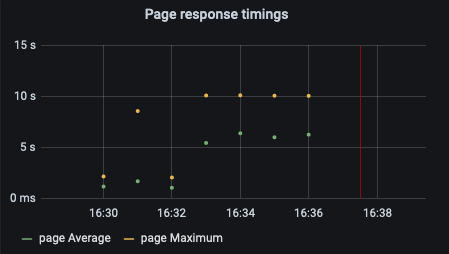
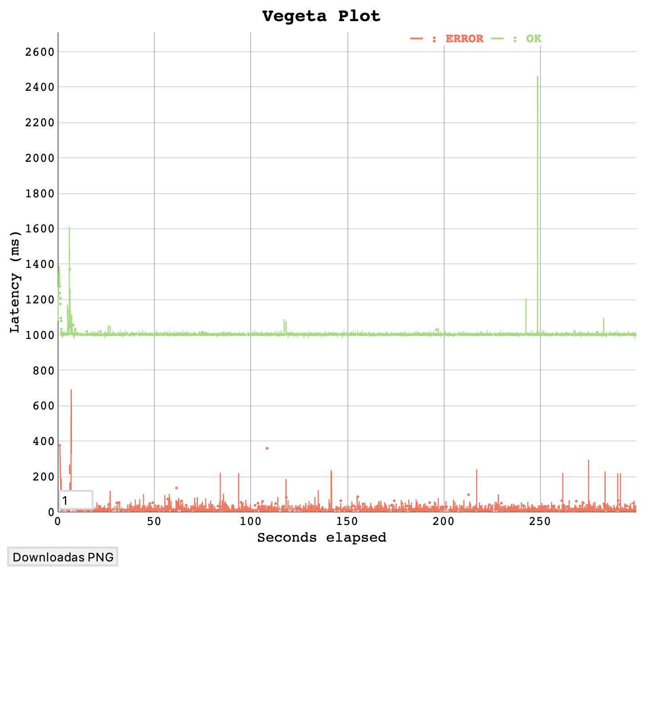
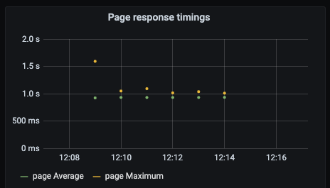
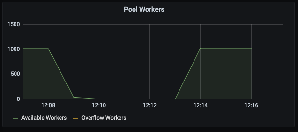

# Replicate Search Incident
- 8-9th September 2021
- Belfrage Test using Playground and Origin Simulator
- No caching
- Vegeta Runner
- Tests run using http1

## Background
Recently there was an attack on the search page in which belfrage was under massive load for roughly 5 minutes at 2AM on the 11th Aug 2021. (see post mortem docs for more information [here](https://confluence.dev.bbc.co.uk/display/WebCore/2021-08-11+P1+-++OPS-255395+-+Multiple+Web+Core+services+500+errors))

We want to replicate this attack, so we can mitigate the impact if something like this were to happen again.

During the attack Belfrage saw very high page response times of 10s and upwards. We also saw a high number of 500s coming from us due to this increased load.

## Goals
We want to discover from these load tests:
- How much load is required to replicate the behaviour we see in Belfrage from the attack
- When a single page type is being hit hard how does this effect the performance of other pages
- How the load test results change when changing the Poolboy configuration to use no overflow workers and an increase normal workers

## Method
Using the loadtest instance, playground and origin simulator we will attempt to replicate the volume and nature of the load experienced in the attack.

from the load test instance 2 loadtests will be run simultaneously.
- one will slow poll the '/news' route at 1 rps for 5 mins
- the other will fire requests at '/search' with a randomly generated search query

## Config
### Loadtest Instance
- Instance Type - c5.2xlarge

### Playground
- Instance Type - c5.2xlarge

Using belfrage with the commit hash of:
```
de7ba54268b5fa527f38683fee7db7225ec45f22
```

### Origin Simulator
- Instance Type - c5.2xlarge

This is the origin simulator config:
```
[
    {
        "stages": [
            {
                "status": 200,
                "latency": "1s",
                "at": 0
            }
        ],
        "route": "/*",
        "random_content": null,
        "origin": "https://www.bbc.co.uk/search",
        "headers": {
            "content-encoding": "gzip",
            "cache-control": "private, max-age=0, no-cache"
        },
        "body": null
    }
]
```


## Tests
### 1000 RPS 300 Seconds 1 Second Latency 512 Workers 4096 Overflow Workers
#### Vegeta hitting /search
Hitting `/search` endpoint

```
Requests      [total, rate, throughput]  300000, 1000.00, 952.37
Duration      [total, attack, wait]      5m1.363059853s, 4m59.999226301s, 1.363833552s
Latencies     [mean, 50, 95, 99, max]    1.117395042s, 1.00646438s, 1.787235504s, 2.336244184s, 3.165103163s
Bytes In      [total, mean]              18962433120, 63208.11
Bytes Out     [total, mean]              0, 0.00
Success       [ratio]                    95.67%
Status Codes  [code:count]               200:287008  500:12992  
Error Set:
500 Internal Server Error
```

see html graph [here](img/2021-09-07-replicating-search-incident/300s_1000rps_1slat_http2false/results_search_300s_1000rps_http2off.plot.html)


#### Vegeta hitting /news

```
Requests      [total, rate, throughput]  300, 1.00, 0.96
Duration      [total, attack, wait]      5m0.005411299s, 4m58.999993208s, 1.005418091s
Latencies     [mean, 50, 95, 99, max]    1.114064578s, 1.006609371s, 1.78862111s, 2.256335577s, 2.631084269s
Bytes In      [total, mean]              19093935, 63646.45
Bytes Out     [total, mean]              0, 0.00
Success       [ratio]                    96.33%
Status Codes  [code:count]               200:289  500:11  
Error Set:
500 Internal Server Error
```


see html graph [here](img/2021-09-07-replicating-search-incident/300s_1000rps_1slat_http2false/1000-with-1s-latency-news-results.plot.html)


#### Belfrage Requests

#### Page Response Timings

#### CPU Usage

#### Mailbox

#### Pool Workers


### 1100 RPS 300 Seconds 1 Second Latency 512 Workers 4096 Overflow Workers
#### Vegeta hitting /search
Hitting `/search` endpoint

```
Requests      [total, rate, throughput]  330001, 1100.00, 581.91
Duration      [total, attack, wait]      5m24.499662821s, 4m59.999784441s, 24.49987838s
Latencies     [mean, 50, 95, 99, max]    10.541637046s, 3.444882638s, 30.130328183s, 32.978833955s, 36.322324076s
Bytes In      [total, mean]              12476856955, 37808.54
Bytes Out     [total, mean]              0, 0.00
Success       [ratio]                    57.22%
Status Codes  [code:count]               0:112491  200:188829  500:28681  
Error Set:
500 Internal Server Error
Get https://www.belfrage-playground.test.api.bbc.co.uk/search?q=igdquidpkeagcilrxpnyfzfisvpujdohckggeukmglpjkqxbvb: EOF
Get https://www.belfrage-playground.test.api.bbc.co.uk/search?q=ruuobyqvraqxccerlwnfssoqrqhoovnvgootbnjqboqgehcktc: EOF
Get https://www.belfrage-playground.test.api.bbc.co.uk/search?q=pmbmydugpeaabjigdzqkupswsxjukfdjufwohuwfgvnyrxxvne: EOF
Get https://www.belfrage-playground.test.api.bbc.co.uk/search?q=fohroksdxpagsgyvhwdlubrkbhuqxyylrpipgncmixwvkbseiz: EOF
Get https://www.belfrage-playground.test.api.bbc.co.uk/search?q=kvdnbawnmagvqwafcqtfbwdacqetxbflyjliefyfyeyxiuaiuu: EOF
```

see html graph [here](img/2021-09-07-replicating-search-incident/300s_1100rps_1slat_http2false/results_search_300s_1100rps_http2off.plot.html)


#### Vegeta Hitting /news
Hitting `/news` endpoint

```
Requests      [total, rate, throughput]  300, 1.00, 0.59
Duration      [total, attack, wait]      5m20.217319637s, 4m58.999924681s, 21.217394956s
Latencies     [mean, 50, 95, 99, max]    5.91985234s, 2.554334058s, 20.606900107s, 26.608517649s, 30.000154536s
Bytes In      [total, mean]              12422260, 41407.53
Bytes Out     [total, mean]              0, 0.00
Success       [ratio]                    62.67%
Status Codes  [code:count]               0:80  200:188  500:32  
Error Set:
500 Internal Server Error
Get https://www.belfrage-playground.test.api.bbc.co.uk/news: EOF
Get https://www.belfrage-playground.test.api.bbc.co.uk/news: net/http: request canceled (Client.Timeout exceeded while awaiting headers)
Get https://www.belfrage-playground.test.api.bbc.co.uk/news: dial tcp 0.0.0.0:0->52.48.250.115:443: bind: address already in use
```

see html graph [here](img/2021-09-07-replicating-search-incident/300s_1100rps_1slat_http2false/1100-with-1s-latency-news-results.plot.html)


#### Belfrage Requests

#### Page Response Timings

#### CPU Usage

#### Mailbox

#### Pool Workers


### 1200 RPS 300 Seconds 1 Second Latency 512 Workers 4096 Overflow Workers

#### Vegta hitting /search

```
Requests      [total, rate, throughput]  359999, 1199.82, 638.99
Duration      [total, attack, wait]      5m26.527879234s, 5m0.043127867s, 26.484751367s
Latencies     [mean, 50, 95, 99, max]    9.613452265s, 5.228787748s, 30.486982162s, 33.021743758s, 42.832403111s
Bytes In      [total, mean]              13787390212, 38298.41
Bytes Out     [total, mean]              0, 0.00
Success       [ratio]                    57.96%
Status Codes  [code:count]               0:100438  200:208648  500:50913  
Error Set:
500 Internal Server Error
Get https://www.belfrage-playground.test.api.bbc.co.uk/search?q=unsiidwtxtncihucjhntrtaujhdoroszttvbdtfuincgwqfaad: EOF
Get https://www.belfrage-playground.test.api.bbc.co.uk/search?q=kthvtljpydiifvmsfvbusatednqpaaarlgwxhztaorzqfphmbk: EOF
Get https://www.belfrage-playground.test.api.bbc.co.uk/search?q=zclvlnphsynzgjahdofnlkhesefhqkehetbovzxzzpwhjwcqke: EOF
```

see html graph [here](img/2021-09-07-replicating-search-incident/300s_1200rps_1slat_http2false/results_search_300s_1200rps_http2off.plot.html)


#### Vegeta hitting /news

```
Requests      [total, rate, throughput]  300, 1.00, 0.61
Duration      [total, attack, wait]      5m18.482507041s, 4m58.999991759s, 19.482515282s
Latencies     [mean, 50, 95, 99, max]    5.541969579s, 2.363824787s, 20.404429s, 30.000142043s, 30.001174045s
Bytes In      [total, mean]              12753323, 42511.08
Bytes Out     [total, mean]              0, 0.00
Success       [ratio]                    64.33%
Status Codes  [code:count]               0:61  200:193  500:46  
Error Set:
500 Internal Server Error
Get https://www.belfrage-playground.test.api.bbc.co.uk/news: EOF
Get https://www.belfrage-playground.test.api.bbc.co.uk/news: net/http: request canceled (Client.Timeout exceeded while awaiting headers)
Get https://www.belfrage-playground.test.api.bbc.co.uk/news: dial tcp 0.0.0.0:0->52.48.250.115:443: bind: address already in use

```

see html graph [here](img/2021-09-07-replicating-search-incident/300s_1200rps_1slat_http2false/1200-with-1s-latency-news-results.plot.html)


#### Belfrage Requests

#### Page Response Timings

#### CPU Usage

#### Mailbox

#### Pool Workers


### 1000 RPS 300 Seconds 1 Second Latency 1024 Workers 0 Overflow Workers

#### Vegeta Hitting /search
```
Requests      [total, rate, throughput]  300000, 1000.00, 995.55
Duration      [total, attack, wait]      5m1.003326925s, 4m59.999051713s, 1.004275212s
Latencies     [mean, 50, 95, 99, max]    1.004626697s, 1.004423419s, 1.005770966s, 1.018097616s, 1.337482601s
Bytes In      [total, mean]              19797852945, 65992.84
Bytes Out     [total, mean]              0, 0.00
Success       [ratio]                    99.89%
Status Codes  [code:count]               200:299663  500:337  
Error Set:
500 Internal Server Error
```

see html graph [here](img/2021-09-07-replicating-search-incident/1000wrk1000rps/results_search_300s_1000rps_http2off_1000wrk.plot.html)


#### Vegeta Hitting /news
```
Requests      [total, rate, throughput]  300, 1.00, 1.00
Duration      [total, attack, wait]      5m0.004680485s, 4m58.999927392s, 1.004753093s
Latencies     [mean, 50, 95, 99, max]    1.00218681s, 1.004507661s, 1.006058322s, 1.028538683s, 1.073640225s
Bytes In      [total, mean]              19754085, 65846.95
Bytes Out     [total, mean]              0, 0.00
Success       [ratio]                    99.67%
Status Codes  [code:count]               200:299  500:1  
Error Set:
500 Internal Server Error
```

see html graph [here](img/2021-09-07-replicating-search-incident/1000wrk1000rps/1000-with-1s-latency-news-results-1000wrk.plot.html)


#### Belfrage Requests


#### Response Timings

#### CPU Usage

#### Mailbox

#### Pool Workers


### 1100 RPS 300 Seconds 1 Second Latency 1024 Workers 0 Overflow Workers

#### Vegeta Hitting /search
```
Requests      [total, rate, throughput]  330001, 1100.00, 1014.27
Duration      [total, attack, wait]      5m1.004108553s, 4m59.999738639s, 1.004369914s
Latencies     [mean, 50, 95, 99, max]    933.111088ms, 1.004382528s, 1.006208125s, 1.040752963s, 2.466380794s
Bytes In      [total, mean]              20171539552, 61125.69
Bytes Out     [total, mean]              0, 0.00
Success       [ratio]                    92.51%
Status Codes  [code:count]               200:305300  500:24701  
Error Set:
500 Internal Server Error
```

see html graph [here](img/2021-09-07-replicating-search-incident/1000wrk1100rps/results_search_300s_1100rps_http2off_1000wrk.plot.html)



#### Vegeta Hitting /news
```
Requests      [total, rate, throughput]  300, 1.00, 0.86
Duration      [total, attack, wait]      5m0.00508064s, 4m58.999980006s, 1.005100634s
Latencies     [mean, 50, 95, 99, max]    865.526798ms, 1.004759752s, 1.006642319s, 1.064059833s, 1.098110961s
Bytes In      [total, mean]              16981455, 56604.85
Bytes Out     [total, mean]              0, 0.00
Success       [ratio]                    85.67%
Status Codes  [code:count]               200:257  500:43  
Error Set:
500 Internal Server Error
```

see html graph [here](img/2021-09-07-replicating-search-incident/1000wrk1100rps/1100-with-1s-latency-news-results-1000wrk.plot.html)


#### Belfrage Requests

#### Response Timings

#### CPU Usage

#### Mailbox

#### Pool Workers


### 1200 RPS 300 Seconds 1 Second Latency 1024 Workers 0 Overflow Workers

#### Vegeta Hitting /search
```
Requests      [total, rate, throughput]  360001, 1200.00, 1013.79
Duration      [total, attack, wait]      5m1.044423787s, 4m59.999913593s, 1.044510194s
Latencies     [mean, 50, 95, 99, max]    864.576612ms, 1.004423018s, 1.011226956s, 1.275691569s, 2.058437452s
Bytes In      [total, mean]              20166167977, 56016.98
Bytes Out     [total, mean]              0, 0.00
Success       [ratio]                    84.78%
Status Codes  [code:count]               200:305195  500:54806  
Error Set:
500 Internal Server Erro
```

see html graph [here](img/2021-09-07-replicating-search-incident/1000wrk1200rps/results_search_300s_1200rps_http2off_1000wrk.plot.html)


#### Vegeta Hitting /news
```
Requests      [total, rate, throughput]  300, 1.00, 0.85
Duration      [total, attack, wait]      5m0.073478475s, 4m59.000002758s, 1.073475717s
Latencies     [mean, 50, 95, 99, max]    864.316653ms, 1.004263793s, 1.013579326s, 1.216175968s, 1.850530673s
Bytes In      [total, mean]              16783410, 55944.70
Bytes Out     [total, mean]              0, 0.00
Success       [ratio]                    84.67%
Status Codes  [code:count]               200:254  500:46  
Error Set:
500 Internal Server Error
```

see html graph [here](img/2021-09-07-replicating-search-incident/1000wrk1200rps/1200-with-1s-latency-news-results-1000wrk.plot.html)


#### Belfrage Requests

#### Response Timings


#### CPU Usage

#### Mailbox


#### Pool Workers


## Discussion of Results
To reiterate, we want to discover from these load tests:
- How much load is required to replicate the behaviour we see in Belfrage from the attack
- When a single page type is being hit hard how does this effect the performance of other pages
- How the load test results change when changing the Poolboy configuration to use no overflow workers and an increase normal workers

### Load Required

We that belfrage can handle 1000 rps of uncacheable content comfortably with 1s latency. This stands to reason as 1s * 1000 rps (assuming requests are distributed equally the pool should stabilise) at 1000 workers. This shows to be true in experimentation too using all its 512 persistent workers and roughly 500 overflow workers. This is while 96% of the requests are 200s.


We can also see that the page response times are reasonable:


After just 100rps more 200s plummet to 62% and page response times rise to a maximum of 10s. While pool seems like it may have maxed out its overflow workers and restarted.


So we can see that between 1000-1100rps is the amount of non-cacheable requests belfrage can handle before we start seeing high 500 rates and slow page response times, when belfrage is in this configuration.

### Performance of Page Types
When belfrage can handle the load, both pages types return with almost identical average latency.
```
/search Latencies     [mean, 50, 95, 99, max]    1.117395042s, 1.00646438s, 1.787235504s, 2.336244184s, 3.165103163s
/news   Latencies     [mean, 50, 95, 99, max]    1.114064578s, 1.006609371s, 1.78862111s, 2.256335577s, 2.631084269s
```

When belfrage is under real stress from `/search` being hit, the latency of `/news` but doesn't seem to be effected as much as `/search`.

```
1100rps
/search Latencies     [mean, 50, 95, 99, max]    10.541637046s, 3.444882638s, 30.130328183s, 32.978833955s, 36.322324076s
/news   Latencies     [mean, 50, 95, 99, max]    5.91985234s, 2.554334058s, 20.606900107s, 26.608517649s, 30.000154536s

1200rps
/search Latencies     [mean, 50, 95, 99, max]    9.613452265s, 5.228787748s, 30.486982162s, 33.021743758s, 42.832403111s
/news   Latencies     [mean, 50, 95, 99, max]    5.541969579s, 2.363824787s, 20.404429s, 30.000142043s, 30.001174045s
```

We also see that the success ratio is slightly higher for `/news` pages than `/search` When belfrage is under load.

```
Success Ratio

1000rps
/search 95.67%
/news   96.33%

1100rps
/search 57.22%
/news   62.67%

1200rps
/search 57.96%
/news   64.33%
```

It is hard to say why `/news` seems to be performing better. It could be because we are polling `/news` rather than loadtesting it. The main takeaway here is that. Hitting `/search` also degrades `/news` performance. But not as much as `/search`'s performance is degraded.

### Pool Configuration
#### Impact on the CPU
Here we can see that overflow workers seems to impact the CPU more than the a fixed size pool does even when belfrage is coping with the load at 1000rps

512 Workers 4096 Overflow Workers


1024 Workers 0 Overflow Workers


```
Configuration                           largest CPU difference
512 Workers 4096 Overflow Workers       65%
1024 Workers 0 Overflow Workers         50%
```

We see here that with the overflow worker configuration uses the CPU more than the fixed pool configuration, even when the system is functioning normally.

512 Workers 4096 Overflow Workers


1024 Workers 0 Overflow Workers


```
Configuration                           largest CPU difference
512 Workers 4096 Overflow Workers       91%
1024 Workers 0 Overflow Workers         74%
```

#### Impact on Responses
Here are the responses latencies side by side for comparison.

```
Configuration                           RPS     Latencies   [mean, 50, 95, 99, max]
512 Workers 4096 Overflow Workers       1000    1.117395042s, 1.00646438s, 1.787235504s, 2.336244184s, 3.165103163s
1024 Workers 0 Overflow Workers         1000    1.004626697s, 1.004423419s, 1.005770966s, 1.018097616s, 1.337482601s

512 Workers 4096 Overflow Workers       1100    10.541637046s, 3.444882638s, 30.130328183s, 32.978833955s, 36.322324076s
1024 Workers 0 Overflow Workers         1100    933.111088ms, 1.004382528s, 1.006208125s, 1.040752963s, 2.466380794s

512 Workers 4096 Overflow Workers       1200    9.613452265s, 5.228787748s, 30.486982162s, 33.021743758s, 42.832403111s
1024 Workers 0 Overflow Workers         1200    864.576612ms, 1.004423018s, 1.011226956s, 1.275691569s, 2.058437452s
```

From here we can see that when the pool is of a fixed size the latencies of the loadtests are significantly lower.

If we go on to compare the success ratio
```
Configuration                           RPS     Success Ratio
512 Workers 4096 Overflow Workers       1000    95.67%
1024 Workers 0 Overflow Workers         1000    99.89%

512 Workers 4096 Overflow Workers       1100    57.22%
1024 Workers 0 Overflow Workers         1100    92.51%

512 Workers 4096 Overflow Workers       1200    57.96%
1024 Workers 0 Overflow Workers         1200    84.78%
```
We also see that across the board the fixed worker configuration performs better returning more 200 responses.

Now looking at the response latency graphs we can see that the fixed worker configuration is much more stable as the overflow configuration is much more erratic. Take the graphs for 1200 RPS for example:

512 Workers 4096 Overflow Workers


1024 Workers 0 Overflow Workers


We can see that the performance in the fixed pool worker configuration is consistent. It provides a response as quickly as possible or returns a 500 if the pool is full. The overflow worker configuration's performance seems to be degrading over time. Performance seriously degrades after 160 seconds where it seems like the poolboy may have crashed.


## Conclusion

From the loadtests we have conducted its clear that currently a single instance of belfrage can withstand about 1000-1100 rps when the origin has a 1s latency.

There is a possibility that if we increased, the pool worker size of the fixed pool we could maintain a higher rps but eventually the pool wouldn't become the limiting factor of our request and would stress some other maybe less resilient part of our system.

As for page types we can see that when one page type is being hit very hard with requests other page types have degraded performance but not as much as the page being hit. In our tests when `/search` is being hit and has a latency of 10s `/news` will have a latency of 5s. However this doesn't necessarily mean this will reflect real life performance as the traffic on other page types is often more than 1rps. However this is still good news because it means that a page being hit will not degrade the performance of other pages as much. Even when the pages are part of the same pool. One thing we could do (if we really wanted to) to mitigate this even further is having separate pools for different routespecs.

The most revealing discovery we've made is that a fixed size pool configuration is more performant reliable and resilient across the board with lower latencies, higher response ratios and more efficient CPU usage in comparison to the overflow worker configuration. From the results of this loadtest its clear we should change our poolboy configurations to have a large pool of a fixed size.

