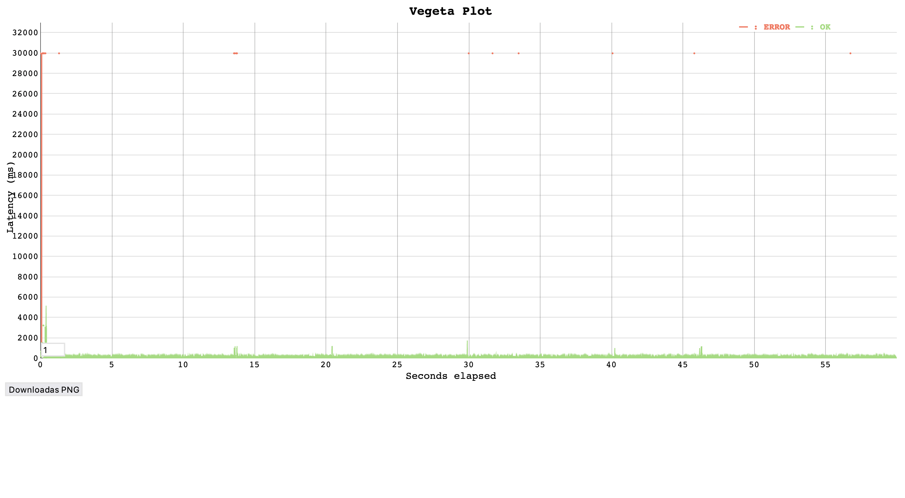
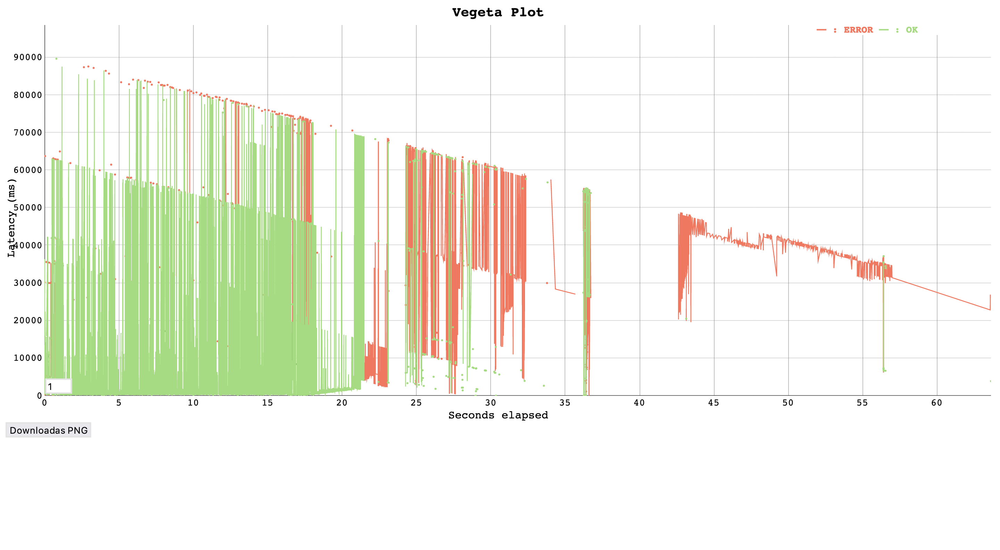
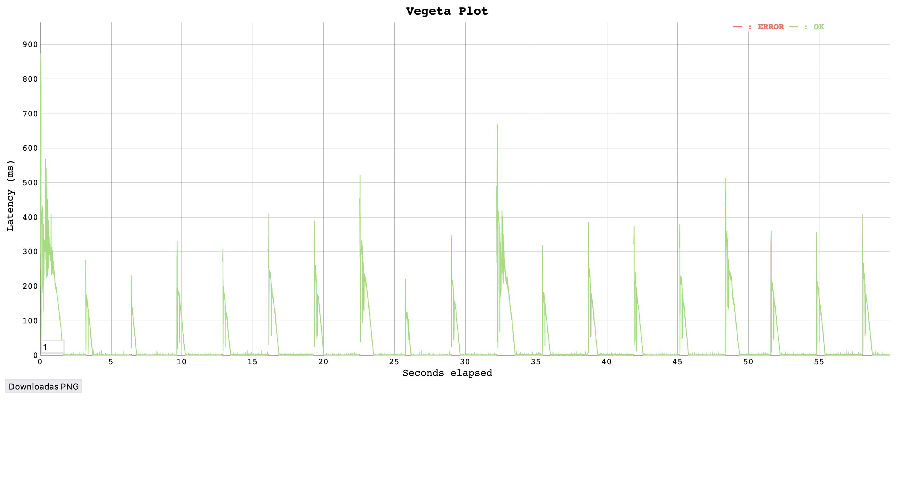
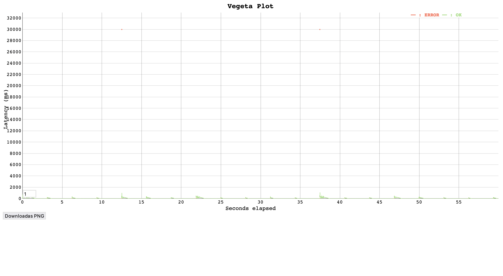
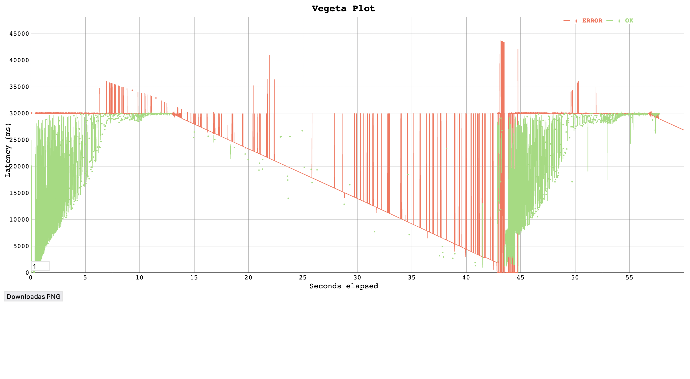
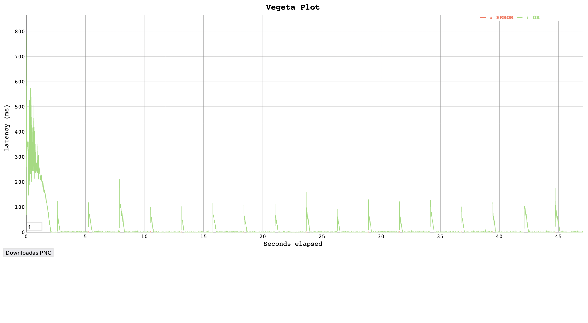
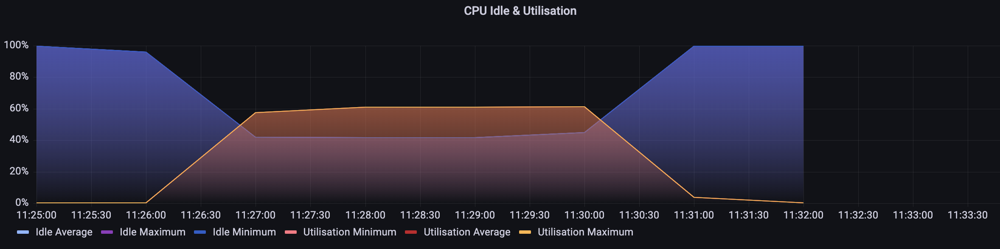
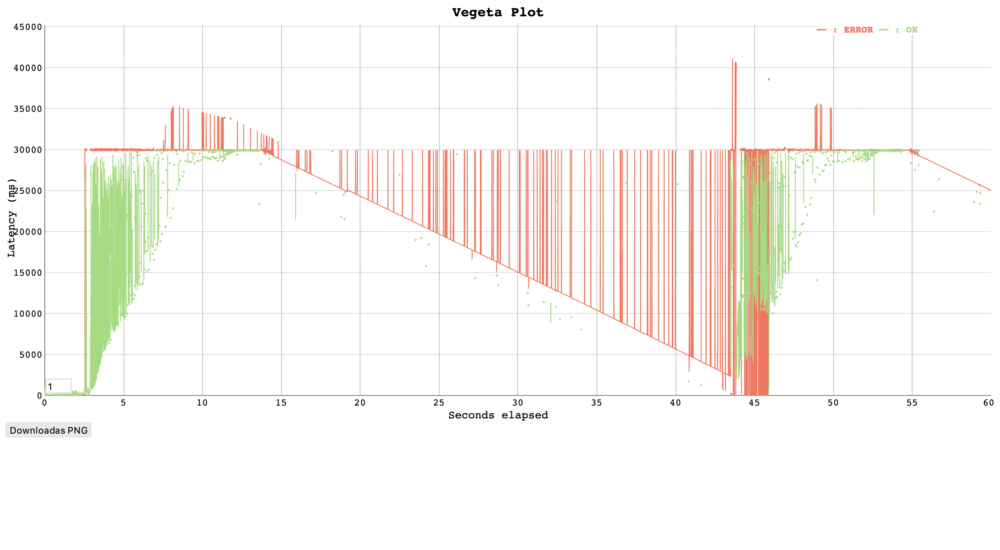

# TLS Termination Loadtest Report

The purpose of these loadtests is to measure the performance differences between:
- terminating TLS connections on the load balancer (as we currently do)
- terminating TLS connections on the instance
- terminating TLS connections on the instance while also verifying client certificates

## ;TLDR
Terminating TLS on the instance is much less performant.

Highest rps achieved, when using TLS termination:
- On the Load Balancer
    - over 10000rps
- On the instance (with client peer verification)
    - 3200rps
- On the instance (no client peer verification)
    - 3800rps

From this we can see that TLS termination on the load balancer is at least 2x faster than the other options.

## Loadtest Configuration
Loadtest Instance:
- Instance Type: c5.9xlarge 

Belfrage Instance:
- Instance Type: c5.2xlarge

Belfage Endpoint:
- `/status`

## Loadtests with TLS Termination on the Load Balancer
- Stack: cedric test Belfrage stack
- Branch:  `master` `c911c3011d019f7370f55fdc51f09a35a54ddcbc`
- Using this branch you can access cedric belfrage just with a url (no certs)
- The stack was set to only have 1 instance and not to scale

5000 rps 60s
```
echo "GET https://cedric.belfrage.test.api.bbc.co.uk/status" | vegeta attack -duration=60s -rate=5000 -max-body=0 | tee cedric_test_d_60_rate_5000_results.bin | vegeta report
Requests      [total, rate, throughput]  300000, 5000.01, 4999.81
Duration      [total, attack, wait]      1m0.00152225s, 59.999825792s, 1.696458ms
Latencies     [mean, 50, 95, 99, max]    3.264735ms, 1.719755ms, 2.895516ms, 28.24736ms, 30.000129198s
Bytes In      [total, mean]              0, 0.00
Bytes Out     [total, mean]              0, 0.00
Success       [ratio]                    100.00%
Status Codes  [code:count]               0:4  200:299996  
Error Set:
Get https://cedric.belfrage.test.api.bbc.co.uk/status: net/http: request canceled (Client.Timeout exceeded while awaiting headers)
```

10,000 rps 60s
```
echo "GET https://cedric.belfrage.test.api.bbc.co.uk/status" | vegeta attack -duration=60s -rate=10000 -max-body=0 | tee cedric_test_d_60_rate_10000_results.bin | vegeta report
Requests      [total, rate, throughput]  600000, 10000.01, 6915.78
Duration      [total, attack, wait]      1m26.750134052s, 59.999932756s, 26.750201296s
Latencies     [mean, 50, 95, 99, max]    57.809084ms, 2.757247ms, 181.911657ms, 235.970939ms, 30.016036036s
Bytes In      [total, mean]              0, 0.00
Bytes Out     [total, mean]              0, 0.00
Success       [ratio]                    99.99%
Status Codes  [code:count]               0:55  200:599945  
Error Set:
Get https://cedric.belfrage.test.api.bbc.co.uk/status: EOF
Get https://cedric.belfrage.test.api.bbc.co.uk/status: net/http: request canceled (Client.Timeout exceeded while awaiting headers)
```

15,000 rps 60s
```
echo "GET https://cedric.belfrage.test.api.bbc.co.uk/status" | vegeta attack -duration=60s -rate=15000 -max-body=0 | tee cedric_test_d_60_rate_15000_results.bin | vegeta report
Requests      [total, rate, throughput]  495890, 7790.39, 3718.96
Duration      [total, attack, wait]      1m33.761200347s, 1m3.654041319s, 30.107159028s
Latencies     [mean, 50, 95, 99, max]    12.704114079s, 1.762509147s, 50.748589068s, 1m0.86085506s, 1m29.689677646s
Bytes In      [total, mean]              0, 0.00
Bytes Out     [total, mean]              0, 0.00
Success       [ratio]                    70.32%
Status Codes  [code:count]               0:147196  200:348694  
Error Set:
Get https://cedric.belfrage.test.api.bbc.co.uk/status: EOF
Get https://cedric.belfrage.test.api.bbc.co.uk/status: dial tcp 0.0.0.0:0->34.245.253.217:443: bind: address already in use
Get https://cedric.belfrage.test.api.bbc.co.uk/status: dial tcp 0.0.0.0:0->34.245.253.217:443: socket: too many open files
Get https://cedric.belfrage.test.api.bbc.co.uk/status: dial tcp: lookup cedric.belfrage.test.api.bbc.co.uk on 10.114.128.2:53: no such host
Get https://cedric.belfrage.test.api.bbc.co.uk/status: dial tcp 0.0.0.0:0->63.32.81.99:443: bind: address already in use
```

20,000 rps 60s
```
echo "GET https://cedric.belfrage.test.api.bbc.co.uk/status" | vegeta attack -duration=60s -rate=20000 -max-body=0 | tee cedric_test_d_60_rate_20000_results.bin | vegeta report
Requests      [total, rate, throughput]  329404, 5111.01, 1385.02
Duration      [total, attack, wait]      1m40.021033002s, 1m4.449877361s, 35.571155641s
Latencies     [mean, 50, 95, 99, max]    33.591561676s, 37.064901404s, 1m17.216530888s, 1m27.702833834s, 1m37.82527741s
Bytes In      [total, mean]              0, 0.00
Bytes Out     [total, mean]              0, 0.00
Success       [ratio]                    42.06%
Status Codes  [code:count]               0:190873  200:138531  
Error Set:
Get https://cedric.belfrage.test.api.bbc.co.uk/status: EOF
Get https://cedric.belfrage.test.api.bbc.co.uk/status: dial tcp 0.0.0.0:0->63.32.81.99:443: bind: address already in use
Get https://cedric.belfrage.test.api.bbc.co.uk/status: dial tcp 0.0.0.0:0->34.245.253.217:443: bind: address already in use
Get https://cedric.belfrage.test.api.bbc.co.uk/status: http: server closed idle connection
Get https://cedric.belfrage.test.api.bbc.co.uk/status: dial tcp 0.0.0.0:0->34.241.185.115:443: bind: address already in use
Get https://cedric.belfrage.test.api.bbc.co.uk/status: net/http: request canceled (Client.Timeout exceeded while awaiting headers)
Get https://cedric.belfrage.test.api.bbc.co.uk/status: net/http: request canceled while waiting for connection (Client.Timeout exceeded while awaiting headers)
```

Here you can see that when not verifying client certificate. **The performance doesn't start to degrade until we reach 15,000rps** and even then it degrades somewhat more gracefully.

master branch comfortably handling load of 10,000rps

[see interactively](./data/2022-06-13-tls-termination/test_master_10000rps_plot.html)

but when we hit 15,000rps the load can't be handled so well.

[see interactively](./data/2022-06-13-tls-termination/test_master_15000rps_plot.html)


## Loadtests with Instance TLS Termination with Client Peer Verification
- Stack: www test Belfrage stack
- Branch:  `RESFRAME-4686-instance-tls-termination-loadtest` `07032f3b0d7d189db160c0cdc4fc22222eb23f73`
- Using this branch you can only access Belfrage with a client certificate
- The stack was set to only have 1 instance and not to scale

1000rps 60 s
```
echo "GET https://www.belfrage.test.api.bbc.co.uk/status" | vegeta attack -duration=60s -rate=1000 -max-body=0 -cert=/etc/pki/tls/certs/client_chain.crt -key=/etc/pki/tls/private/client.key | tee TLS_term_d_30s_rate_1000_results.bin | vegeta report
Requests      [total, rate, throughput]  60000, 1000.02, 999.64
Duration      [total, attack, wait]      1m0.02130855s, 59.999006474s, 22.302076ms
Latencies     [mean, 50, 95, 99, max]    1.207779ms, 854.022µs, 1.476699ms, 1.669382ms, 134.496653ms
Bytes In      [total, mean]              0, 0.00
Bytes Out     [total, mean]              0, 0.00
Success       [ratio]                    100.00%
Status Codes  [code:count]               200:60000 
```

2000rps 60s
```
echo "GET https://www.belfrage.test.api.bbc.co.uk/status" | vegeta attack -duration=60s -rate=2000 -max-body=0 -cert=/etc/pki/tls/certs/client_chain.crt -key=/etc/pki/tls/private/client.key | tee TLS_term_d_60s_rate_2000_results.bin | vegeta report
Requests      [total, rate, throughput]  120000, 2000.02, 1997.45
Duration      [total, attack, wait]      1m0.076574619s, 59.999507797s, 77.066822ms
Latencies     [mean, 50, 95, 99, max]    4.32007ms, 1.403732ms, 1.931045ms, 104.143851ms, 411.418215ms
Bytes In      [total, mean]              0, 0.00
Bytes Out     [total, mean]              0, 0.00
Success       [ratio]                    100.00%
Status Codes  [code:count]               200:120000 
```

3000rps 60s
```
echo "GET https://www.belfrage.test.api.bbc.co.uk/status" | vegeta attack -duration=60s -rate=3000 -max-body=0 -cert=/etc/pki/tls/certs/client_chain.crt -key=/etc/pki/tls/private/client.key | tee TLS_term_d_60s_rate_3000_results.bin | vegeta report
Requests      [total, rate, throughput]  180000, 3000.02, 2994.09
Duration      [total, attack, wait]      1m0.113786761s, 59.999683136s, 114.103625ms
Latencies     [mean, 50, 95, 99, max]    14.494389ms, 1.087984ms, 104.303961ms, 250.060326ms, 768.822561ms
Bytes In      [total, mean]              0, 0.00
Bytes Out     [total, mean]              0, 0.00
Success       [ratio]                    99.99%
Status Codes  [code:count]               0:14  200:179986  
Error Set:
Get https://www.belfrage.test.api.bbc.co.uk/status: http2: server sent GOAWAY and closed the connection; LastStreamID=19991, ErrCode=ENHANCE_YOUR_CALM, debug=""
```


3200 rps 60s

I ran this one again just to see if it was reproducible. It seemed to be flakey either having a good 200 ratio or a bad one.

```
echo "GET https://www.belfrage.test.api.bbc.co.uk/status" | vegeta attack -duration=60s -rate=3200 -max-body=0 -cert=/etc/pki/tls/certs/client_chain.crt -key=/etc/pki/tls/private/client.key | tee TLS_term_d_60_rate_3200_try_2_results.bin | vegeta report
Requests      [total, rate, throughput]  192000, 3200.01, 97.58
Duration      [total, attack, wait]      1m27.689760674s, 59.999723996s, 27.690036678s
Latencies     [mean, 50, 95, 99, max]    22.123382843s, 27.496770332s, 30.036221126s, 30.067300678s, 43.791432447s
Bytes In      [total, mean]              0, 0.00
Bytes Out     [total, mean]              0, 0.00
Success       [ratio]                    4.46%
Status Codes  [code:count]               0:183443  200:8557  
Error Set:
Get https://www.belfrage.test.api.bbc.co.uk/status: net/http: request canceled (Client.Timeout exceeded while awaiting headers)
Get https://www.belfrage.test.api.bbc.co.uk/status: net/http: request canceled while waiting for connection (Client.Timeout exceeded while awaiting headers)
Get https://www.belfrage.test.api.bbc.co.uk/status: write tcp 10.114.163.200:50475->52.214.98.115:443: write: broken pipe
Get https://www.belfrage.test.api.bbc.co.uk/status: write tcp 10.114.163.200:50475->52.214.98.115:443: write: broken pipe (Client.Timeout exceeded while awaiting headers)
Get https://www.belfrage.test.api.bbc.co.uk/status: read tcp 10.114.163.200:41104->18.200.147.121:443: read: connection reset by peer
```

```
echo "GET https://www.belfrage.test.api.bbc.co.uk/status" | vegeta attack -duration=60s -rate=3200 -max-body=0 -cert=/etc/pki/tls/certs/client_chain.crt -key=/etc/pki/tls/private/client.key | tee TLS_term_d_60_rate_3200_results.bin | vegeta report
Requests      [total, rate, throughput]  192000, 3200.03, 2844.54
Duration      [total, attack, wait]      1m7.491118078s, 59.999523532s, 7.491594546s
Latencies     [mean, 50, 95, 99, max]    34.054909ms, 1.36129ms, 219.21747ms, 350.177615ms, 30.000090475s
Bytes In      [total, mean]              0, 0.00
Bytes Out     [total, mean]              0, 0.00
Success       [ratio]                    99.99%
Status Codes  [code:count]               0:19  200:191981  
Error Set:
Get https://www.belfrage.test.api.bbc.co.uk/status: http2: server sent GOAWAY and closed the connection; LastStreamID=19991, ErrCode=ENHANCE_YOUR_CALM, debug=""
Get https://www.belfrage.test.api.bbc.co.uk/status: net/http: request canceled while waiting for connection (Client.Timeout exceeded while awaiting headers)
```

3300-3500 rps 60 s
At this point the many more 500 started to appear, and often it would take the instance offline, which was unrecoverable without a full redeploy.

3300rps 60s
```
echo "GET https://www.belfrage.test.api.bbc.co.uk/status" | vegeta attack -duration=60s -rate=3300 -max-body=0 -cert=/etc/pki/tls/certs/client_chain.crt -key=/etc/pki/tls/private/client.key | tee TLS_term_d_60_rate_3300_results.bin | vegeta report
Requests      [total, rate, throughput]  198000, 3300.02, 117.41
Duration      [total, attack, wait]      1m29.999783552s, 59.999705142s, 30.00007841s
Latencies     [mean, 50, 95, 99, max]    22.265468419s, 28.167599791s, 30.034717862s, 30.064932765s, 43.213857032s
Bytes In      [total, mean]              0, 0.00
Bytes Out     [total, mean]              0, 0.00
Success       [ratio]                    5.34%
Status Codes  [code:count]               0:187433  200:10567  
Error Set:
Get https://www.belfrage.test.api.bbc.co.uk/status: net/http: request canceled while waiting for connection (Client.Timeout exceeded while awaiting headers)
Get https://www.belfrage.test.api.bbc.co.uk/status: net/http: request canceled (Client.Timeout exceeded while awaiting headers)
Get https://www.belfrage.test.api.bbc.co.uk/status: write tcp 10.114.163.200:20436->18.200.147.121:443: write: broken pipe
Get https://www.belfrage.test.api.bbc.co.uk/status: write tcp 10.114.163.200:20436->18.200.147.121:443: write: broken pipe (Client.Timeout exceeded while awaiting headers)
```

3500rps 60s
```
echo "GET https://www.belfrage.test.api.bbc.co.uk/status" | vegeta attack -duration=60s -rate=3500 -max-body=0 -cert=/etc/pki/tls/certs/client_chain.crt -key=/etc/pki/tls/private/client.key | tee TLS_term_d_60s_rate_3500_results.bin | vegeta report
Requests      [total, rate, throughput]  210000, 3500.02, 105.04
Duration      [total, attack, wait]      1m26.539058407s, 59.999732857s, 26.53932555s
Latencies     [mean, 50, 95, 99, max]    22.08446065s, 26.652264703s, 30.036786119s, 30.082739463s, 53.808350548s
Bytes In      [total, mean]              0, 0.00
Bytes Out     [total, mean]              0, 0.00
Success       [ratio]                    4.33%
Status Codes  [code:count]               0:200910  200:9090  
Error Set:
Get https://www.belfrage.test.api.bbc.co.uk/status: net/http: request canceled (Client.Timeout exceeded while awaiting headers)
Get https://www.belfrage.test.api.bbc.co.uk/status: write tcp 10.114.164.191:48004->18.200.147.121:443: write: broken pipe
Get https://www.belfrage.test.api.bbc.co.uk/status: write tcp 10.114.164.191:48004->18.200.147.121:443: write: broken pipe (Client.Timeout exceeded while awaiting headers)
Get https://www.belfrage.test.api.bbc.co.uk/status: net/http: request canceled while waiting for connection (Client.Timeout exceeded while awaiting headers)
```

Its not clear what is causing the application to become overloaded. When we look at the CPU metrics we can see that in the most extreme cases only around 60% of CPU is being used.

See the CPU for the 3000rps 60s loadtest below.


Also analysing the latency over the course of the loadtests suggests there is some underlying issue causing latency spikes. There is often a single 500 which leads to a latency spike which is more pronounced the higher the load.

3100rps 60s

[see interactively](./data/2022-06-13-tls-termination/tls_term_3100rps_plot.html)

3200rps 60s, notice the scale is different because of some freak 500s with 30s latency.
For more detail view the interactive version in the link under the graph.

[see interactively](./data/2022-06-13-tls-termination/tls_term_3200rps_plot.html)

When the load test completely fails (when success ratio is below 5%) we can see that there is some kind of ceiling that is reached at the 30 second mark. Its not clear what is causing this. (I'm open to suggestions) but the behaviour in general looks very erratic and strange.

3200 rps 60s trial 2

[see interactively](./data/2022-06-13-tls-termination/tls_term_3200rps_plot_try2.html)

## Loadtest with Instance TLS Termination
- Stack: www test Belfrage stack
- Branch: `master` `7f9a4b465e8e2df4877a93fd964c8f4b3984f14e`
- By default the www Belfrage stack uses tls termination on the instance
- The stack was set to have 1 instance and not to scale

3000rps 60s
```
Requests      [total, rate, throughput]  180001, 3000.02, 2995.93
Duration      [total, attack, wait]      1m0.077810518s, 59.999957888s, 77.85263ms
Latencies     [mean, 50, 95, 99, max]    3.740303ms, 1.308204ms, 2.063285ms, 63.488001ms, 30.000097569s
Bytes In      [total, mean]              0, 0.00
Bytes Out     [total, mean]              0, 0.00
Success       [ratio]                    99.99%
Status Codes  [code:count]               0:12  200:179989  
Error Set:
Get https://www.belfrage.test.api.bbc.co.uk/status: http2: server sent GOAWAY and closed the connection; LastStreamID=19991, ErrCode=ENHANCE_YOUR_CALM, debug=""
Get https://www.belfrage.test.api.bbc.co.uk/status: net/http: request canceled while waiting for connection (Client.Timeout exceeded while awaiting headers)
```

3200rps 60s
```
Requests      [total, rate, throughput]  192000, 3200.01, 2146.58
Duration      [total, attack, wait]      1m29.389428757s, 59.999723984s, 29.389704773s
Latencies     [mean, 50, 95, 99, max]    19.259383ms, 1.19953ms, 5.094736ms, 64.237964ms, 30.000233703s
Bytes In      [total, mean]              0, 0.00
Bytes Out     [total, mean]              0, 0.00
Success       [ratio]                    99.94%
Status Codes  [code:count]               0:118  200:191882  
Error Set:
Get https://www.belfrage.test.api.bbc.co.uk/status: http2: server sent GOAWAY and closed the connection; LastStreamID=19991, ErrCode=ENHANCE_YOUR_CALM, debug=""
Get https://www.belfrage.test.api.bbc.co.uk/status: net/http: request canceled while waiting for connection (Client.Timeout exceeded while awaiting headers)
```

3800rps 60s
```
Requests      [total, rate, throughput]  228001, 3800.03, 2947.17
Duration      [total, attack, wait]      1m17.352551977s, 59.999822675s, 17.352729302s
Latencies     [mean, 50, 95, 99, max]    14.03747ms, 1.480743ms, 69.945891ms, 266.706906ms, 30.000112125s
Bytes In      [total, mean]              0, 0.00
Bytes Out     [total, mean]              0, 0.00
Success       [ratio]                    99.99%
Status Codes  [code:count]               0:30  200:227971  
Error Set:
Get https://www.belfrage.test.api.bbc.co.uk/status: http2: server sent GOAWAY and closed the connection; LastStreamID=19991, ErrCode=ENHANCE_YOUR_CALM, debug=""
Get https://www.belfrage.test.api.bbc.co.uk/status: net/http: request canceled while waiting for connection (Client.Timeout exceeded while awaiting headers)
```

3900rps 60s
```
Requests      [total, rate, throughput]  233993, 3899.67, 205.41
Duration      [total, attack, wait]      1m25.404248238s, 1m0.003305348s, 25.40094289s
Latencies     [mean, 50, 95, 99, max]    21.159776933s, 25.75039929s, 30.031870113s, 30.061497698s, 41.172664718s
Bytes In      [total, mean]              0, 0.00
Bytes Out     [total, mean]              0, 0.00
Success       [ratio]                    7.50%
Status Codes  [code:count]               0:216450  200:17543  
Error Set:
Get https://www.belfrage.test.api.bbc.co.uk/status: http2: server sent GOAWAY and closed the connection; LastStreamID=19991, ErrCode=ENHANCE_YOUR_CALM, debug=""
Get https://www.belfrage.test.api.bbc.co.uk/status: net/http: request canceled (Client.Timeout exceeded while awaiting headers)
unexpected EOF (Client.Timeout exceeded while reading body)
net/http: request canceled (Client.Timeout exceeded while reading body)
Get https://www.belfrage.test.api.bbc.co.uk/status: write tcp 10.114.161.17:13671->108.128.229.253:443: write: broken pipe
Get https://www.belfrage.test.api.bbc.co.uk/status: write tcp 10.114.161.17:13671->108.128.229.253:443: write: broken pipe (Client.Timeout exceeded while awaiting headers)
Get https://www.belfrage.test.api.bbc.co.uk/status: net/http: request canceled awaiting headers)
```

3800rps 240s
I did this to see if it could withstand sustained load at this rps.
```
Requests      [total, rate, throughput]  912003, 3800.02, 3799.48
Duration      [total, attack, wait]      4m0.000810439s, 3m59.999754227s, 1.056212ms
Latencies     [mean, 50, 95, 99, max]    8.278794ms, 1.500366ms, 54.07435ms, 111.321735ms, 30.000088228s
Bytes In      [total, mean]              0, 0.00
Bytes Out     [total, mean]              0, 0.00
Success       [ratio]                    99.99%
Status Codes  [code:count]               0:125  200:911878  
Error Set:
Get https://www.belfrage.test.api.bbc.co.uk/status: http2: server sent GOAWAY and closed the connection; LastStreamID=19991, ErrCode=ENHANCE_YOUR_CALM, debug=""
Get https://www.belfrage.test.api.bbc.co.uk/status: net/http: request canceled while waiting for connection (Client.Timeout exceeded while awaiting headers)
```

I also did the same test using using `-http2 false` argument, just to check if there was a significant difference. There wasn't, it broke at 3900rps just like the other setup.

3800rps 60s `-http2 false`
```
Requests      [total, rate, throughput]  228001, 3800.03, 3799.36
Duration      [total, attack, wait]      1m0.001235604s, 59.999834343s, 1.401261ms
Latencies     [mean, 50, 95, 99, max]    14.927702ms, 1.503571ms, 73.515431ms, 288.047407ms, 781.555858ms
Bytes In      [total, mean]              0, 0.00
Bytes Out     [total, mean]              0, 0.00
Success       [ratio]                    99.98%
Status Codes  [code:count]               0:35  200:227966  
Error Set:
Get https://www.belfrage.test.api.bbc.co.uk/status: http2: server sent GOAWAY and closed the connection; LastStreamID=19991, ErrCode=ENHANCE_YOUR_CALM, debug=""
```

3900rps 60s `-http2 false`
```
Requests      [total, rate, throughput]  233993, 3899.51, 109.90
Duration      [total, attack, wait]      1m23.305617686s, 1m0.005806284s, 23.299811402s
Latencies     [mean, 50, 95, 99, max]    22.115279873s, 25.881916159s, 30.033600374s, 30.068760588s, 41.810924777s
Bytes In      [total, mean]              0, 0.00
Bytes Out     [total, mean]              0, 0.00
Success       [ratio]                    3.91%
Status Codes  [code:count]               0:224838  200:9155  
Error Set:
Get https://www.belfrage.test.api.bbc.co.uk/status: net/http: request canceled while waiting for connection (Client.Timeout exceeded while awaiting headers)
Get https://www.belfrage.test.api.bbc.co.uk/status: net/http: request canceled (Client.Timeout exceeded while awaiting headers)
Get https://www.belfrage.test.api.bbc.co.uk/status: write tcp 10.114.161.17:63569->52.214.98.115:443: write: broken pipe
Get https://www.belfrage.test.api.bbc.co.uk/status: write tcp 10.114.161.17:63569->52.214.98.115:443: write: broken pipe (Client.Timeout exceeded while awaiting headers)
Get https://www.belfrage.test.api.bbc.co.uk/status: read tcp 10.114.161.17:54955->108.128.229.253:443: read: connection reset by peer
17:52238->108.128.229.253:443: read: connection reset by peer
net/http: request canceled (Client.Timeout exceeded while reading body)
```

3800rps 240s `-http2 false`
```
Requests      [total, rate, throughput]  912003, 3800.02, 3671.72
Duration      [total, attack, wait]      4m8.342771547s, 3m59.999763106s, 8.343008441s
Latencies     [mean, 50, 95, 99, max]    8.236221ms, 1.458539ms, 54.183029ms, 111.311956ms, 30.00010597s
Bytes In      [total, mean]              0, 0.00
Bytes Out     [total, mean]              0, 0.00
Success       [ratio]                    99.98%
Status Codes  [code:count]               0:157  200:911846  
Error Set:
Get https://www.belfrage.test.api.bbc.co.uk/status: http2: server sent GOAWAY and closed the connection; LastStreamID=19991, ErrCode=ENHANCE_YOUR_CALM, debug=""
Get https://www.belfrage.test.api.bbc.co.uk/status: net/http: request canceled while waiting for connection (Client.Timeout exceeded while awaiting headers)
```

Looking to the latency graphs we also see behaviour similar to the previous loadtests with peer verification. The loadtest doesn't seem cpu bound as the CPU reaches around 60% usage with 3800rps. We also see the familiar spikes after a 500, just like with the peer verification load tests. The breaking behaviour is almost identical, so it seems to be breaking the same way.

3800rps 60s



3800rps 240s


3900rps 60s



## Comparing the Loadtests and Future Work
To summarise the max request per second reached in each scenario:
- Terminating TLS on the Load Balancer
    - 10,000 rps (at least)
- Terminating TLS on the instance (with client peer verification)
    - 3200 rps
- Terminating TLS on the instance (no client peer verification)
    - 3800 rps

**So terminating TLS on the Load Balancer is over 2x more performant.**

Also its interesting to see that CPU isn't the bottleneck on performance as even in the most extreme instance terminating loadtests reached 60% CPU usage. So there must be another bottleneck.

Its also clear that using peer verification does impact performance. However the greater performance is due to the termination of TLS on the instance.

Future work could include:
- Loadtesting Belfrage with an nginx instance in-front to terminate the TLS connection in a more performant way.
- Look deeper into understanding what the bottleneck is with TLS termination on the instance if its not the CPU.


