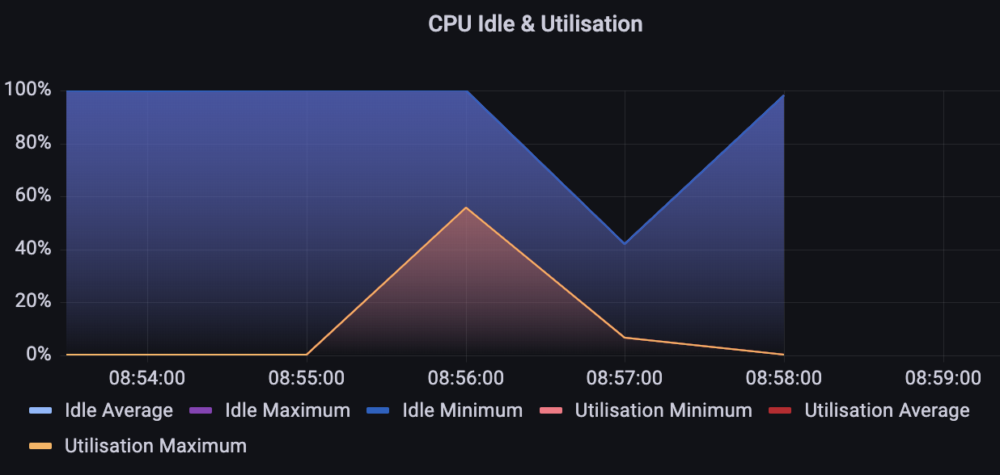

# TLS Termination Loadtest Report

The purpose of the loadtest is to measure the performance differences between terminating tls connection on the load balancer as we currently do and terminating the tls connection on the instance.

## ;TLDR
Terminating tls on the instance is much less performant.
- When using on instance tls termination we can reach between 3000-3200 rps
- When using tls termination from the load balancer (without client side verification) you can comfortably reach over 10000 rps.

## Loadtest Configuration
Loadtest Instance:
- Instance Type: c5.9xlarge 

Belfrage Instance:
- Instance Type: c5.2xlarge

Belfage Endpoint:
- `/status`

## Loadtests with Instance TLS Termination
- Stack: www test Belfrage stack
- Branch:  `RESFRAME-4686-instance-tls-termination-loadtest` `07032f3b0d7d189db160c0cdc4fc22222eb23f73`
- Using this branch you can only access Belfrage with a client certificate
- The stack was set to only have 1 instance and not to scale

1000rps 60 Second Duration
```
echo "GET https://www.belfrage.test.api.bbc.co.uk/status" | vegeta attack -duration=60s -rate=1000 -max-body=0 -cert=/etc/pki/tls/certs/client_chain.crt -key=/etc/pki/tls/private/client.key | tee tls_term_d_30s_rate_1000_results.bin | vegeta report
Requests      [total, rate, throughput]  60000, 1000.02, 999.64
Duration      [total, attack, wait]      1m0.02130855s, 59.999006474s, 22.302076ms
Latencies     [mean, 50, 95, 99, max]    1.207779ms, 854.022µs, 1.476699ms, 1.669382ms, 134.496653ms
Bytes In      [total, mean]              0, 0.00
Bytes Out     [total, mean]              0, 0.00
Success       [ratio]                    100.00%
Status Codes  [code:count]               200:60000 
```

2000rps 60 Second Duration
```
echo "GET https://www.belfrage.test.api.bbc.co.uk/status" | vegeta attack -duration=60s -rate=2000 -max-body=0 -cert=/etc/pki/tls/certs/client_chain.crt -key=/etc/pki/tls/private/client.key | tee tls_term_d_60s_rate_2000_results.bin | vegeta report
Requests      [total, rate, throughput]  120000, 2000.02, 1997.45
Duration      [total, attack, wait]      1m0.076574619s, 59.999507797s, 77.066822ms
Latencies     [mean, 50, 95, 99, max]    4.32007ms, 1.403732ms, 1.931045ms, 104.143851ms, 411.418215ms
Bytes In      [total, mean]              0, 0.00
Bytes Out     [total, mean]              0, 0.00
Success       [ratio]                    100.00%
Status Codes  [code:count]               200:120000 
```

3000rps 60 Second Duration
```
echo "GET https://www.belfrage.test.api.bbc.co.uk/status" | vegeta attack -duration=60s -rate=3000 -max-body=0 -cert=/etc/pki/tls/certs/client_chain.crt -key=/etc/pki/tls/private/client.key | tee tls_term_d_60s_rate_3000_results.bin | vegeta report
Requests      [total, rate, throughput]  180000, 3000.02, 2994.09
Duration      [total, attack, wait]      1m0.113786761s, 59.999683136s, 114.103625ms
Latencies     [mean, 50, 95, 99, max]    14.494389ms, 1.087984ms, 104.303961ms, 250.060326ms, 768.822561ms
Bytes In      [total, mean]              0, 0.00
Bytes Out     [total, mean]              0, 0.00
Success       [ratio]                    99.99%
Status Codes  [code:count]               0:14  200:179986  
Error Set:
Get https://www.belfrage.test.api.bbc.co.uk/status: http2: server sent GOAWAY and closed the connection; LastStreamID=19991, ErrCode=ENHANCE_YOUR_CALM, debug=""
```


3200 rps 60 Second Duration

I ran this one again just to see if it was reproducible. It seemed to be flakey either having a good 200 ratio or a bad one.

```
echo "GET https://www.belfrage.test.api.bbc.co.uk/status" | vegeta attack -duration=60s -rate=3200 -max-body=0 -cert=/etc/pki/tls/certs/client_chain.crt -key=/etc/pki/tls/private/client.key | tee tls_term_d_60_rate_3200_try_2_results.bin | vegeta report
Requests      [total, rate, throughput]  192000, 3200.01, 97.58
Duration      [total, attack, wait]      1m27.689760674s, 59.999723996s, 27.690036678s
Latencies     [mean, 50, 95, 99, max]    22.123382843s, 27.496770332s, 30.036221126s, 30.067300678s, 43.791432447s
Bytes In      [total, mean]              0, 0.00
Bytes Out     [total, mean]              0, 0.00
Success       [ratio]                    4.46%
Status Codes  [code:count]               0:183443  200:8557  
Error Set:
Get https://www.belfrage.test.api.bbc.co.uk/status: net/http: request canceled (Client.Timeout exceeded while awaiting headers)
Get https://www.belfrage.test.api.bbc.co.uk/status: net/http: request canceled while waiting for connection (Client.Timeout exceeded while awaiting headers)
Get https://www.belfrage.test.api.bbc.co.uk/status: write tcp 10.114.163.200:50475->52.214.98.115:443: write: broken pipe
Get https://www.belfrage.test.api.bbc.co.uk/status: write tcp 10.114.163.200:50475->52.214.98.115:443: write: broken pipe (Client.Timeout exceeded while awaiting headers)
Get https://www.belfrage.test.api.bbc.co.uk/status: read tcp 10.114.163.200:41104->18.200.147.121:443: read: connection reset by peer
```


```
echo "GET https://www.belfrage.test.api.bbc.co.uk/status" | vegeta attack -duration=60s -rate=3200 -max-body=0 -cert=/etc/pki/tls/certs/client_chain.crt -key=/etc/pki/tls/private/client.key | tee tls_term_d_60_rate_3200_results.bin | vegeta report
Requests      [total, rate, throughput]  192000, 3200.03, 2844.54
Duration      [total, attack, wait]      1m7.491118078s, 59.999523532s, 7.491594546s
Latencies     [mean, 50, 95, 99, max]    34.054909ms, 1.36129ms, 219.21747ms, 350.177615ms, 30.000090475s
Bytes In      [total, mean]              0, 0.00
Bytes Out     [total, mean]              0, 0.00
Success       [ratio]                    99.99%
Status Codes  [code:count]               0:19  200:191981  
Error Set:
Get https://www.belfrage.test.api.bbc.co.uk/status: http2: server sent GOAWAY and closed the connection; LastStreamID=19991, ErrCode=ENHANCE_YOUR_CALM, debug=""
Get https://www.belfrage.test.api.bbc.co.uk/status: net/http: request canceled while waiting for connection (Client.Timeout exceeded while awaiting headers)
```

3300-3500 rps 60 Second Duration
At this point the many more 500 started to appear, and often it would take the instance offline, which was unrecoverable without a full redeploy.

3300rps
```
echo "GET https://www.belfrage.test.api.bbc.co.uk/status" | vegeta attack -duration=60s -rate=3300 -max-body=0 -cert=/etc/pki/tls/certs/client_chain.crt -key=/etc/pki/tls/private/client.key | tee tls_term_d_60_rate_3300_results.bin | vegeta report
Requests      [total, rate, throughput]  198000, 3300.02, 117.41
Duration      [total, attack, wait]      1m29.999783552s, 59.999705142s, 30.00007841s
Latencies     [mean, 50, 95, 99, max]    22.265468419s, 28.167599791s, 30.034717862s, 30.064932765s, 43.213857032s
Bytes In      [total, mean]              0, 0.00
Bytes Out     [total, mean]              0, 0.00
Success       [ratio]                    5.34%
Status Codes  [code:count]               0:187433  200:10567  
Error Set:
Get https://www.belfrage.test.api.bbc.co.uk/status: net/http: request canceled while waiting for connection (Client.Timeout exceeded while awaiting headers)
Get https://www.belfrage.test.api.bbc.co.uk/status: net/http: request canceled (Client.Timeout exceeded while awaiting headers)
Get https://www.belfrage.test.api.bbc.co.uk/status: write tcp 10.114.163.200:20436->18.200.147.121:443: write: broken pipe
Get https://www.belfrage.test.api.bbc.co.uk/status: write tcp 10.114.163.200:20436->18.200.147.121:443: write: broken pipe (Client.Timeout exceeded while awaiting headers)
```

3500rps
```
echo "GET https://www.belfrage.test.api.bbc.co.uk/status" | vegeta attack -duration=60s -rate=3500 -max-body=0 -cert=/etc/pki/tls/certs/client_chain.crt -key=/etc/pki/tls/private/client.key | tee tls_term_d_60s_rate_3500_results.bin | vegeta report
Requests      [total, rate, throughput]  210000, 3500.02, 105.04
Duration      [total, attack, wait]      1m26.539058407s, 59.999732857s, 26.53932555s
Latencies     [mean, 50, 95, 99, max]    22.08446065s, 26.652264703s, 30.036786119s, 30.082739463s, 53.808350548s
Bytes In      [total, mean]              0, 0.00
Bytes Out     [total, mean]              0, 0.00
Success       [ratio]                    4.33%
Status Codes  [code:count]               0:200910  200:9090  
Error Set:
Get https://www.belfrage.test.api.bbc.co.uk/status: net/http: request canceled (Client.Timeout exceeded while awaiting headers)
Get https://www.belfrage.test.api.bbc.co.uk/status: write tcp 10.114.164.191:48004->18.200.147.121:443: write: broken pipe
Get https://www.belfrage.test.api.bbc.co.uk/status: write tcp 10.114.164.191:48004->18.200.147.121:443: write: broken pipe (Client.Timeout exceeded while awaiting headers)
Get https://www.belfrage.test.api.bbc.co.uk/status: net/http: request canceled while waiting for connection (Client.Timeout exceeded while awaiting headers)
```

Its not clear what is causing the application to become overloaded. When we look at the CPU metrics we can see that in the most extreme cases only around 60% of CPU is being used.



Also analysing the latency over the course of the loadtests show that suggests there is some underlying issue causing latency spikes. There is often a single 500 which leads to a latency spike which is more pronounced the higher the load.


[see interactively](./data/2022-06-13-tls-termination/tls_term_3100rps_plot.html)


[see interactively](./data/2022-06-13-tls-termination/tls_term_3200rps_plot.html)

When the load test completely fails (around 5% success ratio) we can see that there is some kind of ceiling that is reached at the 3 second mark. Its not clear what is causing this. (I'm open to suggestions) but the behaviour in general looks very erratic and strange.


[see interactively](./data/2022-06-13-tls-termination/tls_term_3200rps_plot_try2.html)

## Loadtests with TLS Termination on the Load Balancer
- Stack: cedric test Belfrage stack
- Branch:  `master` `c911c3011d019f7370f55fdc51f09a35a54ddcbc`
- Using this branch you can access cedric belfrage just with url (no certs)
- The stack was set to only have 1 instance and not to scale


5000 rps 60 Seconds Duration
```
echo "GET https://cedric.belfrage.test.api.bbc.co.uk/status" | vegeta attack -duration=60s -rate=5000 -max-body=0 | tee cedric_test_d_60_rate_5000_results.bin | vegeta report
Requests      [total, rate, throughput]  300000, 5000.01, 4999.81
Duration      [total, attack, wait]      1m0.00152225s, 59.999825792s, 1.696458ms
Latencies     [mean, 50, 95, 99, max]    3.264735ms, 1.719755ms, 2.895516ms, 28.24736ms, 30.000129198s
Bytes In      [total, mean]              0, 0.00
Bytes Out     [total, mean]              0, 0.00
Success       [ratio]                    100.00%
Status Codes  [code:count]               0:4  200:299996  
Error Set:
Get https://cedric.belfrage.test.api.bbc.co.uk/status: net/http: request canceled (Client.Timeout exceeded while awaiting headers)
```

10,000 rps 60 Second Duration
```
echo "GET https://cedric.belfrage.test.api.bbc.co.uk/status" | vegeta attack -duration=60s -rate=10000 -max-body=0 | tee cedric_test_d_60_rate_10000_results.bin | vegeta report
Requests      [total, rate, throughput]  600000, 10000.01, 6915.78
Duration      [total, attack, wait]      1m26.750134052s, 59.999932756s, 26.750201296s
Latencies     [mean, 50, 95, 99, max]    57.809084ms, 2.757247ms, 181.911657ms, 235.970939ms, 30.016036036s
Bytes In      [total, mean]              0, 0.00
Bytes Out     [total, mean]              0, 0.00
Success       [ratio]                    99.99%
Status Codes  [code:count]               0:55  200:599945  
Error Set:
Get https://cedric.belfrage.test.api.bbc.co.uk/status: EOF
Get https://cedric.belfrage.test.api.bbc.co.uk/status: net/http: request canceled (Client.Timeout exceeded while awaiting headers)
```

15,000 rps 60 Second Duration
```
echo "GET https://cedric.belfrage.test.api.bbc.co.uk/status" | vegeta attack -duration=60s -rate=15000 -max-body=0 | tee cedric_test_d_60_rate_15000_results.bin | vegeta report
Requests      [total, rate, throughput]  495890, 7790.39, 3718.96
Duration      [total, attack, wait]      1m33.761200347s, 1m3.654041319s, 30.107159028s
Latencies     [mean, 50, 95, 99, max]    12.704114079s, 1.762509147s, 50.748589068s, 1m0.86085506s, 1m29.689677646s
Bytes In      [total, mean]              0, 0.00
Bytes Out     [total, mean]              0, 0.00
Success       [ratio]                    70.32%
Status Codes  [code:count]               0:147196  200:348694  
Error Set:
Get https://cedric.belfrage.test.api.bbc.co.uk/status: EOF
Get https://cedric.belfrage.test.api.bbc.co.uk/status: dial tcp 0.0.0.0:0->34.245.253.217:443: bind: address already in use
Get https://cedric.belfrage.test.api.bbc.co.uk/status: dial tcp 0.0.0.0:0->34.245.253.217:443: socket: too many open files
Get https://cedric.belfrage.test.api.bbc.co.uk/status: dial tcp: lookup cedric.belfrage.test.api.bbc.co.uk on 10.114.128.2:53: no such host
Get https://cedric.belfrage.test.api.bbc.co.uk/status: dial tcp 0.0.0.0:0->63.32.81.99:443: bind: address already in use
```

20,000 rps 60 Second Duration
```
echo "GET https://cedric.belfrage.test.api.bbc.co.uk/status" | vegeta attack -duration=60s -rate=20000 -max-body=0 | tee cedric_test_d_60_rate_20000_results.bin | vegeta report
Requests      [total, rate, throughput]  329404, 5111.01, 1385.02
Duration      [total, attack, wait]      1m40.021033002s, 1m4.449877361s, 35.571155641s
Latencies     [mean, 50, 95, 99, max]    33.591561676s, 37.064901404s, 1m17.216530888s, 1m27.702833834s, 1m37.82527741s
Bytes In      [total, mean]              0, 0.00
Bytes Out     [total, mean]              0, 0.00
Success       [ratio]                    42.06%
Status Codes  [code:count]               0:190873  200:138531  
Error Set:
Get https://cedric.belfrage.test.api.bbc.co.uk/status: EOF
Get https://cedric.belfrage.test.api.bbc.co.uk/status: dial tcp 0.0.0.0:0->63.32.81.99:443: bind: address already in use
Get https://cedric.belfrage.test.api.bbc.co.uk/status: dial tcp 0.0.0.0:0->34.245.253.217:443: bind: address already in use
Get https://cedric.belfrage.test.api.bbc.co.uk/status: http: server closed idle connection
Get https://cedric.belfrage.test.api.bbc.co.uk/status: dial tcp 0.0.0.0:0->34.241.185.115:443: bind: address already in use
Get https://cedric.belfrage.test.api.bbc.co.uk/status: net/http: request canceled (Client.Timeout exceeded while awaiting headers)
Get https://cedric.belfrage.test.api.bbc.co.uk/status: net/http: request canceled while waiting for connection (Client.Timeout exceeded while awaiting headers)
```

Here you can see that when not verifying client certificate. **The performance doesn't start to degrade until we reach 15,000rps** and even then it degrades somewhat more gracefully.

master branch comfortably handling load of 10,000rps

[see interactively](./data/2022-06-13-tls-termination/test_master_10000rps_plot.html)

but when we hit 15,000rps the load can't be handled so well.

[see interactively](./data/2022-06-13-tls-termination/test_master_15000rps_plot.html)


## Comparing the Loadtests and Future Work
We can comfortably reach 3000rps with tls termination on the instance with client side verification. We can handle at least 10,000rps when we terminate tls on the instance. **So terminating tls on the instance without client side verification is over 3x more performant.**

Also its interesting to see that CPU isn't the bottleneck on performance as even in the most extreme instance terminating loadtests reached 60% CPU usage. So there must be another bottleneck.

Future work could include:
- Finding out what causes the slowdown peer verifying client side certificates or terminating on the instance.
- Also loadtesting Belfrage with an nginx instance in-front to terminate the instance in a more performant way.
- Look deeper into understanding what the bottleneck is with instance termination if its not the CPU


