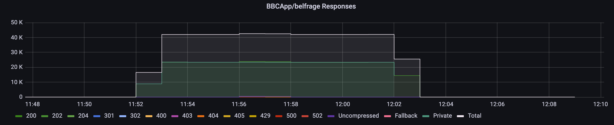
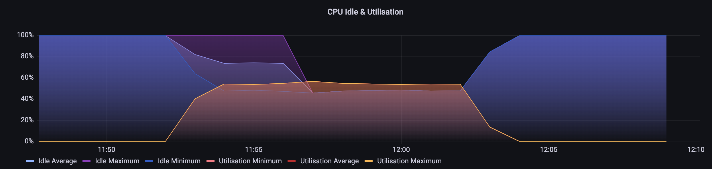
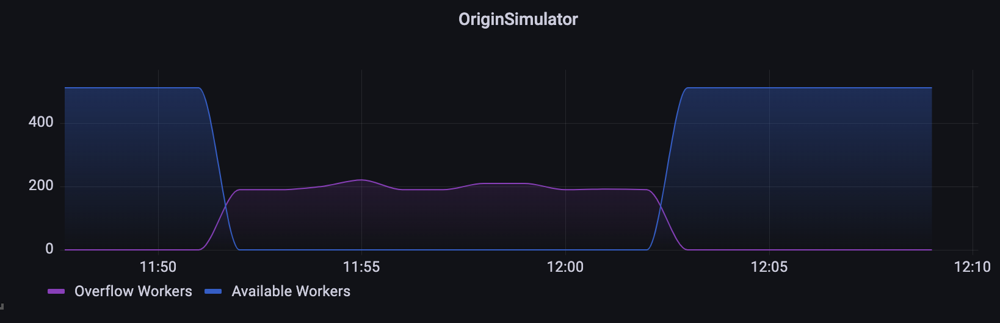
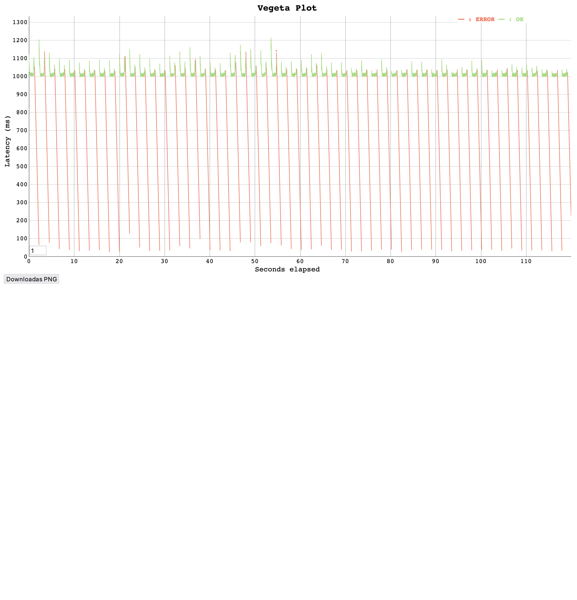
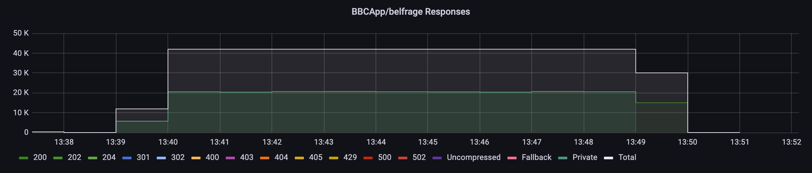
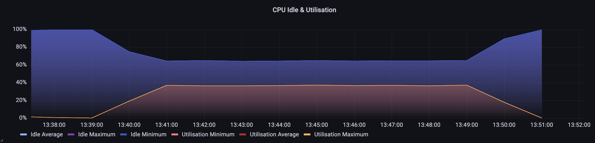
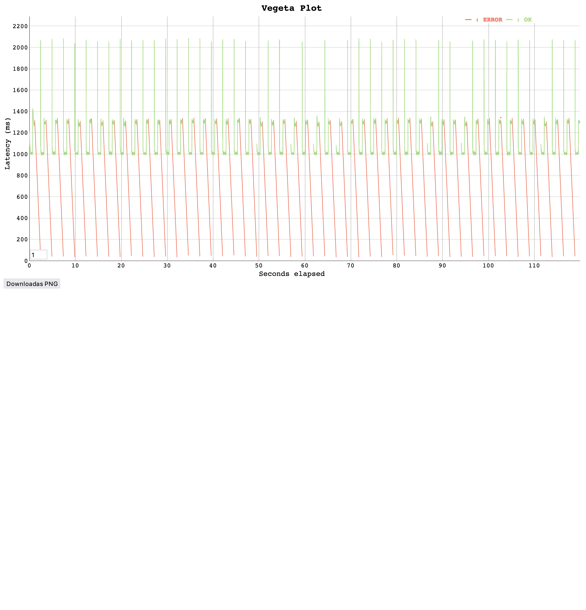

# Finch VS Machine Gun
- Machine Gun is a project which combines poolboy pools with the gun HTTP client.
- Finch is a project which combines nimblepool with the mint HTTP client.

We want to move to Finch because:
- in previous load tests (see [testing-finch-http-client](./2021-09-20-testing-finch-http-client.md)) we've found that finch is more performant that machine gun.
- Machine Gun is a sticking point in us upgrading it OTP 24 meaning we can't use the ASM JIT on Belfrage yet.
- Finch is promising as it's performance focused and uses nimble_pool created by Jose Valim.

The goal of these load tests is to determine **is it safe to roll out Finch as our HTTP client in production?**

## Load Tests using Machine Gun
- Stack: www test Belfrage stack
- Branch:  `master` `87cf5036389c666fe7944fc843decad94448ec73`

The origin is configured with 1 second latency to return the `/news` page fo the BBC website.
```
[
    {
        "stages": [
            {
                "status": 200,
                "latency": "1s",
                "at": 0
            }
        ],
        "route": "/*",
        "random_content": null,
        "origin": "https://www.bbc.co.uk/news",
        "headers": {
            "content-type": "text/html; charset=utf-8",
            "content-encoding": "gzip"
        },
        "body": null
    }
]
```

###  700 RPS 600 Seconds
Vegeta Report
```
$ date && echo "GET https://www.belfrage.test.api.bbc.co.uk/news" | vegeta attack -duration=600s -rate=700 -header "replayed-traffic:true" -http2 false -max-body=0 -timeout=30s | tee machinegun_1s_l_600s_d_700rps_30s_timeout_results.bin | vegeta report
Tue  5 Jul 10:52:35 UTC 2022
Requests      [total, rate, throughput]  420001, 700.00, 382.77
Duration      [total, attack, wait]      10m1.008528329s, 9m59.999875195s, 1.008653134s
Latencies     [mean, 50, 95, 99, max]    796.71742ms, 1.006793049s, 1.033523183s, 1.069909201s, 1.600541773s
Bytes In      [total, mean]              99323627400, 236484.26
Bytes Out     [total, mean]              0, 0.00
Success       [ratio]                    54.77%
Status Codes  [code:count]               0:189951  200:230050
Error Set:
Get https://www.belfrage.test.api.bbc.co.uk/news: http2: server sent GOAWAY and closed the connection; LastStreamID=3101, ErrCode=ENHANCE_YOUR_CALM, debug=""
Get https://www.belfrage.test.api.bbc.co.uk/news: http2: server sent GOAWAY and closed the connection; LastStreamID=3103, ErrCode=ENHANCE_YOUR_CALM, debug=""
Get https://www.belfrage.test.api.bbc.co.uk/news: http2: server sent GOAWAY and
...
```


Responses


CPU


Pool workers


### 700 RPS 120 Seconds
The binary of long load tests are too large to produce a graph. So I ran a shorter load test in order to visualise latency and client status over time.




## Load Tests using Finch 
- Stack: www test Belfrage stack
- Branch:  `RESFRAME-4763-finch-programmes` `042a63eaedf3dbf2cd47fa0b61c6a4a29f079dff`

Finch was configured to use 512 workers for the `OriginSimulator` endpoint.

The origin is configured with 1 second latency to return the `/news` page for the BBC website.
```
[
    {
        "stages": [
            {
                "status": 200,
                "latency": "1s",
                "at": 0
            }
        ],
        "route": "/*",
        "random_content": null,
        "origin": "https://www.bbc.co.uk/news",
        "headers": {
            "content-type": "text/html; charset=utf-8",
            "content-encoding": "gzip"
        },
        "body": null
    }
]
```

###  700 RPS 600 Seconds
Vegeta Report
```
$ date && echo "GET https://www.belfrage.test.api.bbc.co.uk/news" | vegeta attack -duration=600s -rate=700 -header "replayed-traffic:true" -http2 false -max-body=0 -timeout=30s | tee finch_1s_l_600s_d_700rps_30s_timeout_results.bin | vegeta report
Tue  5 Jul 12:39:41 UTC 2022
Requests      [total, rate, throughput]  420001, 700.00, 334.33
Duration      [total, attack, wait]      10m1.631088297s, 9m59.999878872s, 1.631209425s
Latencies     [mean, 50, 95, 99, max]    900.2049ms, 1.007846299s, 1.306505741s, 1.346030511s, 2.163808065s
Bytes In      [total, mean]              86843951460, 206770.82
Bytes Out     [total, mean]              0, 0.00
Success       [ratio]                    47.89%
Status Codes  [code:count]               0:218856  200:201145
Error Set:
Get https://www.belfrage.test.api.bbc.co.uk/news: http2: server sent GOAWAY and closed the connection; LastStreamID=3443, ErrCode=ENHANCE_YOUR_CALM, debug=""
Get https://www.belfrage.test.api.bbc.co.uk/news: http2: server sent GOAWAY and closed the connection; LastStreamID=3471, ErrCode=ENHANCE_YOUR_CALM, debug=""
Get https://www.belfrage.test.api.bbc.co.uk/news: http2: server sent GOAWAY and closed the connection; LastStreamID=3467, ErrCode=ENHANCE_YOUR_CALM, debug=""
...
```


Responses


CPU



### 700 RPS 120 Seconds
The binary of long load tests are too large to produce a graph. So I ran a shorter load test in order to visualise latency and client status over time.




## Discussion
We can see that in a high latency environment Finch and MachineGun perform similarly.

Finch performing slightly slower (1.34s vs 1.06s 95th percentile latency) under heavy load and having a slightly lower success ratio (48% vs 55%).

Some of this could be explained by Finches 512 worker configuration as opposed to Machine Guns 512 workers with 4096 overflow workers. We can see that all of machine guns workers and about 200 overflow workers are in use. Meaning its not quite an equal comparison. Also there are other levers we could pull to increase performance such as increasing the `count` per pool. (see [here](https://github.com/bbc/belfrage/pull/1484))

We can also see that the CPU usage with Finch is much lower than Machine Gun (37% vs 56%). There are two factors which could contribute to this. One is the Machine Gun overflow workers which we already know are inefficient, the other is Finch's superior performance.

## Conclusion
The goal of these load tests was to answer: **Is Finch safe for production?** I think **the answer to this is yes**. Even with low latency origins it performs similarly to Machine Gun, while using less CPU. If we are happy having Machine Gun in production we should be happy using Finch. 


