# Replicating Slow Redirects
On Saturday 30th July 2022 we received a large spike of requests for the route '/vietnamese/' the trailing slash in this route led to it being redirected to '/vietnamese'.
The unexpected thing about this according to our internal latency measurement it was taking us 309ms to return a binary response, much less that we should have done considering 301s have no body.

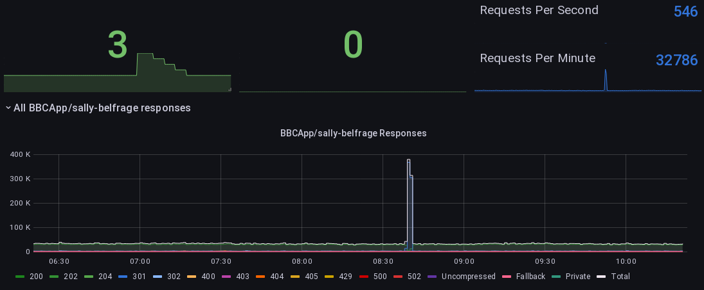

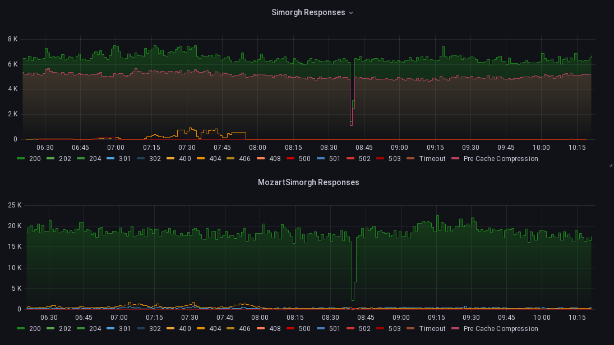

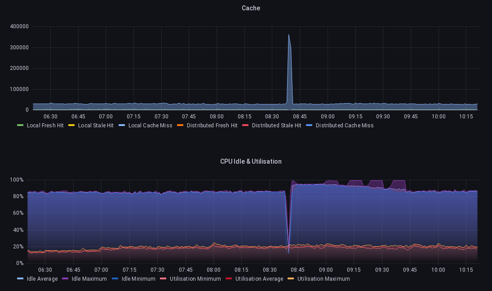

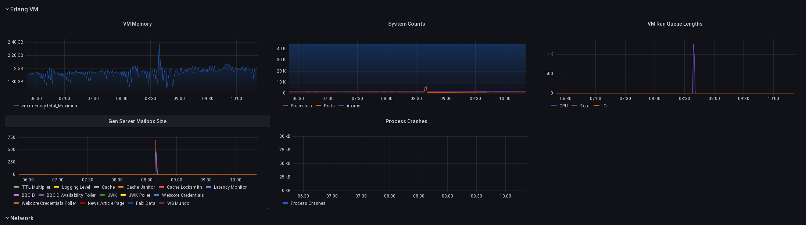

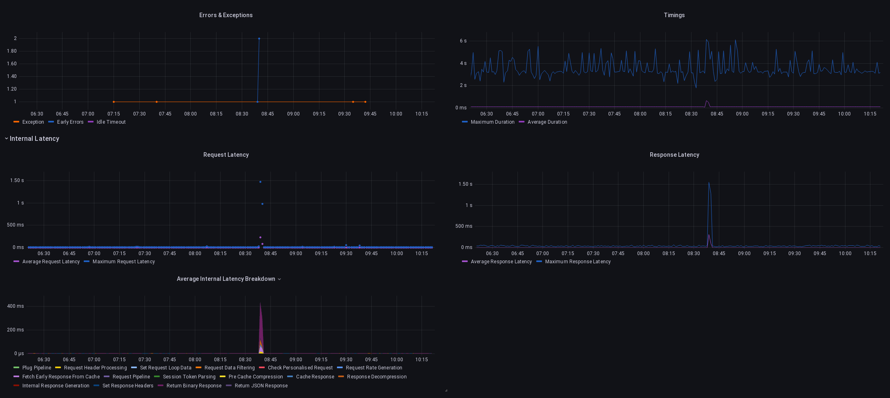

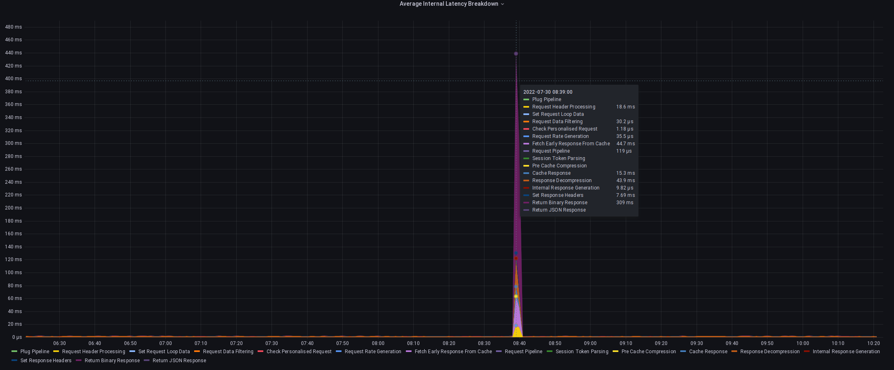

## Loadtest
RPS: 4000
Duration: 300 seconds
The load test client does not follow redirects
Each request is performed with a unique query string which is allowed by vietnamese ws routes.

load test
```
cat loadtest_no_follow_redirect && date && ./loadtest_no_follow_redirect
#!/usr/bin/env bash

d=300
r=4000
n=$(($d * $r))
(let i=0
while [ $i -lt $n ]; do
let i++
echo GET https://sally.belfrage.test.api.bbc.co.uk/vietnamese/?component_env=$i
done) | vegeta attack -header "x-bbc-edge-host:www.test.bbc.com" -header "replayed-traffic:true" -http2=false -max-body=0 -timeout=30s -redirects=-1  -rate=$r -duration=${d}s | tee vietnamese_300s_4000rps_querystring_results.bin | vegeta report
Tue  6 Sep 07:35:23 UTC 2022
Requests      [total, rate, throughput]  1081297, 3662.80, 1915.62
Duration      [total, attack, wait]      6m2.504984189s, 4m55.210425113s, 1m7.294559076s
Latencies     [mean, 50, 95, 99, max]    24.891259429s, 2.814909092s, 1m38.108436159s, 1m46.345227116s, 2m52.38298375s
Bytes In      [total, mean]              0, 0.00
Bytes Out     [total, mean]              0, 0.00
Success       [ratio]                    64.22%
Status Codes  [code:count]               0:385308  301:694421  500:1568
Error Set:
Get https://sally.belfrage.test.api.bbc.co.uk/vietnamese/?component_env=62: net/http: request canceled (Client.Timeout exceeded while awaiting headers)
Get https://sally.belfrage.test.api.bbc.co.uk/vietnamese/?component_env=981: net/http: request canceled (Client.Timeout exceeded while awaiting headers)
...
```

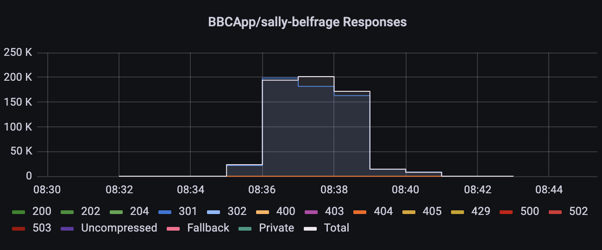

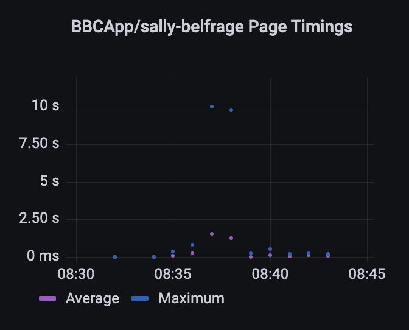

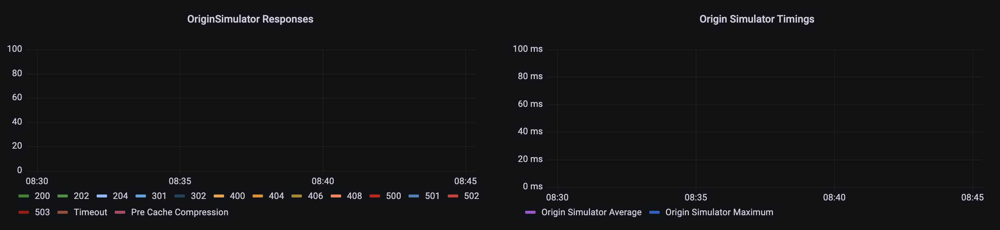

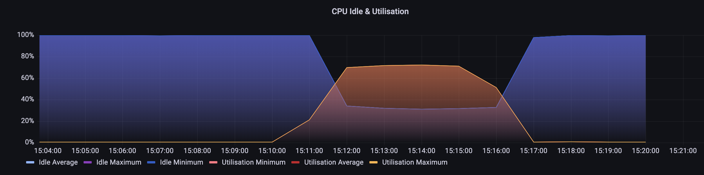

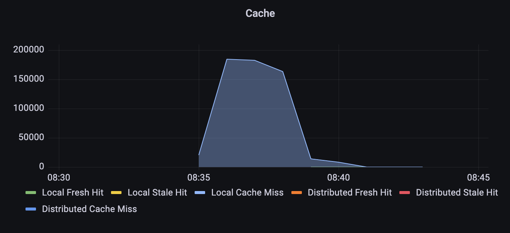

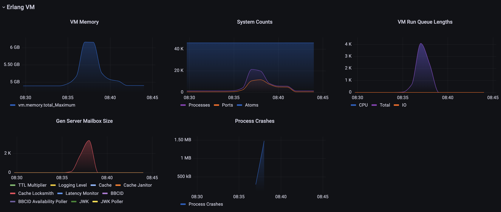

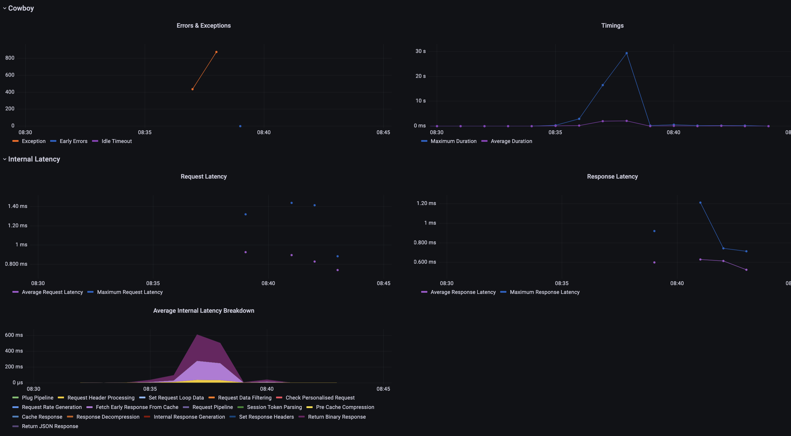

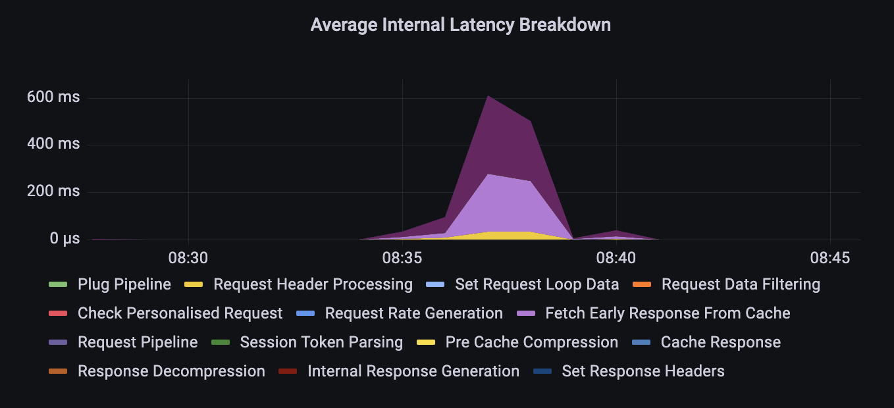

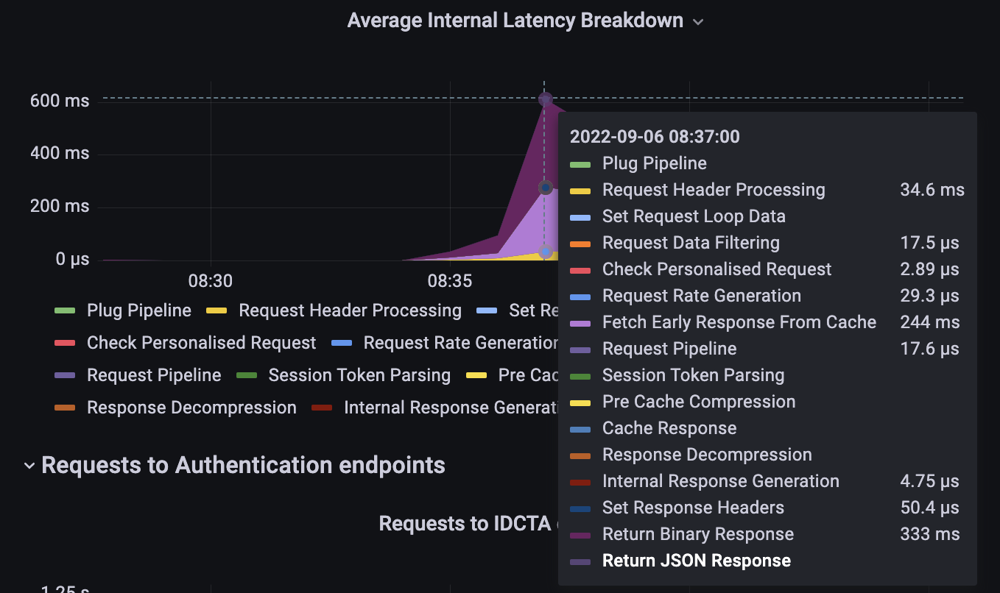

This seems to replicate the incident accurately this can be seen by:
* 333ms 'Return Binary Response' internal latency (309ms in incident)
* Cache spike similar relative size and practically no cache hits
* CPU utilisation is similar
* Spikes in Erlang VM metrics (System Counts, VM run queue lengths, Cache locksmith queue length)

Using this load test format this was analysed further using `observer_cli`.

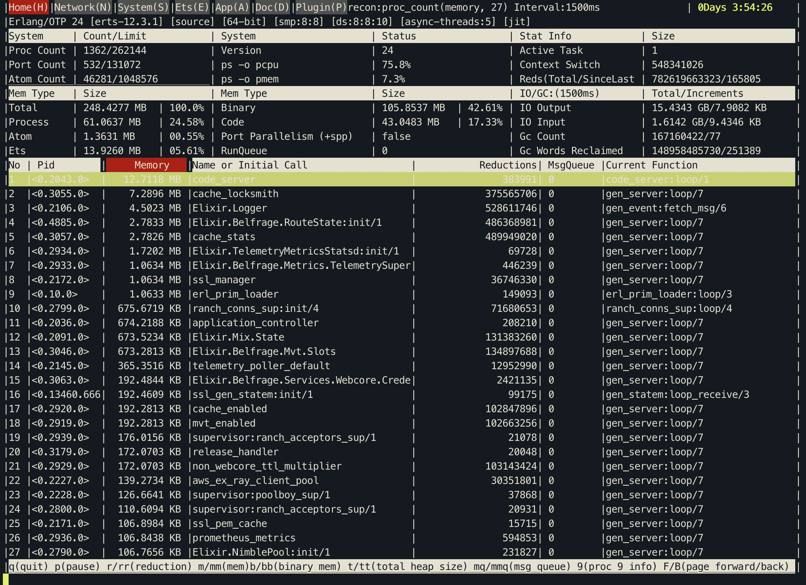

You can see that `cache_locksmith` and `cache_stats` have a very high reduction count, high memory and often has high message queue. For this reason I think this is the cause of the slowdown. I can't find the causal link but I think the checking of the cache for a response that isn't there is eating up the schedulers time.


The load tests underneath were performed in an effort to replicate the incident.
There are kept here for posterity.

---

### Following Redirects 300s 2000rps
```
$ date && echo "GET https://www.belfrage.test.api.bbc.co.uk/vietnamese/" | vegeta attack -duration=300s -rate=2000  -header "x-bbc-edge-host:www.test.bbc.com" -http2=false -max-body=0 -timeout=30s | tee vietnamese_300s_2000rps_results.bin | vegeta report
Mon 22 Aug 11:09:41 UTC 2022
Requests      [total, rate, throughput]  596514, 1903.33, 116.08
Duration      [total, attack, wait]      5m43.349174466s, 5m13.406010989s, 29.943163477s
Latencies     [mean, 50, 95, 99, max]    29.358244331s, 27.240054993s, 1m2.28902243s, 1m31.045371577s, 2m25.759005295s
Bytes In      [total, mean]              0, 0.00
Bytes Out     [total, mean]              0, 0.00
Success       [ratio]                    6.68%
Status Codes  [code:count]               0:556657  200:39857
Error Set:
Get https://www.belfrage.test.api.bbc.co.uk/vietnamese/: read tcp 10.114.167.183:31144->18.200.147.121:443: read: connection reset by peer
read tcp 10.114.167.183:23574->52.214.98.115:443: read: connection reset by peer
```

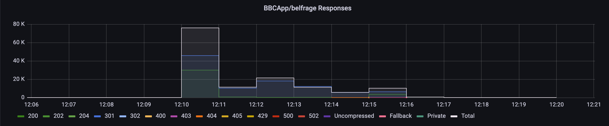

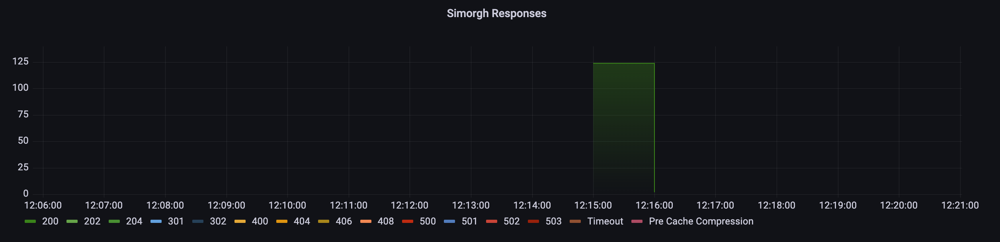

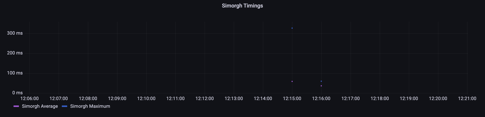

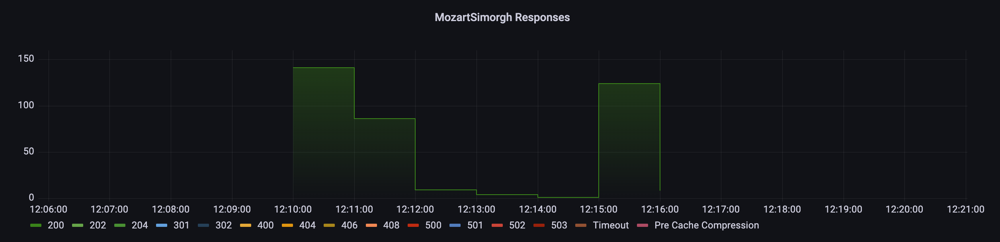

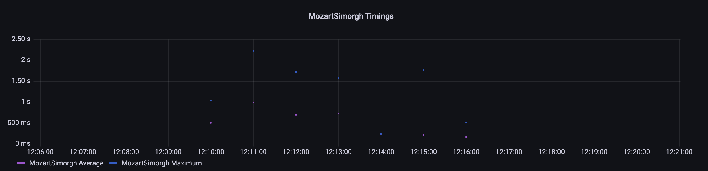

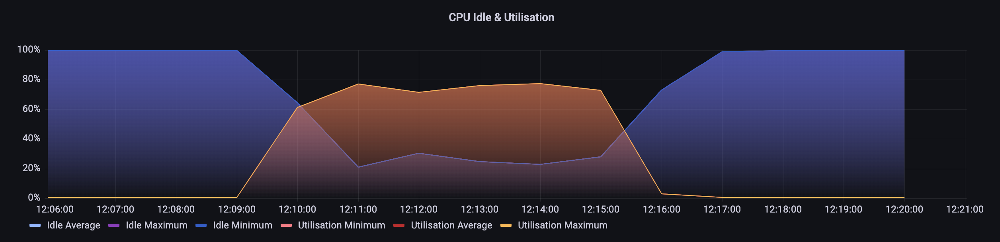

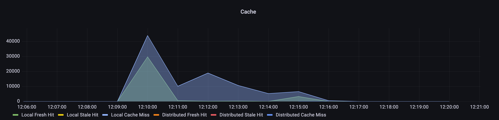

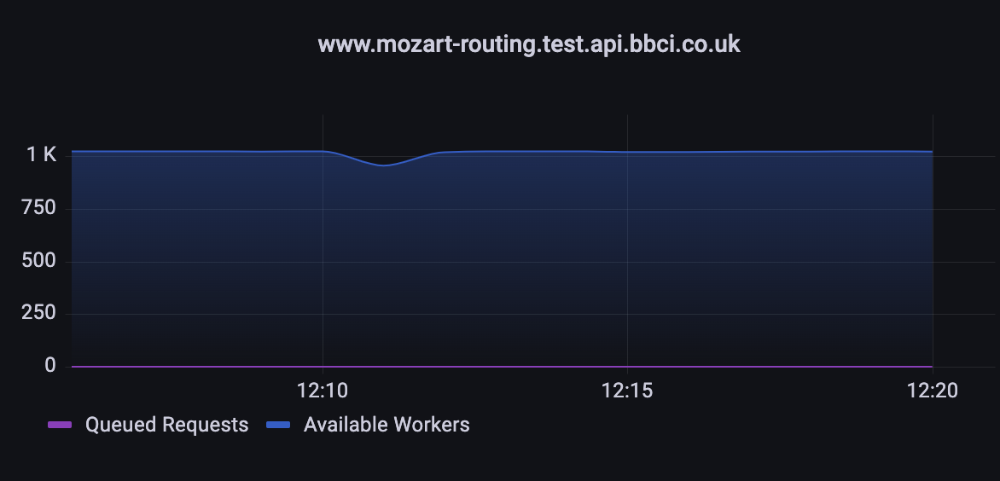

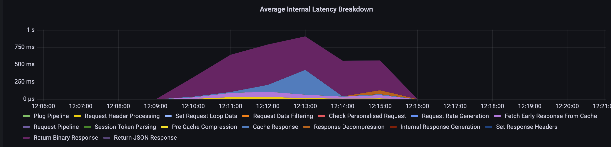

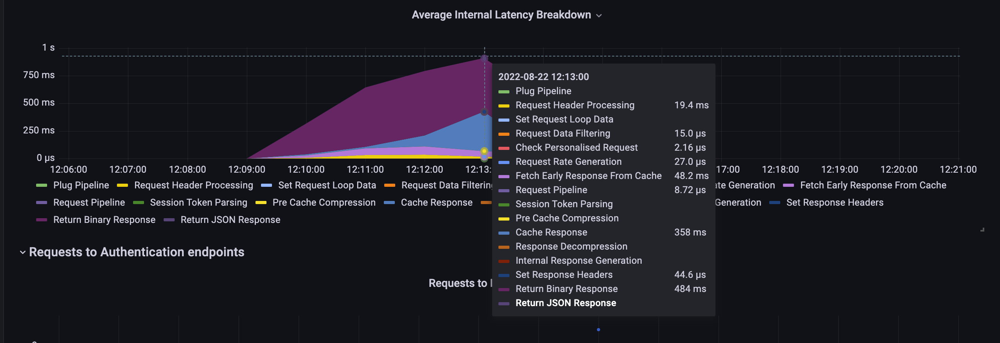

While we produced a similar 'Return Binary Response' latency with the incident in the loadtest, it doesn't accurately represent the incident. This is because in the incident redirects are not being followed as in this loadtest we do. This means that the cache for '/vietnamese' is being hit very hard which brings down the local cache causing belfrage to struggle.

We need to see the slow 'Return Binary Response' while the client isn't following the redirects. That way the cache shouldn't be hit at all.

### Not Following Redirects 200s 2000rps
```
$ date && echo "GET https://www.belfrage.test.api.bbc.co.uk/vietnamese/" | vegeta attack -duration=300s -rate=2000 -redirects=-1  -header "x-bbc-edge-host:www.test.bbc.com" -http2=false -max-body=0 -timeout=30s | tee vietnamese_300s_2000rps_dont_follow_redirects_results.bin | vegeta report
Mon 22 Aug 13:44:27 UTC 2022
Requests      [total, rate, throughput]  600000, 2000.00, 1970.06
Duration      [total, attack, wait]      5m4.555098703s, 4m59.99951019s, 4.555588513s
Latencies     [mean, 50, 95, 99, max]    5.776327ms, 2.08445ms, 23.572122ms, 87.052987ms, 30.000129604s
Bytes In      [total, mean]              0, 0.00
Bytes Out     [total, mean]              0, 0.00
Success       [ratio]                    100.00%
Status Codes  [code:count]               0:8  301:599992
Error Set:
Get https://www.belfrage.test.api.bbc.co.uk/vietnamese/: net/http: request canceled (Client.Timeout exceeded while awaiting headers)
```

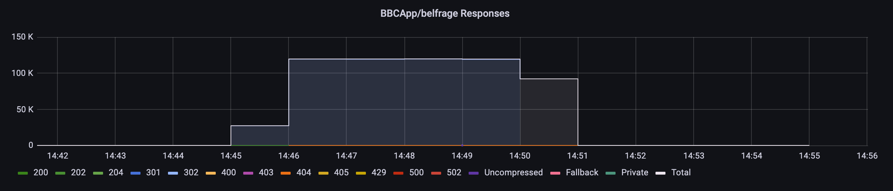

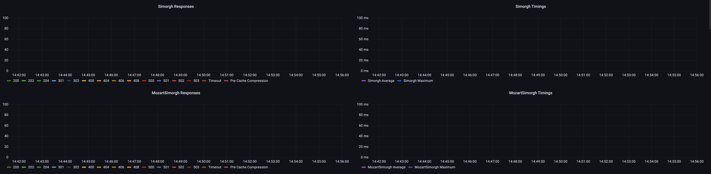

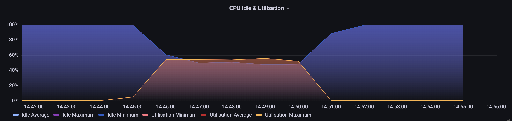

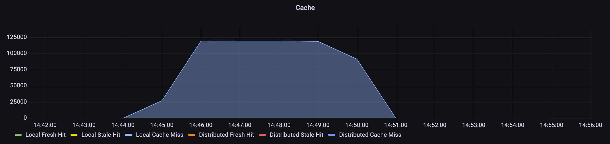

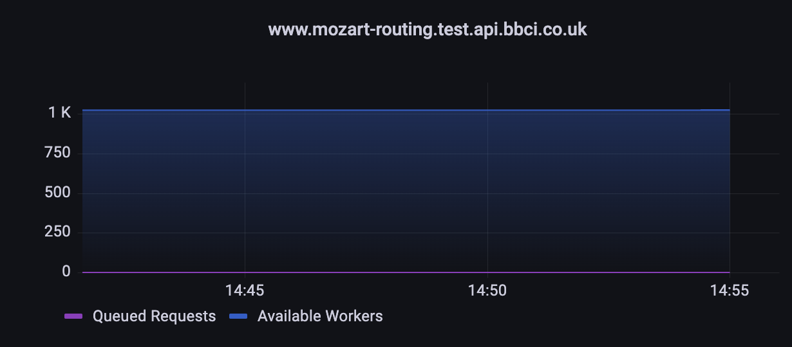

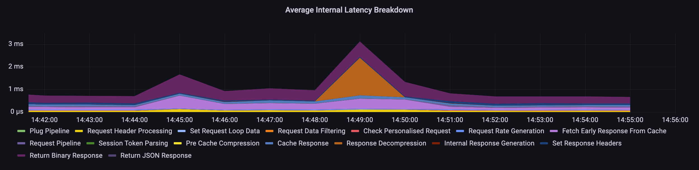

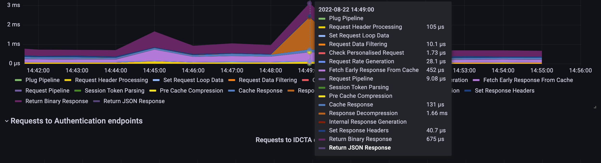

When we don't follow redirects the internal latency of belfrage is nowhere near the same level as it was during the incident. Maybe there were a few legitimate 200s which had huge binary response times due to belfrage having to handle millions of 301's?

### '/vietnamese' and '/vietnamese/' at the same time (public)
In the event we saw many 301s and a small amount of 300s I wondered if the vast amounts of 301s was making the 200 responses slow, which would explain the slow internal latency for 'return binary response'.

300s 2000rps to '/vietnamese/' (doesn't follow redirect)
```
$ date && echo "GET https://www.belfrage.test.api.bbc.co.uk/vietnamese/" | vegeta attack -duration=2000s -rate=100  -header "x-bbc-edge-host:www.test.bbc.com" -redirects=-1 -http2=false -max-body=0 -timeout=30s | tee vietnamese_300s_2000rps_combo_redirects_results.bin | vegeta report
Tue 23 Aug 09:37:11 UTC 2022
Requests      [total, rate, throughput]  599639, 1950.17, 144.41
Duration      [total, attack, wait]      5m29.818598099s, 5m7.480352814s, 22.338245285s
Latencies     [mean, 50, 95, 99, max]    26.385303638s, 25.160608773s, 55.030804712s, 1m19.327338527s, 2m1.99477605s
Bytes In      [total, mean]              0, 0.00
Bytes Out     [total, mean]              0, 0.00
Success       [ratio]                    7.94%
Status Codes  [code:count]               0:551928  200:47629  500:82
Error Set:
read tcp 10.114.158.105:9515->52.214.98.115:443: read: connection reset by peer
read tcp 10.114.158.105:21204->108.128.229.253:443: read: connection reset by peer
```


300s 100rps to '/vietnamese' (returns 200)
```
$ date && echo "GET https://www.belfrage.test.api.bbc.co.uk/vietnamese" | vegeta attack -duration=300s -rate=100  -header "x-bbc-edge-host:www.test.bbc.com" -http2=false -max-body=0 -timeout=30s | tee vietnamese_300s_100_rps_combo_200s_results.bin | vegeta report
Tue 23 Aug 09:37:10 UTC 2022
Requests      [total, rate, throughput]  30000, 100.00, 78.20
Duration      [total, attack, wait]      5m29.273040593s, 4m59.990683885s, 29.282356708s
Latencies     [mean, 50, 95, 99, max]    1.496311703s, 174.552984ms, 5.201657447s, 30.009422862s, 30.225053677s
Bytes In      [total, mean]              0, 0.00
Bytes Out     [total, mean]              0, 0.00
Success       [ratio]                    85.83%
Status Codes  [code:count]               0:4228  200:25748  500:24
Error Set:
Get https://www.belfrage.test.api.bbc.co.uk/vietnamese: net/http: request canceled (Client.Timeout exceeded while awaiting headers)
Get https://www.belfrage.test.api.bbc.co.uk/vietnamese: dial tcp 0.0.0.0:0->108.128.229.253:443: bind: address already in use
Get https://www.belfrage.test.api.bbc.co.uk/vietnamese: dial tcp 0.0.0.0:0->52.214.98.115:443: bind: address already in use
Get https://www.belfrage.test.api.bbc.co.uk/vietnamese: dial tcp 0.0.0.0:0->18.200.147.121:443: bind: address already in use
Get https://www.belfrage.test.api.bbc.co.uk/vietnamese: read tcp 10.114.158.105:29168->52.214.98.115:443: read: connection reset by peer
500 Internal Server Error
```

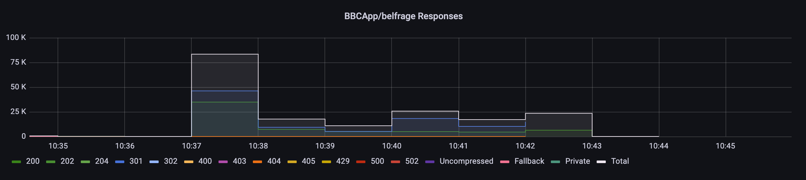

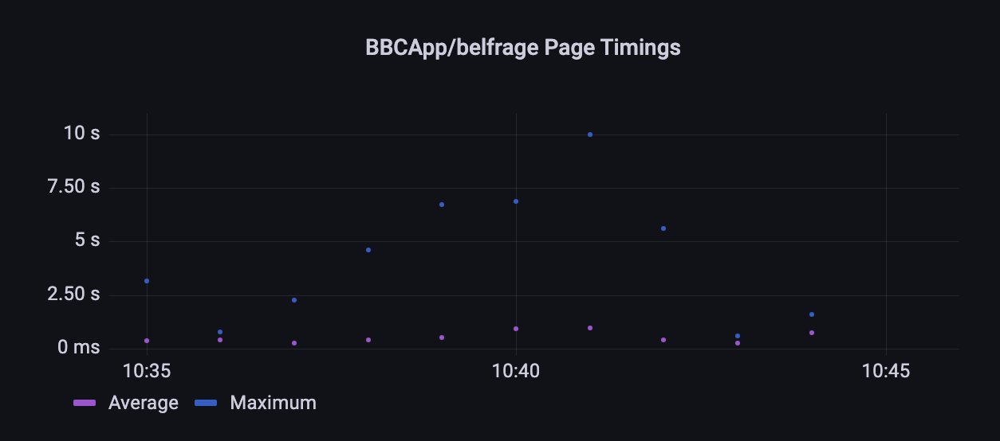

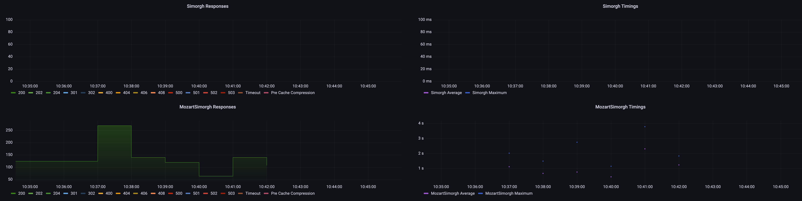

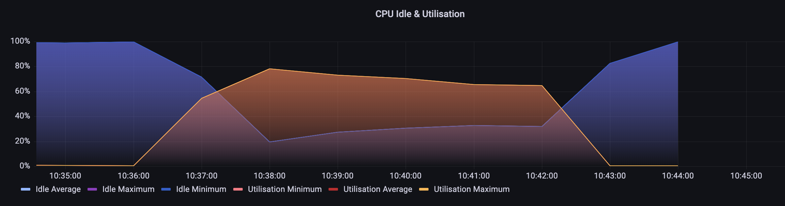

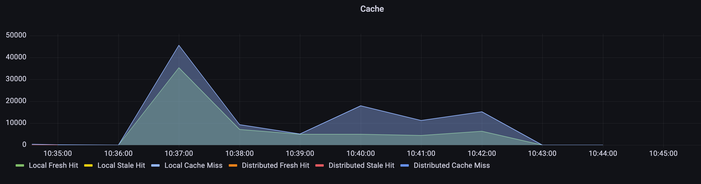

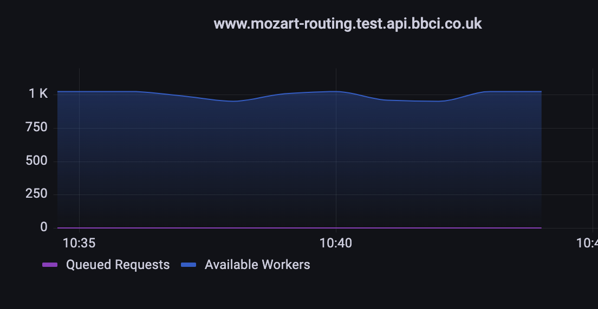

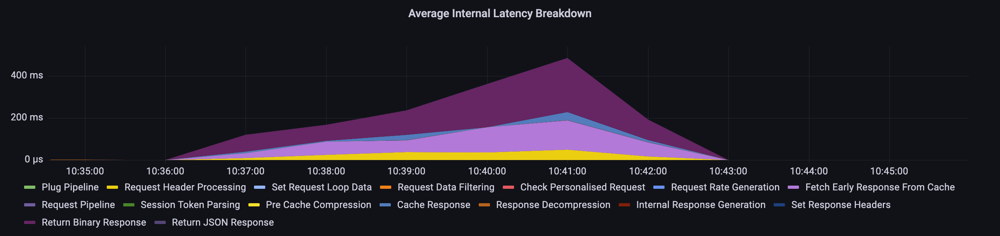

Again we see a small amount of 200's while there is a sustained number of 301's is enough to disrupt the cache and raise 'Return Binary Response' latency to 200ms , but as stated before this is not what is primarily being looked for.

### '/vietnamese' and '/vietnamese/' at the same time (private content)
In the previous test the cache is being hit hard, but in the recorded event the cache isn't being hit at all. To try to replicate this better I used the `replayed-traffic:true` header to direct requests to origin simulator with a `private` cache control header.

origin simulator recipe
```
{
    "origin": "https://www.bbc.com/vietnamese",
    "stages": [
        {
            "at": 0,
            "status": 200,
            "latency": "100ms"
        }
    ],
    "headers": {
        "content-encoding": "gzip",
        "content-type": "text/html; charset=utf-8",
        "cache-control": "private"
    }
}
```


300s 2000rps to '/vietnamese/' (doesn't follow redirect)
```
$ date && echo "GET https://www.belfrage.test.api.bbc.co.uk/vietnamese/" | vegeta attack -duration=300s -rate=2000 -header "x-bbc-edge-host:www.test.bbc.com" -header "replayed-traffic:true" -http2=false -redirects=-1 -max-body=0 -timeout=30s | tee vietnamese_300s_2000rps_combo_redirect_private_results.bin | vegeta report
Tue 23 Aug 12:58:51 UTC 2022
Requests      [total, rate, throughput]  600000, 2000.01, 1999.89
Duration      [total, attack, wait]      5m0.000898107s, 4m59.999078544s, 1.819563ms
Latencies     [mean, 50, 95, 99, max]    9.712892ms, 2.229324ms, 52.729566ms, 121.179028ms, 30.00013802s
Bytes In      [total, mean]              0, 0.00
Bytes Out     [total, mean]              0, 0.00
Success       [ratio]                    99.99%
Status Codes  [code:count]               0:31  301:599969
Error Set:
Get https://www.belfrage.test.api.bbc.co.uk/vietnamese/: net/http: request canceled (Client.Timeout exceeded while awaiting headers)
```

300s 100rps '/vietnamese' (should give private 200)
```
$ date && echo "GET https://www.belfrage.test.api.bbc.co.uk/vietnamese" | vegeta attack -duration=300s -rate=100  -header "x-bbc-edge-host:www.test.bbc.com" -header "replayed-traffic:true" -http2=false -max-body=0 -timeout=30s | tee vietnamese_300s_2000rps_combo_200s__private_results.bin | vegeta report
Tue 23 Aug 12:58:53 UTC 2022
Requests      [total, rate, throughput]  30000, 100.00, 99.94
Duration      [total, attack, wait]      5m0.095708426s, 4m59.990007932s, 105.700494ms
Latencies     [mean, 50, 95, 99, max]    124.710334ms, 106.810099ms, 181.798893ms, 328.45916ms, 30.000135675s
Bytes In      [total, mean]              0, 0.00
Bytes Out     [total, mean]              0, 0.00
Success       [ratio]                    99.97%
Status Codes  [code:count]               0:8  200:29992
Error Set:
Get https://www.belfrage.test.api.bbc.co.uk/vietnamese: net/http: request canceled (Client.Timeout exceeded while awaiting headers)
```

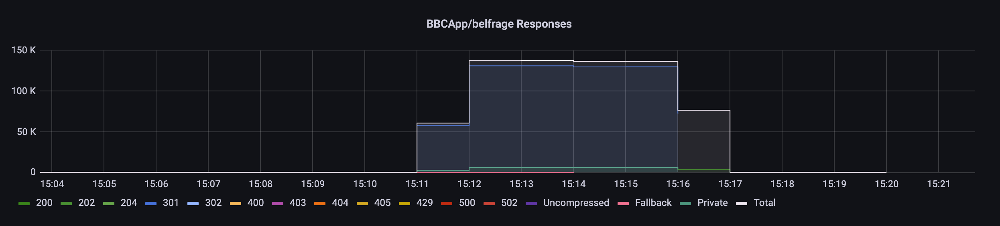

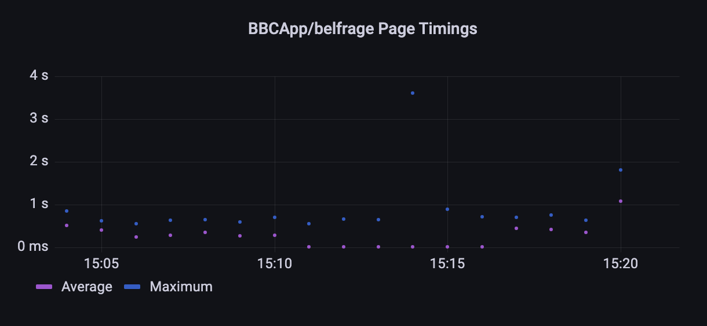

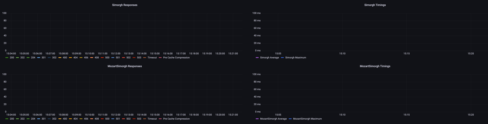


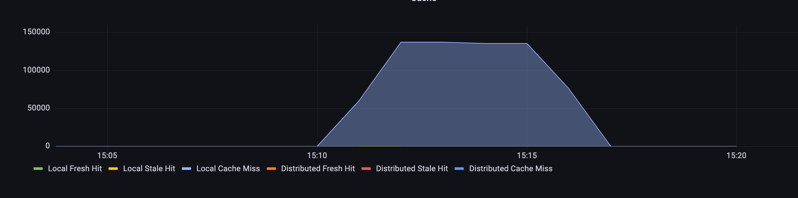

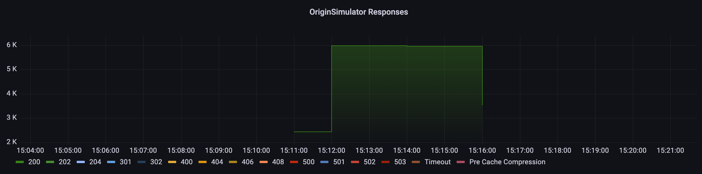

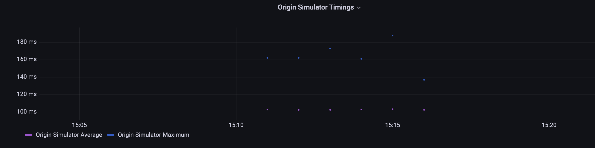

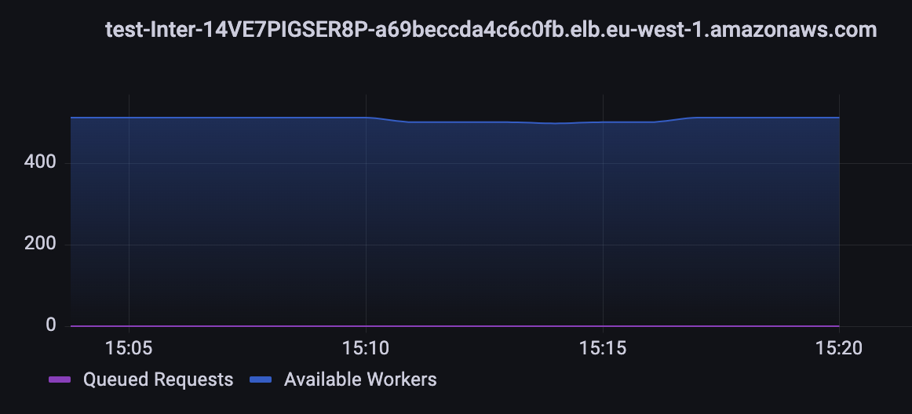

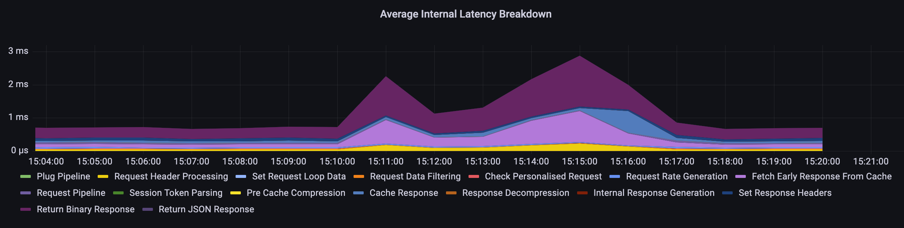

We can see here that the cache isn't being hit. However the 'Return Binary Response' is tiny in comparison to the observed incident.
