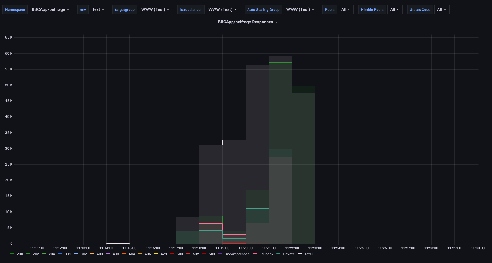
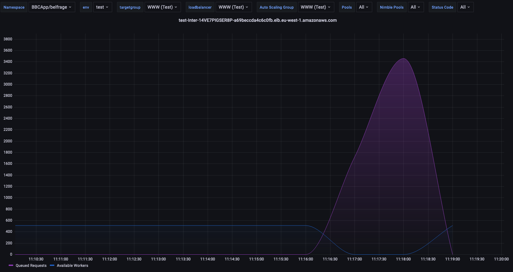
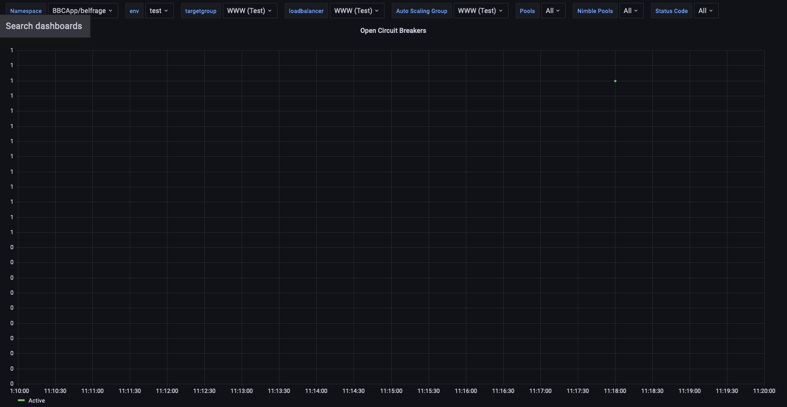
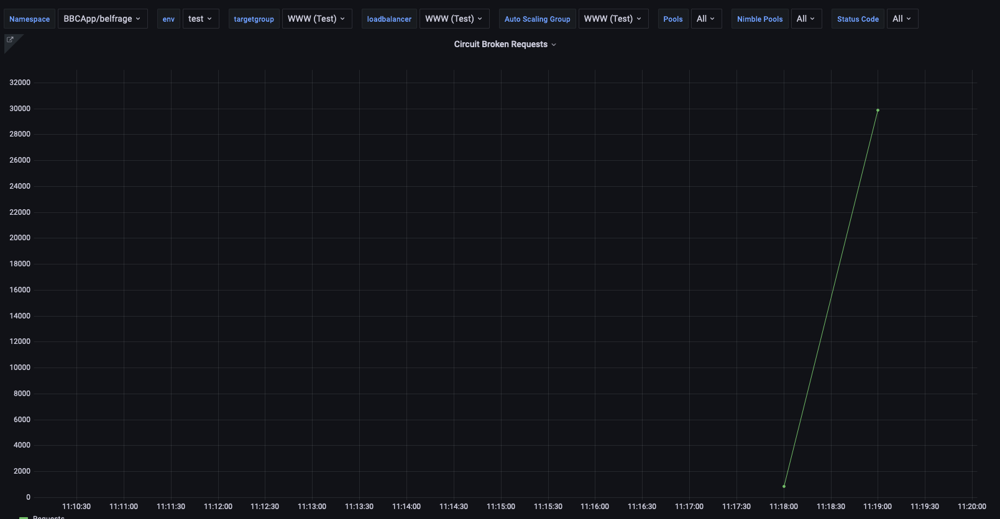
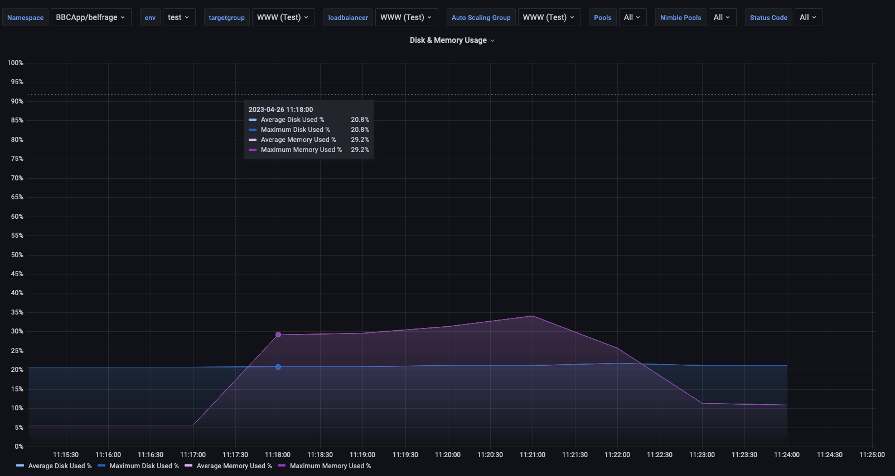
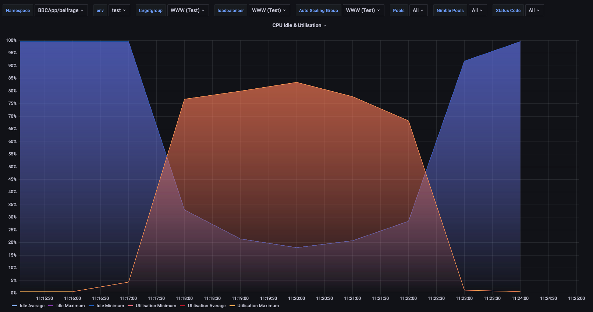
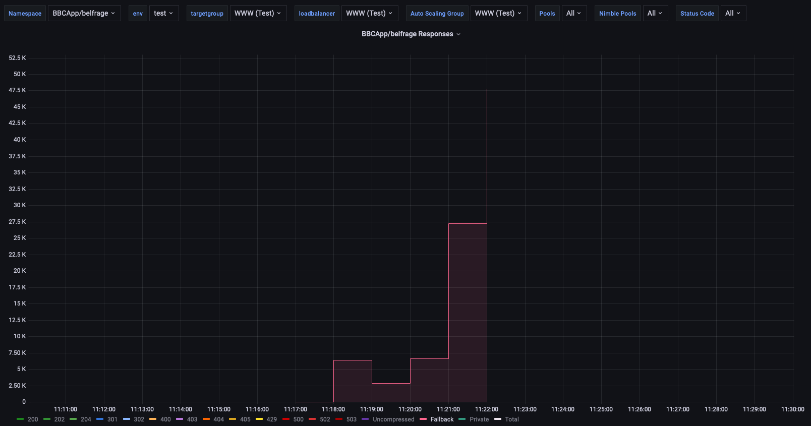
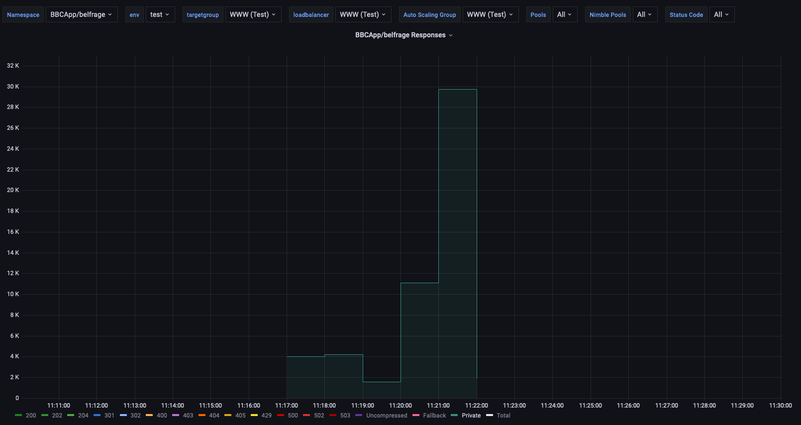
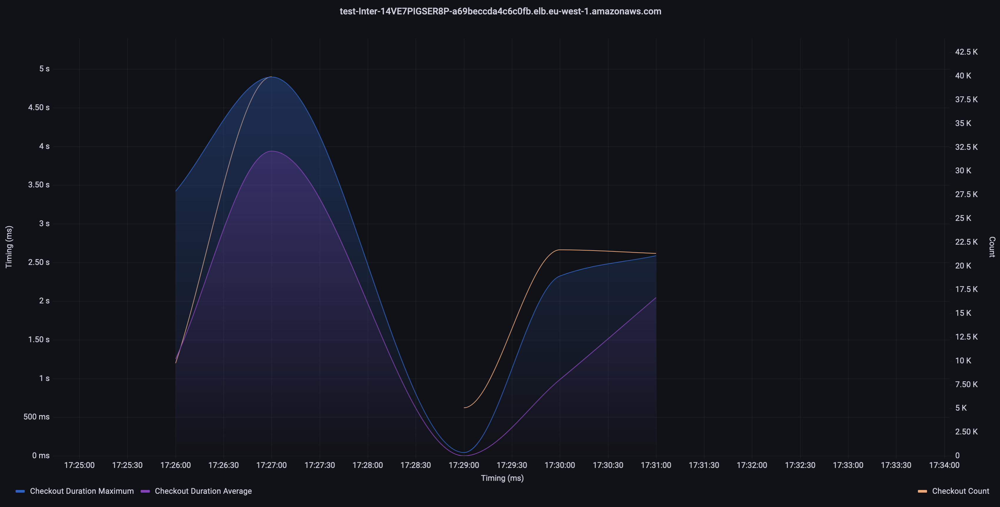

# Load Test April 2023

- 26.06.2023
- Belfrage (www) test using origin simulator
- Vegeta Runner

## Load Test Setup

### Loadtest Config

Instance Type: c5.9xlarge

### Belfrage Config

- Instance Type: c5.2xlarge
- Scaling limited to 1 instance
- Branch: master 
- Commit Hash: `6263bd1`

### Setup

| Duration | RPS  | Timeout |
|----------|------|---------|
| 300      | 1000 | 30      |

#### Command

```
date && echo "GET https://www.belfrage.test.api.bbc.co.uk/foobar" | vegeta attack -header="replayed-traffic:true" -header "accept-encoding:gzip" -duration=300s -rate=1000 -http2=false -max-body=0 -timeout=30s | tee vegeta_results.bin | vegeta report &> report.log
```

#### Origin Simulator Recipe

```
[
  {
    "stages": [
      {
        "status": 200,
        "latency": "1s",
        "at": 0
      }
    ],
    "route": "/*",
    "random_content": null,
    "origin": null,
    "headers": {
      "content-encoding": "gzip",
      "cache-control": "private, max-age=0"
    },
    "body": "<!doctype html>\n<html lang=\"en\">\n  <head>\n    <meta charset=\"utf-8\">\n    <meta name=\"viewport\" content=\"width=device-width, initial-scale=1\">\n    <link rel=\"stylesheet\" href=\"https://unpkg.com/@picocss/pico@1.*/css/pico.classless.min.css\">\n    <title>BBC Origin Simulator - Default Content</title>\n  </head>\n  <body>\n    <main>\n      <header>\n        <hgroup>\n          <h1>BBC Origin Simulator</h1>\n          <h2>A tool to simulate a (flaky) upstream origin during load and stress tests.</h2>\n        </hgroup>\n      </header>\n      <hr/>\n      <h5>Welcome!</h5>\n      <p>This is the default content, just to get you started. <mark>You should create and add your own recipe!</mark></p>\n      <p>Here's a basic example, once loaded, it fetches the BBC News front page, stores it in a cache and serves it continuosly with a simulated latency of 100 milliseconds.</p>\n        <pre>\n          <code>\n            {\n              \"origin\": \"https://www.bbc.co.uk/news\",\n              \"headers\": {\n                 \"cache-control\": \"public, max-age=30\",\n                 \"content-encoding\": \"gzip\"\n              },\n              \"stages\": [{\"at\": 0, \"status\": 200, \"latency\": \"100ms\"}]\n            }</code>\n        </pre>\n      <p>You can read more about Origin Simulator <a href=\"https://github.com/bbc/origin_simulator\">here</a>, but to quickly start adding a recipe run:\n        <pre><code>curl -X POST -d @my_recipe.json http://my.origin-simulator.xyz/_admin/add_recipe</code></pre>\n      </p>\n      <p>\n        To see the current recipe use:\n        <pre><code>curl http://my.origin-simulator.xyz/_admin/current_recipe</code></pre>\n      </p>\n      <p>Happy testing!</p>\n    </main>\n  </body>\n</html>\n"
  }
]
```

## Result Report
```
Requests      [total, rate, throughput]  300000, 1000.00, 471.79
Duration      [total, attack, wait]      5m0.014823466s, 4m59.999041192s, 15.782274ms
Latencies     [mean, 50, 95, 99, max]    12.044528679s, 5.979561399s, 30.000129779s, 30.03528345s, 32.019939264s
Bytes In      [total, mean]              0, 0.00
Bytes Out     [total, mean]              0, 0.00
Success       [ratio]                    47.18%
Status Codes  [code:count]               0:120816  200:141544  500:37640
```

## Belfrage metrics and analysis

The main objective of this loadtest was to confirm the following sequence of events.

1. A high number of requests is sent to an origin, each of which taking a long time (>= 1s).
2. The worker pool processing those requests gets drained.
3. Circuit Breaker triggers, stopping any request to that origin.

We confirmed the spike in requests:




Which drained the worker pool:



After the worker pool gets drained, the circuit breaker triggered at 11:18





Memory and CPU behaved like so:





At one point, we started serving fallbacks as well:





Finally, it is worth mentioning that there is a discrepancy in the worker timeout_limit, which is set to 5s, and the actual maximum checkout duration, closer to 8.3s. A ticket has been created to analyse this further.


Another load test was run, with the the `pool_timeout` set to 2 seconds and the `:caching_enabled` set to `false` for the `ProxyPass` RouteSpec.
The diff for the above is [here](https://github.com/bbc/belfrage/compare/6263bd1db...3cde7422f).

We observed reduced latencies and pool checkout durations:
```
date && echo "GET https://www.belfrage.test.api.bbc.co.uk/foobar" | vegeta attack -header="replayed-traffic:true" -header "accept-encoding:gzip" -duration=300s -rate=1000 -http2=false -max-body=0 timeout=30s
Wed 26 Apr 16:26:44 UTC 2023

Requests      [total, rate, throughput]  300000, 1000.00, 157.63
Duration      [total, attack, wait]      5m14.316103893s, 4m59.999045028s, 14.317058865s
Latencies     [mean, 50, 95, 99, max]    1.401948639s, 2.678678ms, 6.439684543s, 10.077972525s, 30.003895362s
Bytes In      [total, mean]              0, 0.00
Bytes Out     [total, mean]              0, 0.00
Success       [ratio]                    16.52%
Status Codes  [code:count]               0:1407  200:49546  500:249047
```


