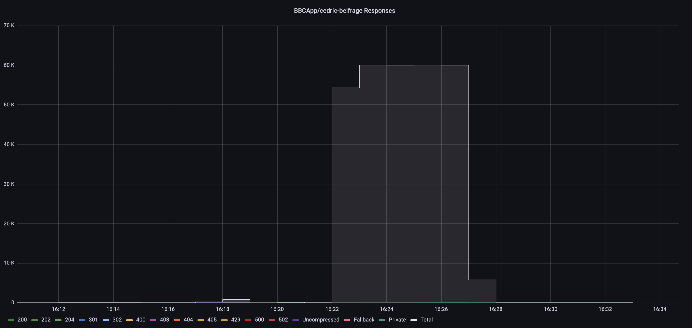
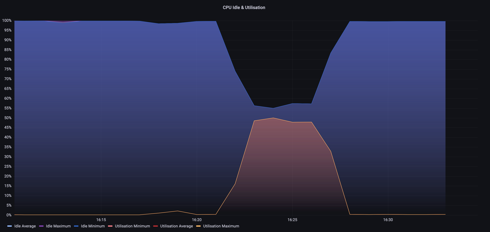
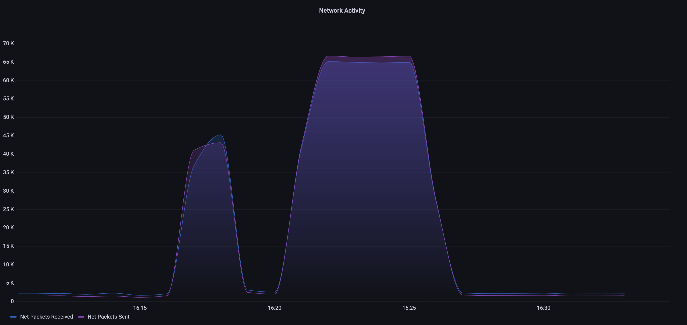
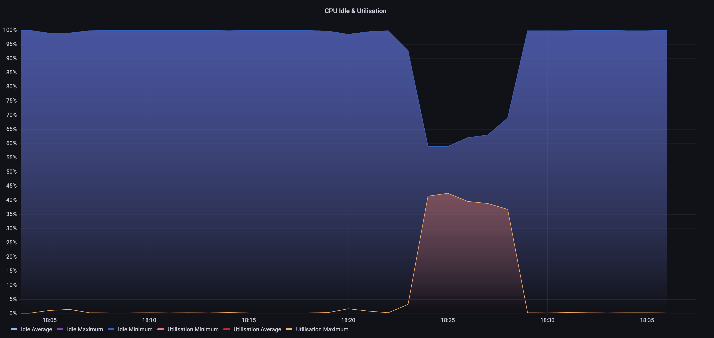
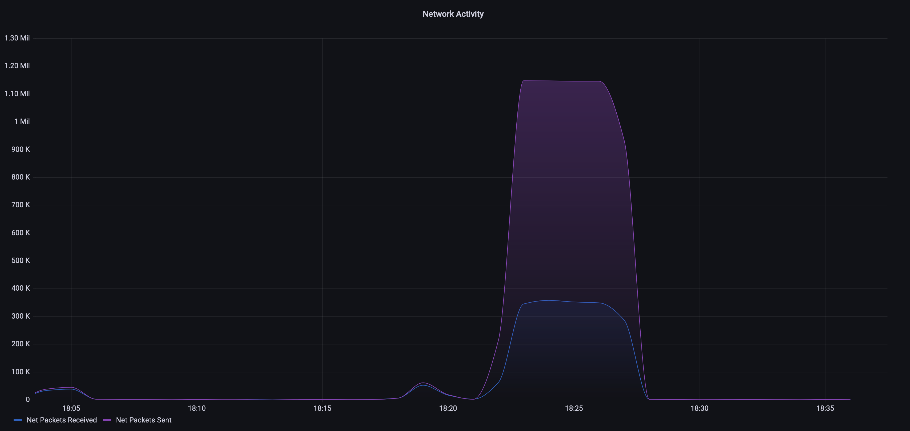
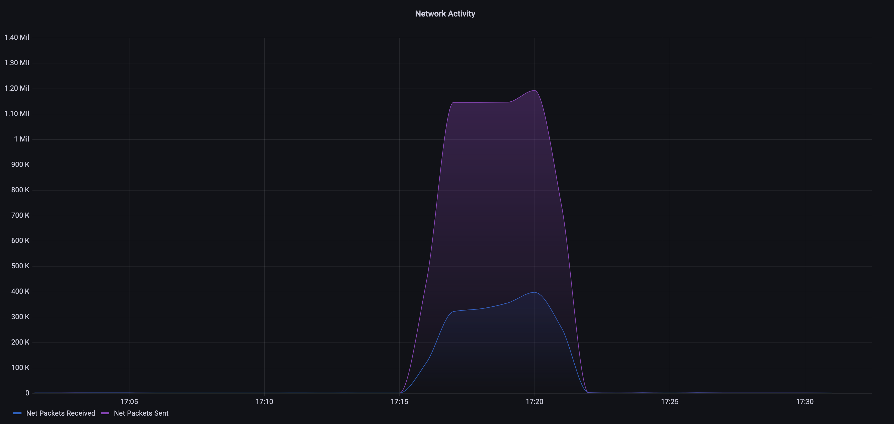

# Load tests for ETag Support on the RouteSpec level

## Revision `f5757f82aa51c8dbb335904e30ab25c0d60ae362` (Feature branch)

### With Matching Etag

**Origin Simulator Recipe**
```
[
  {
    "stages": [
      {
        "status": 200,
        "latency": "0ms",
        "at": 0
      }
    ],
    "route": "/*",
    "random_content": "200kb",
    "origin": null,
    "headers": {
      "content-encoding": "gzip",
      "cache-control": "public, max-age=60"
    },
    "body": null
  }
]
```

**RouteSpec**
```
defmodule Routes.Specs.NewsLocalNews do
  def specs do
    %{
      owner: "DENewsCardiff@bbc.co.uk",
      runbook: "https://confluence.dev.bbc.co.uk/display/news/Location+topic+page+run+book",
      platform: MozartNews,
      headers_allowlist: ["if-none-match"],
      put_etag: true
    }
  end
end
```

**Load test**
```
$ date && echo "GET https://cedric.belfrage.test.api.bbc.co.uk/news/localnews" | vegeta attack -header="replayed-traffic: true" -header='if-none-match:"218312E01BF65A5C0187E504CD529372C826ED8C"' -header="accept-encoding:gzip" -duration=300s -rate=1000 -http2=false -max-body=0 | vegeta report
Tue 19 Jul 15:22:04 UTC 2022
Requests      [total, rate, throughput]  300000, 1000.00, 1000.00
Duration      [total, attack, wait]      5m0.001484495s, 4m59.998989611s, 2.494884ms
Latencies     [mean, 50, 95, 99, max]    2.967051ms, 2.911202ms, 3.860448ms, 4.728578ms, 206.24449ms
Bytes In      [total, mean]              0, 0.00
Bytes Out     [total, mean]              0, 0.00
Success       [ratio]                    100.00%
Status Codes  [code:count]               304:300000
Error Set
```

**Results**

Responses


CPU


Network



### Without Matching Etag

**Origin Simulator Recipe**
```
[
  {
    "stages": [
      {
        "status": 200,
        "latency": "0ms",
        "at": 0
      }
    ],
    "route": "/*",
    "random_content": "200kb",
    "origin": null,
    "headers": {
      "content-encoding": "gzip",
      "cache-control": "public, max-age=60"
    },
    "body": null
  }
]
```

**RouteSpec**
```
defmodule Routes.Specs.NewsLocalNews do
  def specs do
    %{
      owner: "DENewsCardiff@bbc.co.uk",
      runbook: "https://confluence.dev.bbc.co.uk/display/news/Location+topic+page+run+book",
      platform: MozartNews,
      headers_allowlist: ["if-none-match"],
      put_etag: true
    }
  end
end
```

**Load test**
```
$ date && echo "GET https://cedric.belfrage.test.api.bbc.co.uk/news/localnews" | vegeta attack -header="replayed-traffic: true" -header="accept-encoding:gzip" -duration=300s -rate=1000 -http2=false -max-body=0 | vegeta report
Tue 19 Jul 16:17:16 UTC 2022
Requests      [total, rate, throughput]  300000, 1000.00, 999.98
Duration      [total, attack, wait]      5m0.004805661s, 4m59.998990911s, 5.81475ms
Latencies     [mean, 50, 95, 99, max]    5.906868ms, 5.69637ms, 7.138872ms, 8.453579ms, 612.419632ms
Bytes In      [total, mean]              0, 0.00
Bytes Out     [total, mean]              0, 0.00
Success       [ratio]                    100.00%
Status Codes  [code:count]               200:300000
Error Set

```

**Results**

Responses


CPU


Network


## Revision `4ecd776e41a27384ea95e0bd39386bfe4c73b6c0` (Main branch)


**Origin Simulator Recipe**
```
[
  {
    "stages": [
      {
        "status": 200,
        "latency": "0ms",
        "at": 0
      }
    ],
    "route": "/*",
    "random_content": "200kb",
    "origin": null,
    "headers": {
      "content-encoding": "gzip",
      "cache-control": "public, max-age=60"
    },
    "body": null
  }
]
```

**RouteSpec**
```
defmodule Routes.Specs.NewsLocalNews do
  def specs do
    %{
      owner: "DENewsCardiff@bbc.co.uk",
      runbook: "https://confluence.dev.bbc.co.uk/display/news/Location+topic+page+run+book",
      platform: MozartNews
    }
  end
end
```

**Load test**
```
$ date && echo "GET https://cedric.belfrage.test.api.bbc.co.uk/news/localnews" | vegeta attack -header="replayed-traffic: true" -header="accept-encoding:gzip" -duration=300s -rate=1000 -http2=false -max-body=0 | vegeta report
Tue 19 Jul 17:23:44 UTC 2022
Requests      [total, rate, throughput]  300000, 1000.00, 999.99
Duration      [total, attack, wait]      5m0.003993532s, 4m59.998994451s, 4.999081ms
Latencies     [mean, 50, 95, 99, max]    5.584065ms, 5.290352ms, 6.589691ms, 7.664461ms, 609.29969ms
Bytes In      [total, mean]              0, 0.00
Bytes Out     [total, mean]              0, 0.00
Success       [ratio]                    100.00%
Status Codes  [code:count]               200:300000
Error Set:
```

**Results**

Responses


CPU


Network


## Discussion

The most significant difference observed was in the metric for network packets sent.

Compared to the main branch, network packets sent did not differ significantly when the "if-none-match" header value did not match the generated ETag.

Also, compared to the main branch, network packets sent reduced significantly when the "if-none-match" header value matched the generated ETag.

**Network Packets Sent**

Control (Main Branch)


Without Matching Etags (Feature branch)


With Matching Etags (Feature branch)

