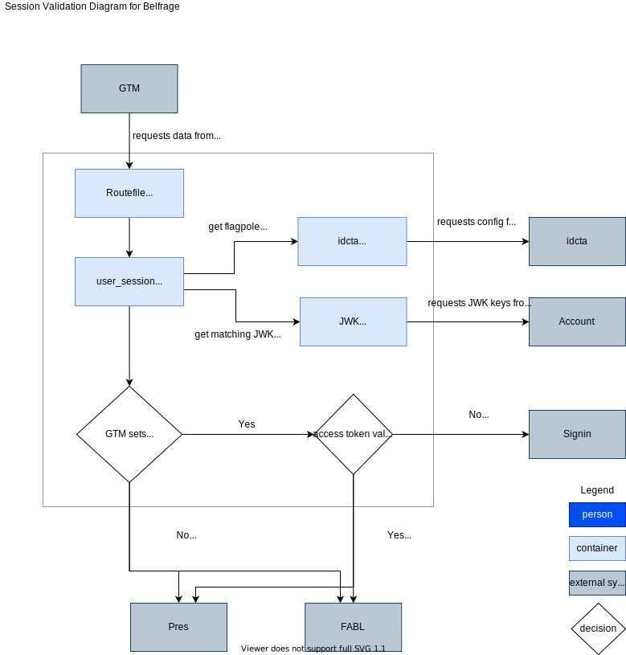

# Personalisation

Belfrage supports requests for personalised content.

## What is personalised content in Belfrage

Belfrage is a layer in the WebCore platform and provides an important piece in the personalisation journey. Much like in other areas it will serve as the gatekeeper to the other layers ensuring resiliency and efficiency.

In the context of Belfrage, personalisation is the existence of a BBC account token in the form of a cookie.

## Component Overview



[Diagram source](source/session-validation.drawio)

## Enabling personalisation

In order to enable personalisation in WebCore Belfrage performs several tasks

* check if the route is personalisable: personalisation is currently restricted to a specific route on test and limited to 2 users (IDs)
* check the account IDCTA flagpole and a Cosmos dial that switch personalisation on or off entirely on Belfrage
* check the GTM `X-ID-OIDC-SIGNEDIN` header for user authentication status
* get the user's access token (`ckns_atkn`)
* verify that the access token was signed by the BBC

Then, if the user is authenticated and the token is correct, the token is sent in the request to the downstream layer, Pres or FABL.

The following headers are set

```
authorization: Bearer [ckns_atkn]
x-authentication-provider: idv5
```

Belfrage only supports v5 of the BBC Account.

## IDCTA flagpole

A periodic request is made to he IDCTA config which contains the BBC ID flagpole status. Belfrage looks for the `id-availability` key for the values `GREEN` or `RED` applying the fallback of `GREEN` should there be an issue retrieving the config.

The config is retrieved from the API at https://idcta.api.bbc.co.uk/idcta/config every 10 seconds currently and stored in-memory. The config flagpole state is available for continuous polling by other personalisation components, i.e. the user session transformer.

## Verify user access tokens

You may be aware of the [BBC API Management](https://github.com/bbc/api-management/wiki) tools that already exist and wonder what we may be doing differently. Our solution is based closely on a subset of that package and we work with the team there to enable the required features in Belfrage.

In order to check the user's access token the payload can be inspected to ensure it has the correct issuer and audience values. The check for the token name is also performed as only one type of token is currently supported.

The following claims are validated

* iss = https://access.api.bbc.com/bbcidv5/oauth2
* aud = Account
* tokenName = access_token

The token is also verified as well as validated. To verify a token Belfrage uses the BBC Account key to ensure that the token was signed by the BBC. For performance reasons Belfrage keeps the available account keys in memory with a GenServer process periodically running in the background to refresh the list.

Each user is token is signed using a specific key. The header of the users access token (`ckns_atkn`) specifies which key was used to sign it

* kid
* alg

Belfage uses both these values to ensure a unique key is returned from the list (there may be multiple keys with the same `kid`).

## BBC Account Keys

The Account keys are provided by the BBC Account team (see [C4](docs/architecture.md#level-2-container-diagrams)) for further details. Upon deployment of Belfrage the keys are fetched and stored in memory. They are then periodically fetched to ensure they remain up to date.

Should there be an issue fetching the keys the existing set in memory will simply be used until the next refresh period. Should there be an issue on deployment a fallback set will be used. The fallback set is the list of keys fetched and then hard baked during the creation of the release archive.

The keys returned are of the [JWK format](https://tools.ietf.org/html/rfc7517).

The endpoint to fetch the keys is https://access.api.bbc.com/v1/oauth/connect/jwk_uri and this is currently fetched every hour (check the GenServer module in case this changes).

The JWK_URI requires the relevant BBC Authentication so Belfrage makes the request using the Client certificates provided by Cosmos.

### Handling key revokation

If the Account JWK keys are revoked there will be a period of time, until the next fetch is performed, where Belfrage is unable to successfully verify newly signed in users.

A manual process exists where the keys can be updated manually on each instance should this be required.

## Handling invalid tokens

If a user requests a route that is personalisable and has a token that is invalid or expired, they are redirected to the BBC Account URL https://session.bbc.co.uk/session. Belfrage adds the `ptrt` (the page to return to) which lets the Account signing page know to redirect users back ot the Belfrage route they requested.

If a user does not have an Identity token (ckns_id) and they are on a personalised route then no current action is taken.

## Caching

Personalised content is not cached in Belfrage. If the downstream returns a private cache control header, which would be the case when the content is personalised, the content will not be cached by Belfrage.

If a route is personalisable but for whatever reason the downstream returns a public cache control header, the content will then follow the normal caching process. This may be in cases where there was an error getting the personalised content. The error response will also trigger Belfrage fallback mechanism for a non-personalised fallback or an error response if non-personalised fallback is not available in caches.
