# PoolBoy Loadtests

## The Problem

Belfrage has a 5 second request timeout, however in some loadtests response times were 10 - 11 seconds, only the very slowest ones.

```
Latencies     [mean, 50, 95, 99, max]    59.289158ms, 2.954208ms, 4.70963ms, 24.93016153s, 10.112362334s 
```

Meaning that something was happening in Belfrage for 5 seconds. The goal of this investigation is to find out why this is happening and how to solve it.

We're looking in Poolboy because it manages HTTP connections to downstream services in Belfrage.

## Replicating the Issue

I managed to replicate the issue using this configuration of instances.

```
loadtest-instance -> belfrage-playground -> origin_simulator
```
The loadtest instance was configured for 180rps for 60 seconds using the vegeta loadtest tool.

The origin_simulator was configured to give a response in 5s with the news frontpage.

### First Load test

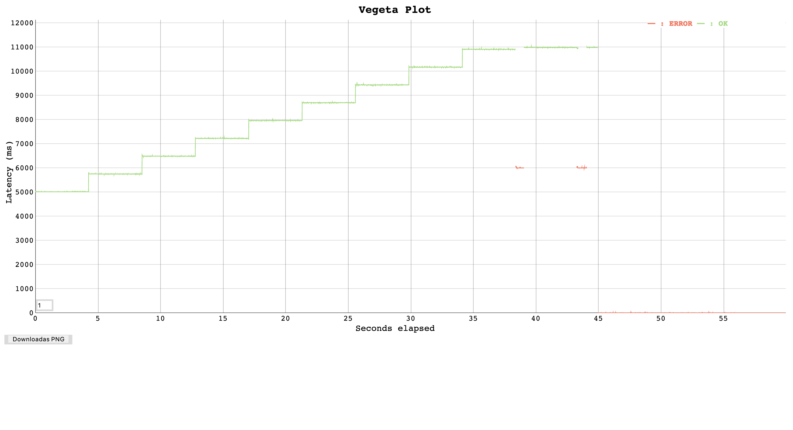

### Reproduced

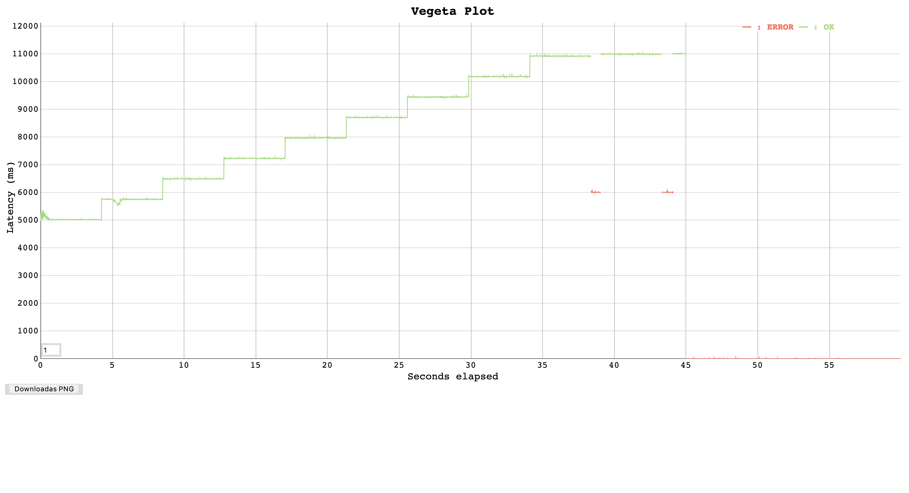

As you can see these two graphs bear a striking resemblance to eachother.

Both

- Hit a limit at 11s latency
- go up by 714ms latency each step
- each step takes roughly 4.3 seconds

## Varying by Requests per Second

To see when this behaviour appears a series of tests were done at different RPS (Requests per Second)

### 160 RPS

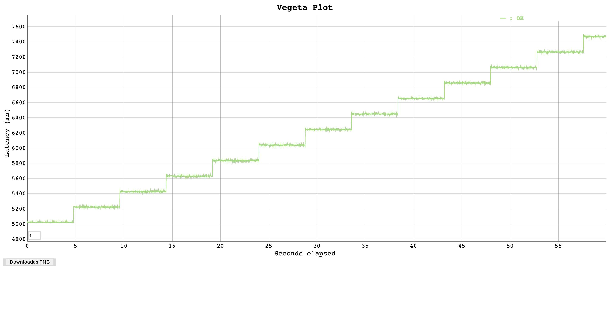

### 180 RPS


### 300 RPS

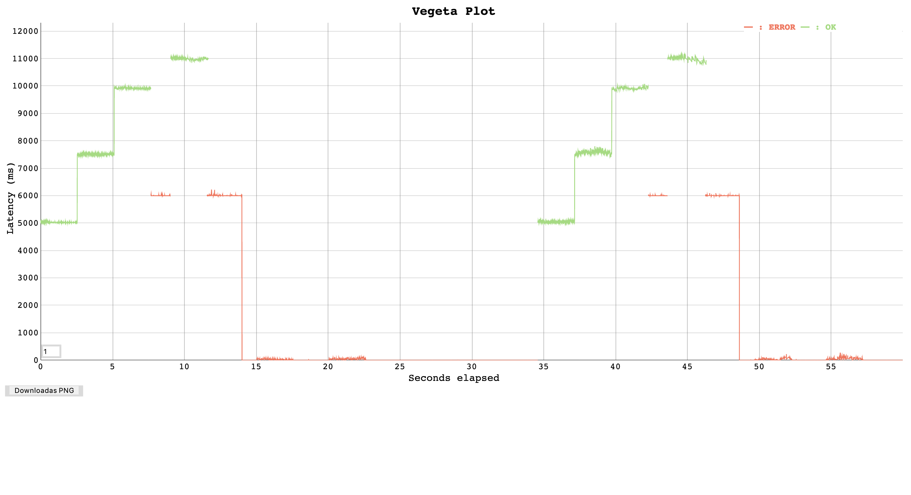

As you can see this pattern appears again, but higher the RPS the larger the steps are!

Comparison of Latency increase for each step:

| Test (RPS)  | latency increase (ms) | step length (s) |
|------------ | --------------------- | --------------- |
|160          | 200                   | 4.8             |
|180          | 714                   | 4.3             |
|300          | 2500                  | 2.5             |

Unsurprisingly this shows that as RPS increases the latency increases. Although we would need more data to find the exact trend.

The thing these graphs have in common is the 11000ms timeout, why it decides to timeout at that level doesn't seem clear, yet.

However there is a clear theory as to what is causing the steps. The poolboy has a pool size of 512 workers and a pool overflow size of 256. Combined that's 768 workers. If you multiply the RPS by the time a step takes that is what you approximately get:

```
160 * 4.8 = 768
180 * 4.3 = 774
300 * 2.5 = 750
```

This can't be a coincidence so the increase in latency is probably caused by the pool reaching its limit of workers.

## Varying by Latency

How slow do responses need to get before they show this behaviour?
And with a faster response can we still show the same behaviour?

### 5s latency at 180RPS


### 3s latency at 180RPS
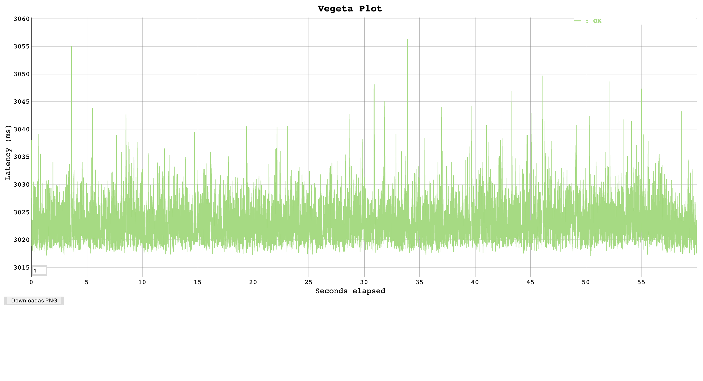


Here you can see a drastic difference, it looks like that if the pool size is large enough (overflow included) there are no extreme response times.

I think the maths behind the theory while not a proof does provide some reasoning:

```
180rps * 5s latency = 900 workers required
180rps * 3s latency = 540 workers required
```

We have 768 workers currently so if I increase the pool to say 1024 (512 pool size and 512 overflow) then I should be able to produce a graph similar to 3s at 180rps, at 180rps 5s latency.

### 5s latency at 180rps (512 pool size, 512 overflow workers)

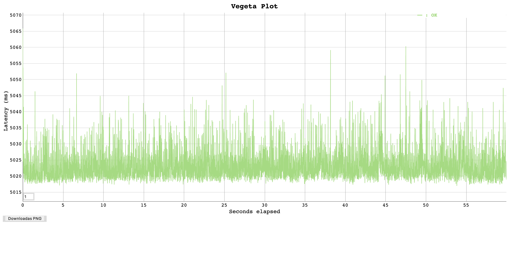

This supports my hypothesis, as you can see the graphs seem to show similar pattens with a very small spread of latencies. This shows the cause of the steps in the graphs is most likely due these slow latencies and the pool filling up.

## Poolboy Pools
One thing we know very little about in all of this is how many workers are available and being used at any given time? We don't know the characteristics of poolboy pools, or more specifically how are the overflow workers allocated?

Another thing we may want to consider is the elasticity of the pool. How quickly can it stretch to accommodate load, and is this fixed or does it scale with rps?

All these tests are run with 512 pool size with 256 pool overflow.

### 100 RPS

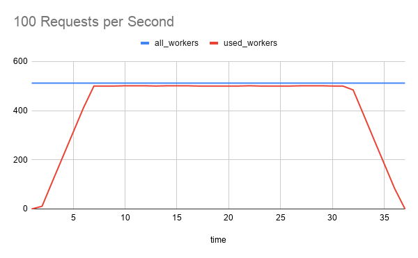

This is more of a control you can see that in this test not all of the pool workers are used, so the overflow is never used. You can also see that while the load test only lasts for 30 seconds the workers take a little longer to fall back to 0.

### 150 RPS

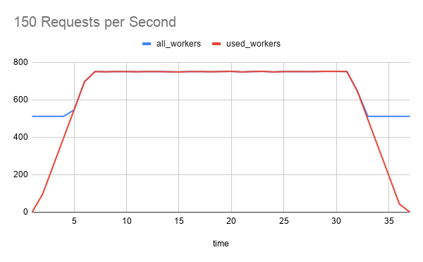

Here you can see the load test starting to flex the pool. What we can see here is that the pool overflow is assigned dynamically, its not as if as soon as the pool worker limit of 512 is reached it creates 256 new workers. It seems to assign them as and when they are needed. Although it may look like it, it doesn't reach the hard limit of workers 768 (512 workers + 256 overflow workers). The pool seems to reach an equilibrium.

### 200 RPS


Here its clear that the gradient of the used_workers line is getting steeper this mean the rate of worker creation seems to scale depending on the rps.

### 250 RPS

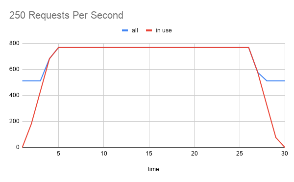

Here we can most clearly see that which happens in other graphs but is less clear. It seems like the pool anticipates increase load when reaching a limit by creating new overflow workers slightly before they are needed. It also leaves them for a while before killing the excess worker

### 300 RPS

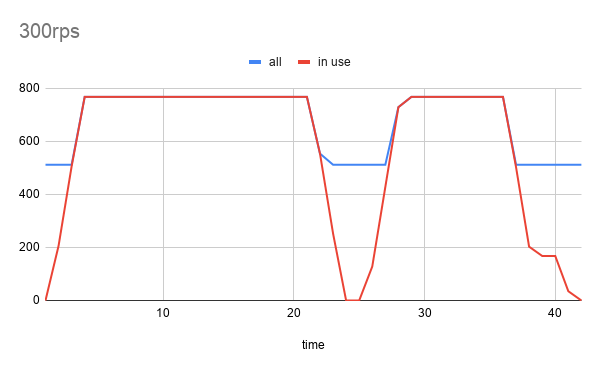

This graph looks strange, but I don't think this has anything to do with the pools I think here Belfrage restarts itself as it can't handle all of the slow requests its receiving.

### Rate of worker assignment

Using the same data from the previous graphs we can look at if the rps effects the rate of assignment and if so what is the relationship between the two.

| Requests per Second | Peak Workers | Time till Peak | workers per second |
| ------------------- | ------------ | -------------- | ------------------ |
| 100                 | 500          | 8              | 62.5               |
| 150                 | 750          | 7              | 107.1              |
| 200                 | 768          | 6              | 128                |
| 250                 | 768          | 5              | 155.6              |
| 300                 | 768          | 4              | 192                |

If we plot this on a graph of workers per second / requests per second:

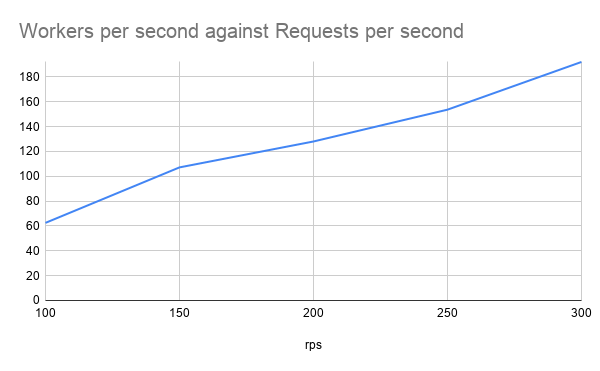

The relationship shown here looks linear as you would expect. Using this we can get the workers per request when the latency is 5s. Which means its possible to predict the workers needed given the rps and latency.


| Requests per Second | workers per second | workers per request |
| ------------------- | ------------------ | ------------------- |
| 100                 | 62.5               | 0.625               |
| 150                 | 107.1              | 0.714               |
| 200                 | 128                | 0.63                |
| 250                 | 155.6              | 0.614               |
| 300                 | 192                | 0.64                |
|                     | Average            | 0.647               |

Maybe an easier way to think of this is 1.55 request per worker the reciprocal of 0.647. But what does that mean, well it means that for each worker that is made by the pool approximately 1.5 requests are made. This is the constant that decides the scaling of the pool when the latency is 5s. If we find out how this figure changes per latency (i.e. request per workers per latency) It would be possible to predict the amount of workers needed for any rps and latency. Is this particular data useful? It remains to be seen!


## Poolboy Timeout

Poolboy timeout it a little ambiguous in what it could mean but having dug into the source code of poolboy I can confirm its **the amount of time to take a worker out of the pool** to use. This explains the 11s time out as the poolboy timeout is 6s and the http timeout is 5 seconds, meaning that in a worst case it could take 11s to get a response from a slow response and a saturated pool.

To make things more clear:

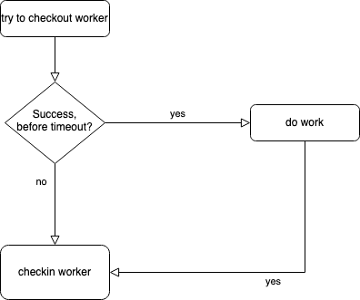

Its in the 'do work' that the http request and waits for a response there.

### Testing

I decided to run a load test of 250rps for 30 seconds with 5s latency while changing the pool timeout to see how it would effect performance.

### 6 second poolboy timeout (current timeout)

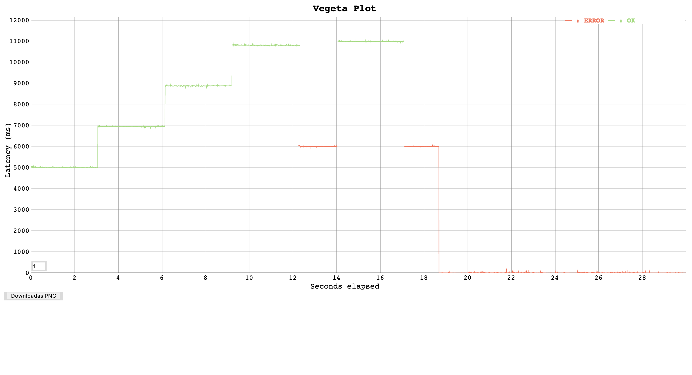

We can see here that the familiar 11000ms peak before it starts returning 500s.

### 3 second poolboy timeout


Notice how neither length of the steps nor the size of the step changes only the upper limit of latency allowed changes. Also notice that ceiling here is hit at 8000ms peak. This supports the assertion that the limit is set by poolboy timeout + request timeout. This graph is a perfect example of this. But why is that?


## Conclusion 

After analysing all the data I believe this is what's happening (the data is from the graph above):

- Each step takes 3 seconds
- Rate of requests is 250 rps
- That means 750ish requests in those 3 seconds, equal ish to the number of workers
- In the first step none of the workers are is use so the poolboy checkout time is 0s
- But remember **each request takes 5s** and the **pool has become saturated in 3**
- **There is a two second deficit** , now every request has to wait 2 seconds to get the worker and 5s to complete the request meaning the overall latency will be 7s
- this latency doesn't go away but is build upon.

This diagram explains it clearly:

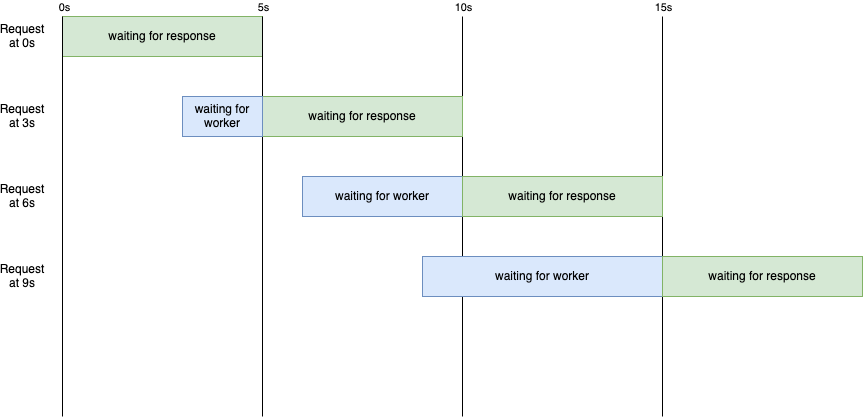
