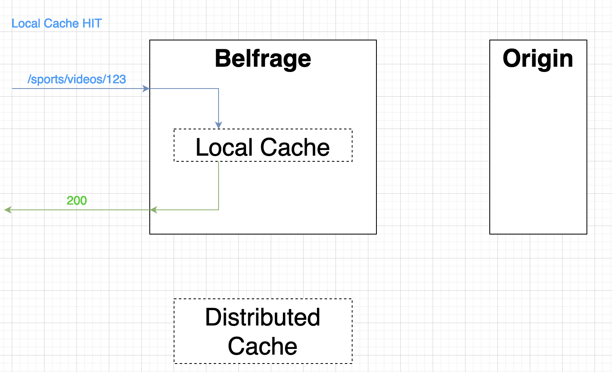
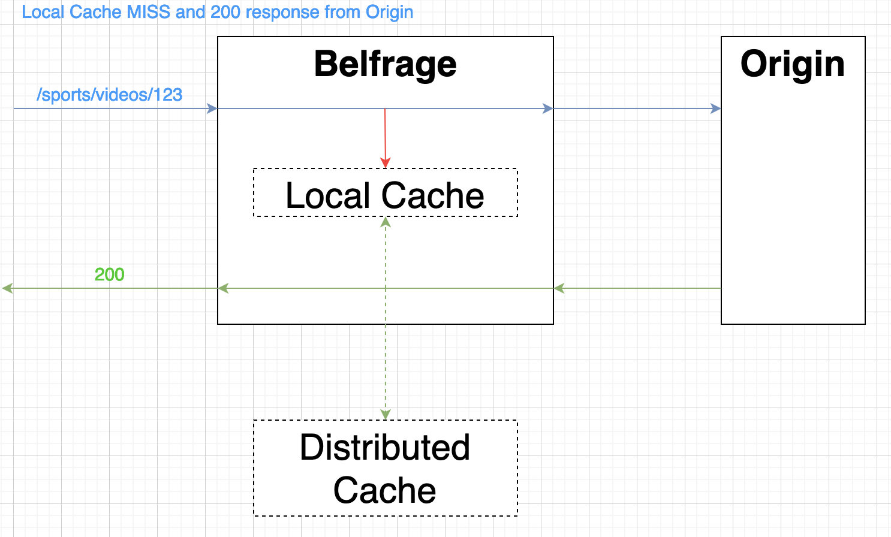
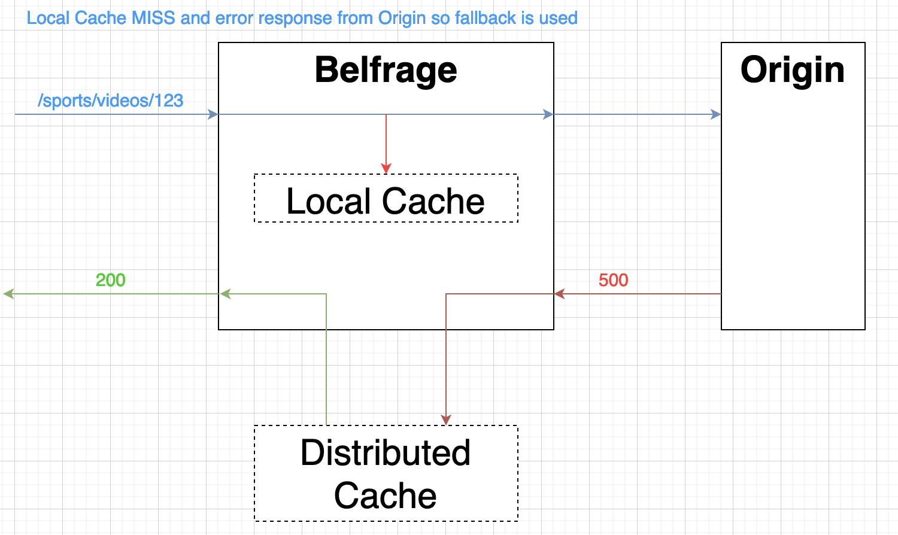
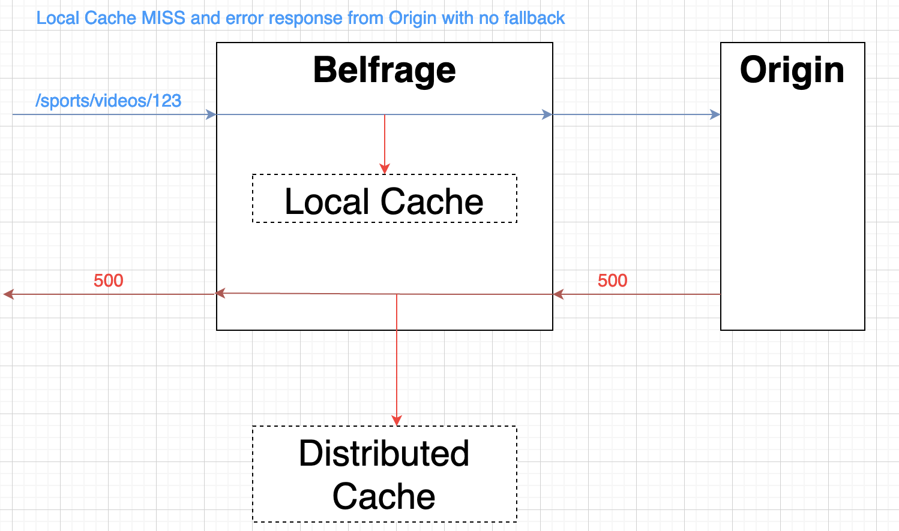

# Caching

## Design
Belfrage offers an optional caching layer. Caching in Belfrage means storing pages in a way that future requests for that page can have quicker access to it. Routes using these features can rely on faster response times, less load on the origin(s) and the peace of mind of fallback content in case of temporary faults. A route can disable caching by using the key `caching_enabled: false` in it's routespec.

When we receive a request the first action Belfrage takes is to look for cached content in the local cache. The cached content will be returned if found and `fresh`. If not, a request to the origin(s) is then made.

If the response from the origin(s) has an error status code the fallback mechanism kicks in.

## Request Hash
Items in the cache are stored against a request hash which depends on a set of signature keys defined here: [lib/belfrage/request_hash.ex](../../lib/belfrage/request_hash.ex), this means two structs must have the same signature keys for them to match. The signature keys list include path, host and query params. These keys can be added to and skipped using the `signature_keys` map in the private of the struct.

The request hash is generated using the Crimpex library. 

## Caching tiers
Belfrage will provide two cascading caching layers:
### Tier 1 - Local Cache
A per-node in-memory LRU cache with no network involved and almost no latency. The size of the per-node cache is dependant on the memory capacity of the server. 

We use a library `Cachex` for our local cache, see more [lib/belfrage/cache/local.ex](../../lib/belfrage/cache/local.ex)

NOTE: future iterations could implement smarter ways to determine which content has more chances to get a hit or requires continuous presence in the in-memory cache.

### Tier 2 - Distributed cache
A slower and longer-term cache on Amazon S3. 

We have a seperate application [Belfrage-ccp](https://github.com/bbc/belfrage-ccp) where Belfrage sends responses from origins and which stores them on S3. Fetching pages is done by requesting straight from S3 within Belfrage.

## Fallback Mechanism
If Belfrage is unable to find fresh cached content it will then make request(s) to origin(s) to get a response. 

Belfrage will then try to store this response in cache depending on a few factors such as if caching is enabled for that request. Finally, if the response is an error (for the purpose of serving a fallback, it has to have a status code >=400 and not 404, 401 or 451) and caching is enabled, we attempt to find any cached response (fresh or stale) and serve it as a fallback. If we got the cached response from S3, we add it to the local cache so that on the following request to the same page we could find the fallback quicker.

Fallback TTL is currently configured as 7 days, which can be found in `"ExpirationInDays"` under `"LifecycleConfiguration"` defined within the [cloud formation](https://github.com/bbc/frameworks-infra/blob/master/belfrage/belfrage-ccp/stacks/s3bucket.json) for our S3 caching bucket.

## Personalisation
Personalised pages will not be able to use the cache feature. The fallback option will still be available. When a personalised route is requested the cache directive is set to private so the personalised response is not stored in cache; however, when a personalised request fails, we can return a non-personalised version in the form of a fallback.

## Vary Header
The [Vary Header](../../lib/belfrage_web/response_headers/vary.ex) is a header which Belfrage adds when sending the response downstream to services such as GTM. It contains a list of request headers that downstream services should use to vary their caches, which means that the current response should only be used as a cached response for requests with the same values of the headers included in the value of the `Vary` header. This is how Belfrage effectively instructs downstream services on how to cache the response. Various headers are included in the value of the `Vary` header, many of which are set by GTM itself (i.e. are internal headers). 

## Metrics
Belfrage records metrics for each type of cache result. You will be able to see these on the Grafana Dashboards.

These are the metrics we record and when we record them:
- Local fresh hit: When an item is found in local cache and the time elapsed since stored is less than the max-age.
- Local stale hit: When an item is found in local cache and the time elapsed since stored is greater than the max-age.
- Local cache miss: When an item is not found in local cache.
- Distributed fresh hit: At present, this metric count will not increment as we do not check the age of responses in the distributed cache.
- Distributed stale hit: When a item is found in the distributed cache.
- Distributed cache miss: When an item is not found in the distributed cache (S3).

## Cache Diagrams

### Local Cache HIT

### No Local Cache Hit, Request To Origin

### Fallback

### No Cache Hits

