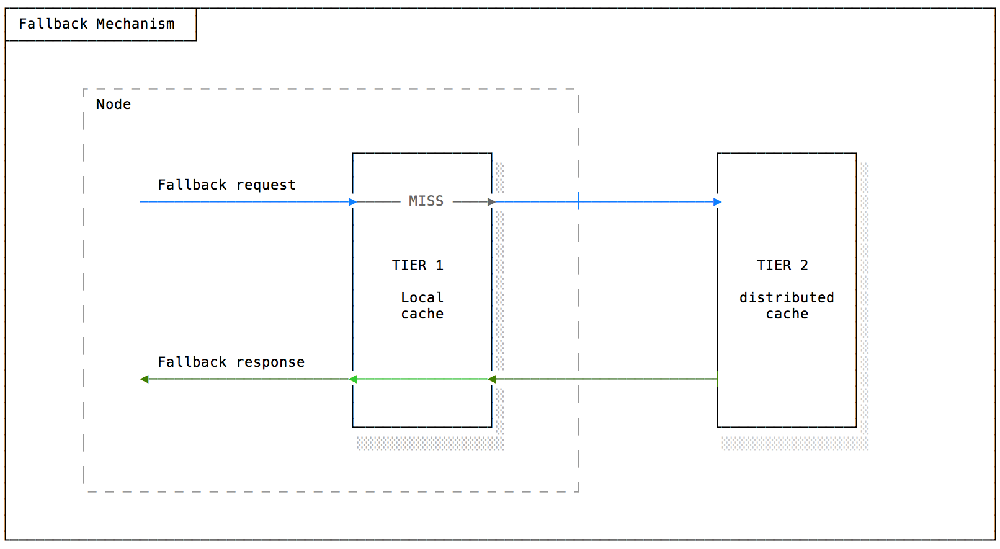
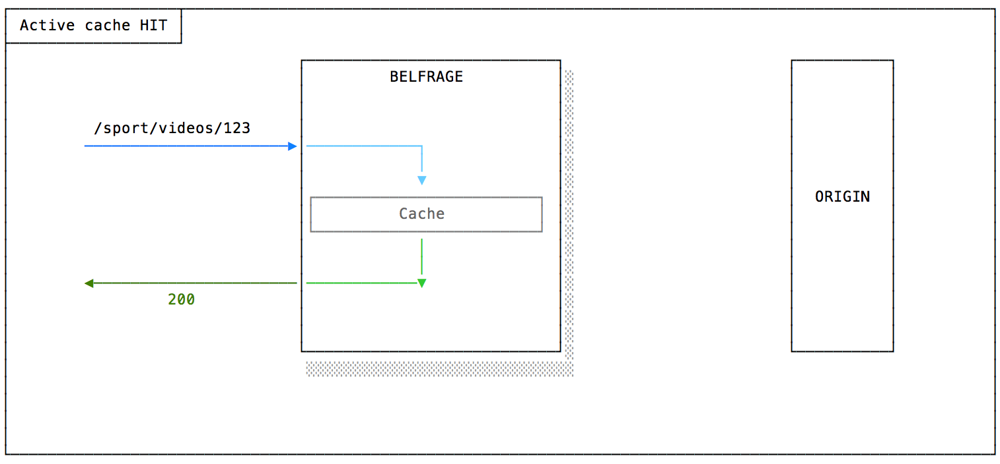
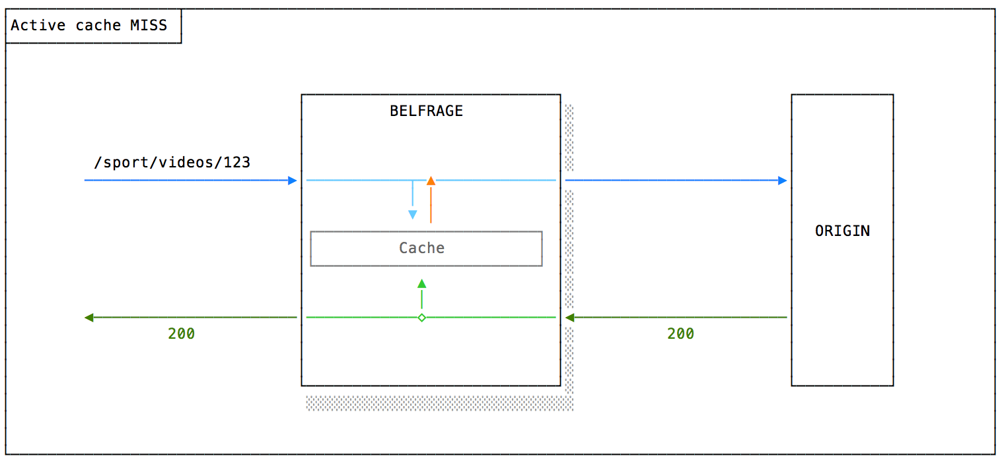
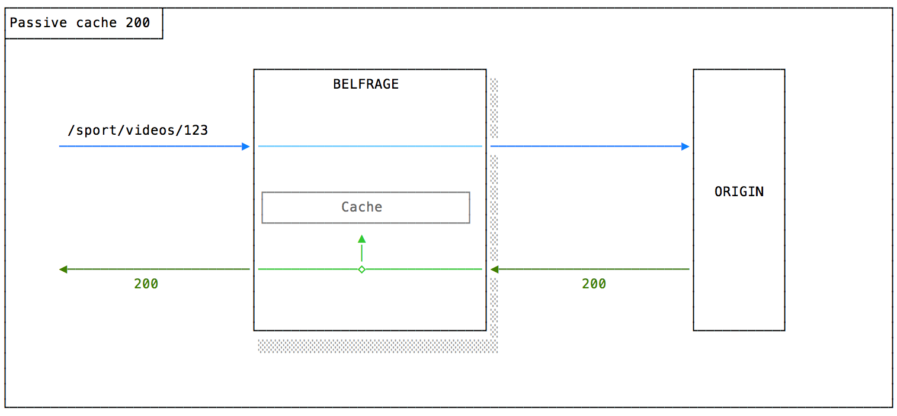
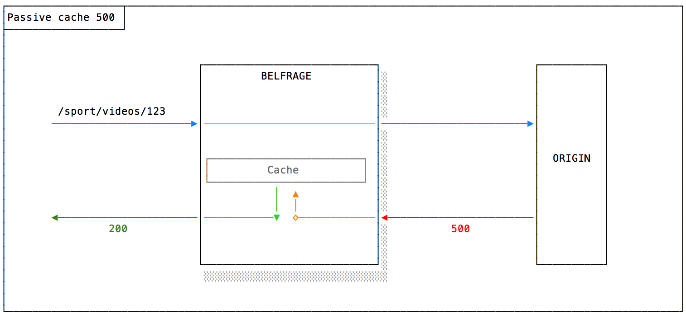

# Caching

## Caching tiers

Belfrage will provide two cascading caching layers:
### Tier 1 - Local Cache

A per-node in-memory LRU cache with no network involved and almost no latency. Currently, every Belfrage node can cache around 12Gb of content.
RESFRAME-2881 plans work to pre-warm the cache for new nodes added to the pool.

NOTE: future iterations could implement smarter ways to determine which content has more chances to get a hit or requires continuous presence in the in-memory cache.

### Tier 2 - Distributed cache

A slower and longer-term cache used for fallback reasons. If the first tier misses a fallback page, Belfrage will try to fetch it form this second tier before returning a 500.

NOTE: TIER 2 work hasn't started yet. The current plan is to use S3 as cache storage.
S3 Advantages:

-   S3 will not pose any limit in terms of number of stored items,
-   S3  offers a self-deleting mechanism once the max life of the page is reached
-   S3 offer multi-region (only 2 currently) bucket sync
-   S3 performance is less of a problem because of the TIER 1 layer.

## Design

Belfrage can offer an optional caching and resiliency layer. Routes requiring these features can rely on faster response times, less load on the origin and the peace of mind of a fallback content in case of temporary faults.

Personalised pages will not be able to use the cache feature. The fallback option will still be available. It's still early stage for this, but the plan is to serve the un-personalised fallback version of the page when the errors reach the circuit breaker threshold.

On a request the first action Belfrage takes is to look for cached content in the local cache. The cached content will be returned if found and it is `fresh`. If not, a request to the origin is then made.

If the origin returns a non 500 response then Belfrage will simply return that response. However, if the origin does return a 500 response then the fallback mechanism kicks in. 408 responses are handled slightly differently in that they signify a timeout. In this case the fallback mechanism is also triggered.

## Fallback Mechanism

When Belfrage receives a 500 response from an origin it sets an internal flag called `fallback_on_error`, when the route configuration indicates that an attempt to serve fallback is possible, Belfrage will try to fetch a fallback copy from the in-memory cache. 

In case of MISS, it will then try to fetch this page from the distributed cache. In case of success, the user will see a successful page. After a certain threshold of fallbacks alarm will be raised so that the Belfrage and the SRE team can take corrective actions.

Fallback TTL is currently configured as 6h.

# Caching & Circuit Breaker

The Circuit Breaker relies massively on the caching layer. Essentially it monitors routes error responses, and if a threshold is reached, it simulates an origin error to stop attempting to fetch content from the origin temporarily. In the meantime, the simulated failure triggers the fallback mechanism.

Error thresholds are configurable per-route.

The retry mechanism will improve in time; the first iteration is pretty simple and just stops calling a faulty endpoint for a given amount of time. Next iterations will introduce progressive reintroduction of faulty services and retry policies.

NOTE: while the circuit breaker is active and continuously monitoring routes response statuses it still doesn't trigger. We plan to enable it in Q3 2019.

## Modes

Cache in Belfrage can be set per-route in active and passive mode.

### Active Mode

This mode will allow serving cached content for a specified TTL. During this fraction of time, cached content will be served if available. Once the content gets stale, a new request to the origin will be made which will ultimately update the cache. Even if stale pages will be kept in the cache and used as a fallback mechanism in case of faults. The max fallback TTL is currently 6h.

### Passive Mode

A route configured in passive mode will not serve any cached content but will still store successful non-personalised responses as a fallback.

## Metrics

Belfrage records metrics for each type of cache result. You will be able to see these on the Grafana Dashboards.

It is worth being aware that due to the cascade a `cache.local.miss` metric is set for both the initial cache lookup and on the `fallback_on_error` request. This can mean that the metric is recorded twice for a request (once on the `miss` when requesting fresh content and once on the cascade request when fetching based on an origin 500).

## Cache flow

### Fetching fresh content

The following diagram shows the flow in Belfrage when requesting fresh cache content.

[Diagram source](../img/source/belfrage-cache-fresh.drawio)

### Caching in depth

The following diagram shows the detailed flow of cache content for fresh and stale content.

1. Check for "fresh" content in the local cache.
2. Check for "fresh" or "stale" content in the local or distributed cache (applicable when an origin has returned a 500 response).

[Diagram source](../img/source/belfrage-cache.drawio)
