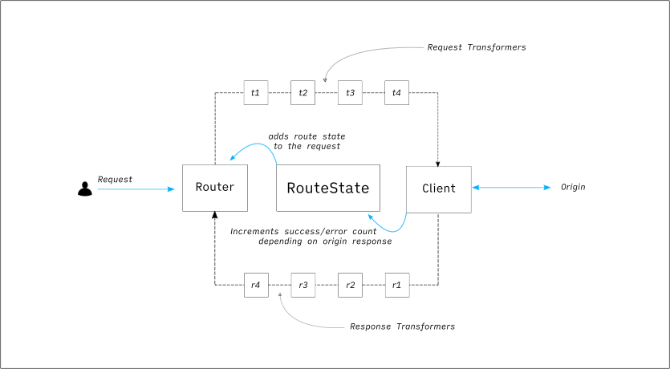
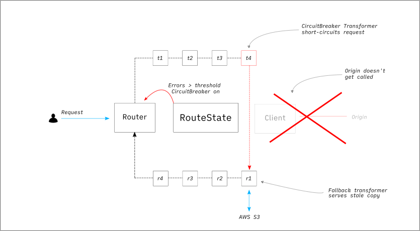
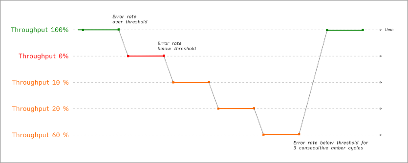
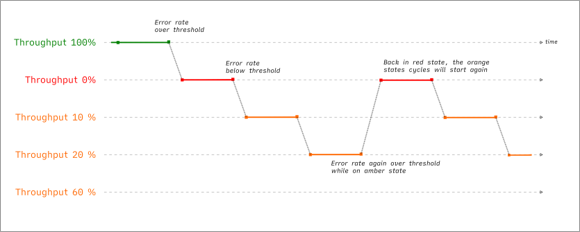

# Circuit Breaker
The circuit breaker is designed to protect Belfrage, and up-stream services through periods of high latency or elevated error rates.

***

### How can I use the circuit breaker?
For a route to take advantage of the circuit breaker, it must have the circuit breaker transformer in it's platform or routspec pipieline and should have the `circuit_breaker_error_threshold` key/value as shown:

```
defmodule Routes.Platforms.Programmes do
  def specs(production_env) do
    %{
      circuit_breaker_error_threshold: 500
    }
  end

  defp pipeline("live") do
    ["HTTPredirect", "TrailingSlashRedirector", "CircuitBreaker"]
  end

  defp pipeline(_production_env), do: pipeline("live") ++ ["DevelopmentRequests"]
end

```
The value for `circuit_breaker_error_threshold` is the limit of erroneous responses you accept per 1 minute period. If this number is exceeded, then the circuit breaker will be triggered.

The circuit breaker dial, found in the dials section for each belfrage stack must be set to 'true' to enable circuit breaker usage.

***

### What triggers the circuit breaker?
Belfrage tracks the number of errors returned from HTTP requests. An error is classed as a response with status code between `500..504` or a `408`.
If the up-stream service is a lambda, failure to invoke the lambda, will also count as an error.

When a route receives more errors in 60 seconds than what is defined in the `circuit_breaker_error_threshold` key within it's routespec (As shown below), the circuit breaker is turned on.

***

### What action does the circuit breaker take?
An active circuit breaker means that Belfrage will attempt to serve a fallback response, or return a 500 response if no fallback response is found. Belfrage will not call up-stream services for a circuit broken request.

A fallback response is the most recently cached response, that could be from a few seconds ago, or up to 7 days old.

If a fallback response cannot be found, Belfrage will return a 500, with content based on the `accept-content` request header.

***

### What is the scope of an active circuit breaker?
The error count is stored against a composite key composed of the routespec and origin. This means that the circuit breaker is active at per-routespec level. If the routespec is shared between multiple route matchers, then the circuit breaker will be active for all route matchers that share the same routespec.

If a request can be routed to multiple origins, and only one origin triggers the circuit breaker, then only requests for the routespec heading to the failing origin are impacted by the active circuit breaker.

The circuit breaker is activated on a Belfrage server by server basis. If the circuit breaker is triggered on one of Belfrage's servers, then it is possible that it's only triggered on that one server.

***

### When does the circuit breaker reset?
The error counts for all routes resets to 0 every minute from when the application was started. 

Each route is now given a throughput value, which is initialised at 100% and is set to 0% when the circuit breaker is triggered. With 100% being all requests go to the origin and 0% meaning none reach the origin and are all circuit broken. 

The throughput value will then increment through a set of values each minute (0%, 20%, 60%, 100%) until it returns to 100%. If the error count rises over the `circuit_breaker_error_threshold` value, the throughput is reset to 0.

Having a set of throughput values gives us the ability to 'ramp down' the circuit breaker for routes which begin to return fewer errors. 

***

### I have a route, with a routespec that could call multiple origins, how does the circuit breaker behave?
As the "error" count is stored against a composite key of the routespec and the origin, the circuit breaker will act independently for each origin.

***

### Many route matchers are using my routespec, how will the circuit breaker behave?
If multiple route matchers specify the same routespec, and the circuit breaker is activated, then any requests to a route matcher using that routespec that are routed to the same origin, will be circuit broken.

It is for this reason, that it is bad practice to use one routespec for many route matchers.

***

### How does the circuit breaker behave for preview environments?
An active circuit breaker on one preview environment, will not effect another preview environment. This is because different lambda preview environments are treated as different origins.

***

### How do I know if the circuit breaker has triggered on my route?
The belfrage team will be alerted to an active circuit breaker and will notify the relevant team if live issues need addressing.

You are now able to see the number of circuit breaker activations per routespec on Belfrage Grafana dashboards.


### Diagrams

Non circuit broken request


Circuit broken request


Temporary origin fault flips circuit breaker


A prolonged origin fault



