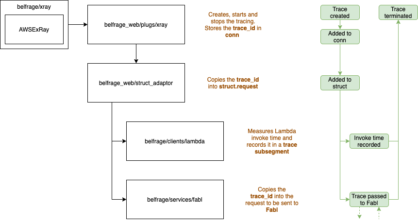

# Investigating our use of AWS X-Ray

In this document:

- Outline where we use X-Ray in the Belfrage codebase
- Explore the limitations of the aws_ex_ray library
- Explore how we can avoid errors and slow responses in Belfrage, when X-Ray produces an error or has degraded performance

## What is AWS X-Ray? (Just a Refresher)

X-Ray enables developers to analyse and debug applications built on AWS.
It can be used across distributed applications to track data as it passes through the system.

To do this X-Ray uses a trace.

- A trace can be comprised of one or more segments
- Each Segment can also be divided into one or more subsegments
- Each subsegment contains data such as a timestamp, query, status code
- This data is then sent to the X-Ray daemon (via [aws_ex_ray](https://github.com/lyokato/aws_ex_ray)) which interacts with AWS X-Ray API.

So calls to X-Ray from Belfrage flow like so:
```
calls == -->

Belfrage --> aws_ex_ray --> X-Ray daemon --> X-Ray API 
```

## Where is X-Ray Used in Belfrage?


credit: Owen Tourlamain

- [`belfrage/xray.ex` (link)](https://github.com/bbc/belfrage/blob/87754708b8de461c06f6cc189b6d4bf09cfe0ab0/lib/xray.ex) - This module is a wrapper around the [AwsExRaylibrary](https://github.com/lyokato/aws_ex_ray).
  <br>

- [`belfrage_web/plugs/xray.ex` (link)](https://github.com/bbc/belfrage/blob/87754708b8de461c06f6cc189b6d4bf09cfe0ab0/lib/belfrage_web/plugs/xray.ex)

  - This does 3 main things:
    - creates, starts and stops the X-Ray tracing
    - attaches data to the trace such as `request_id` `method` and `request path`
    - puts the `:xray_trace_id` in the `conn.private` (`:xray_trace_id` contains the `id` and sampling information)
    <br>

- [`belfrage_web/struct_adaptor.ex` (link)](https://github.com/bbc/belfrage/blob/f6eaf776880a0c258384b01059e49fa56d1766bf/lib/belfrage_web/struct_adapter.ex)

  - Here the `:xray_trace_id` is taken from `conn.private` and placed in `struct.request`
    <br>

- [`belfrage/clients/lambda.ex` (link)](https://github.com/bbc/belfrage/blob/87754708b8de461c06f6cc189b6d4bf09cfe0ab0/lib/belfrage/clients/lambda.ex)
  - here a trace subsegment is created measuring the time it takes to invoke and receive a response from the lambda.
<br>

- [`belfrage/services/fabl.ex` (link)](https://github.com/bbc/belfrage/blob/f6eaf776880a0c258384b01059e49fa56d1766bf/lib/belfrage/services/fabl.ex)
  - `:xray_trace_id` is taken from the `struct` and put into requests that we send to fabl.

## How Does the Library We Use Function?

We use the [aws_ex_ray](https://github.com/lyokato/aws_ex_ray) library in belfrage to handle our requests to interface with X-Ray.

This library functions by creating an ETS table which is bound to the process which calls `start_tracing` (in our case each request process). This keeps track of the segments and subsegments of each request. When the tracing is finished it is sent to the X-Ray daemon (on the instance) via a UDP client.

This also means that if the X-Ray daemon or X-Ray API is down it will have no effect on our application. As aws_ex_ray sends its data to the daemon via UDP.

### Evaluation of aws_ex_ray
#### Pool Timeout & Errors

Under particularly high load this library has been coming under strain. This has been observed during recent load test [see here](https://github.com/bbc/belfrage/blob/f6a7a093f051167f6017f983c4f92d17420e6aa5/docs/load-test-results/2021-09-20-testing-finch-http-client.md). The whole error is underneath:

```
{"datetime":"2021-09-22T07:17:18.671042Z","kind":"exit","level":"error","metadata":{"request_id":"648198ee846844d3bfbf3482c2f11681"},"msg":"Router Service returned a 500 status","query_string":"","reason":["timeout",["gen_server","call",["aws_ex_store_pool",["checkout","#Ref<>",true],5000]]],"request_path":"/sam","stack":"    (stdlib 3.14) gen_server.erl:246: :gen_server.call/3\n    (poolboy 1.5.2) /home/sam_french/belfrage/deps/poolboy/src/poolboy.erl:63: :poolboy.checkout/3\n    (poolboy 1.5.2) /home/sam_french/belfrage/deps/poolboy/src/poolboy.erl:82: :poolboy.transaction/3\n    (aws_ex_ray 0.1.16) lib/aws_ex_ray/store/monitor_supervisor.ex:17: AwsExRay.Store.MonitorSupervisor.start_monitoring/1\n    (aws_ex_ray 0.1.16) lib/aws_ex_ray.ex:258: AwsExRay.start_tracing/2\n    (belfrage 0.2.0) lib/belfrage_web/plugs/xray.ex:23: BelfrageWeb.Plugs.XRay.call/2\n    (belfrage 0.2.0) lib/belfrage_web/router.ex:1: BelfrageWeb.Router.plug_builder_call/2\n    (belfrage 0.2.0) lib/plug/error_handler.ex:65: BelfrageWeb.Router.call/2\n"}
```

Under closer inspection we see:
```
"reason":["timeout",["gen_server","call",["aws_ex_store_pool",["checkout","#Ref<>",true],5000]]]
```

This shows that while under extreme load the aws_ex_store_pool becomes overwhelmed, but why is this?

When a trace is started an ETS table is created linked to the process and its ID is placed in the ETS table. When a trace is finished the table (and ID) is deleted as aws_ex_ray no longer needs to keep track of it.

But what if before `finish_tracing/1` is called the process dies? That would result in pollution of the ETS table for all of the traces of the processes that have failed.

To get around this a monitor per process is made to supervise the thing being traced. If the process does fail, then the ETS table related to that process is deleted.

The relevant code is below:

`poolboy.erl`
```erlang
checkout(Pool, Block, Timeout) ->
    CRef = make_ref(),
    try
        gen_server:call(Pool, {checkout, CRef, Block}, Timeout) % Timeout or Error occurs here
    catch
        ?EXCEPTION(Class, Reason, Stacktrace) ->
            gen_server:cast(Pool, {cancel_waiting, CRef}),
            erlang:raise(Class, Reason, ?GET_STACK(Stacktrace)) % Error is raised again
    end.
```
[link](https://github.dev/devinus/poolboy/blob/9212a8770edb149ee7ca0bca353855e215f7cba5/src/poolboy.erl#L60-L68)

`aws_ex_ray/store/monitor_supervisor.ex`
```elixir
def start_monitoring(pid) do
  # transaction calls :poolboy.checkout/3
  :poolboy.transaction(@pool_name, fn monitor ->
    ProcessMonitor.start_monitoring(monitor, pid)
  end)
  :ok
end
```
[link](https://github.dev/lyokato/aws_ex_ray/blob/ab6e07f097d0063afb748b30155878cbb8aba60f/lib/aws_ex_ray/store/monitor_supervisor.ex#L16-L21)

`aws_ex_ray.ex`
```elixir
def start_tracing(trace, name) do
  case Store.Table.lookup() do
    {:error, :not_found} ->
      segment = Segment.new(trace, name)
      Store.Table.insert(trace, segment.id)
      Store.MonitorSupervisor.start_monitoring(self())
      segment

    {:ok, _, _, _} ->
      raise "<AwsExRay> Tracing Context already exists on this process."
  end
end
```
[link](https://github.dev/lyokato/aws_ex_ray/blob/ab6e07f097d0063afb748b30155878cbb8aba60f/lib/aws_ex_ray.ex#L251-L266)

For more detail see these modules in the library:
[AwsExRay](https://github.com/lyokato/aws_ex_ray/blob/ab6e07f097d0063afb748b30155878cbb8aba60f/lib/aws_ex_ray.ex#L258)
[AwsExRay.Store.MonitorSupervisor](https://github.com/lyokato/aws_ex_ray/blob/ab6e07f097d0063afb748b30155878cbb8aba60f/lib/aws_ex_ray/store/monitor_supervisor.ex#L16-L21)
[AwsExRay.Store.ProcessMonitor](https://github.com/lyokato/aws_ex_ray/blob/ab6e07f097d0063afb748b30155878cbb8aba60f/lib/aws_ex_ray/store/process_monitor.ex#L14)


**This means for each belfrage request a monitor is being created to supervise it**

**This also means that if we have more requests than the `aws_ex_store_pool` pool size being handled in belfrage, the pool will time out causing 500s**

These 500s will be caused by poolboy giving us a timeout error because the pool is full, all just so that a trace information can be sent to AWS.

However a timeout error isn't the only error that may cause a 500, in fact any runtime error produced by the pool worker will result in a 500. 

`system_limit` errors could also occur when using the ETS, but this is very likely. ([see here](https://erlang.org/doc/man/ets.html#failures))

#### Inefficient Sampling
As X-Ray is designed for production applications it would be impractical to send a trace of every request to the X-Ray API. Therefore there is a concept of sampling. In our case we have a sample rate of 0.1 or 1 in 10 requests.

However, [aws_ex_ray](https://github.com/lyokato/aws_ex_ray)'s approach to sampling is not particularly elegant. Below we can see why.
When a trace is created it is decided whether it should be traced or not. 
```elixir

defmodule AwsExRay.Trace do
...

def new() do
  %__MODULE__{
    root:    Util.generate_trace_id(),
    sampled: Util.sample?(), # decided here
    parent:  "",
  }
  end
...

end
```
[link to code](https://github.com/lyokato/aws_ex_ray/blob/ab6e07f097d0063afb748b30155878cbb8aba60f/lib/aws_ex_ray/trace.ex#L21-L28)

If the trace is not destined to be sampled **it is still treated the same** as a request that is destined be sampled. A Trace struct and subsegment struct will be created and calls will be made to the ETS too. The distinction is only made once the trace is finished. A check is made to see if the trace is supposed to be sampled before being sent to the X-Ray daemon.

```elixir
defmodule AwsExRay do
...

  def finish_tracing(segment) do

    segment = segment
           |> Segment.finish()

    if Segment.sampled?(segment) do
      segment
      |> Segment.to_json()
      |> Client.send()
    end

    Store.Table.delete()
    :ok

  end
...

end
```
[link to code](https://github.com/lyokato/aws_ex_ray/blob/ab6e07f097d0063afb748b30155878cbb8aba60f/lib/aws_ex_ray.ex#L275-L292)

**This means the library could be performing 90% more work than it needs to.**
## Is there another library available?
Unfortunately it doesn't seem so! If we look at hex.pm and search for [x-ray clients](https://hex.pm/packages?search=aws+x-ray&sort=recent_downloads) there doesn't seem to be another client apart from the one given. Although this one says '[NOT STABLE YET](https://github.com/lyokato/aws_ex_ray#not-stable-yet)' it seems to be the only one in popular use.
## Mitigating Impact From Errors and Degraded X-Ray Performance

If any component of the chain stops working (aws_ex_ray library, the x-ray daemon or x-ray API) we want to be sure that it doesn't impact Belfrage's performance. As the collection of logs like these should be optional. 

### Sampling Properly
One Change we could make to mitigate impact would be to shift the sampling logic closer to belfrage so we can avoid calling the aws_ex_ray library so often. We would:
* let belfrage control the sampling logic for traces
* adjust the config for aws_ex_ray so a call to it always results in a sampled trace

This would be fairly easy to implement as we already track request sampling in the struct with the [`:xray_trace_id` see here](https://github.dev/bbc/belfrage/blob/4bb3025bf9587f84334f95bab2afdda3ad21233c/lib/belfrage_web/plugs/xray.ex#L11-L16).

```elixir
trace = if Belfrage.Xray.sample? do # our own implementation of sample
  AxsExRay.Trace.new()
  |> AwsExRay.start_tracing(:belfrage) # calls the aws_ex_ray library
else
  :not_sampled
end
```
This change would reduce calls to aws_ex_ray by around 90% and mean there is less pressure being put on the pools and no redundant structs being created.


### Failing Fast
There could be situations where aws_ex_ray takes a while to respond whether due to itself or downstream components. In this situation its better for us to fail to send a request to X-Ray, rather than slow down our own application.

If we introduced a timeout to all calls to aws_ex_ray, this would limit the amount of latency it would add to a request. Something like this perhaps:

```elixir
trace = timeout 1000 do
  @xray.new_trace()
end
```

### Isolating Runtime Errors
We want to ensure that errors that occur in aws_ex_ray stay there and don't cause errors in our own application.

One solution to this would be to wrap all calls to aws_ex_ray in a try-catch blocks this would means any runtime exceptions would be caught and handled whenever they arose.

Another solution could be to isolate calls to aws_ex_ray through a separate process which could be interacted with through casts. Any Errors produced would cause that process to restart but not effect the belfrage request process.
## Summary
To summarise:
  - X-Ray is used to track a distributed applications performance across services
  - `Belfrage -calls-> aws_ex_ray -calls-> X-Ray Daemon -calls-> X-Ray API`
  - We use aws_ex_ray in belfrage in:
    - `plugs/xray.ex` where we start and end the trace
    - `clients/lambda.ex` where we use a subsegment to report how long the lambda call took
  - aws_ex_ray has some issues which include:
    - Causing bottlenecks by using a fixed pool to monitor belfrage request processes, which result in latency and could produce 500s
    - Performing more work than necessary on traces that won't be sent to the X-Ray API
  - These issued can be mitigated by:
    - Only calling aws_ex_ray when we wish to sent a trace to the X-Ray API
    - Enforcing timeouts for calls to aws_ex_ray within Belfrage
    - Wrapping calls to aws_ex_ray in its own isolated process or try-catch blocks


